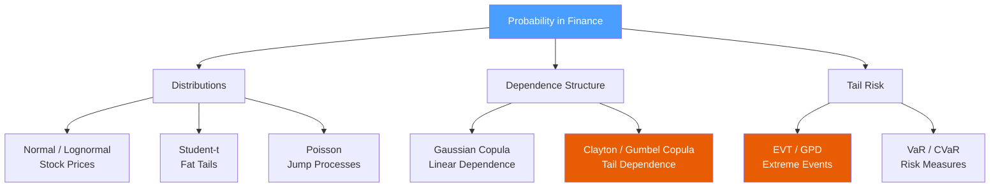

# 🎲 Probability Theory for Finance

> [!abstract] TL;DR
> Probability theory provides the language for modeling uncertainty in financial markets. The key insight is that real returns are not normally distributed — they have fat tails (extreme events are more frequent than Gaussian models predict) and non-linear dependence (copulas). Understanding lognormal models, heavy-tailed distributions, and extreme value theory is essential for honest risk management.

## Intuition — Analogy First

The normal distribution is like a well-behaved crowd in a concert hall — most people cluster near the middle, and the extremes thin out quickly and predictably. Financial markets are more like that crowd during a fire alarm: most of the time things look normal, but occasionally everyone rushes for the exit simultaneously, creating tail events far more extreme than the "normal" model would ever predict. This is **fat tails** (leptokurtosis).

Copulas solve a different problem: separating *marginal behavior* from *joint behavior*. Imagine two coins — you know each one individually is fair (50/50). But are they independent? Do they tend to land the same way? Copulas let you specify the dependence structure (correlation, tail co-dependence) independently from the marginal distributions (what each asset's own distribution looks like). This is crucial in credit derivatives: the 2008 crisis partly arose from Gaussian copula models that dramatically underestimated the probability of correlated defaults.

Extreme Value Theory (EVT) is the mathematician's answer to fat tails. Instead of fitting the whole return distribution, it focuses specifically on what happens beyond a high threshold — the tail behavior — using the Generalized Pareto Distribution (GPD), which has a solid theoretical basis as the limiting distribution of exceedances.

---

## How It Works



## Key Concepts / Details

### Lognormal Model for Stock Prices

If log-returns are normally distributed: $\ln(S_T/S_0) \sim \mathcal{N}(\mu T, \sigma^2 T)$, then:

$$S_T = S_0 \exp(\mu T + \sigma\sqrt{T} Z), \quad Z \sim \mathcal{N}(0,1)$$

The expected stock price accounts for the **lognormal adjustment**:

$$E[S_T] = S_0 \exp\left(\mu T + \frac{\sigma^2 T}{2}\right)$$

The $+\sigma^2 T/2$ term arises because $E[e^X] = e^{\mu + \sigma^2/2}$ for $X \sim \mathcal{N}(\mu, \sigma^2)$ — Jensen's inequality applied to the convex exponential. The drift $\mu$ is the arithmetic mean of returns, while the **geometric (realized) mean** is $\mu - \sigma^2/2$. This $\sigma^2/2$ correction also appears as the Itô correction in [[Stochastic_Calculus]].

The lognormal model implies:
- $S_T > 0$ always (no negative prices)
- Log-returns are symmetric
- Volatility scales as $\sigma\sqrt{T}$

But it fails to capture fat tails and volatility clustering observed in real data.

### Student-t Distribution for Fat Tails

The Student-t distribution with $\nu$ degrees of freedom has:
- Mean: $0$ (for $\nu > 1$)
- Variance: $\nu / (\nu - 2)$ for $\nu > 2$
- **Excess kurtosis**: $6/(\nu - 4)$ for $\nu > 4$

As $\nu \to \infty$, the Student-t converges to Normal. For financial returns, $\nu \approx 4$-$6$ is typical, giving **large excess kurtosis** and heavy tails. For $\nu = 5$, excess kurtosis $= 6/(5-4) = 6$ — the distribution has six times more kurtosis than the normal.

The tail probability comparison:
| Event | Normal (5%) | Student-t $\nu=5$ |
|-------|------------|-------------------|
| $> 3\sigma$ | 0.27% | ~1.0% |
| $> 4\sigma$ | 0.0063% | ~0.4% |
| $> 5\sigma$ | 0.000057% | ~0.15% |

Fat tails mean that risk models calibrated to the normal distribution systematically **understate** the probability of large losses.

### Sklar's Theorem and Copulas

**Sklar's theorem** states that any joint distribution $F(x,y)$ can be written as:

$$F(x,y) = C(F_X(x), F_Y(y))$$

where $C: [0,1]^2 \to [0,1]$ is the **copula** — a joint distribution on uniform marginals that captures the dependence structure, separated from the marginals $F_X, F_Y$.

**Key copula families:**
- **Gaussian copula**: $C(u,v) = \Phi_\rho(\Phi^{-1}(u), \Phi^{-1}(v))$ — no tail dependence; was misused in CDO pricing pre-2008
- **Clayton copula**: $C(u,v) = (u^{-\theta} + v^{-\theta} - 1)^{-1/\theta}$ — **lower** tail dependence (joint crashes)
- **Gumbel copula**: strong **upper** tail dependence (joint booms)
- **t-copula**: symmetric tail dependence in both tails

**Tail dependence coefficient** $\lambda_U = \lim_{u\to 1} P(V > u \mid U > u)$ measures the probability of joint extremes. For the Gaussian copula, $\lambda_U = 0$ for any $\rho < 1$ — it cannot model crash co-dependence. The t-copula has $\lambda_U > 0$.

### Moment Generating Functions and Characteristic Functions

The **MGF** of $X$ is $M_X(t) = E[e^{tX}]$ (when it exists). Key properties:
- $E[X^n] = M_X^{(n)}(0)$ — moments from derivatives at zero
- For sums: $M_{X+Y}(t) = M_X(t) M_Y(t)$ if independent

The **characteristic function** $\phi_X(t) = E[e^{itX}]$ always exists and is used for:
- Lévy-Khintchine formula for jump-diffusion processes
- Fourier-based option pricing (Carr-Madan FFT method in [[Numerical_Methods]])

### CLT and Its Limits in Finance

The Central Limit Theorem guarantees that the sum of $n$ i.i.d. finite-variance random variables converges to Normal. This justifies using the Normal distribution for long holding periods. But CLT convergence is **slow** in the tails — the normal approximation is good in the center but fails in the extreme tails even for large $n$.

CLT **fails entirely** when the underlying distribution has infinite variance (Pareto/power-law tails with $\alpha < 2$). In this case, the Generalized CLT applies and the sum converges to a stable distribution, not Normal.

### Extreme Value Theory — GPD for Tail Estimation

Pickands-Balkema-de Haan theorem: given a sufficiently high threshold $u$, the distribution of exceedances $X - u \mid X > u$ converges to the **Generalized Pareto Distribution (GPD)**:

$$G_{\xi,\beta}(x) = 1 - \left(1 + \frac{\xi x}{\beta}\right)^{-1/\xi}$$

- $\xi > 0$: heavy-tailed (Pareto) — common in financial returns
- $\xi = 0$: exponential tail (thin-tailed)
- $\xi < 0$: bounded support (rare in finance)

For equity returns, $\xi \approx 0.2$-$0.5$ is typical, confirming heavy tails. EVT-based VaR is more reliable in the tail than parametric normal or even Student-t models.

## Python Example

```python
import numpy as np
from scipy import stats
from scipy.stats import norm, t, genpareto
import matplotlib.pyplot as plt

np.random.seed(42)

# --- Lognormal stock simulation ---
def simulate_lognormal(S0, mu, sigma, T, n_paths):
    """Simulate lognormal paths. E[S_T] = S0 * exp(mu*T + 0.5*sigma^2*T)"""
    Z = np.random.standard_normal(n_paths)
    S_T = S0 * np.exp((mu - 0.5 * sigma**2) * T + sigma * np.sqrt(T) * Z)
    E_ST_theory = S0 * np.exp(mu * T + 0.5 * sigma**2 * T)
    return S_T, E_ST_theory

S0, mu, sigma, T = 100, 0.08, 0.20, 1.0
paths, expected = simulate_lognormal(S0, mu, sigma, T, 100_000)
print(f"E[S_T] theoretical: {expected:.2f}")
print(f"E[S_T] simulated:   {paths.mean():.2f}")

# --- Student-t excess kurtosis ---
for nu in [4.5, 5, 7, 10, 30]:
    excess_kurt = 6 / (nu - 4) if nu > 4 else float('inf')
    print(f"Student-t ν={nu:4.1f}: excess kurtosis = {excess_kurt:.2f}")

# --- Gaussian Copula simulation ---
def gaussian_copula_sample(rho, n_samples):
    """
    Sample from a 2D Gaussian copula with correlation rho.
    Returns uniform marginals (u, v) with Gaussian dependence structure.
    """
    cov = np.array([[1, rho], [rho, 1]])
    L   = np.linalg.cholesky(cov)
    Z   = np.random.standard_normal((2, n_samples))
    X   = L @ Z  # correlated standard normals
    # Transform to uniform via the normal CDF
    U = norm.cdf(X[0])
    V = norm.cdf(X[1])
    return U, V

def clayton_copula_sample(theta, n_samples):
    """
    Sample from Clayton copula (lower tail dependence).
    """
    # Conditional distribution method
    U = np.random.uniform(0, 1, n_samples)
    W = np.random.uniform(0, 1, n_samples)
    # Inverse of conditional CDF of V|U
    V = U * (W**(-theta / (1 + theta)) - 1 + U**theta)**(-1 / theta)
    V = np.clip(V, 0, 1)
    return U, V

n = 10_000
U_gauss, V_gauss = gaussian_copula_sample(rho=0.7, n_samples=n)
U_clay, V_clay   = clayton_copula_sample(theta=2.0, n_samples=n)

# Tail dependence: P(V > 0.95 | U > 0.95)
threshold = 0.95
tail_gauss = np.mean(V_gauss[U_gauss > threshold] > threshold)
tail_clay  = np.mean(V_clay[U_clay > threshold]   > threshold)
print(f"\nUpper tail dependence (P(V>0.95|U>0.95)):")
print(f"  Gaussian copula: {tail_gauss:.3f} (expected ~0)")
print(f"  Clayton copula:  {tail_clay:.3f}")

# --- EVT / GPD tail estimation ---
def fit_gpd_tail(returns, threshold_quantile=0.95):
    """
    Fit GPD to exceedances above threshold. Returns VaR and CVaR estimates.
    """
    threshold = np.quantile(returns, threshold_quantile)
    exceedances = returns[returns > threshold] - threshold
    n_total = len(returns)
    n_exceed = len(exceedances)

    # Fit GPD
    xi, loc, beta = genpareto.fit(exceedances, floc=0)

    # EVT-based VaR at 99.9%
    p = 0.999
    VaR_EVT = threshold + (beta / xi) * (
        ((n_total / n_exceed) * (1 - p))**(-xi) - 1
    )
    print(f"\nEVT tail fit: ξ={xi:.3f}, β={beta:.4f}")
    print(f"EVT VaR(99.9%): {VaR_EVT:.4f}")
    return xi, beta, VaR_EVT

# Generate fat-tailed returns (Student-t nu=5)
fat_returns = t.rvs(df=5, scale=0.01, size=5000)
xi, beta, var_99 = fit_gpd_tail(fat_returns)
```

## Real-World Notes

- **Copula selection matters enormously in credit**: the Gaussian copula gives near-zero probability of correlated defaults, while the t-copula or Clayton copula can give probabilities 10-100x higher for a diversified CDO tranche losing 30%+.
- **EVT threshold selection** is tricky — too low and GPD fit is poor; too high and sample size is insufficient. The mean excess plot (MEP) helps identify the threshold where exceedances become approximately linear.
- **Realized vs. implied distributions**: options markets imply a risk-neutral distribution via the Breeden-Litzenberger formula; this is invariably more fat-tailed and negatively skewed than the historical distribution due to the variance risk premium.

## Common Pitfalls

- Confusing $E[\ln S_T/S_0] = (\mu - \sigma^2/2)T$ with $\ln E[S_T/S_0] = \mu T$ — the lognormal adjustment is not optional.
- Using the Gaussian copula for assets with known tail co-dependence (equities in stress, credits in default waves) — lower tail dependence is a qualitative modeling choice, not just a parameter.
- Fitting EVT to too few observations — GPD requires at least 100-200 exceedances for stable parameter estimates.
- Treating excess kurtosis as a fixed property: kurtosis in financial returns is time-varying (GARCH effects), so a single Student-t fit may not capture the full dynamics.

## Related Concepts

- [[Stochastic_Calculus]] — Lognormal model is derived from GBM; the $-\sigma^2/2$ drift correction comes from Itô's lemma
- [[Linear_Algebra_Finance]] — Gaussian copula is parameterized by the correlation matrix; multivariate returns modeled as MVN use $\Sigma$
- [[Numerical_Methods]] — Copula simulation and EVT estimation are computationally intensive; Monte Carlo variance reduction applies

## Review Questions

1. Derive $E[S_T]$ for the lognormal model and explain why it equals $S_0 e^{\mu T + \sigma^2 T/2}$ rather than $S_0 e^{\mu T}$.
2. What is Sklar's theorem, and why does it allow you to separate marginal distributions from dependence structure?
3. Why does the Gaussian copula have zero upper tail dependence, and what are its practical consequences for credit modeling?
4. Compare VaR estimates for a Normal vs. Student-t($\nu=5$) distribution at the 99.9% confidence level for a daily $1M portfolio.
5. What is the Pickands-Balkema-de Haan theorem, and why is GPD the appropriate distribution for extreme tail estimation?
6. When does the Central Limit Theorem fail to produce a normal limit, and what is the alternative limit theorem?

## Sources

- McNeil, A., Frey, R., Embrechts, P. — *Quantitative Risk Management*, Chapters 5-7 (Copulas, EVT)
- Embrechts, P., McNeil, A., Straumann, D. — *Correlation and Dependence in Risk Management* (2002)
- Li, D.X. — *On Default Correlation: A Copula Function Approach* (2000) — the original Gaussian copula paper

#quantitative-finance #math-foundations #probability #copulas #fat-tails #evt
