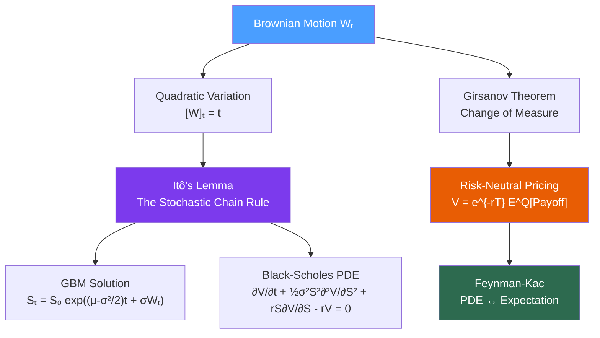

# 📈 Stochastic Calculus

> [!abstract] TL;DR
> Stochastic calculus is the mathematics of continuous-time random processes — the foundation for all continuous-time pricing models. The key results are Itô's lemma (the stochastic chain rule), which gives the GBM solution for stock prices with its critical $-\sigma^2/2$ Itô correction, and Girsanov's theorem, which underpins risk-neutral pricing by showing how to change probability measures. Mastery of SDEs unlocks the derivation of every major options pricing model.

## Intuition — Analogy First

Ordinary calculus assumes functions are smooth: small inputs give small outputs, and you can reason locally with derivatives. Brownian motion destroys this: it is continuous but nowhere differentiable, with infinite variation over any time interval. You cannot define $dW_t / dt$ as a classical derivative. Stochastic calculus (Itô calculus) builds a new integration theory specifically for these rough paths.

The critical difference from ordinary calculus appears in the chain rule. In deterministic calculus, for $f(X)$ with $dX = \mu \, dt$: $df = f' dX = f' \mu \, dt$. In stochastic calculus, Brownian motion has the property $dW^2 = dt$ (quadratic variation equals time), which means the second-order term in the Taylor expansion *does not vanish* — it contributes an $O(dt)$ correction. This extra term is the **Itô correction**, and ignoring it leads to systematically wrong answers.

Think of it like this: when you drive a car on a bumpy road, the vibrations contribute to your average position even if they average to zero directionally — because variance accumulates. The Itô correction captures exactly this variance-accumulation effect.

The shift to the **risk-neutral measure** via Girsanov's theorem is equally fundamental. Real-world (physical) Brownian motion has drift $\mu$; under the risk-neutral measure, every asset grows at the risk-free rate $r$. Girsanov shows how to change from one measure to another by adjusting the drift — the price of risk, or **market price of risk** $\lambda = (\mu - r)/\sigma$, is absorbed into the new Brownian motion.

---

## How It Works



## Key Concepts / Details

### Brownian Motion — Properties and Quadratic Variation

Standard Brownian motion $W_t$ satisfies:
1. $W_0 = 0$
2. Increments are independent: $W_t - W_s \perp W_s - W_u$ for $u < s < t$
3. $W_t - W_s \sim \mathcal{N}(0, t-s)$ — increments are normally distributed
4. Paths are continuous but nowhere differentiable

The fundamental property of Brownian motion is its **quadratic variation**:

$$[W]_t = \lim_{n\to\infty} \sum_{i=1}^n (W_{t_i} - W_{t_{i-1}})^2 = t$$

In Itô calculus, this is encoded as the multiplication rule: $dW_t \cdot dW_t = dt$, $dt \cdot dW_t = 0$, $dt \cdot dt = 0$. This table replaces the ordinary $dx \cdot dx = 0$ rule of classical calculus.

### Itô's Lemma — The Stochastic Chain Rule

For a twice-differentiable function $f(t, X_t)$ where $dX_t = \mu_t \, dt + \sigma_t \, dW_t$:

$$df = \left(\frac{\partial f}{\partial t} + \mu_t \frac{\partial f}{\partial x} + \frac{1}{2}\sigma_t^2 \frac{\partial^2 f}{\partial x^2}\right)dt + \sigma_t \frac{\partial f}{\partial x} \, dW_t$$

The extra $\frac{1}{2}\sigma_t^2 \frac{\partial^2 f}{\partial x^2}$ term is the **Itô correction** — it comes from $\sigma_t^2 (dW_t)^2 = \sigma_t^2 dt$ in the Taylor expansion.

**Derivation sketch**: expand $df$ by Taylor's theorem to second order:
$$df = \frac{\partial f}{\partial t}dt + \frac{\partial f}{\partial x}dX + \frac{1}{2}\frac{\partial^2 f}{\partial x^2}(dX)^2 + \ldots$$
Substitute $dX = \mu dt + \sigma dW$, so $(dX)^2 = \sigma^2 (dW)^2 + O(dt^{3/2}) = \sigma^2 dt$. The third term survives, giving the Itô correction.

### GBM — The $-\sigma^2/2$ Itô Correction

Geometric Brownian Motion models stock prices: $dS = \mu S \, dt + \sigma S \, dW$

Applying Itô's lemma to $f(S) = \ln S$:
$$d(\ln S) = \left(\mu - \frac{\sigma^2}{2}\right)dt + \sigma \, dW$$

Integrating:

$$S_t = S_0 \exp\left(\left(\mu - \frac{\sigma^2}{2}\right)t + \sigma W_t\right)$$

The $-\sigma^2/2$ **Itô correction** is crucial:
- The **arithmetic drift** is $\mu$ (what you expect in returns)
- The **geometric (log) drift** is $\mu - \sigma^2/2$ (what you actually get in compound growth)
- The gap $\sigma^2/2$ is the **volatility drag** — higher vol, lower realized compound growth
- This is Jensen's inequality: $E[\ln X] < \ln E[X]$ for convex functions

**Practical consequence**: a portfolio with 20% annual vol loses $0.20^2/2 = 2\%$ per year purely from volatility drag, even with zero net return.

### Ornstein-Uhlenbeck (OU) Process — Mean Reversion

The OU process models mean-reverting quantities (interest rates, spreads, VIX):

$$dX = \kappa(\theta - X)dt + \sigma \, dW$$

- $\kappa > 0$: **mean-reversion speed** (half-life $= \ln 2 / \kappa$)
- $\theta$: **long-run mean**
- $\sigma$: **diffusion coefficient** (vol of vol)

The analytical solution is:
$$X_t = \theta + (X_0 - \theta)e^{-\kappa t} + \sigma \int_0^t e^{-\kappa(t-s)} dW_s$$

Stationary distribution: $X_\infty \sim \mathcal{N}(\theta, \sigma^2/(2\kappa))$

Used in: Vasicek interest rate model, OU spread model for stat-arb, VIX modeling.

### CIR Process — Square-Root Diffusion

The Cox-Ingersoll-Ross process adds a square-root diffusion:

$$dX = \kappa(\theta - X)dt + \sigma\sqrt{X} \, dW$$

The $\sqrt{X}$ ensures variance is proportional to level — appropriate for interest rates (high rates are more volatile). The **Feller condition**:

$$2\kappa\theta > \sigma^2$$

ensures $X_t > 0$ almost surely — the process cannot reach zero. When $2\kappa\theta \leq \sigma^2$, zero is a reflecting boundary and rates can touch zero (relevant in near-ZIRP environments).

Used in: CIR interest rate model, Heston stochastic volatility model (for the variance process).

### Girsanov Theorem — Change of Measure

Under the physical measure $\mathbb{P}$, Brownian motion has drift $\mu$. Girsanov's theorem constructs an equivalent measure $\mathbb{Q}$ (the **risk-neutral measure**) under which $\tilde{W}_t = W_t + \lambda t$ is a Brownian motion, where:

$$\lambda = \frac{\mu - r}{\sigma}$$

is the **market price of risk** (Sharpe ratio of the asset).

The **Radon-Nikodym derivative** (change-of-measure density):

$$\frac{d\mathbb{Q}}{d\mathbb{P}} = \exp\left(-\lambda W_T - \frac{\lambda^2 T}{2}\right)$$

Under $\mathbb{Q}$, all discounted asset prices are **martingales**:
$$E^\mathbb{Q}[e^{-rT} S_T] = S_0$$

This is the fundamental theorem of asset pricing: no-arbitrage $\Leftrightarrow$ existence of risk-neutral measure $\mathbb{Q}$.

### Feynman-Kac — PDE to Expectation Bridge

The Feynman-Kac formula links PDEs and stochastic expectations. If $V(t,x)$ satisfies:

$$\frac{\partial V}{\partial t} + \mu \frac{\partial V}{\partial x} + \frac{1}{2}\sigma^2 \frac{\partial^2 V}{\partial x^2} - rV = 0, \quad V(T,x) = g(x)$$

then the solution is:

$$V(t,x) = e^{-r(T-t)} E^\mathbb{Q}[g(X_T) \mid X_t = x]$$

This is why the Black-Scholes formula (a PDE solution) equals the discounted expected payoff under $\mathbb{Q}$. It also means Monte Carlo simulation is a valid alternative to PDE solving — both compute the same quantity.

## Python Example

```python
import numpy as np
import matplotlib.pyplot as plt

np.random.seed(42)

def simulate_gbm(S0, mu, sigma, T, n_steps, n_paths):
    """
    Simulate Geometric Brownian Motion paths.
    Uses exact GBM formula: S_t = S0 * exp((mu - sigma²/2)*t + sigma*W_t)
    Critical: the -sigma²/2 Itô correction must be included.
    """
    dt = T / n_steps
    dW = np.random.standard_normal((n_paths, n_steps)) * np.sqrt(dt)
    W  = np.cumsum(dW, axis=1)  # cumulative Brownian motion

    t_grid = np.linspace(0, T, n_steps + 1)
    t_inner = t_grid[1:]

    # GBM exact solution with Itô correction
    S = S0 * np.exp((mu - 0.5 * sigma**2) * t_inner + sigma * W)
    S = np.hstack([S0 * np.ones((n_paths, 1)), S])

    # Verify Itô correction: E[S_T] should be S0 * exp(mu * T)
    E_ST_theory   = S0 * np.exp(mu * T)
    E_ST_simulated = S[:, -1].mean()
    print(f"GBM: E[S_T] theory={E_ST_theory:.2f}, simulated={E_ST_simulated:.2f}")
    print(f"  Itô drift (mu - σ²/2) = {mu - 0.5*sigma**2:.4f} vs mu={mu:.4f}")
    return S, t_grid

def simulate_ou_process(X0, kappa, theta, sigma, T, n_steps, n_paths):
    """
    Simulate Ornstein-Uhlenbeck process (exact discretization).
    Euler-Maruyama: dX = kappa*(theta - X)*dt + sigma*dW
    Uses exact conditional distribution for accuracy.
    """
    dt  = T / n_steps
    X   = np.zeros((n_paths, n_steps + 1))
    X[:, 0] = X0

    e_kdt     = np.exp(-kappa * dt)
    mean_incr = theta * (1 - e_kdt)
    std_incr  = sigma * np.sqrt((1 - np.exp(-2 * kappa * dt)) / (2 * kappa))

    for i in range(n_steps):
        Z         = np.random.standard_normal(n_paths)
        X[:, i+1] = mean_incr + e_kdt * X[:, i] + std_incr * Z

    print(f"\nOU Process: stationary mean={theta}, std={sigma/np.sqrt(2*kappa):.4f}")
    print(f"  Realized mean={X[:,-1].mean():.4f}, std={X[:,-1].std():.4f}")
    return X

def simulate_cir(X0, kappa, theta, sigma, T, n_steps, n_paths):
    """
    Simulate CIR process via Euler-Maruyama (milstein scheme for accuracy).
    dX = kappa*(theta - X)*dt + sigma*sqrt(X)*dW
    Feller condition for positivity: 2*kappa*theta > sigma^2
    """
    dt = T / n_steps
    X  = np.zeros((n_paths, n_steps + 1))
    X[:, 0] = X0
    feller = 2 * kappa * theta > sigma**2
    print(f"\nCIR: Feller condition (2κθ > σ²): {2*kappa*theta:.3f} > {sigma**2:.3f} => {feller}")

    for i in range(n_steps):
        X_pos     = np.maximum(X[:, i], 0)  # reflection at zero
        dW        = np.random.standard_normal(n_paths) * np.sqrt(dt)
        drift     = kappa * (theta - X_pos) * dt
        diffusion = sigma * np.sqrt(X_pos) * dW
        X[:, i+1] = X_pos + drift + diffusion
    return X

# --- Run simulations ---
# GBM
S, t = simulate_gbm(S0=100, mu=0.08, sigma=0.20, T=1.0, n_steps=252, n_paths=10_000)

# OU (e.g., log spread in pairs trading)
X_ou = simulate_ou_process(X0=0.0, kappa=2.0, theta=0.0, sigma=0.3,
                           T=1.0, n_steps=252, n_paths=5_000)

# CIR (e.g., short rate model)
X_cir = simulate_cir(X0=0.03, kappa=0.5, theta=0.04, sigma=0.05,
                     T=10.0, n_steps=1200, n_paths=1_000)
```

## Real-World Notes

- **Volatility drag** ($-\sigma^2/2$) is real and measurable: a leveraged ETF with 2x leverage has geometric drag of $2 \times \text{vol}^2 - (2\text{vol})^2/2 = 0$ in expectation — actually negative due to daily rebalancing. This is why 2x leveraged ETFs can underperform 2x the underlying index over long horizons.
- **Girsanov in practice**: risk-neutral pricing replaces $\mu$ with $r$ in all SDE drifts. This is why you use the risk-free rate in Black-Scholes regardless of the stock's actual expected return — the drift cancels in the hedged portfolio.
- **Numerical SDE simulation**: Euler-Maruyama ($X_{t+dt} = X_t + \mu dt + \sigma \sqrt{dt} Z$) is first-order accurate. The Milstein scheme adds a correction $+\frac{1}{2}\sigma\sigma' (Z^2-1)dt$ for second-order accuracy, important for CIR and Heston.
- **Feynman-Kac in ML**: neural network PDE solvers (deep BSDE, deep Galerkin) use the Feynman-Kac connection to replace classical finite difference grids, handling high-dimensional pricing PDEs.

## Common Pitfalls

- **Forgetting the $-\sigma^2/2$ correction** in GBM: using $S_t = S_0 e^{\mu t + \sigma W_t}$ gives a biased estimate of realized paths — the mean is correct but the distribution of paths is wrong.
- **Euler-Maruyama for CIR without reflection**: without clipping $X$ to non-negative values, the numerical scheme can produce negative interest rates even when the Feller condition holds analytically.
- **Confusing physical vs. risk-neutral drift**: simulating future paths for scenario analysis should use physical drift $\mu$; pricing options should use risk-neutral drift $r$.
- **OU half-life estimation**: $\kappa$ estimated from an AR(1) fit on daily data gives a daily $\kappa$; to get the continuous-time value, multiply by $-\ln(\hat{\phi}) / \Delta t$ where $\hat{\phi}$ is the AR(1) coefficient.

## Related Concepts

- [[Probability_Theory]] — Brownian motion is built from normally distributed increments; risk-neutral pricing changes the probability measure via Girsanov
- [[Calculus_for_Finance]] — Itô's lemma is the stochastic generalization of the chain rule; Black-Scholes PDE is derived using Taylor expansion + Itô
- [[Numerical_Methods]] — Monte Carlo simulation of SDEs (Euler-Maruyama, Milstein); finite difference methods solve the Feynman-Kac PDE directly

## Review Questions

1. Derive the GBM solution $S_t = S_0 \exp((\mu - \sigma^2/2)t + \sigma W_t)$ using Itô's lemma applied to $\ln S$.
2. Explain the Itô correction $-\sigma^2/2$ physically: what does it mean for compound returns?
3. State Girsanov's theorem and explain how it changes the drift of a Brownian motion under a new measure.
4. What is the Feller condition for the CIR process, and what happens when it is violated?
5. How does Feynman-Kac connect the Black-Scholes PDE to the risk-neutral expectation of the option payoff?
6. A trader simulates GBM without the $-\sigma^2/2$ correction for one year with $\sigma = 30\%$. By how much does the expected simulated price exceed the true expected price?

## Sources

- Shreve, S. — *Stochastic Calculus for Finance II*, Chapters 3-5 (Itô, Girsanov, Feynman-Kac)
- Øksendal, B. — *Stochastic Differential Equations*, Chapters 4-8
- Glasserman, P. — *Monte Carlo Methods in Financial Engineering*, Chapter 3 (SDE discretization)

#quantitative-finance #math-foundations #stochastic-calculus #ito-lemma #gbm #sde
