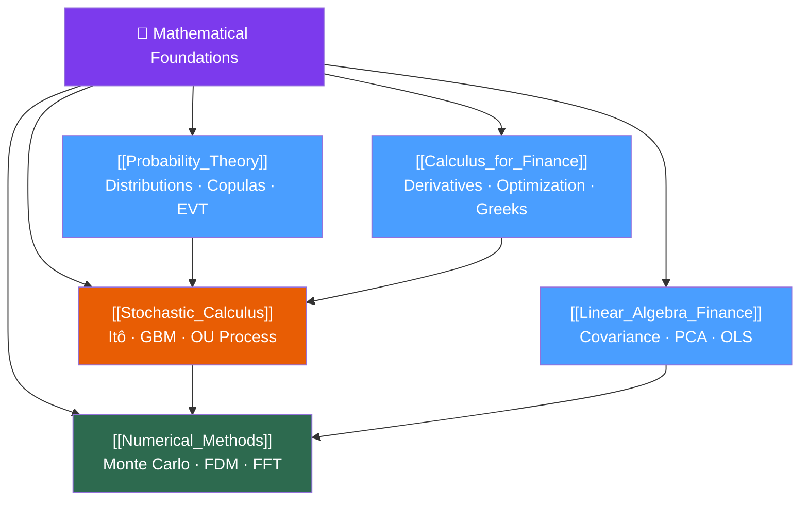

# 🧮 Mathematical Foundations — Map of Content

> [!abstract] What This Section Covers
> Mathematical Foundations provides the rigorous analytical toolkit every quant needs before touching a pricing model or risk system. This section covers the core branches of mathematics — calculus, linear algebra, probability, stochastic processes, and numerical methods — all framed through the lens of financial applications. Mastering this section unlocks every other domain in the vault: options theory, portfolio optimization, and machine learning for finance all rest on these foundations.

## Concept Map

## Learning Path

Follow this sequence — each note builds on the previous:

1. [[Calculus_for_Finance]] — Start here: Taylor expansions, optimization, and the Greeks
2. [[Linear_Algebra_Finance]] — Vectors, matrices, and covariance structures
3. [[Probability_Theory]] — Distributions, fat tails, copulas, and moment theory
4. [[Stochastic_Calculus]] — Brownian motion, Itô's lemma, and SDEs (requires Probability)
5. [[Numerical_Methods]] — Computational methods for pricing and simulation (requires all prior notes)

## All Notes at a Glance

| Note | Difficulty | What You'll Learn |
|------|------------|-------------------|
| [[Calculus_for_Finance]] | Intermediate | Taylor expansions for option Greeks, Lagrangian portfolio optimization, chain rule in derivative pricing, KKT conditions |
| [[Linear_Algebra_Finance]] | Intermediate | Portfolio variance as quadratic forms, eigendecomposition of covariance matrices, Cholesky for correlated Monte Carlo, PCA on yield curves |
| [[Probability_Theory]] | Intermediate | Lognormal stock model, fat tails with Student-t, Sklar's theorem and copulas, EVT/GPD for tail risk |
| [[Stochastic_Calculus]] | Advanced | Brownian motion properties, Itô's lemma derivation, GBM/OU/CIR processes, Girsanov theorem, Feynman-Kac |
| [[Numerical_Methods]] | Advanced | Finite difference PDE solvers, Monte Carlo variance reduction, Sobol sequences, Newton-Raphson for implied vol, FFT pricing |

## Key Questions This Section Answers

- How does the Taylor expansion explain why option gamma risk compounds non-linearly?
- Why does portfolio variance require a quadratic form rather than a simple weighted average?
- Why do financial returns have fat tails, and how do copulas capture non-linear dependence?
- What is the Itô correction $-\sigma^2/2$ in GBM, and why does it appear?
- How do you numerically solve the Black-Scholes PDE using finite differences?
- When does Monte Carlo variance reduction matter, and which technique to choose?
- How does PCA decompose the yield curve into level, slope, and curvature factors?

## Related Sections

- [[_MOC_QuantFinance_Master|↑ Master MOC]]
- [[_MOC_Financial_Instruments|→ Financial Instruments]]
- [[_MOC_Options_Theory|→ Options Theory]]
- [[_MOC_Portfolio_Theory|→ Portfolio Theory]]
- [[_MOC_Risk_Management|→ Risk Management]]

#MOC #QuantitativeFinance #MathFoundations
