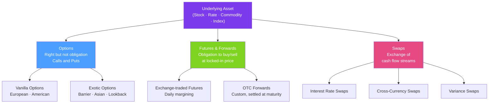

# 🔗 Derivatives Overview

> [!abstract] TL;DR
> A derivative is a contract whose value depends on an underlying asset (stock, rate, commodity, index). Derivatives exist for three purposes: hedging risk, speculating, and enabling arbitrage. The key insight underlying all derivative pricing is the **no-arbitrage principle** — if two portfolios produce identical payoffs, they must have the same price today; otherwise a riskless profit exists.

## Intuition — analogy FIRST

Derivatives are financial contracts written *about* another asset, like a side bet on a sports game. The game (the underlying asset) plays out regardless of the bet. But the bet itself has value — it can transfer risk from those who don't want it (hedgers) to those willing to accept it (speculators).

A **call option** is like buying the right — but not the obligation — to purchase a house at today's price six months from now. If prices rise, you exercise your right and profit. If prices fall, you let the option expire and lose only the premium you paid. The option lets you cap your downside while preserving the upside.

A **forward contract** is simpler: you lock in today's price for a future purchase. A farmer sells wheat forward to lock in revenue; a baker buys wheat forward to lock in costs. Both sides reduce uncertainty. The forward price is set so neither party pays anything upfront — it's calculated to make the contract fair (zero NPV) at initiation.

---

## How It Works



## Key Concepts / Details

### Why Derivatives Exist

| Purpose | Who | Example |
|---------|-----|---------|
| **Hedging** | Corporates, investors | Airline buys oil futures to cap fuel cost |
| **Speculation** | Traders, hedge funds | Buy calls to express bullish view with leverage |
| **Arbitrage** | Market makers | Exploit put-call parity violations |
| **Completing markets** | Everyone | Access exposures unavailable in spot markets |

Derivatives also enable **leverage** (large exposure with small premium) and **tail risk transfer** (selling catastrophe insurance).

### The No-Arbitrage Principle

The bedrock of all derivative pricing. If two portfolios produce identical future payoffs in every possible state of the world, they must have the same price today:

> **Law of One Price**: identical payoffs → identical price

If violated, you can **buy the cheap portfolio** and **sell the expensive one** for a guaranteed riskless profit (arbitrage). In liquid markets, arbitrageurs immediately close such gaps.

### Put-Call Parity

The most important identity in options theory — a no-arbitrage relationship between call price $C$, put price $P$, stock price $S_0$, strike $K$, risk-free rate $r$, continuous dividend yield $q$, and time to expiry $T$:

$$C - P = S_0 e^{-qT} - K e^{-rT}$$

**Intuition**: A call minus a put with the same strike/maturity is equivalent to a forward contract on the stock (long forward = long call + short put). If the equation breaks, a riskless arbitrage exists.

**Arbitrage if $C - P > S_0 e^{-qT} - K e^{-rT}$**: Sell call, buy put, buy stock on margin — collect the spread risk-free.

### Breeden-Litzenberger: Options as Risk-Neutral Densities

The cross-sectional distribution of option prices across strikes reveals the risk-neutral probability density of the underlying at expiry:

$$p(S_T = K) = e^{rT}\frac{\partial^2 C}{\partial K^2}$$

This means the entire options market prices imply a density function for future asset prices — without assuming any specific model. This is used to extract market-implied distributions and for model calibration.

### Derivative Payoffs at a Glance

| Instrument | Payoff at $T$ | Premium Paid? |
|------------|--------------|---------------|
| Long call | $\max(S_T - K, 0)$ | Yes (upfront) |
| Long put | $\max(K - S_T, 0)$ | Yes (upfront) |
| Long forward | $S_T - F_0$ | No |
| Short forward | $F_0 - S_T$ | No |
| Long straddle | $|S_T - K|$ | Yes (double premium) |

## Python Example

```python
import numpy as np
import matplotlib.pyplot as plt

def payoff_profiles():
    S_T = np.linspace(50, 150, 500)
    K, premium_call, premium_put = 100, 5, 4

    payoffs = {
        "Long Call":  np.maximum(S_T - K, 0) - premium_call,
        "Long Put":   np.maximum(K - S_T, 0) - premium_put,
        "Long Forward": S_T - K,
        "Covered Call": (S_T - 100) - np.maximum(S_T - K, 0) + premium_call,
        "Protective Put": (S_T - 100) + np.maximum(K - S_T, 0) - premium_put,
    }

    fig, axes = plt.subplots(1, 3, figsize=(15, 5))
    colors = ["#4a9eff", "#e64980", "#7ed321", "#f5a623", "#7c3aed"]

    for ax, (name, payoff), color in zip(
        [axes[0], axes[0], axes[1], axes[2], axes[2]],
        payoffs.items(), colors
    ):
        ax.plot(S_T, payoff, label=name, color=color, linewidth=2)
        ax.axhline(0, color='black', linewidth=0.5)
        ax.axvline(K, color='gray', linewidth=0.5, linestyle='--')
        ax.legend()
        ax.set_xlabel("Stock Price at Expiry")
        ax.set_ylabel("Profit / Loss")

    plt.tight_layout()
    return payoffs

# Verify put-call parity
def verify_pcp(S0=100, K=100, r=0.05, q=0.02, T=1.0):
    """Check: C - P = S0*exp(-q*T) - K*exp(-r*T)"""
    from scipy.stats import norm
    sig = 0.20
    d1 = (np.log(S0/K) + (r - q + sig**2/2)*T) / (sig * np.sqrt(T))
    d2 = d1 - sig * np.sqrt(T)
    C = S0*np.exp(-q*T)*norm.cdf(d1) - K*np.exp(-r*T)*norm.cdf(d2)
    P = K*np.exp(-r*T)*norm.cdf(-d2) - S0*np.exp(-q*T)*norm.cdf(-d1)
    lhs = C - P
    rhs = S0*np.exp(-q*T) - K*np.exp(-r*T)
    print(f"C - P = {lhs:.6f}, S0*exp(-qT) - K*exp(-rT) = {rhs:.6f}")
    print(f"Put-call parity holds: {np.isclose(lhs, rhs)}")

verify_pcp()
```

## Real-World Notes

- **OTC vs exchange-traded**: Futures are exchange-traded (standardized, daily margined, centrally cleared). Forwards and swaps are OTC (customizable, bilateral, counterparty credit risk — hence ISDA agreements and CSAs). Post-GFC reform mandates central clearing for standardized OTC derivatives.
- **Notional vs market value**: A $100M notional interest rate swap has a *market value* near zero at initiation — the notional is not at risk. Only changes in the underlying create market value. This distinction matters enormously for risk reporting.
- **The VIX is derivative-derived**: the CBOE Volatility Index is computed from S&P 500 option prices using the Breeden-Litzenberger formula in reverse — effectively a model-free measure of implied variance.

## Common Pitfalls

- **Confusing notional with exposure**: a $1B notional swap doesn't mean $1B is at risk — only the net PV of rate differences is at risk.
- **Forgetting put-call parity in practice**: if your quoted call and put prices don't satisfy PCP (adjusted for dividends), you're leaving arbitrage on the table or have a data error.
- **Assuming all options are European**: American options allow early exercise and require different pricing (binomial trees, finite differences); Black-Scholes alone is insufficient.

## Related Concepts

- [[Futures_and_Forwards]] — Deep dive on forward/futures pricing and hedging
- [[Options_Fundamentals]] — Call/put mechanics, moneyness, strategies
- [[Swaps]] — IRS, variance swaps, and the multi-curve framework
- [[Black_Scholes_Model]] — Pricing options under lognormal dynamics
- [[Fixed_Income_Instruments]] — Bonds as the discounting foundation for derivatives

## Review Questions

1. Two portfolios: (A) long call + cash $K e^{-rT}$, and (B) long put + long stock. Prove they have the same payoff at expiry. What is the no-arbitrage implication?
2. The Breeden-Litzenberger formula says $p(K) = e^{rT}\partial^2C/\partial K^2$. Explain in plain English why the second derivative of call prices with respect to strike gives the risk-neutral density.
3. A corporate treasurer is concerned about rising interest rates on a floating-rate loan. Which derivative instrument would you recommend, and why?

## Sources

- John Hull, *Options, Futures, and Other Derivatives*, Ch. 1-2 (Introduction to derivatives)
- Robert McDonald, *Derivatives Markets*, Ch. 1
- Breeden & Litzenberger (1978), "Prices of State-contingent Claims Implicit in Option Prices"

#quantitative-finance #financial-instruments #derivatives #no-arbitrage #put-call-parity
