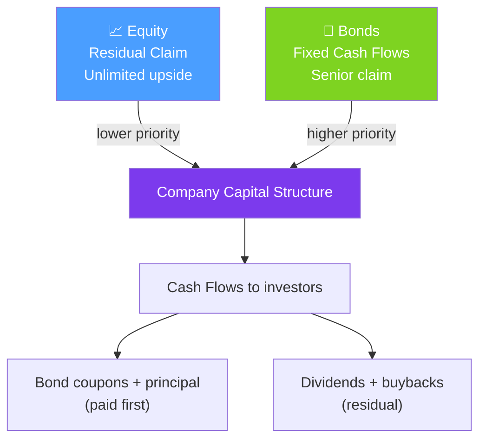

# 📈 Equities and Bonds

> [!abstract] TL;DR
> Equities and bonds are the two primary asset classes. Equities represent ownership (residual claim on corporate profits), while bonds are debt contracts with fixed cash flows. Their risk/return profiles are polar opposites: equity has unlimited upside and full downside; bonds have capped upside but priority claim in bankruptcy. Understanding return compounding and bond price sensitivity (duration, convexity) is the foundation for all portfolio and risk work.

## Intuition — analogy FIRST

Think of a company as a building. **Bondholders** are the mortgage lender — they get paid first (fixed interest), have a legal claim on the building, and their upside is capped at what they're owed. **Equity holders** own the building after the mortgage is paid — they get everything left over (unlimited upside), but if the building burns down, the mortgage lender gets paid from insurance before the owners see a cent.

This priority structure — debt senior to equity — explains why bonds yield less than stocks on average. The bond investor accepts lower expected return in exchange for contractual protection and seniority.

For return measurement, the difference between simple returns and log returns matters enormously at long horizons. Simple returns add across assets (cross-sectional portfolio math) but don't add across time. Log returns add across time but need an adjustment to aggregate across assets. In quantitative finance, always be explicit about which you're using.

---

## How It Works



## Key Concepts / Details

### Return Compounding Regimes

**Simple return** (arithmetic): $R_t = \frac{S_t - S_{t-1}}{S_{t-1}} = \frac{S_t}{S_{t-1}} - 1$

**Log return** (continuously compounded): $r_t = \ln\frac{S_t}{S_{t-1}}$

**Relationship**: $r_t = \ln(1 + R_t) \approx R_t - \frac{R_t^2}{2}$ for small returns.

Key properties:
| Property | Simple $R_t$ | Log $r_t$ |
|----------|-------------|-----------|
| Multi-period | Multiply: $(1+R_1)(1+R_2)$ | Add: $r_1 + r_2$ |
| Portfolio | Add: $\sum w_i R_i$ | Approximate only |
| Distribution | Skewed | Closer to normal |
| GBM | Arithmetic | Natural (GBM log-prices are Brownian) |

Log returns are used in time-series modeling; simple returns are used in portfolio weighting.

### Bond Pricing

A bond's price is the present value of all future cash flows discounted at the yield $y$:

$$P = \sum_{i=1}^{n} \frac{c}{(1+y)^i} + \frac{F}{(1+y)^n} = \sum_i c_i \cdot D(t_i) + F \cdot D(T)$$

where $c$ is the coupon, $F$ is face value, and $D(t) = e^{-rt}$ is the discount factor.

**Continuous compounding version**: $P = \sum_i c_i e^{-y t_i} + F e^{-yT}$

### Duration, DV01, and Convexity

**Modified Duration** measures price sensitivity to yield changes (linear approximation):

$$D_{mod} = -\frac{1}{P}\frac{dP}{dy}$$

So $\Delta P \approx -D_{mod} \cdot P \cdot \Delta y$.

For a zero-coupon bond: $D_{mod} = T/(1+y)$ (Macaulay Duration divided by $(1+y)$).

**DV01** (Dollar Value of a Basis Point) — absolute price change for a 1bp yield move:

$$DV01 = -\frac{dP}{d(y/10000)} = D_{mod} \cdot P / 10000$$

**Convexity** captures the curvature (second-order correction):

$$\text{Convexity} = \frac{1}{P}\frac{d^2P}{dy^2}$$

Full P&L for a yield move $\Delta y$:

$$\Delta P \approx -D_{mod} \cdot P \cdot \Delta y + \frac{1}{2}\text{Convexity} \cdot P \cdot (\Delta y)^2$$

Convexity is positive for vanilla bonds — holders benefit (relative to the linear duration approximation) when yields move in either direction. Callable bonds can have negative convexity.

### Yield Curve Shapes

| Shape | Description | Economic Signal |
|-------|-------------|-----------------|
| Normal (upward sloping) | Short rates < long rates | Expansion expected |
| Inverted | Short rates > long rates | Recession predicted |
| Flat | Rates similar across maturities | Transition period |
| Humped | Medium rates highest | Specific supply/demand |

Yield curve inversions (2Y > 10Y) have historically preceded US recessions by 6-18 months.

## Python Example

```python
import numpy as np
from scipy.optimize import brentq

def bond_price(y: float, coupon: float, face: float, periods: int, freq: int = 2) -> float:
    """Price a bond given yield y (annual), coupon rate, face value, periods (semiannual)."""
    c = coupon * face / freq
    times = np.arange(1, periods + 1) / freq
    pv_coupons = np.sum(c * np.exp(-y * times))
    pv_face = face * np.exp(-y * periods / freq)
    return pv_coupons + pv_face

def modified_duration(y: float, coupon: float, face: float, periods: int, freq: int = 2) -> float:
    """Numerical modified duration via central difference."""
    dy = 1e-5
    p_up = bond_price(y + dy, coupon, face, periods, freq)
    p_dn = bond_price(y - dy, coupon, face, periods, freq)
    p = bond_price(y, coupon, face, periods, freq)
    return -(p_up - p_dn) / (2 * dy * p)

def convexity(y: float, coupon: float, face: float, periods: int, freq: int = 2) -> float:
    """Numerical convexity."""
    dy = 1e-5
    p_up = bond_price(y + dy, coupon, face, periods, freq)
    p_dn = bond_price(y - dy, coupon, face, periods, freq)
    p = bond_price(y, coupon, face, periods, freq)
    return (p_up - 2*p + p_dn) / (dy**2 * p)

# Example: 5% 10-year bond at 4% yield
y, coupon, face, periods = 0.04, 0.05, 1000, 20
price = bond_price(y, coupon, face, periods)
dur = modified_duration(y, coupon, face, periods)
cvx = convexity(y, coupon, face, periods)
dv01 = dur * price / 10000

print(f"Price:     {price:.4f}")
print(f"Mod Dur:   {dur:.4f} years")
print(f"DV01:      {dv01:.4f}")
print(f"Convexity: {cvx:.4f}")

# P&L approximation for 50bp yield shock
dy = 0.005
dprice_linear = -dur * price * dy
dprice_full = dprice_linear + 0.5 * cvx * price * dy**2
print(f"\n50bp shock — linear: {dprice_linear:.4f}, with convexity: {dprice_full:.4f}")
```

## Real-World Notes

- **Duration immunization**: pension funds match asset duration to liability duration to make the portfolio insensitive to parallel yield curve shifts. Duration matching is the most common fixed-income risk management technique.
- **DV01 aggregation**: a bond portfolio's DV01 is the sum of individual DV01s — this makes it simple to hedge interest rate risk with Treasury futures ($100 DV01 per contract at current rates).
- **Log returns and risk models**: risk models use log returns because they're approximately normal and aggregate cleanly across time. But performance reporting uses simple returns (more intuitive to clients).
- **Equity risk premium**: the long-run equity premium over bonds (US: ~5-7% historically) compensates for higher volatility, uncertainty of cash flows, and junior claim in bankruptcy.

## Common Pitfalls

- **Confusing Macaulay and Modified Duration**: Macaulay Duration = Modified Duration × $(1+y)$. Use Modified for sensitivity calculations.
- **Ignoring convexity for large rate moves**: duration alone is fine for <50bp; for 100bp+ moves, convexity correction is material.
- **Using simple returns for time-series modeling**: simple returns don't add across time — using them in regression misspecifies the model for compound growth.
- **Treating yield-to-maturity as the return**: YTM assumes coupons are reinvested at the same rate. In practice, reinvestment risk means realized return differs.

## Related Concepts

- [[Derivatives_Overview]] — Building complex instruments on top of equity and bond underlyings
- [[Fixed_Income_Instruments]] — Zero bootstrapping, Nelson-Siegel, and yield curve PCA
- [[Modern_Portfolio_Theory]] — How equities and bonds combine to form efficient portfolios
- [[Value_at_Risk]] — Computing risk of equity and bond portfolios
- [[Factor_Models]] — Fama-French model for equity; level/slope/curvature for fixed income

## Review Questions

1. A 10-year, 6% coupon bond is priced at par ($1000) with YTM of 6%. If rates rise 100bp to 7%, what is the approximate new price using duration only? Then add the convexity correction. Why does convexity benefit long bondholders?
2. Why do quantitative models prefer log returns over simple returns for time-series analysis, even though portfolio weights are applied to simple returns?
3. Explain the senior/junior capital structure claim using the analogy of a building with a mortgage. What does this imply about the yield relationship between corporate bonds and equity expected returns?

## Sources

- John Hull, *Options, Futures, and Other Derivatives*, Ch. 4 (Interest rates), Ch. 6 (Futures on bonds)
- Frank Fabozzi, *Fixed Income Mathematics*, Ch. 3 (Duration and Convexity)
- Campbell, Lo, MacKinlay, *The Econometrics of Financial Markets*, Ch. 1 (log vs simple returns)

#quantitative-finance #financial-instruments #equities #bonds #duration #fixed-income
