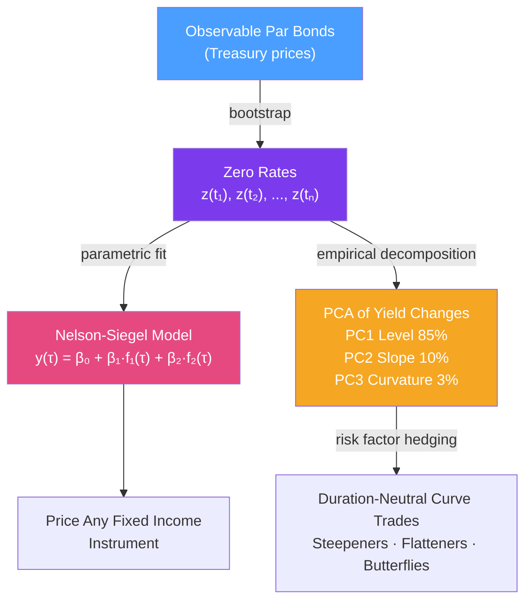

# 🏦 Fixed Income Instruments

> [!abstract] TL;DR
> Fixed income instruments are debt securities with predetermined cash flows. Understanding the yield curve — its construction, modeling, and decomposition — is essential for pricing all interest-rate-sensitive products. The Nelson-Siegel model parametrizes the curve with three economically intuitive factors; PCA reveals that level (85%), slope (10%), and curvature (3%) explain nearly all yield curve variation.

## Intuition — analogy FIRST

The yield curve is like a term premium map for lending money. If you lend $1 for one day, you charge very little (the overnight rate). If you lend for 30 years, you demand much more — you're exposed to inflation risk, credit risk, and opportunity cost over a long horizon. The yield curve connects these rates across all maturities.

Zero rates are the building blocks: the yield on a bond that pays only at maturity (no intermediate coupons). All other fixed income instruments can be decomposed into portfolios of zero-coupon bonds. **Bootstrapping** extracts these zero rates from observable par bond prices — working maturity by maturity, peeling away each coupon date.

The Nelson-Siegel model says the yield curve shape is driven by just three factors: the **level** (all rates move together), the **slope** (short vs long end), and the **curvature** (the hump in the belly). These align perfectly with what PCA extracts from yield curve data — confirming both the empirical structure and the parametric model.

---

## How It Works



## Key Concepts / Details

### Zero-Rate Bootstrapping

Par bonds trade at par ($P = F$), so the coupon rate equals the yield. Bootstrap zero rates by stripping coupon cash flows iteratively:

For a 1-year annual coupon bond at par (rate $c_1$): $z_1 = c_1$ (trivial — single cash flow).

For a 2-year bond with coupon $c_2$ at par:
$$F = c_2 \cdot e^{-z_1 \cdot 1} + (F + c_2) \cdot e^{-z_2 \cdot 2}$$
Solve for $z_2$ using the known $z_1$.

Continue sequentially. This converts par yields into the zero-coupon (spot) yield curve.

### Nelson-Siegel Parameterization

The Nelson-Siegel model provides a smooth, parsimonious functional form for the yield curve:

$$y(\tau) = \beta_0 + \beta_1\frac{1 - e^{-\lambda\tau}}{\lambda\tau} + \beta_2\left[\frac{1 - e^{-\lambda\tau}}{\lambda\tau} - e^{-\lambda\tau}\right]$$

**Economic interpretation**:
| Parameter | Factor | Interpretation | Loading |
|-----------|--------|---------------|---------|
| $\beta_0$ | Level | Long-run rate ($\tau \to \infty$) | Constant = 1 |
| $\beta_1$ | Slope | Short-end deviation from long end | Decays to 0 |
| $\beta_2$ | Curvature | Hump in the belly | Peak at medium $\tau$ |
| $\lambda$ | Decay | Controls where belly peaks | Fixed or estimated |

**Diebold-Li extension**: treating $\beta_0, \beta_1, \beta_2$ as latent state variables and adding dynamics (AR(1) or VAR) makes this a Dynamic Nelson-Siegel (DNS) model for forecasting yield curves.

### PCA of the Yield Curve

Empirical PCA of yield curve changes across maturities consistently finds:
- **PC1 (Level, ~85% variance)**: all yields move together — a parallel shift
- **PC2 (Slope, ~10% variance)**: short and long rates move in opposite directions
- **PC3 (Curvature, ~3% variance)**: belly moves relative to wings

These three factors explain >97% of yield curve variation. This has two major implications:
1. You only need 3 factors to hedge most yield curve risk (DV01 plus slope and curvature hedges)
2. The Nelson-Siegel parametric form is consistent with the empirical factor structure

### Fixed Income Instrument Types

| Instrument | Key Features | Risk |
|------------|-------------|------|
| Treasury bonds | Government credit, liquid benchmark | Rates only |
| Corporate bonds | Credit spread, seniority | Rates + credit |
| MBS (mortgage-backed) | Prepayment risk, negative convexity | Rates + prepayment |
| TIPS | Inflation-linked principal | Real rates + inflation |
| Callable bonds | Embedded call, negative convexity | Rates + optionality |
| ABS | Asset-backed pools | Rates + asset-specific |

### Credit Spreads

A corporate bond yield = Treasury yield + credit spread:

$$y_{corp}(\tau) = y_{treasury}(\tau) + s(\tau)$$

**Z-spread**: constant spread added to the entire OIS/Treasury curve to match corporate bond price.

**OAS (Option-Adjusted Spread)**: spread after removing the value of embedded optionality (for callable bonds/MBS).

**Credit spread ≈ $\lambda(1-R)$**: where $\lambda$ is the hazard rate (default intensity) and $R$ is recovery rate.

## Python Example

```python
import numpy as np
from scipy.optimize import minimize, curve_fit

def bootstrap_zero_rates(par_yields: list[float], maturities: list[float]) -> dict:
    """Bootstrap zero rates from par bond yields (annual coupon, continuous compounding)."""
    zero_rates = {}
    
    for i, (T, par_y) in enumerate(zip(maturities, par_yields)):
        coupon = par_y  # par bond: coupon = yield
        # Sum of PV of coupons for previous maturities
        pv_coupons = sum(coupon * np.exp(-zero_rates[t] * t) 
                        for t in maturities[:i])
        # Solve for current zero rate: 1 = pv_coupons + (1+coupon)*exp(-z*T)
        z = -np.log((1 - pv_coupons) / (1 + coupon)) / T
        zero_rates[T] = z
        
    return zero_rates

def nelson_siegel(tau: np.ndarray, beta0: float, beta1: float, 
                  beta2: float, lam: float) -> np.ndarray:
    """Nelson-Siegel yield curve model."""
    f1 = (1 - np.exp(-lam * tau)) / (lam * tau)
    f2 = f1 - np.exp(-lam * tau)
    return beta0 + beta1 * f1 + beta2 * f2

def fit_nelson_siegel(maturities: np.ndarray, yields: np.ndarray):
    """Fit Nelson-Siegel parameters to observed zero rates."""
    p0 = [0.04, -0.01, 0.01, 0.5]  # initial guess
    popt, _ = curve_fit(nelson_siegel, maturities, yields, p0=p0)
    return popt

# Example: US Treasury par yields (simplified)
maturities = [1, 2, 3, 5, 7, 10, 20, 30]
par_yields  = [0.052, 0.049, 0.048, 0.046, 0.046, 0.047, 0.050, 0.051]

# Bootstrap zero rates
zero_rates = bootstrap_zero_rates(par_yields, maturities)
print("Bootstrapped Zero Rates:")
for T, z in zero_rates.items():
    print(f"  {T}Y: {z*100:.4f}%")

# Fit Nelson-Siegel
tau = np.array(maturities)
z_arr = np.array(list(zero_rates.values()))
beta0, beta1, beta2, lam = fit_nelson_siegel(tau, z_arr)
print(f"\nNelson-Siegel: β0={beta0*100:.2f}%, β1={beta1*100:.2f}%, β2={beta2*100:.2f}%, λ={lam:.3f}")

# PCA on simulated yield curve changes
np.random.seed(42)
n_obs = 252
level_shock = np.random.randn(n_obs, 1) * 0.005
slope_shock = np.random.randn(n_obs, 1) * 0.002
curve_data = level_shock + slope_shock * np.array([-1, -0.5, 0, 0.5, 1, 1.2, 1.3, 1.4])
from numpy.linalg import svd
U, S, Vt = svd(curve_data - curve_data.mean(axis=0), full_matrices=False)
var_explained = S**2 / (S**2).sum()
print("\nPCA variance explained:")
for i, v in enumerate(var_explained[:3]):
    print(f"  PC{i+1}: {v*100:.1f}%")
```

## Real-World Notes

- **Yield curve as economic indicator**: an inverted curve (2Y > 10Y) has preceded every US recession since 1955. The slope factor ($\beta_1$ in Nelson-Siegel) is a key macro predictor.
- **DV01 hedging with futures**: Treasury futures (ZB for 30Y, ZN for 10Y, ZF for 5Y, ZT for 2Y) allow traders to hedge specific maturity buckets of yield curve exposure.
- **MBS negative convexity**: when rates fall, homeowners prepay mortgages, shortening MBS duration. This creates negative convexity — the worst of both worlds for bond holders.

## Common Pitfalls

- **Bootstrapping order matters**: always go from shortest to longest maturity; each zero rate feeds into the next.
- **Par yields vs zero rates**: Nelson-Siegel should be fit to zero rates, not par yields (they're close but not identical for non-flat curves).
- **PCA on levels vs changes**: yield PCA should be done on **changes** (stationary) not levels (non-stationary).

## Related Concepts

- [[Equities_and_Bonds]] — Duration and DV01 for individual bonds
- [[Swaps]] — IRS valuation using the bootstrapped zero curve
- [[Interest_Rate_Derivatives]] — Short-rate models fitting the initial yield curve
- [[Credit_Risk]] — Credit spread as default probability × LGD

## Review Questions

1. Walk through the bootstrapping algorithm for 3-year par yields. Why must you solve sequentially from shortest to longest maturity?
2. Explain the economic interpretation of each Nelson-Siegel parameter ($\beta_0, \beta_1, \beta_2$). How does the model capture an inverted yield curve?
3. PCA of the yield curve shows that 3 factors explain 98% of variance. What are these three factors, and how would you use them to hedge a bond portfolio's curve risk?

## Sources

- Fabozzi, *Fixed Income Mathematics* (bootstrapping chapter)
- Nelson & Siegel (1987), "Parsimonious Modeling of Yield Curves"
- Diebold & Li (2006), "Forecasting the Term Structure of Government Bond Yields"
- Litterman & Scheinkman (1991), "Common Factors Affecting Bond Returns" (PCA paper)

#quantitative-finance #financial-instruments #fixed-income #yield-curve #nelson-siegel #PCA
