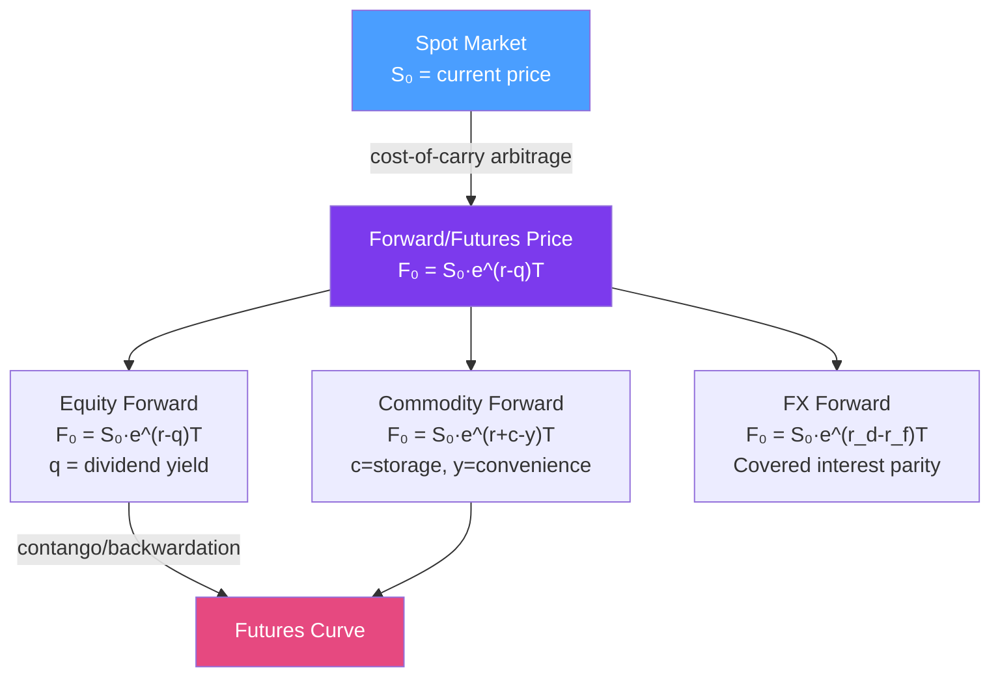

# 📦 Futures and Forwards

> [!abstract] TL;DR
> Forwards and futures are agreements to buy or sell an asset at a predetermined price on a future date. The fair forward price is determined by the **cost-of-carry model** — no arbitrage between buying spot and buying forward. Futures differ from forwards by being exchange-traded with daily mark-to-market settlement. The **minimum-variance hedge ratio** tells you how many futures contracts to use to hedge a spot position.

## Intuition — analogy FIRST

A forward contract is like pre-ordering a custom pizza for next month at today's price. You commit now; you pay (and eat) later. The pizza shop sets the "forward price" based on what the ingredients will cost — current ingredient prices plus storage and financing until delivery. This is the cost-of-carry.

If the forward price were *higher* than the cost-of-carry price, everyone would buy ingredients today, store them, and sell the pizza later for a riskless profit. If it were *lower*, they'd short the ingredients and lock in the forward price. Arbitrage forces the forward price to exactly the cost-of-carry level.

A futures contract is the same idea but traded on an exchange: standardized, centrally cleared, and **marked to market daily** — meaning gains and losses are settled every day rather than at maturity. This daily settlement eliminates counterparty risk but introduces "tailing the hedge" adjustments when interest rates are correlated with the underlying.

---

## How It Works



## Key Concepts / Details

### Cost-of-Carry Pricing

The forward price is the no-arbitrage price for future delivery. For an equity with continuous dividend yield $q$:

$$F_0 = S_0 \cdot e^{(r-q)T}$$

**Derivation**: 
- Strategy A: Buy forward at $F_0$ (costs nothing today, pays $F_0$ at T)
- Strategy B: Borrow $S_0 e^{-qT}$, buy stock (worth $S_0 e^{-qT}$ today), receive dividends

Both strategies deliver one share at time T. By no-arbitrage: $F_0 = S_0 e^{-qT} \cdot e^{rT} = S_0 e^{(r-q)T}$.

For **commodities** with storage cost $c$ and convenience yield $y$:

$$F_0 = S_0 \cdot e^{(r+c-y)T}$$

- Storage cost $c$: cost of warehousing (pushes price up)
- Convenience yield $y$: benefit of holding physical inventory (pushes price down)
- Backwardation ($F_0 < S_0$): high convenience yield $y > r + c$ — common in energy markets during supply scarcity

For **FX** (covered interest parity):

$$F_0 = S_0 \cdot e^{(r_d - r_f)T}$$

### Contango vs Backwardation

| Term | Condition | Typical Market |
|------|-----------|---------------|
| Contango | $F_0 > S_0$ | Financial assets, cheap storage |
| Backwardation | $F_0 < S_0$ | Energy (high convenience yield), seasonal commodities |
| Flat | $F_0 \approx S_0$ | Low carry, near-term delivery |

### Minimum-Variance Hedge Ratio

To hedge a spot position of size $V_S$ in asset S using futures on asset F:

$$h^* = \rho \cdot \frac{\sigma_S}{\sigma_F}$$

Number of futures contracts: $N^* = h^* \cdot \frac{V_S}{V_F}$ where $V_F$ is the futures contract value.

**Basis risk**: The residual risk when the hedge is imperfect ($\rho < 1$), e.g., hedging jet fuel with crude oil futures.

**Tailing the hedge for futures** (daily settlement adjustment):
$$N^*_{tailed} = h^* \cdot \frac{V_S}{V_F} \cdot e^{-rT}$$

### Forward vs Futures: Key Differences

| Feature | Forward | Futures |
|---------|---------|---------|
| Venue | OTC (bilateral) | Exchange (centralized) |
| Counterparty risk | High (mitigated by CSA/netting) | Minimal (CCP clearinghouse) |
| Settlement | Single payment at maturity | Daily mark-to-market |
| Standardization | Customizable | Standardized contract specs |
| Liquidity | Lower | Higher |
| Tailing adjustment | No | Yes |

## Python Example

```python
import numpy as np

def forward_price(S0: float, r: float, q: float, T: float) -> float:
    """No-arbitrage forward price for equity with continuous dividend yield."""
    return S0 * np.exp((r - q) * T)

def commodity_forward(S0: float, r: float, c: float, y: float, T: float) -> float:
    """Forward price for commodity with storage cost c and convenience yield y."""
    return S0 * np.exp((r + c - y) * T)

def min_variance_hedge_ratio(sigma_S: float, sigma_F: float, rho: float) -> float:
    """Optimal hedge ratio h* = rho * (sigma_S / sigma_F)."""
    return rho * sigma_S / sigma_F

def futures_contracts_needed(
    V_spot: float, V_futures: float, h: float, r: float = 0, T: float = 0
) -> float:
    """Number of futures contracts for minimum-variance hedge (with optional tailing)."""
    N = h * V_spot / V_futures
    if T > 0 and r > 0:
        N *= np.exp(-r * T)  # tail the hedge for futures daily settlement
    return N

# Example: Equity portfolio hedge
S0 = 4500  # S&P 500 level
T = 0.5    # 6 months
r, q = 0.05, 0.015
F0 = forward_price(S0, r, q, T)
print(f"6M S&P 500 Forward: {F0:.2f} (spot: {S0})")

# Hedge $10M equity portfolio with ES futures ($50 * index)
V_spot = 10_000_000
V_futures = 50 * F0  # $ per futures contract
h_star = min_variance_hedge_ratio(sigma_S=0.20, sigma_F=0.20, rho=0.98)
N = futures_contracts_needed(V_spot, V_futures, h_star, r, T)
print(f"Hedge ratio h*: {h_star:.4f}")
print(f"Futures contracts needed: {N:.1f}")

# Commodity example (WTI crude: backwardation)
oil_spot = 80
F_oil = commodity_forward(S0=oil_spot, r=0.05, c=0.03, y=0.12, T=0.5)
print(f"\nWTI 6M Forward: {F_oil:.2f} (spot: {oil_spot}) — {'backwardation' if F_oil < oil_spot else 'contango'}")
```

## Real-World Notes

- **Rolling futures hedges**: a 6-month exposure hedged with 3-month contracts requires rolling every 3 months. Roll risk is material when the futures curve shape changes (e.g., a contango market in energy during COVID-19 oil storage crisis, where May 2020 WTI futures went negative).
- **Convergence**: at expiry $T$, futures price must converge to spot: $F_T = S_T$. If it doesn't, an arbitrage exists (buy cheap, deliver).
- **Forward rates in FX**: covered interest parity is one of the most robust no-arbitrage conditions in finance; deviations (CIP violations) were notable during the 2008 GFC and post-2015 regulatory capital changes.

## Common Pitfalls

- **Forward price ≠ expected future price**: $F_0 = S_0 e^{(r-q)T}$ is a no-arbitrage price, not a forecast. Under risk-neutral measure, $F_0 = E^Q[S_T]$, but under the real-world measure, the expected future price includes a risk premium.
- **Forgetting the tailing adjustment for futures**: when interest rates and futures payoffs are correlated, using the same $h^*$ as for forwards overstates the number of contracts.
- **Ignoring basis risk**: if your hedge asset differs from the exposure (e.g., jet fuel vs crude), residual basis risk remains even at the optimal hedge ratio.

## Related Concepts

- [[Derivatives_Overview]] — Derivative taxonomy and the no-arbitrage principle
- [[Equities_and_Bonds]] — Spot prices and dividends that feed into forward pricing
- [[Swaps]] — Swaps as portfolio of forwards
- [[Algorithmic_Execution]] — Futures used as hedging instruments in execution algorithms

## Review Questions

1. Derive the forward price for a stock paying no dividends using the no-arbitrage argument (cash-and-carry). What two strategies must be equivalent?
2. A portfolio manager holds $50M of equity with $\beta = 1.2$. How many S&P 500 futures contracts (size $250 \times$ index) are needed to reduce beta to 0.5?
3. WTI crude oil is in backwardation: spot = $80, 3M future = $75. What economic condition does this reflect? Under what circumstances would you expect crude to be in contango?

## Sources

- John Hull, *Options, Futures, and Other Derivatives*, Ch. 3-5 (Forwards, Futures, Hedging)
- Geman, *Commodities and Commodity Derivatives*, Ch. 2 (Cost of carry)
- Working, "The Theory of Price of Storage" (1949)

#quantitative-finance #financial-instruments #futures #forwards #cost-of-carry #hedging
