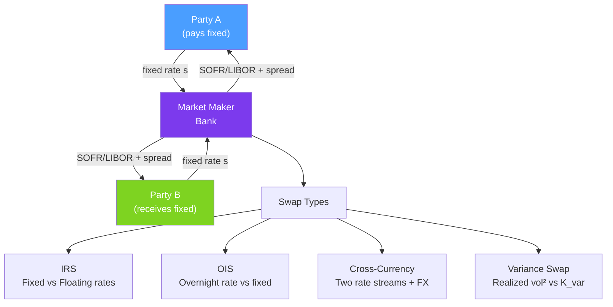

# 🔄 Swaps

> [!abstract] TL;DR
> A swap is an agreement to exchange two streams of cash flows. Interest rate swaps (IRS) exchange fixed vs floating payments and are the world's largest OTC derivatives market (~$400T notional). Post-2008, the multi-curve framework (OIS discounting) replaced the single-curve approach. Variance swaps allow model-free exposure to realized volatility and underlie the VIX.

## Intuition — analogy FIRST

An **interest rate swap** is like two homeowners swapping mortgage payments. Homeowner A has a fixed mortgage (pays $2,000/month reliably) but wishes they had a floating payment that tracks their income. Homeowner B has a floating mortgage (varies with interest rates) but prefers the predictability of fixed payments. They agree to swap: A makes B's floating payment while B makes A's fixed payment. Neither pays the actual "house" amount (the notional) — only the payment streams are exchanged.

The bank acts as intermediary, earning a small bid-ask spread. The IRS market exists because corporations often issue floating-rate debt but want fixed-rate exposure (or vice versa), while interest rate managers want to hedge or express views on rate movements.

A **variance swap** is even more elegant: it's a direct bet on realized volatility squared. Pay a fixed "variance strike" $K_{var}$ and receive the actual realized variance $\sigma_R^2$. The fair value of $K_{var}$ can be computed entirely from the options market — no model needed.

---

## How It Works



## Key Concepts / Details

### Interest Rate Swap Valuation

An IRS where Party A pays fixed rate $s$ and receives SOFR on notional $N$ with payment dates $t_1, ..., t_n$:

**Fixed leg PV**: $V_{fixed} = s \cdot N \sum_{i=1}^{n} \tau_i \cdot P(0, t_i)$

**Float leg PV**: At fair value at initiation, the floating leg is priced via forward rates.

**Fair swap rate** (par rate) — the fixed rate that makes the swap NPV = 0:

$$s = \frac{1 - P(0, t_n)}{\sum_{i=1}^{n} \tau_i \cdot P(0, t_i)}$$

where $P(0, t)$ is today's discount factor to time $t$ and $\tau_i$ is the day count fraction.

### Multi-Curve Framework (Post-2008)

Pre-2008: single LIBOR curve for both discounting and forward rate projection.

Post-2008: LIBOR-OIS spread revealed credit risk embedded in LIBOR. Now use two curves:
- **OIS curve** (SOFR, Fed Funds): risk-free discounting of cash flows
- **SOFR/projection curve**: forecast future floating-rate payments

**LIBOR-OIS spread** = LIBOR − OIS rate ≈ 0 in normal times, >100bp during stress (peaked at ~364bp in Oct 2008). It measures interbank credit risk / funding stress.

The multi-curve framework means a single IRS has:
1. A SOFR forward curve for projecting float payments
2. An OIS discount curve for computing PVs

This distinction matters for exotic rates products where a 1bp LIBOR-OIS spread error can cause material P&L discrepancies.

### Swaptions

A **swaption** is an option to enter a swap at a fixed rate $K$ (the swaption strike). Pricing via Black's formula:

$$V_{payer} = A_{n} \left[ F_s N(d_1) - K N(d_2) \right]$$

where $A_n = \sum_i \tau_i P(0, t_i)$ is the annuity factor, $F_s$ is the forward swap rate, and $d_1, d_2$ follow Black's formula with swaption implied vol.

### Variance Swaps

A variance swap pays the difference between realized variance and a fixed variance strike:

$$\text{Payoff} = N \cdot (\sigma_R^2 - K_{var})$$

**Model-free replication** (Neuberger 1994): the fair variance strike equals the cost of a log-contract portfolio:

$$K_{var} = \frac{2}{T}\left[\int_0^{F_0}\frac{P(K)}{K^2}dK + \int_{F_0}^{\infty}\frac{C(K)}{K^2}dK\right]$$

This is entirely derived from market option prices — no model needed for the forward price of variance.

**VIX**: the CBOE VIX index is essentially the 30-day variance swap rate on S&P 500 options, annualized and square-rooted:

$$VIX = 100\sqrt{\frac{2}{T}\sum_i \frac{\Delta K_i}{K_i^2}e^{rT}O(K_i)}$$

**Variance Risk Premium (VRP)**: implied variance consistently exceeds realized variance by ~2 variance points/month. Selling variance swaps (being short VRP) is a persistent carry trade.

**Dispersion trade**: sell index variance, buy single-stock variance — profits from higher index implied correlation than realized correlation.

## Python Example

```python
import numpy as np

def fair_swap_rate(discount_factors: np.ndarray, day_count_fracs: np.ndarray) -> float:
    """
    Compute par swap rate.
    discount_factors: array of OIS discount factors P(0, t_i)
    day_count_fracs: tau_i (e.g., 0.25 for quarterly)
    """
    annuity = np.sum(day_count_fracs * discount_factors)
    # Float leg = 1 - P(0, T_n) for par swap
    float_leg = 1 - discount_factors[-1]
    return float_leg / annuity

def irs_pv(fixed_rate: float, market_swap_rate: float,
           discount_factors: np.ndarray, day_count_fracs: np.ndarray,
           notional: float = 1e6) -> float:
    """Mark-to-market PV of existing IRS (paying fixed)."""
    annuity = np.sum(day_count_fracs * discount_factors)
    # PV = Notional * annuity * (market_rate - fixed_rate)
    return notional * annuity * (market_swap_rate - fixed_rate)

def variance_swap_pv(realized_var: float, K_var: float, notional: float = 1e6) -> float:
    """Variance swap payoff (long realized variance)."""
    return notional * (realized_var - K_var)

# Example: 2-year quarterly IRS
n = 8  # 8 quarterly payments
r_ois = 0.04  # OIS curve flat at 4%
tau = np.full(n, 0.25)
t = np.cumsum(tau)
D = np.exp(-r_ois * t)  # OIS discount factors

s = fair_swap_rate(D, tau)
print(f"Fair 2Y swap rate: {s*100:.4f}%")

# Mark-to-market after 6M if rates moved to 5%
new_r = 0.05
t_rem = t - 0.5  # remaining tenors after 6M
t_rem = t_rem[t_rem > 0]
D_rem = np.exp(-new_r * t_rem)
tau_rem = np.full(len(t_rem), 0.25)
new_par = fair_swap_rate(D_rem, tau_rem)
pv = irs_pv(s, new_par, D_rem, tau_rem, notional=10_000_000)
print(f"MtM after rates rise to 5%: ${pv:,.0f}")

# Variance swap: VIX was 20 (implied var = 0.04), realized was 15% (var = 0.0225)
VIX_level = 20  # vol points
K_var = (VIX_level/100)**2
sigma_R = 0.15
realized_var = sigma_R**2
payoff = variance_swap_pv(realized_var, K_var, notional=1_000_000)
print(f"\nVariance swap payoff (long): ${payoff:,.0f} (seller made money)")
```

## Real-World Notes

- **LIBOR transition**: LIBOR was phased out at end of 2021 (USD) and 2023. SOFR (Secured Overnight Financing Rate) replaced USD LIBOR. This required repricing $200T+ of contracts — one of the largest financial engineering projects in history.
- **Gamma scalping via variance swaps**: a long variance swap position profits if realized vol exceeds implied. It's equivalent to gamma scalping a delta-hedged portfolio — but the variance swap does this continuously and model-free.
- **OIS market**: central banks' overnight rates (Fed Funds, SOFR) are now the risk-free rate. OIS swaps are the most liquid product referencing overnight rates and are used for collateral and discount curves.

## Common Pitfalls

- **Confusing notional with risk**: IRS notional ($10M) is never exchanged; only the rate difference matters. Risk is measured by DV01 (change in PV per 1bp rate move).
- **Single-curve vs multi-curve**: using a single curve for both discounting and projection is now incorrect for any non-OIS swap.
- **VIX is not realized vol**: VIX is implied vol (forward-looking), not a measure of recent realized volatility.

## Related Concepts

- [[Fixed_Income_Instruments]] — Discount curves and bootstrapping underlying IRS valuation
- [[Interest_Rate_Derivatives]] — Short-rate models, Vasicek, Hull-White for rates
- [[Volatility_Smile]] — Swaption vol surface and SABR model for rates vol
- [[Exotic_Options]] — Variance swaps, dispersion trades in Advanced Derivatives

## Review Questions

1. Derive the fair swap rate formula from the condition that the IRS has zero NPV at initiation. Why is the fair rate equal to the par bond yield for the same maturity?
2. Explain why the LIBOR-OIS spread is a measure of bank credit/funding stress. What caused it to spike to 364bp in October 2008?
3. A long variance swap has strike $K_{var} = 0.04$ (VIX = 20). At expiry, realized volatility was 12%. Calculate the payoff on $1M notional. Who made money, and why?

## Sources

- Brigo & Mercurio, *Interest Rate Models: Theory and Practice*, Ch. 1-2 (IRS, multi-curve)
- Neuberger (1994), "The Log Contract" — variance swap replication
- CBOE VIX White Paper (2009): VIX calculation methodology

#quantitative-finance #financial-instruments #swaps #IRS #variance-swaps #VIX #OIS
