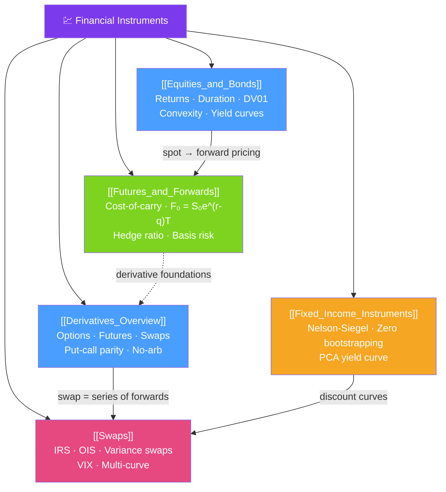

# 💹 Financial Instruments — Map of Content

> [!abstract] What This Section Covers
> The building blocks of every portfolio and derivative structure. This section covers equities, bonds, derivatives, futures, forwards, swaps, and the full fixed-income toolkit — with pricing formulas, risk sensitivities, and the no-arbitrage relationships that hold everything together. Master these before modeling anything more complex.

## Concept Map

## Learning Path

1. [[Equities_and_Bonds]] — Return compounding, bond pricing, duration, DV01, and convexity.
2. [[Derivatives_Overview]] — What derivatives are, why they exist, put-call parity, and no-arbitrage.
3. [[Futures_and_Forwards]] — Cost-of-carry pricing, hedge ratios, basis risk, contango/backwardation.
4. [[Fixed_Income_Instruments]] — Yield curves, zero-rate bootstrapping, Nelson-Siegel, and PCA.
5. [[Swaps]] — IRS mechanics, OIS discounting, variance swaps, and the VIX.

## All Notes at a Glance

| Note | Difficulty | What You'll Learn |
|------|------------|-------------------|
| [[Equities_and_Bonds]] | Beginner | Log vs simple returns, bond pricing, Modified Duration, DV01, Convexity, yield curve shapes |
| [[Derivatives_Overview]] | Beginner | Derivative taxonomy, payoff profiles, put-call parity, Breeden-Litzenberger, no-arbitrage |
| [[Futures_and_Forwards]] | Intermediate | Forward pricing formula, cost-of-carry, minimum-variance hedge ratio, contango vs backwardation |
| [[Fixed_Income_Instruments]] | Intermediate | Zero bootstrapping, Nelson-Siegel parameterization, PCA of yield curve, credit spreads |
| [[Swaps]] | Intermediate | IRS valuation, OIS/multi-curve framework, variance swap replication, VIX construction |

## Key Questions This Section Answers

- Why is the log return $\ln(S_t/S_{t-1})$ preferred over simple return for multi-period compounding?
- What is Modified Duration and why does convexity matter for large yield moves?
- Why is a forward price NOT the expected future price — what is it actually?
- How does put-call parity create a no-arbitrage constraint between option prices?
- How does the multi-curve framework (OIS discounting) differ from the pre-2008 single-curve approach?
- How is the fair value of a variance swap determined without a model?
- What does the VIX actually measure, and how is it computed from option prices?

## Related Sections

- [[_MOC_QuantFinance_Master|↑ Master MOC]]
- [[_MOC_Math_Foundations|← Mathematical Foundations]]
- [[_MOC_Options_Theory|→ Options Theory]]
- [[_MOC_Advanced_Derivatives|→ Advanced Derivatives]]

#MOC #QuantitativeFinance #FinancialInstruments
