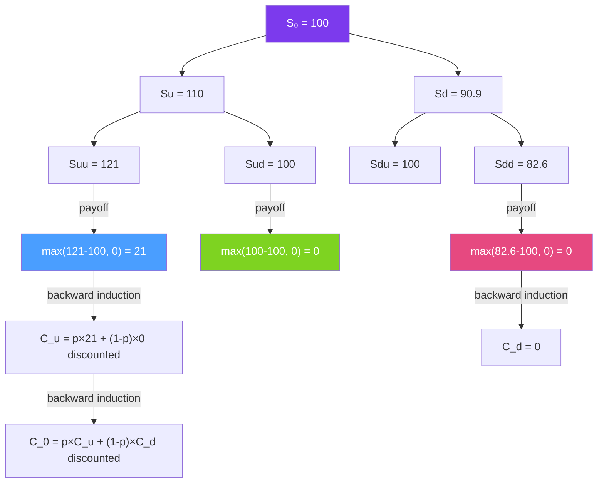

# 🌳 Binomial Trees

> [!abstract] TL;DR
> The binomial tree model (Cox-Ross-Rubinstein, 1979) prices options by discretizing time into $n$ steps, where at each step the stock price moves up by factor $u$ or down by $d = 1/u$. The key insight is that **risk-neutral probabilities** $p$ make the discounted asset price a martingale — no-arbitrage without needing the real-world drift $\mu$. As $n \to \infty$, the binomial price converges to the Black-Scholes price. Crucially, binomial trees handle **American early exercise** naturally via backward induction.

## Intuition — analogy FIRST

Think of a stock price as a coin-flip game. At each time step, the stock either goes up (heads: multiply by $u$) or down (tails: multiply by $d$). After $n$ flips, the stock can be at $n+1$ different price levels. This is a lattice — a tree of possible futures.

Now here's the clever part: the real probability of heads doesn't matter for pricing the option. What matters is the **risk-neutral probability** $p$ — the probability that makes the expected return equal to the risk-free rate. Once you have $p$, you can price any option by working backwards from its expiry payoffs to today (backward induction).

American options are natural in this framework. At each node, compare the immediate exercise value (intrinsic value) to the continuation value (holding the option). Take the maximum. European options ignore early exercise; you just compute the discounted expected payoff at expiry.

---

## How It Works



## Key Concepts / Details

### CRR Parameters

The Cox-Ross-Rubinstein parameterization ensures the binomial model matches the first two moments of log-returns:

$$u = e^{\sigma\sqrt{\Delta t}}, \quad d = \frac{1}{u} = e^{-\sigma\sqrt{\Delta t}}$$

**Risk-neutral probability** (makes discounted stock price a martingale):

$$p = \frac{e^{(r-q)\Delta t} - d}{u - d}$$

where $r$ is the risk-free rate, $q$ is dividend yield, $\Delta t = T/n$.

Verification: $p \cdot u + (1-p) \cdot d = e^{(r-q)\Delta t}$ ✓ (Expected growth = risk-free rate − dividend)

**No-arbitrage condition**: $d < e^{(r-q)\Delta t} < u$, ensuring $p \in (0,1)$.

### Backward Induction

**Step 1**: Build the price tree. At node $(i, j)$ (time step $i$, $j$ up-moves), the stock price is:
$$S_{i,j} = S_0 \cdot u^j \cdot d^{i-j}$$

**Step 2**: Compute option payoffs at expiry ($i = n$):
- Call: $V_{n,j} = \max(S_{n,j} - K, 0)$
- Put: $V_{n,j} = \max(K - S_{n,j}, 0)$

**Step 3**: Work backwards using risk-neutral expectation:
$$V_{i,j} = e^{-r\Delta t}[p \cdot V_{i+1,j+1} + (1-p) \cdot V_{i+1,j}]$$

**For American options**, at each node, compare to intrinsic value:
$$V_{i,j}^{American} = \max\left(\text{Intrinsic}_{i,j}, e^{-r\Delta t}[p \cdot V_{i+1,j+1}^{Am} + (1-p) \cdot V_{i+1,j}^{Am}]\right)$$

### Convergence to Black-Scholes

As $n \to \infty$:
$$\text{Binomial Price}(n) \to \text{Black-Scholes Price}$$

Convergence is oscillatory (even $n$ vs odd $n$ alternately over- and underestimate). Practical rules:
- Use $n \geq 100$ steps for European options (accuracy ≈ 0.01%)
- Use $n \geq 200$ for American options near expiry

**Richardson extrapolation** accelerates convergence: combine prices with $n$ and $2n$ steps:
$$V \approx V_{2n} + (V_{2n} - V_n)$$

### Early Exercise Value

The American put premium over European put:
$$\text{Early Exercise Premium} = V^{Am}_{put} - V^{Eu}_{put} \geq 0$$

This premium increases with: deeper ITM, longer time to expiry, lower dividend yield, higher risk-free rate.

For **calls on dividend-paying stocks**: early exercise may be optimal just before an ex-dividend date (capture the discrete dividend). The binomial tree handles this by explicitly modeling the dividend drop.

### Greeks from Binomial Tree

Numerical Greeks via finite differences on the binomial tree:

$$\Delta \approx \frac{V_{1,1} - V_{1,0}}{S_{1,1} - S_{1,0}}$$

$$\Gamma \approx \frac{(V_{2,2}-V_{2,1})/(S_{2,2}-S_{2,1}) - (V_{2,1}-V_{2,0})/(S_{2,1}-S_{2,0})}{(S_{2,2}-S_{2,0})/2}$$

$$\Theta \approx \frac{V_{2,1} - V_0}{2\Delta t}$$

## Python Example

```python
import numpy as np

def binomial_option(S: float, K: float, r: float, q: float, T: float,
                    sigma: float, n: int, opt_type: str = 'call',
                    american: bool = False) -> dict:
    """
    CRR Binomial tree option pricing.
    Returns price and Greeks.
    """
    dt = T / n
    u = np.exp(sigma * np.sqrt(dt))
    d = 1 / u
    p = (np.exp((r - q) * dt) - d) / (u - d)
    discount = np.exp(-r * dt)
    
    # Build stock price tree (terminal nodes only, backward)
    # Stock prices at maturity
    j = np.arange(n + 1)
    S_T = S * (u ** j) * (d ** (n - j))
    
    # Terminal payoffs
    if opt_type == 'call':
        V = np.maximum(S_T - K, 0)
    else:
        V = np.maximum(K - S_T, 0)
    
    # Backward induction
    for i in range(n - 1, -1, -1):
        S_i = S * (u ** np.arange(i + 1)) * (d ** (i - np.arange(i + 1)))
        V = discount * (p * V[1:i+2] + (1 - p) * V[0:i+1])
        if american:
            if opt_type == 'call':
                V = np.maximum(V, S_i - K)
            else:
                V = np.maximum(V, K - S_i)
    
    # Greeks from first two steps
    dt2 = 2 * dt
    V_tree = np.zeros((3, 3))
    # Rebuild a small tree for Greeks (simplified)
    S_nodes = {(0,0): S, (1,0): S*d, (1,1): S*u,
               (2,0): S*d*d, (2,1): S, (2,2): S*u*u}
    
    price = V[0]
    
    # Simplified Greek estimation using bump-and-revalue
    def price_at(S_bump):
        S_T_bump = S_bump * (u ** j) * (d ** (n - j))
        V_bump = np.maximum(S_T_bump - K, 0) if opt_type == 'call' else np.maximum(K - S_T_bump, 0)
        for i in range(n-1, -1, -1):
            V_bump = discount * (p * V_bump[1:i+2] + (1-p) * V_bump[0:i+1])
        return V_bump[0]
    
    dS = S * 0.01
    delta = (price_at(S + dS) - price_at(S - dS)) / (2 * dS)
    gamma = (price_at(S + dS) - 2*price + price_at(S - dS)) / dS**2
    
    return {"price": price, "delta": delta, "gamma": gamma}

# European and American comparison
params = dict(S=100, K=100, r=0.05, q=0.02, T=1.0, sigma=0.20, n=200)

eu_call = binomial_option(**params, opt_type='call', american=False)
eu_put  = binomial_option(**params, opt_type='put',  american=False)
am_call = binomial_option(**params, opt_type='call', american=True)
am_put  = binomial_option(**params, opt_type='put',  american=True)

print("European Call:", eu_call)
print("American Call:", am_call)
print(f"Call early exercise premium: {am_call['price'] - eu_call['price']:.4f}")
print("\nEuropean Put:", eu_put)
print("American Put:", am_put)
print(f"Put early exercise premium: {am_put['price'] - eu_put['price']:.4f}")

# Convergence study
print("\nConvergence to BS:")
from scipy.stats import norm
def bs_price(S, K, r, q, T, sigma, opt='call'):
    d1 = (np.log(S/K) + (r-q+sigma**2/2)*T) / (sigma*np.sqrt(T))
    d2 = d1 - sigma*np.sqrt(T)
    if opt == 'call':
        return S*np.exp(-q*T)*norm.cdf(d1) - K*np.exp(-r*T)*norm.cdf(d2)
    return K*np.exp(-r*T)*norm.cdf(-d2) - S*np.exp(-q*T)*norm.cdf(-d1)

bs = bs_price(**{k:v for k,v in params.items() if k!='n'})
for n in [10, 50, 100, 200, 500]:
    p = binomial_option(**{**params, 'n': n}, opt_type='call')['price']
    print(f"  n={n:4d}: Binomial={p:.5f}, BS={bs:.5f}, Error={abs(p-bs):.5f}")
```

## Real-World Notes

- **Dividend handling**: large dividends require adjusting the stock price at the ex-dividend date. Discrete dividends break the log-normality assumption — the tree must be modified (escrowed dividend model or shifted tree).
- **Exotic option pricing**: binomial trees extend naturally to path-dependent exotics (barrier options, lookbacks) with modified payoff calculations at barrier-crossing nodes.
- **Implied trees (Derman-Kani)**: construct a binomial tree exactly consistent with the observed implied volatility surface — each node's transition probability is calibrated to match market option prices.

## Common Pitfalls

- **Forgetting the early exercise check**: omitting the `max(intrinsic, continuation)` step turns American pricing into European pricing — common bug.
- **$d \neq 1/u$ for other parameterizations**: the Jarrow-Rudd parameterization uses $u = e^{(\mu-\sigma^2/2)\Delta t + \sigma\sqrt{\Delta t}}$ with real-world probabilities. Only CRR has $u = 1/d$.
- **Using too few steps for short-dated options**: a 3-month option priced with $n=10$ steps ($\Delta t = 1$ week) is very inaccurate. Use $n \geq 50$ minimum.

## Related Concepts

- [[Black_Scholes_Model]] — The continuous-time limit of the binomial tree
- [[Options_Fundamentals]] — The payoffs priced by the tree
- [[Monte_Carlo_Pricing]] — Alternative numerical method for complex payoffs
- [[Greeks]] — Obtained numerically from binomial tree differences

## Review Questions

1. Derive the CRR risk-neutral probability $p = (e^{(r-q)\Delta t}-d)/(u-d)$. What condition ensures $p \in (0,1)$?
2. Why is the American put worth more than the European put, but the American call on a non-dividend-paying stock is worth the same as the European call?
3. Implement backward induction for a 2-step binomial tree with $S=100, K=100, r=5\%, \sigma=20\%, T=0.5$ (so $\Delta t=0.25$). Price both a European and American put.

## Sources

- Cox, Ross, Rubinstein (1979), "Option Pricing: A Simplified Approach," *Journal of Financial Economics*
- John Hull, *Options, Futures, and Other Derivatives*, Ch. 13 (Binomial Trees)
- Derman & Kani (1994), "Riding on a Smile" — implied binomial trees

#quantitative-finance #options-theory #binomial-trees #CRR #american-options #backward-induction
