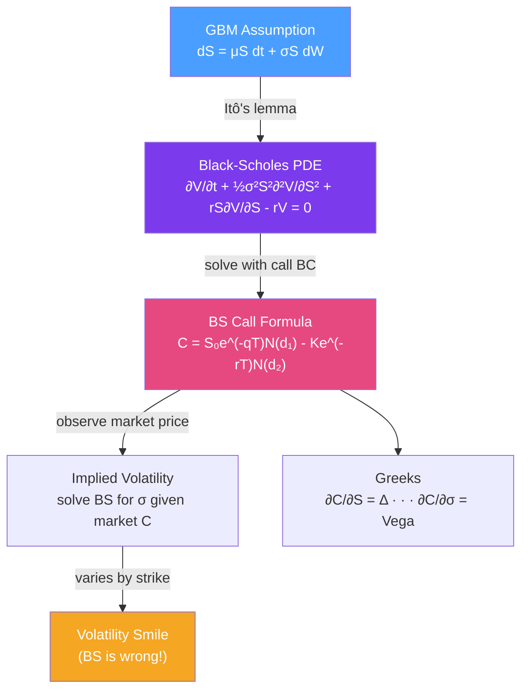

# 📐 Black-Scholes Model

> [!abstract] TL;DR
> Black-Scholes (1973) derives the fair price of a European option by constructing a **replicating portfolio** that eliminates all risk — the real-world drift $\mu$ cancels out, leaving only the risk-free rate and volatility. The resulting formula $C = S_0 e^{-qT}N(d_1) - Ke^{-rT}N(d_2)$ is the cornerstone of modern derivatives pricing, and **implied volatility** (the BS formula inverted to find the vol that matches the market price) is the universal quoting convention for options.

## Intuition — analogy FIRST

Black and Scholes asked: "Given that a stock follows a random walk, how much should an option on that stock cost?" Their key insight was that you can **continuously hedge** an option position by holding a specific quantity of the stock (Delta). If you do this perfectly, all randomness cancels out — you're left with a deterministic portfolio that must earn the risk-free rate.

Think of it like continuously adjusting the weight of ballast in a boat to stay level in choppy water. The waves (stock price randomness) are always present, but you're constantly counterbalancing. The cost of setting up this perfect balance determines the fair option price.

The stunning implication: the fair option price doesn't depend on whether the stock is expected to go up or down ($\mu$ disappears). It only depends on the volatility $\sigma$ (how choppy the water is), the risk-free rate $r$, the strike $K$, time to expiry $T$, and the current stock price $S$.

---

## How It Works



## Key Concepts / Details

### Assumptions

| Assumption | Reality | Impact of Violation |
|------------|---------|---------------------|
| Constant volatility $\sigma$ | Vol changes over time | Volatility smile exists |
| GBM (continuous paths) | Jumps occur | Underprices short-dated OTM options |
| No transaction costs | Costs are real | Continuous hedging is impossible in practice |
| Continuous trading | Markets have gaps | Discrete hedging leads to hedging error |
| Log-normal returns | Fat tails in data | Underprices tail risk |
| Known constant $r$ | Rates stochastic | Matters for long-dated options |

### Black-Scholes Formula

$$C = S_0 e^{-qT}N(d_1) - Ke^{-rT}N(d_2)$$

$$P = Ke^{-rT}N(-d_2) - S_0 e^{-qT}N(-d_1)$$

where:
$$d_1 = \frac{\ln(S_0/K) + (r - q + \sigma^2/2)T}{\sigma\sqrt{T}}, \quad d_2 = d_1 - \sigma\sqrt{T}$$

**Interpretation**:
- $N(d_2) = e^{-rT}N(d_2)$ after discounting: risk-neutral probability of exercise at expiry
- $N(d_1)$: delta-adjusted probability — the hedge ratio
- $Ke^{-rT}N(d_2)$: present value of expected strike payment
- $S_0 e^{-qT}N(d_1)$: present value of expected asset receipt

### Black-Scholes PDE Derivation

Under GBM: $dS = \mu S\,dt + \sigma S\,dW$

By Itô's lemma, the option value $V(S,t)$ satisfies:
$$dV = \left(\frac{\partial V}{\partial t} + \mu S\frac{\partial V}{\partial S} + \frac{1}{2}\sigma^2 S^2\frac{\partial^2 V}{\partial S^2}\right)dt + \sigma S\frac{\partial V}{\partial S}\,dW$$

**Key step**: form portfolio $\Pi = V - \Delta S$ where $\Delta = \partial V/\partial S$. The $dW$ terms cancel:
$$d\Pi = \left(\frac{\partial V}{\partial t} + \frac{1}{2}\sigma^2 S^2\frac{\partial^2 V}{\partial S^2}\right)dt$$

This portfolio is riskless, so it must earn $r$: $d\Pi = r\Pi\,dt = r(V - \Delta S)dt$

Combining gives the **Black-Scholes PDE**:
$$\frac{\partial V}{\partial t} + \frac{1}{2}\sigma^2 S^2\frac{\partial^2 V}{\partial S^2} + rS\frac{\partial V}{\partial S} - rV = 0$$

Note: $\mu$ has completely disappeared — the option price doesn't depend on the stock's expected return.

### Risk-Neutral Pricing

An equivalent derivation uses the **risk-neutral measure** $\mathbb{Q}$: change to a world where all assets earn $r$ (Girsanov theorem shifts $\mu \to r$). Then:

$$C = e^{-rT}\mathbb{E}^{\mathbb{Q}}[\max(S_T - K, 0)]$$

Under $\mathbb{Q}$, $\ln(S_T/S_0) \sim \mathcal{N}((r-q-\sigma^2/2)T, \sigma^2 T)$, and evaluating the expectation yields the BS formula.

### Implied Volatility

The BS formula can be inverted: given the market option price $C^{mkt}$, find $\sigma$ such that:
$$BS(S, K, r, q, T, \sigma) = C^{mkt}$$

This $\sigma$ is the **implied volatility** — the market's forecast of future realized volatility embedded in the option price. It's the universal quoting convention: traders quote option prices as implied vols.

**Newton-Raphson for IV**: Starting from initial guess $\sigma_0$:
$$\sigma_{n+1} = \sigma_n - \frac{BS(\sigma_n) - C^{mkt}}{\text{Vega}(\sigma_n)}$$

Converges in 3-5 iterations. Vega = $\partial C/\partial\sigma$ provides the Jacobian.

## Python Example

```python
import numpy as np
from scipy.stats import norm
from scipy.optimize import brentq

def bs_price(S: float, K: float, r: float, q: float, T: float, 
             sigma: float, opt_type: str = 'call') -> float:
    """Black-Scholes option price."""
    if T <= 0:
        return max(S - K, 0) if opt_type == 'call' else max(K - S, 0)
    d1 = (np.log(S/K) + (r - q + sigma**2/2)*T) / (sigma * np.sqrt(T))
    d2 = d1 - sigma * np.sqrt(T)
    if opt_type == 'call':
        return S*np.exp(-q*T)*norm.cdf(d1) - K*np.exp(-r*T)*norm.cdf(d2)
    else:
        return K*np.exp(-r*T)*norm.cdf(-d2) - S*np.exp(-q*T)*norm.cdf(-d1)

def bs_vega(S: float, K: float, r: float, q: float, T: float, sigma: float) -> float:
    """Vega = dC/d_sigma."""
    d1 = (np.log(S/K) + (r - q + sigma**2/2)*T) / (sigma * np.sqrt(T))
    return S * np.exp(-q*T) * norm.pdf(d1) * np.sqrt(T)

def implied_vol(S: float, K: float, r: float, q: float, T: float, 
                market_price: float, opt_type: str = 'call') -> float:
    """Implied volatility via Brent's method (robust Newton-Raphson)."""
    def objective(sigma):
        return bs_price(S, K, r, q, T, sigma, opt_type) - market_price
    
    # Bracket: vol must be in (1e-6, 10)
    try:
        return brentq(objective, 1e-6, 10.0, xtol=1e-8)
    except ValueError:
        return np.nan

# Example
S, K, r, q, T, sigma = 100, 100, 0.05, 0.02, 1.0, 0.20
C = bs_price(S, K, r, q, T, sigma, 'call')
P = bs_price(S, K, r, q, T, sigma, 'put')
print(f"ATM Call: {C:.4f}")
print(f"ATM Put:  {P:.4f}")
print(f"Verify PCP: C-P = {C-P:.4f}, S*exp(-qT)-K*exp(-rT) = {S*np.exp(-q*T)-K*np.exp(-r*T):.4f}")

# IV inversion
market_price = 11.5  # Slightly above fair value implies higher vol
iv = implied_vol(S, K, r, q, T, market_price)
print(f"\nMarket price {market_price:.2f} → Implied vol: {iv*100:.2f}%")

# IV surface across strikes
strikes = np.arange(80, 125, 5)
for Ks in strikes:
    price = bs_price(S, Ks, r, q, T, 0.22)  # True vol = 22%
    iv_k = implied_vol(S, Ks, r, q, T, price)
    print(f"K={Ks:3d}: Price={price:.3f}, IV={iv_k*100:.2f}%")
```

## Real-World Notes

- **BS as IV machine**: practitioners rarely use BS to get an absolute price. Instead, they use it to convert between price and implied vol. All the modelling happens in the vol surface — how to interpolate and extrapolate IV across strikes and maturities.
- **Delta hedging frequency**: theoretical BS requires continuous hedging. In practice, options market makers hedge in discrete intervals (daily or intraday). The hedging error creates P&L noise proportional to $\Gamma \cdot (dS)^2 - \Theta\,dt$.
- **Model dependency**: BS gives a unique implied vol from a market price. But that same vol plugged into a Heston or SABR model would give a different "equivalent" parameter. IV is model-dependent — it's specifically the BS inverse.

## Common Pitfalls

- **Using the wrong $d_1$ for dividend-paying stocks**: always include the $-q$ term in $d_1$; forgetting dividends systematically underprices calls and overprices puts.
- **Applying BS to American options**: BS gives the European price; American put prices are always higher (early exercise premium). Use binomial trees or FDM for Americans.
- **Treating IV as "true volatility"**: implied vol is not a forecast of future vol — it's the vol that makes BS match the market price. The difference between IV and realized vol is the variance risk premium.

## Related Concepts

- [[Options_Fundamentals]] — The payoffs being priced
- [[Greeks]] — Partial derivatives of the BS formula
- [[Stochastic_Calculus]] — GBM and Itô's lemma underlying the derivation
- [[Volatility_Smile]] — The market's evidence that BS is wrong (constant vol)
- [[Binomial_Trees]] — Discrete approximation of the BS framework

## Review Questions

1. Derive the Black-Scholes PDE from the GBM assumption and a delta-hedging argument. At which step does the drift $\mu$ disappear, and why?
2. A European call on a non-dividend-paying stock has BS price of $5.20 with inputs $S=100, K=100, r=5\%, T=0.5, \sigma=20\%$. If the market trades this option at $6.00, what is the implied volatility (qualitatively — higher or lower than 20%) and what does this suggest about the market's view?
3. Why can't you directly apply the Black-Scholes formula to price an American put option on a dividend-paying stock?

## Sources

- Black & Scholes (1973), "The Pricing of Options and Corporate Liabilities," *JPE*
- Merton (1973), "Theory of Rational Option Pricing," *Bell Journal*
- John Hull, *Options, Futures, and Other Derivatives*, Ch. 15-16

#quantitative-finance #options-theory #black-scholes #implied-volatility #risk-neutral-pricing
