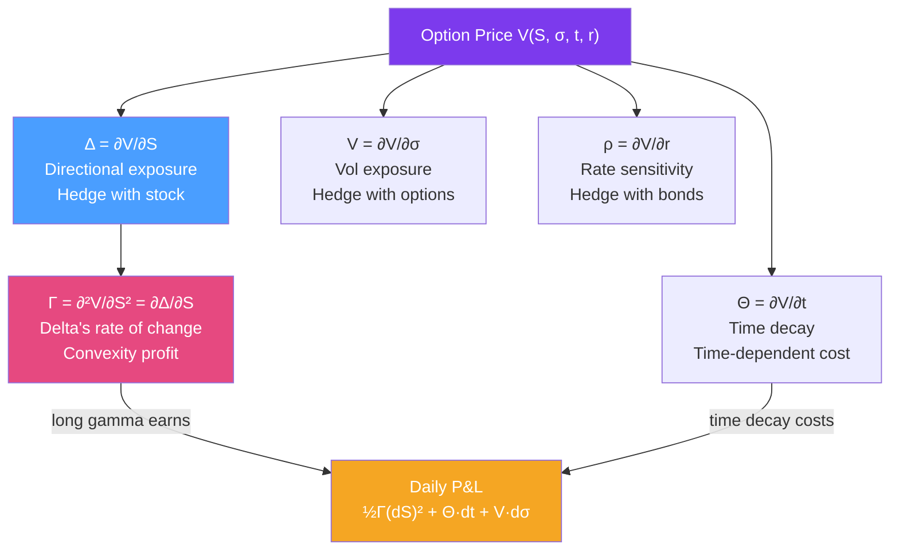

# Γ Greeks

> [!abstract] TL;DR
> The Greeks measure an option's price sensitivity to each market parameter: Delta (stock price), Gamma (rate of change of Delta), Vega (volatility), Theta (time decay), and Rho (interest rate). The daily P&L of a delta-hedged option position decomposes cleanly as: $dV \approx \frac{1}{2}\Gamma(dS)^2 + \Theta\,dt + \mathcal{V}\,d\sigma$. The critical tradeoff: **long Gamma earns money if realized vol exceeds implied; Theta (time decay) is the cost**.

## Intuition — analogy FIRST

Think of Greeks as the speedometer, acceleration gauge, weather sensitivity, and fuel gauge for your option position.

**Delta** is the speedometer: how fast is your position moving relative to the stock? A Delta of 0.6 means for every $1 the stock moves, your option moves $0.60. A delta-hedged portfolio has Delta ≈ 0 — you're not directionally exposed.

**Gamma** is the acceleration gauge: how quickly is Delta changing? High Gamma means your Delta can swing dramatically on a big move. This is what makes options nonlinear — and valuable to hold. 

**Theta** is the fuel gauge running backwards: options lose value every day as expiry approaches (for most positions). You're paying a daily time decay tax just for holding the position.

**Vega** is the weather sensitivity: if volatility picks up (stormy weather = bigger price swings), your options become more valuable. If it calms down, they lose value.

The Gamma-Theta tradeoff is the central tension of options trading: you collect Theta every day (getting paid to hold the position), but you'd need realized volatility to stay low to break even. If the stock moves a lot (high realized vol), your Gamma profits exceed your Theta cost.

---

## How It Works



## Key Concepts / Details

### The Five Greeks

**Delta** ($\Delta$): rate of change of option price with respect to underlying price.

$$\Delta_{call} = e^{-qT}N(d_1), \quad \Delta_{put} = -e^{-qT}N(-d_1) = \Delta_{call} - e^{-qT}$$

- Ranges from 0 to 1 for calls, -1 to 0 for puts
- Equals the hedge ratio: short $\Delta$ shares to delta-hedge a long call
- Equals the risk-neutral probability of being ITM at expiry (approximately)

**Gamma** ($\Gamma$): rate of change of Delta; convexity of option w.r.t. stock.

$$\Gamma = \frac{e^{-qT}n(d_1)}{S\sigma\sqrt{T}}$$

where $n(\cdot)$ is the standard normal PDF. Gamma is always positive for long options (calls and puts). It is highest ATM and for short-dated options.

**Vega** ($\mathcal{V}$): sensitivity to volatility.

$$\mathcal{V} = S \cdot e^{-qT} \cdot n(d_1) \cdot \sqrt{T}$$

Quoted per 1% change in vol. Long options are always long Vega (profit from vol increase). Highest ATM; grows with time to expiry $(\propto \sqrt{T})$.

**Theta** ($\Theta$): rate of change w.r.t. calendar time (time decay).

$$\Theta_{call} = -\frac{Se^{-qT}n(d_1)\sigma}{2\sqrt{T}} - rKe^{-rT}N(d_2) + qSe^{-qT}N(d_1)$$

Usually negative for long options — time works against option holders. Theta is most negative for ATM short-dated options.

**Rho** ($\rho$): sensitivity to interest rates.

$$\rho_{call} = KTe^{-rT}N(d_2)$$

Rho is often the least important Greek for equity options with short maturities but matters for long-dated options and FX.

### P&L Decomposition for Delta-Hedged Position

The daily P&L of a delta-hedged long option position:

$$dV \approx \underbrace{\frac{1}{2}\Gamma(dS)^2}_{\text{Gamma P&L}} + \underbrace{\Theta\,dt}_{\text{Theta decay}} + \underbrace{\mathcal{V}\,d\sigma}_{\text{Vega P&L}}$$

**Gamma-Theta tradeoff**: The Gamma P&L is $\frac{1}{2}\Gamma(dS)^2 \propto \Gamma \sigma_{realized}^2$, while Theta costs $-\Theta\,dt \propto \Gamma \sigma_{implied}^2$. Net:

$$\text{Net P&L} \approx \frac{1}{2}\Gamma S^2(\sigma_R^2 - \sigma_{IV}^2)\,dt$$

Long gamma is profitable when **realized volatility > implied volatility**. This is the core bet of options trading.

### Second-Order Greeks

| Greek | Formula | Interpretation |
|-------|---------|---------------|
| **Vanna** | $\partial\Delta/\partial\sigma = \partial\mathcal{V}/\partial S$ | Skew risk; how delta changes with vol |
| **Volga** | $\partial\mathcal{V}/\partial\sigma$ | Convexity in vol; cost of vol-of-vol risk |
| **Charm** | $\partial\Delta/\partial t$ | How delta drifts with time |
| **Speed** | $\partial\Gamma/\partial S$ | Third-order; Gamma change with stock |
| **Zomma** | $\partial\Gamma/\partial\sigma$ | Gamma change with vol |

Vanna and Volga are critical for vol surface management and exotic option hedging.

### Variance Risk Premium

The **variance risk premium (VRP)**: implied variance consistently exceeds realized variance by ~2 variance points/month (i.e., $IV^2 > \sigma_R^2$ on average). This means:

- Short gamma (sell options) is a systematic positive carry trade
- Long gamma loses money on average (Theta exceeds realized vol P&L)
- VRP is compensation for providing volatility insurance

## Python Example

```python
import numpy as np
from scipy.stats import norm

def bs_greeks(S: float, K: float, r: float, q: float, T: float, sigma: float) -> dict:
    """Compute all BS Greeks for a call option."""
    d1 = (np.log(S/K) + (r - q + sigma**2/2)*T) / (sigma * np.sqrt(T))
    d2 = d1 - sigma * np.sqrt(T)
    
    delta = np.exp(-q*T) * norm.cdf(d1)
    gamma = np.exp(-q*T) * norm.pdf(d1) / (S * sigma * np.sqrt(T))
    vega  = S * np.exp(-q*T) * norm.pdf(d1) * np.sqrt(T)  # per unit vol change
    theta = (-S * np.exp(-q*T) * norm.pdf(d1) * sigma / (2*np.sqrt(T))
             - r * K * np.exp(-r*T) * norm.cdf(d2)
             + q * S * np.exp(-q*T) * norm.cdf(d1))
    rho   = K * T * np.exp(-r*T) * norm.cdf(d2)
    
    return {"delta": delta, "gamma": gamma, "vega": vega/100,  # per 1% vol
            "theta": theta/365, "rho": rho/100}  # per day, per 1% rate

def gamma_theta_pnl(S: float, K: float, r: float, q: float, T: float,
                    sigma_iv: float, sigma_realized: float, dt: float = 1/252) -> float:
    """Expected daily P&L of delta-hedged long option from Gamma-Theta tradeoff."""
    greeks = bs_greeks(S, K, r, q, T, sigma_iv)
    gamma_pnl = 0.5 * greeks["gamma"] * (S * sigma_realized)**2 * dt * 252  # annualized
    theta_cost = greeks["theta"]  # already per day (negative for long option)
    return gamma_pnl + theta_cost

# Example
S, K, r, q, T, sigma = 100, 100, 0.05, 0.02, 0.25, 0.20
greeks = bs_greeks(S, K, r, q, T, sigma)

print("ATM 3M Call Greeks:")
for name, val in greeks.items():
    print(f"  {name:8s}: {val:+.6f}")

# Gamma-Theta P&L simulation
print("\nGamma-Theta daily P&L scenarios:")
for sigma_R in [0.15, 0.20, 0.25, 0.30]:
    pnl = gamma_theta_pnl(S, K, r, q, T, sigma, sigma_R)
    print(f"  Realized vol={sigma_R*100:.0f}%: Daily P&L = {pnl:+.4f}")

# P&L attribution for a 1-day move
dS = 2.0  # stock moves $2
dt = 1/252
g = bs_greeks(S, K, r, q, T, sigma)
gamma_pnl = 0.5 * g["gamma"] * dS**2
theta_pnl = g["theta"]
print(f"\nFor dS={dS}: Gamma P&L={gamma_pnl:.4f}, Theta={theta_pnl:.4f}, Total={gamma_pnl+theta_pnl:.4f}")
```

## Real-World Notes

- **Delta hedging in practice**: options market makers delta-hedge using the underlying stock or futures. They re-hedge at intervals (not continuously) — the frequency depends on Gamma and transaction costs. High-Gamma positions (short-dated ATM) need more frequent hedging.
- **Vanna-Volga pricing for exotics**: many FX exotic options are priced by adjusting the BS price using Vanna and Volga corrections — a practical approximation that doesn't require a full stochastic vol model.
- **Theta as the options seller's income**: systematic option selling (put writing, covered calls) earns positive Theta daily. Hedge funds explicitly target this premium (VRP strategies), accepting the tail risk of large realized vol spikes.

## Common Pitfalls

- **Delta neutrality ≠ risk neutrality**: delta-hedged positions are still exposed to Gamma (large moves), Vega (vol changes), and Theta (time decay).
- **Vega doesn't sum across maturities**: Vega for a 1M option and a 1Y option are both per 1% vol change, but vol changes at different maturities are not perfectly correlated. Use vega bucketed by maturity.
- **Forgetting Charm for daily hedging**: Delta changes overnight due to Charm — the market-maker who only rehedges at market open needs to account for the Charm drift from the previous close.

## Related Concepts

- [[Black_Scholes_Model]] — The pricing model from which Greeks are derived
- [[Volatility_Smile]] — Vanna and Volga corrections from the vol surface
- [[Value_at_Risk]] — Greeks feed into scenario P&L: $\delta^\top\Delta x + \frac{1}{2}\Delta x^\top\Gamma\Delta x$
- [[Exotic_Options]] — Higher-order Greeks important for path-dependent products

## Review Questions

1. Explain the Gamma-Theta tradeoff using the equation $\frac{1}{2}\Gamma S^2(\sigma_R^2 - \sigma_{IV}^2)dt$. Under what realized volatility does a long-gamma delta-hedged position break even?
2. An ATM call has Delta = 0.52. You are long 100 calls on 100 shares each. How many shares do you short to delta-hedge? If the stock jumps $5, how much does your delta change (using Gamma = 0.03)?
3. What is the variance risk premium and why does it mean that systematic option selling is profitable on average? What is the tail risk?

## Sources

- John Hull, *Options, Futures, and Other Derivatives*, Ch. 19 (Greeks)
- Taleb, *Dynamic Hedging*, Part I-II (Greeks and hedging in practice)
- Carr & Wu (2009), "Variance Risk Premiums," *Review of Financial Studies*

#quantitative-finance #options-theory #greeks #delta #gamma #vega #theta #delta-hedging
