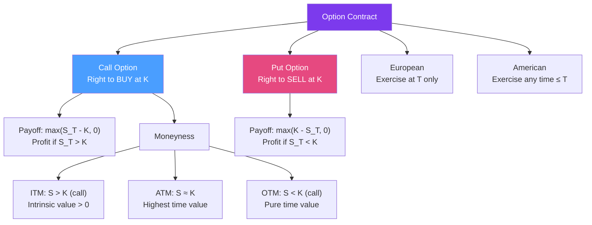

# 🎯 Options Fundamentals

> [!abstract] TL;DR
> An option gives the holder the **right, but not the obligation**, to buy (call) or sell (put) an underlying asset at a specified **strike price** $K$ before or at **expiry** $T$. Options are priced at a premium because time value (probability of becoming profitable) and intrinsic value (current profitability) both contribute. Put-call parity is the fundamental no-arbitrage relationship connecting call and put prices.

## Intuition — analogy FIRST

Buying a call option is like paying a non-refundable deposit to hold a house purchase at today's price. You pay a small deposit (the premium) now. If house prices rise, you exercise your right to buy at the locked-in price. If they fall, you walk away and lose only the deposit.

A put option is the opposite: insurance against falling prices. You pay a premium for the right to *sell* an asset at a guaranteed minimum price. Like car insurance — you pay annually; if nothing bad happens, you lose the premium; if your car is totaled, the insurance pays out.

The key insight is the **asymmetry**: the option holder has the upside if the market moves in their favor, but their loss is limited to the premium paid. The option seller (writer) has the opposite: they collect the premium upfront but face potentially large losses if the market moves against them.

---

## How It Works



## Key Concepts / Details

### Call and Put Payoffs

**Long call payoff** at expiry: $\max(S_T - K, 0)$

Profit (after premium): $\max(S_T - K, 0) - C$

**Long put payoff** at expiry: $\max(K - S_T, 0)$

Profit (after premium): $\max(K - S_T, 0) - P$

### Moneyness

| Position | Call | Put |
|----------|------|-----|
| **In-the-money (ITM)** | $S > K$ | $S < K$ |
| **At-the-money (ATM)** | $S \approx K$ | $S \approx K$ |
| **Out-of-the-money (OTM)** | $S < K$ | $S > K$ |

**Intrinsic value**: $\max(S - K, 0)$ for call — the immediate exercise value.

**Time value**: Option premium − Intrinsic value. Time value is always positive for European options (you can't know the future). ATM options have maximum time value.

### Put-Call Parity

The most fundamental relationship in options — a no-arbitrage identity:

$$C - P = S_0 e^{-qT} - K e^{-rT}$$

where $C$ and $P$ are call and put prices with the same $K$ and $T$, $q$ is continuous dividend yield.

**Proof**: Portfolio A = long call + $K e^{-rT}$ cash. Portfolio B = long put + $S_0 e^{-qT}$ stock. Both pay $\max(S_T, K)$ at $T$ — by no-arbitrage, they must have the same price today.

### Common Option Strategies

| Strategy | Construction | Max Profit | Max Loss | Breakeven |
|----------|-------------|-----------|---------|-----------|
| **Long call** | Buy call | Unlimited | Premium $C$ | $K + C$ |
| **Long put** | Buy put | $K - P$ | Premium $P$ | $K - P$ |
| **Covered call** | Long stock + short call | Strike − Stock + $C$ | Stock − $C$ | Stock − $C$ |
| **Protective put** | Long stock + long put | Unlimited | Put premium | Stock + $P$ |
| **Bull spread** | Long low $K_1$ call + short high $K_2$ call | $K_2 - K_1 - \text{net premium}$ | Net premium | $K_1 + \text{net premium}$ |
| **Straddle** | Long call + long put (same $K$) | Unlimited | $C + P$ | $K \pm (C+P)$ |
| **Strangle** | Long OTM call + long OTM put | Unlimited | $C + P$ | Two breakevens |

### Early Exercise

**American calls on non-dividend-paying stocks**: it is never optimal to exercise early — the option's time value is always positive. Thus American call = European call on non-dividend stocks.

**American puts**: early exercise of deep ITM puts can be optimal — you gain $K - S$ now and reinvest at the risk-free rate rather than waiting. American put > European put always.

**Calls with dividends**: deep ITM calls on dividend-paying stocks may be exercised just before the ex-dividend date to capture the dividend.

## Python Example

```python
import numpy as np
import matplotlib.pyplot as plt

def option_payoff(S_T: np.ndarray, K: float, opt_type: str, premium: float = 0) -> np.ndarray:
    """Calculate option payoff (and profit if premium provided)."""
    if opt_type == 'call':
        payoff = np.maximum(S_T - K, 0)
    elif opt_type == 'put':
        payoff = np.maximum(K - S_T, 0)
    else:
        raise ValueError("opt_type must be 'call' or 'put'")
    return payoff - premium

def verify_pcp(S0: float, K: float, r: float, q: float, T: float, C: float, P: float) -> dict:
    """Verify put-call parity."""
    lhs = C - P
    rhs = S0 * np.exp(-q * T) - K * np.exp(-r * T)
    return {"C - P": lhs, "Forward - PV(K)": rhs, "Parity holds": np.isclose(lhs, rhs, atol=0.01)}

# Plot strategy payoffs
S_T = np.linspace(60, 140, 500)
K, C, P = 100, 5, 4

strategies = {
    "Long Call": option_payoff(S_T, K, 'call', C),
    "Long Put": option_payoff(S_T, K, 'put', P),
    "Straddle": option_payoff(S_T, K, 'call', 0) + option_payoff(S_T, K, 'put', 0) - (C + P),
    "Bull Spread": (option_payoff(S_T, 95, 'call', 0) - option_payoff(S_T, K, 'call', 0)) - 3,
}

for name, payoff in strategies.items():
    print(f"{name}: max profit={max(payoff):.1f}, max loss={min(payoff):.1f}")

# Verify PCP with BS prices
from scipy.stats import norm
def bs_price(S, K, r, q, T, sigma, opt_type):
    d1 = (np.log(S/K) + (r - q + sigma**2/2)*T) / (sigma * np.sqrt(T))
    d2 = d1 - sigma * np.sqrt(T)
    if opt_type == 'call':
        return S*np.exp(-q*T)*norm.cdf(d1) - K*np.exp(-r*T)*norm.cdf(d2)
    else:
        return K*np.exp(-r*T)*norm.cdf(-d2) - S*np.exp(-q*T)*norm.cdf(-d1)

C = bs_price(100, 100, 0.05, 0.02, 1, 0.20, 'call')
P = bs_price(100, 100, 0.05, 0.02, 1, 0.20, 'put')
result = verify_pcp(100, 100, 0.05, 0.02, 1, C, P)
print(f"\nPut-Call Parity check: {result}")
```

## Real-World Notes

- **Options as insurance**: corporates routinely buy put options on commodity prices (airlines hedge fuel, farmers hedge crops). The premium is a known cost; the payoff is contingent protection.
- **Leverage**: a 10% move in the stock can produce 100%+ return on an OTM call option — options provide enormous leverage for a given premium. This also means OTM options can expire worthless (100% loss of premium).
- **Implied vol as "fear gauge"**: the implied volatility of at-the-money options reflects the market's expected future volatility. When investors are fearful, they bid up put option premiums — the VIX is essentially the implied vol of S&P 500 ATM options.

## Common Pitfalls

- **Confusing expiry payoff with pre-expiry price**: a call has time value before expiry — it is worth more than its intrinsic value unless expiry is immediate.
- **Thinking maximum loss on a long option > premium**: it can never exceed the premium paid (for long options). Unlike futures, options have defined downside.
- **Assuming American = early exercise is always better**: for calls on non-dividend-paying stocks, early exercise destroys time value. The decision is never trivial.

## Related Concepts

- [[Black_Scholes_Model]] — Pricing these payoffs under GBM dynamics
- [[Greeks]] — Measuring option price sensitivity to market parameters
- [[Binomial_Trees]] — Numerical pricing that handles American early exercise
- [[Derivatives_Overview]] — Options in the broader derivatives context

## Review Questions

1. Draw the payoff profile of a protective put (long stock + long put). What does this strategy look like at expiry? Why is it called "portfolio insurance"?
2. Use put-call parity to prove that an American call on a non-dividend-paying stock is worth the same as a European call. (Hint: show the American feature has no extra value.)
3. A straddle on stock XYZ (current price $100) costs $12 total premium. At what stock price at expiry does the buyer break even? What does this strategy bet on?

## Sources

- John Hull, *Options, Futures, and Other Derivatives*, Ch. 9-10 (Options strategies, properties)
- Sheldon Natenberg, *Option Volatility and Pricing*, Ch. 1-4 (Option basics)
- CBOE Options Institute materials

#quantitative-finance #options-theory #calls #puts #put-call-parity #options-fundamentals
