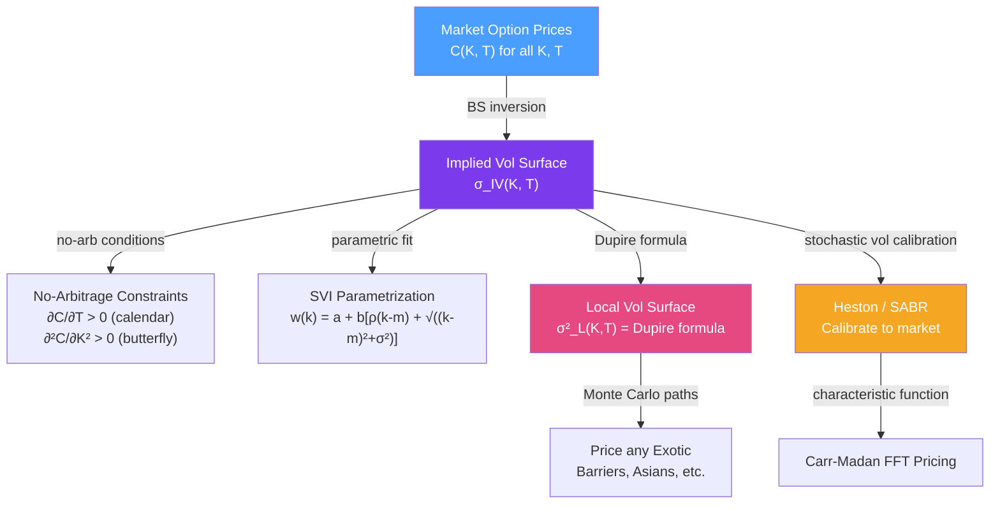

# 📊 Volatility Smile

> [!abstract] TL;DR
> The volatility smile is the market's confession that Black-Scholes is wrong: the same underlying asset trades with **different implied volatilities at different strikes and maturities**. Equity markets show a persistent left skew (OTM puts expensive relative to calls). The implied vol surface must satisfy no-arbitrage constraints (calendar spread monotonicity, butterfly positivity) and can be used to extract the **local vol surface** (Dupire 1994) or calibrated to stochastic vol models (Heston, SABR).

## Intuition — analogy FIRST

Black-Scholes assumes the stock price follows a simple random walk with constant volatility $\sigma$. If this were true, every option on the same stock would give the same implied vol — a flat, horizontal surface. But when you look at actual option prices and "invert" them through BS to get implied vol, you see a curve (or surface) that is decidedly not flat.

For equity indices like the S&P 500, the vol surface has a **left skew**: out-of-the-money puts (strikes below current price) have higher implied vol than ATM or OTM calls. This reflects two things: (1) investors fear crashes and pay a premium for crash insurance (puts), and (2) realized volatility tends to spike when markets fall (leverage effect). The market is telling you that large down moves are more likely than a simple lognormal model predicts.

For currency options, you often see a more symmetric **smile** — both OTM puts and calls are expensive relative to ATM — because large moves in either direction are possible. For rates options (swaptions), you see complex surfaces with term-structure effects.

---

## How It Works



## Key Concepts / Details

### No-Arbitrage Conditions on the Vol Surface

A valid implied vol surface must satisfy two no-arbitrage conditions:

**1. Calendar spread monotonicity**: call prices must increase with maturity for same strike:
$$\frac{\partial C(K, T)}{\partial T} \geq 0$$

Violation: you could sell the short-dated option and buy the long-dated one for a riskless profit (butterfly with time spread).

**2. Butterfly positivity**: call prices must be convex in strike:
$$\frac{\partial^2 C(K, T)}{\partial K^2} \geq 0$$

Violation: sell the two outer options, buy the middle — collect premium with bounded loss. Equivalently, the risk-neutral density $p(K) = e^{rT}\partial^2 C/\partial K^2$ must be non-negative.

Additionally, the vol surface must be arbitrage-free with respect to put-call parity at every $(K, T)$.

### SVI Parameterization

Gatheral's Stochastic Volatility Inspired (SVI) parameterization models total implied variance $w(k) = \sigma_{IV}^2(k,T) \cdot T$ as a function of log-moneyness $k = \ln(K/F)$:

$$w(k) = a + b\left[\rho(k-m) + \sqrt{(k-m)^2 + \sigma^2}\right]$$

Parameters:
- $a$: overall level (ATM variance)
- $b$: wings (controls slope of both sides)
- $\rho \in (-1, 1)$: rotation (asymmetry / skew direction)
- $m$: location of minimum (usually near 0)
- $\sigma$: smoothness of the minimum

SVI has no-arbitrage conditions that can be checked analytically (Gatheral-Jacquier 2014). It is used by practitioners to interpolate and extrapolate the vol smile across strikes for a fixed maturity.

### Dupire Local Volatility

Dupire (1994) showed that given the complete implied volatility surface $C(K,T)$, there exists a unique **local volatility function** $\sigma_L(S,t)$ such that the stock price satisfies $dS = \mu S\,dt + \sigma_L(S,t)S\,dW$ and exactly reproduces all market option prices:

$$\sigma_L^2(K, T) = \frac{\frac{\partial C}{\partial T} + qC + (r-q)K\frac{\partial C}{\partial K}}{\frac{1}{2}K^2\frac{\partial^2 C}{\partial K^2}}$$

**Key properties**:
- Model-free: no parametric assumption; derived directly from the market surface
- Local vol is the market-implied diffusion coefficient at each $(S,t)$ — the "right" vol to use locally
- Can price exotics consistently with the vanilla market
- Problem: local vol models predict a "sticky-strike" dynamic that doesn't match how the smile moves (Hagan et al. 2002)

In terms of implied vol $\sigma_{IV}$, for small skew/curvature:
$$\sigma_L^2(K,T) \approx \sigma_{IV}^2(K,T) + 2T\sigma_{IV}\frac{\partial\sigma_{IV}}{\partial T} + \text{strike derivative terms}$$

### Heston Stochastic Volatility Model

The Heston (1993) model makes volatility itself stochastic:

$$dS = rS\,dt + \sqrt{v}\,S\,dW^S$$
$$dv = \kappa(\theta - v)\,dt + \xi\sqrt{v}\,dW^v$$
$$d\langle W^S, W^v\rangle = \rho\,dt$$

Parameters: $v_0$ (initial vol), $\kappa$ (mean reversion speed), $\theta$ (long-run variance), $\xi$ (vol-of-vol), $\rho$ (correlation, typically negative for equities: $-0.7$).

**Characteristic function**: Heston has a closed-form characteristic function $\phi(\omega)$, enabling FFT pricing (Carr-Madan). The Albrecher/Gatheral reparametrization avoids numerical branch-cut issues.

**Calibration two-step**:
1. ATM term structure → fit $v_0, \kappa, \theta$ (controls level and term structure of ATM vol)
2. Strike skew/curvature → fit $\rho, \xi$ (controls shape of smile at each maturity)

### SABR Model

SABR (Hagan et al. 2002) is widely used in rates markets:

$$dF = \alpha F^\beta dW^F, \quad d\alpha = \nu\alpha dW^\alpha, \quad d\langle W^F, W^\alpha\rangle = \rho\,dt$$

**Hagan lognormal approximation** (closed-form implied vol):
$$\sigma_{BS}(K, F) \approx \frac{\alpha}{(FK)^{(1-\beta)/2}} \cdot \frac{z}{\chi(z)} \cdot \left[1 + \left(\frac{(1-\beta)^2}{24}\frac{\alpha^2}{(FK)^{1-\beta}} + \frac{\rho\beta\nu\alpha}{4(FK)^{(1-\beta)/2}} + \frac{2-3\rho^2}{24}\nu^2\right)T\right]$$

- $\beta = 0$: normal (rates); $\beta = 1$: lognormal (equities); $\beta = 0.5$: CIR-like
- $\rho < 0$: negative skew (typical for rates and equities)
- $\nu$: smile curvature (vol-of-vol)

**Rough volatility**: Gatheral-Jaisson-Rosenbaum (2018) find empirically that realized volatility has Hurst exponent $H \approx 0.1$ (strongly rough, antipersistent). This produces a power-law ATM vol term structure $\sigma_{ATM}(T) \propto T^{H-1/2}$ matching observed flattening.

## Python Example

```python
import numpy as np
from scipy.stats import norm
from scipy.optimize import minimize_scalar

def bs_price(S, K, r, q, T, sigma):
    """Black-Scholes call price."""
    d1 = (np.log(S/K) + (r - q + sigma**2/2)*T) / (sigma * np.sqrt(T))
    d2 = d1 - sigma * np.sqrt(T)
    return S*np.exp(-q*T)*norm.cdf(d1) - K*np.exp(-r*T)*norm.cdf(d2)

def implied_vol(S, K, r, q, T, C_market):
    """Find implied vol via Brent's method."""
    from scipy.optimize import brentq
    try:
        return brentq(lambda s: bs_price(S, K, r, q, T, s) - C_market, 0.01, 5.0)
    except:
        return np.nan

def svi_total_var(k, a, b, rho, m, sigma_svi):
    """SVI parameterization: total variance w = sigma_IV^2 * T."""
    return a + b * (rho * (k - m) + np.sqrt((k - m)**2 + sigma_svi**2))

# Generate a skewed vol surface (simulate equity-like left skew)
S, r, q, T = 100, 0.05, 0.02, 0.25
strikes = np.arange(80, 125, 5)
# True surface: skewed (higher vol for lower strikes)
true_vols = 0.20 + 0.30 * np.maximum(0, np.log(S / strikes)) - 0.05 * np.log(strikes/S)**2
true_vols = np.clip(true_vols, 0.10, 0.50)

print("Implied Volatility Smile (3M equity-like):")
print(f"{'Strike':>7} {'IV':>8}")
for K, iv in zip(strikes, true_vols):
    moneyness = "ATM" if abs(K - S) < 2 else ("OTM put" if K < S else "OTM call")
    print(f"{K:7.0f} {iv*100:8.2f}%  {moneyness}")

# Fit SVI to this smile
k_log = np.log(strikes / (S * np.exp((r-q)*T)))  # log-moneyness
w_obs = true_vols**2 * T  # observed total variance

from scipy.optimize import minimize
def svi_loss(params):
    a, b, rho, m, s = params
    if b < 0 or s < 0 or abs(rho) >= 1: return 1e10
    w_fit = svi_total_var(k_log, a, b, rho, m, s)
    if np.any(w_fit < 0): return 1e10
    return np.sum((w_fit - w_obs)**2)

result = minimize(svi_loss, [0.04, 0.1, -0.5, 0, 0.1], method='Nelder-Mead')
a, b, rho_svi, m, s_svi = result.x
w_svi = svi_total_var(k_log, a, b, rho_svi, m, s_svi)
iv_svi = np.sqrt(np.maximum(w_svi / T, 0))

print(f"\nSVI Parameters: a={a:.4f}, b={b:.4f}, ρ={rho_svi:.4f}, m={m:.4f}, σ={s_svi:.4f}")
print(f"SVI Fit Error (RMSE): {np.sqrt(np.mean((iv_svi - true_vols)**2))*100:.4f}%")

# Check no-arbitrage: butterfly positivity (∂²C/∂K² > 0)
dK = 1.0
butterfly_vals = []
for i in range(1, len(strikes)-1):
    K_m, K_0, K_p = strikes[i-1], strikes[i], strikes[i+1]
    C_m = bs_price(S, K_m, r, q, T, true_vols[i-1])
    C_0 = bs_price(S, K_0, r, q, T, true_vols[i])
    C_p = bs_price(S, K_p, r, q, T, true_vols[i+1])
    butterfly = (C_m - 2*C_0 + C_p) / dK**2  # discrete 2nd derivative
    butterfly_vals.append((K_0, butterfly))

print("\nButterfly positivity check (must be ≥ 0 for no-arb):")
for K, bf in butterfly_vals:
    status = "✓" if bf >= 0 else "✗ VIOLATION"
    print(f"  K={K:.0f}: {bf:.6f} {status}")
```

## Real-World Notes

- **Equity skew vs FX smile**: equity index options show persistent left skew (crash insurance demand + leverage effect). FX options show more symmetric smiles. Rates swaptions show complex term structures reflecting rate dynamics.
- **Smile dynamics**: the local vol model predicts a "sticky-strike" dynamic (vol surface shifts with the forward). Heston/SABR predict a "sticky-delta" dynamic that better matches empirical behavior.
- **VRP across the surface**: the variance risk premium is not uniform — short-dated OTM puts have the largest VRP. Systematic put selling is profitable on average but with severe tail risk during crashes.

## Common Pitfalls

- **Interpolating naively across strikes**: linear interpolation of implied vols can violate butterfly constraints (negative densities). Use SVI or spline interpolation with monotonicity constraints.
- **Using local vol for vol products**: local vol models are calibrated to vanilla prices but poorly price vol products (variance swaps, vix futures) because they don't capture vol-of-vol dynamics. Use Heston or rough vol.
- **Flat vol for exotic pricing**: using ATM implied vol for a barrier option ignores that the option's payoff depends on vol at different strikes — a significant error for deep ITM/OTM barriers.

## Related Concepts

- [[Black_Scholes_Model]] — The model whose failure the smile reveals
- [[Greeks]] — Vanna and Volga reflect sensitivity to smile dynamics
- [[Exotic_Options]] — Local vol and Heston calibrated surfaces price exotics
- [[Monte_Carlo_Pricing]] — Heston simulation using the calibrated surface
- [[Interest_Rate_Derivatives]] — SABR is the rates analog of Heston

## Review Questions

1. Explain why a risk-neutral density that is negative for some stock prices is a problem, and relate this to the butterfly no-arbitrage condition $\partial^2C/\partial K^2 \geq 0$.
2. The Dupire formula gives the local vol as a function of the implied vol surface. If the IV surface is flat ($\sigma_{IV} = $ constant for all $K, T$), what is the local vol? What does this imply about Black-Scholes?
3. In the Heston model, what role does $\rho$ (correlation between price and variance innovations) play in generating the implied vol skew? What sign of $\rho$ produces a left skew (higher IV for low strikes)?

## Sources

- Dupire (1994), "Pricing with a Smile," *Risk Magazine*
- Gatheral (2006), *The Volatility Surface: A Practitioner's Guide*
- Heston (1993), "A Closed-Form Solution for Options with Stochastic Volatility," *RFS*
- Hagan et al. (2002), "Managing Smile Risk" (SABR paper), *Wilmott Magazine*
- Gatheral, Jaisson, Rosenbaum (2018), "Volatility is Rough," *Quantitative Finance*

#quantitative-finance #options-theory #volatility-smile #dupire #local-vol #heston #SABR #implied-volatility
