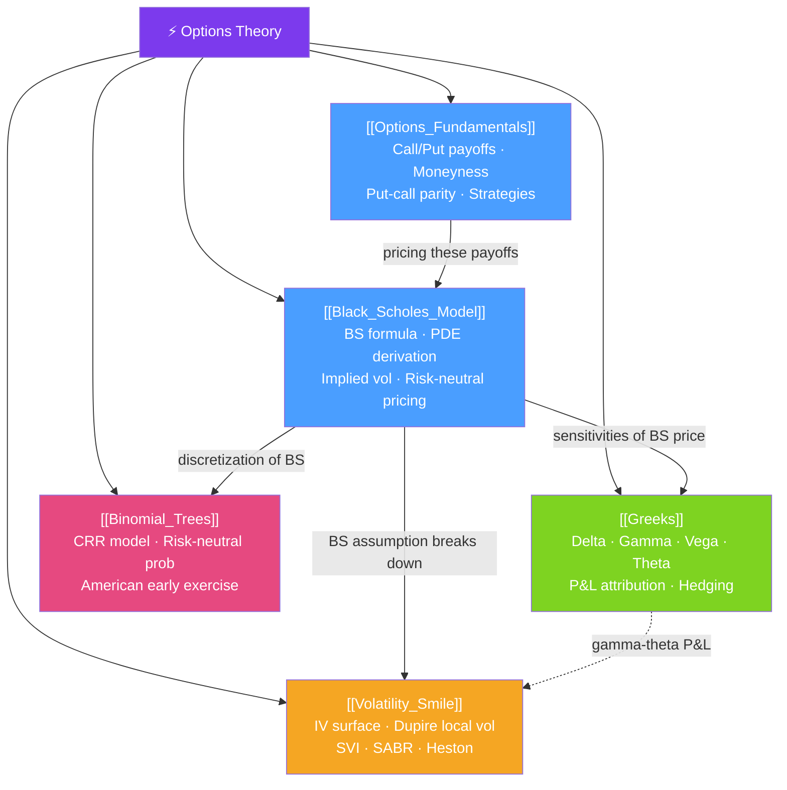

# ⚡ Options Theory — Map of Content

> [!abstract] What This Section Covers
> Options are the most mathematically rich instruments in finance. This section builds from first principles: what options are and why they have value (fundamentals), how to price them under lognormal dynamics (Black-Scholes), how to measure and manage their risk sensitivities (Greeks), how to price American options computationally (binomial trees), and how the market's own implied volatility surface reveals Black-Scholes' failure (volatility smile). These five notes form the essential options toolkit for quant roles.

## Concept Map

## Learning Path

1. [[Options_Fundamentals]] — Call/put payoffs, put-call parity, moneyness, and basic strategies.
2. [[Black_Scholes_Model]] — Replicating portfolio derivation, BS formula, PDE, and implied vol.
3. [[Greeks]] — Delta, Gamma, Vega, Theta, and the daily P&L attribution framework.
4. [[Binomial_Trees]] — CRR binomial tree for European and American option pricing.
5. [[Volatility_Smile]] — The IV surface, no-arbitrage conditions, Dupire, SVI, SABR, and Heston.

## All Notes at a Glance

| Note | Difficulty | What You'll Learn |
|------|------------|-------------------|
| [[Options_Fundamentals]] | Beginner | Payoffs, put-call parity, intrinsic vs time value, common strategies |
| [[Black_Scholes_Model]] | Intermediate | GBM assumption, BS formula, PDE, risk-neutral pricing, implied vol inversion |
| [[Greeks]] | Intermediate | All five Greeks, second-order Greeks (Vanna/Volga), gamma-theta tradeoff, P&L decomposition |
| [[Binomial_Trees]] | Intermediate | CRR tree, risk-neutral probability, American early exercise, convergence to BS |
| [[Volatility_Smile]] | Advanced | IV surface shape, SVI, Dupire local vol, Heston, SABR, rough vol |

## Key Questions This Section Answers

- Why is the right to buy a stock (a call option) worth more than zero even when the stock is below the strike?
- How does Black-Scholes derive the option price without knowing the real-world drift $\mu$?
- What does Delta hedging mean, and why doesn't it eliminate all option risk?
- Why does the same underlying have different implied volatilities at different strikes (the volatility smile)?
- How does the Dupire formula extract a local volatility surface directly from option prices?
- What is the Gamma-Theta tradeoff, and when does a long gamma position make money?
- Why does the implied volatility surface in equity markets show a skew (left wing higher than right)?

## Related Sections

- [[_MOC_QuantFinance_Master|↑ Master MOC]]
- [[_MOC_Financial_Instruments|← Financial Instruments]]
- [[_MOC_Portfolio_Theory|→ Portfolio Theory]]
- [[_MOC_Risk_Management|→ Risk Management]]
- [[_MOC_Advanced_Derivatives|→ Advanced Derivatives]]

#MOC #QuantitativeFinance #OptionsTheory
