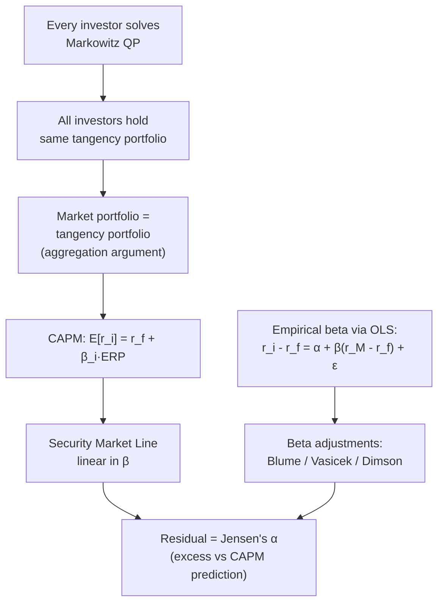

# 📈 Capital Asset Pricing Model (CAPM)

> [!abstract] TL;DR
> CAPM (Sharpe 1964, Lintner 1965) answers: "If every investor runs Markowitz, what return must a stock offer to clear the market?" The answer is $E[r_i] = r_f + \beta_i(E[r_M]-r_f)$: only systematic risk (beta) is priced, because idiosyncratic risk is diversified away. CAPM is empirically wrong — size, value, and momentum effects are unexplained — but it remains the starting point for every asset pricing model and is still the dominant tool for estimating the cost of equity in corporate finance.

---

## Intuition — The Surfboard Analogy

CAPM says a stock's required return is **entirely determined by how much it swings with the market** — like a surfboard on an ocean wave. A surfboard that moves exactly with the wave ($\beta=1$) gives you the market return. One that amplifies every wave ($\beta=2$) requires double the risk premium to compensate. One that moves *against* the wave ($\beta<0$, like gold in some regimes) can actually reduce portfolio risk — and earns below $r_f$. Skill, story, or fundamental quality is irrelevant in CAPM: if two stocks have the same beta, they must have the same expected return. Everything else is idiosyncratic noise that disappears in a diversified portfolio.

---

## How It Works



---

## Key Concepts

### CAPM Derivation

Suppose every investor solves the [[Modern_Portfolio_Theory]] QP. With identical beliefs (homogeneous expectations) and no frictions, all investors hold the same tangency portfolio $T$. Since aggregate demand must equal aggregate supply, the tangency portfolio **must equal the market portfolio** $M$ (value-weighted index of all assets). In equilibrium, for any asset $i$:

$$E[r_i] = r_f + \beta_i \underbrace{(E[r_M] - r_f)}_{\text{Equity Risk Premium (ERP)}}$$

where:

$$\beta_i = \frac{\text{Cov}(r_i, r_M)}{\text{Var}(r_M)} = \frac{\sigma_{iM}}{\sigma_M^2}$$

Beta measures how much of the market's variance a unit of asset $i$ contributes. Only this *systematic* component is priced; unsystematic risk vanishes in the market portfolio.

### Security Market Line (SML)

The SML plots expected return against beta for *all assets and portfolios* (not just efficient ones):

$$E[r_i] = r_f + \beta_i(E[r_M] - r_f)$$

Key properties:
- **Intercept**: $r_f$ at $\beta=0$ (risk-free asset)
- **Slope**: $E[r_M]-r_f$ (equity risk premium, historically ~5–6% p.a. in the US)
- **Market portfolio**: lies on the SML at $\beta=1$, $E[r_M]$
- **Contrast with CML** ([[Modern_Portfolio_Theory]]): CML is in $(\sigma_p, E[r_p])$ space and only applies to efficient portfolios; SML is in $(\beta, E[r])$ space and applies to any asset.

### Jensen's Alpha

The realized excess return beyond CAPM's prediction:

$$\alpha_i = r_i - \left[r_f + \beta_i(r_M - r_f)\right]$$

CAPM predicts $\alpha_i = 0$ for all assets. Persistently positive $\alpha$ would imply either skill (rare) or model mis-specification (common — see [[Factor_Models]]).

### CAPM Assumptions (and Why They Fail)

| Assumption | Reality |
|-----------|---------|
| Homogeneous expectations | Analysts disagree violently |
| Unlimited short selling | Institutional constraints, short-sale costs |
| No taxes or transaction costs | Capital gains taxes, bid-ask spreads |
| Single-period horizon | Multi-period investment problems |
| Risk-free borrowing at $r_f$ | Borrowing rate > lending rate |
| All assets tradeable | Private equity, human capital not in index |

---

### Beta Estimation via OLS

In practice, beta is estimated by regressing excess stock returns on excess market returns:

$$r_{i,t} - r_{f,t} = \alpha_i + \beta_i(r_{M,t} - r_{f,t}) + \epsilon_{i,t}$$

OLS gives $\hat\beta_i = \hat\sigma_{iM}/\hat\sigma_M^2$. Issues:

- **Non-stationarity**: beta changes over time (use rolling 60-month window, or Kalman filter)
- **Illiquid stocks**: prices don't move daily → OLS understates beta

### Beta Adjustments

**Blume (1975) shrinkage** — betas mean-revert toward 1 over time. A simple linear correction:

$$\beta_{\text{adj}} = 0.33 + 0.67\hat\beta$$

**Vasicek (1973) Bayesian shrinkage** — weights sample beta by its precision against a prior:

$$\beta_{\text{Vasicek}} = \frac{\sigma_\beta^{-2}\cdot\bar\beta + \hat\sigma_{\hat\beta}^{-2}\cdot\hat\beta}{\sigma_\beta^{-2} + \hat\sigma_{\hat\beta}^{-2}}$$

where $\bar\beta$ is the cross-sectional prior mean, $\sigma_\beta^2$ is the cross-sectional variance of betas, and $\hat\sigma_{\hat\beta}^2$ is the estimation variance for this stock's beta. High-precision estimates are shrunk less.

**Dimson (1979) sum-of-lagged betas** — for illiquid stocks, price lags cause downward beta bias. Add lagged market returns:

$$r_{i,t} - r_f = \alpha_i + \sum_{k=-1}^{+1}\beta_k(r_{M,t-k} - r_f) + \epsilon_{i,t}$$

$$\hat\beta_{\text{Dimson}} = \sum_k \hat\beta_k$$

### Fama-MacBeth (1973) Two-Pass Procedure

Tests whether beta is cross-sectionally priced. Step 1 (time series): estimate $\hat\beta_i$ for each stock. Step 2 (cross-section): for each month $t$, regress:

$$r_{i,t} = \gamma_{0,t} + \gamma_{1,t}\hat\beta_i + \eta_{i,t}$$

CAPM predicts: $E[\gamma_0] = r_f$, $E[\gamma_1] = E[r_M] - r_f > 0$. Empirically, $\gamma_1$ is often insignificant or negative, and $\gamma_0 > r_f$ — a central empirical failure.

### Empirical Failures of CAPM

- **Size effect** (Banz 1981): small-cap stocks earn higher returns than CAPM predicts
- **Value premium** (Stattman 1980, Fama-French 1992): high book-to-market stocks outperform
- **Momentum** (Jegadeesh-Titman 1993): past 12-month winners continue to outperform
- **Low-beta anomaly** (Black 1972, Frazzini-Pedersen 2014): low-beta assets earn *higher* risk-adjusted returns than CAPM predicts — "betting against beta"
- **Alpha decay**: documented CAPM alphas largely disappear post-publication (data snooping)

These failures motivate [[Factor_Models]] (Fama-French, Carhart).

---

## Python Example

```python
import numpy as np
import pandas as pd
import statsmodels.api as sm
import matplotlib.pyplot as plt

np.random.seed(0)
T = 120  # 10 years of monthly data

# ── Simulate market and two stocks ──
r_f_monthly = 0.04 / 12
r_M = np.random.normal(0.08/12, 0.16/np.sqrt(12), T)  # market returns

true_betas = [1.3, 0.6]
true_alphas = [0.002, -0.001]  # stock 1 has positive alpha, stock 2 negative
stocks = {}
for i, (b, a) in enumerate(zip(true_betas, true_alphas)):
    eps = np.random.normal(0, 0.05, T)
    stocks[f'Stock{i+1}'] = r_f_monthly + b * (r_M - r_f_monthly) + a + eps

df = pd.DataFrame(stocks)
df['Market'] = r_M

# ── OLS beta estimation for each stock ──
results = {}
for col in ['Stock1', 'Stock2']:
    y = df[col] - r_f_monthly
    X = sm.add_constant(df['Market'] - r_f_monthly)
    model = sm.OLS(y, X).fit()
    results[col] = {'alpha': model.params['const'],
                    'beta': model.params.iloc[1],
                    'beta_se': model.bse.iloc[1],
                    't_alpha': model.tvalues['const']}
    print(f"{col}: α={results[col]['alpha']:.4f} (t={results[col]['t_alpha']:.2f}), "
          f"β={results[col]['beta']:.3f} (±{results[col]['beta_se']:.3f})")

# ── Blume-adjusted betas ──
for col in results:
    b = results[col]['beta']
    b_blume = 0.33 + 0.67 * b
    print(f"{col} Blume-adjusted β: {b_blume:.3f}")

# ── Security Market Line plot ──
betas_range = np.linspace(-0.5, 2.0, 100)
ERP = (r_M - r_f_monthly).mean() * 12        # annualised ERP from sample
sml_returns = r_f_monthly * 12 + betas_range * ERP

plt.figure(figsize=(8, 5))
plt.plot(betas_range, sml_returns, 'k-', label='Security Market Line')

for col, res in results.items():
    ann_alpha = res['alpha'] * 12
    ann_return = r_f_monthly * 12 + res['beta'] * ERP + ann_alpha
    plt.scatter(res['beta'], ann_return, s=100, zorder=5,
                label=f"{col} (β={res['beta']:.2f}, α={ann_alpha:.2%})")

plt.axvline(1, color='gray', linestyle='--', alpha=0.5, label='Market (β=1)')
plt.xlabel('Beta'); plt.ylabel('Expected Return (ann.)')
plt.title('Security Market Line'); plt.legend(); plt.tight_layout(); plt.show()
```

---

## Real-World Notes

- **Cost of equity (WACC)**: CAPM is the standard model used in DCF analysis, even knowing its failures — practitioners use $r_e = r_f + \beta \cdot ERP$ with ERP typically 5–6%.
- **ERP estimation**: Damodaran publishes monthly implied ERP; historical 5-yr, 10-yr, and long-run estimates differ substantially.
- **Industry betas**: for private companies or thin trading, analysts use comparable public company betas (unlevered, then re-levered for target capital structure).
- **Beta instability**: financial crisis of 2008 saw cross-asset correlations spike toward 1, making all betas temporarily approach 1 — "correlation goes to 1 in a crisis."

---

## Common Pitfalls

- **Using total return instead of excess return**: regress $r_i - r_f$ on $r_M - r_f$, not on raw returns — the intercept shifts otherwise.
- **Too short a window for beta estimation**: 36-month minimum; 60-month is standard; use EWMA for time-varying beta.
- **Ignoring standard errors**: a beta of 1.3 with $SE=0.4$ is statistically indistinguishable from 0.5 — always report confidence intervals.
- **Conflating SML and CML**: CML applies only to efficient portfolios in $(\sigma, r)$ space; SML applies to any asset in $(\beta, r)$ space.
- **Assuming positive alpha is real**: data-mined alphas disappear out-of-sample; check for multiple testing corrections.

---

## Related Concepts

- [[Modern_Portfolio_Theory]] — CAPM's parent framework; tangency portfolio = market portfolio in equilibrium
- [[Factor_Models]] — Fama-French multi-factor extensions that explain CAPM failures
- [[Portfolio_Optimization]] — Black-Litterman uses CAPM reverse-optimization as the prior
- [[Performance_Attribution]] — Jensen's alpha is a core performance metric

---

## Review Questions

1. Derive the CAPM equation from the condition that in equilibrium the tangency portfolio must equal the market portfolio. What is the key aggregation step?
2. A stock has a sample beta of 1.8 estimated over 36 months. Apply Blume shrinkage and Vasicek shrinkage (assume cross-sectional prior $\bar\beta=1.0$, $\sigma_\beta^2=0.09$, and estimation variance $\hat\sigma^2_{\hat\beta}=0.16$). Which shrinks more and why?
3. Fama-MacBeth finds $\gamma_1 \approx 0$ in cross-sectional regressions. Does this definitively refute CAPM? What alternative explanations exist?

---

## Sources

- Sharpe, W. (1964). "Capital Asset Prices: A Theory of Market Equilibrium." *Journal of Finance*, 19(3), 425–442.
- Lintner, J. (1965). "The Valuation of Risk Assets and the Selection of Risky Investments." *Review of Economics and Statistics*, 47(1), 13–37.
- Fama, E. & MacBeth, J. (1973). "Risk, Return, and Equilibrium." *Journal of Political Economy*, 81(3), 607–636.
- Blume, M. (1975). "Betas and Their Regression Tendencies." *Journal of Finance*, 30(3), 785–795.
- Dimson, E. (1979). "Risk Measurement When Shares Are Subject to Infrequent Trading." *Journal of Financial Economics*, 7(2), 197–226.
- Fama, E. & French, K. (1992). "The Cross-Section of Expected Stock Returns." *Journal of Finance*, 47(2), 427–465.

---

#quantitative-finance #portfolio-theory #intermediate #capm #beta #sml
