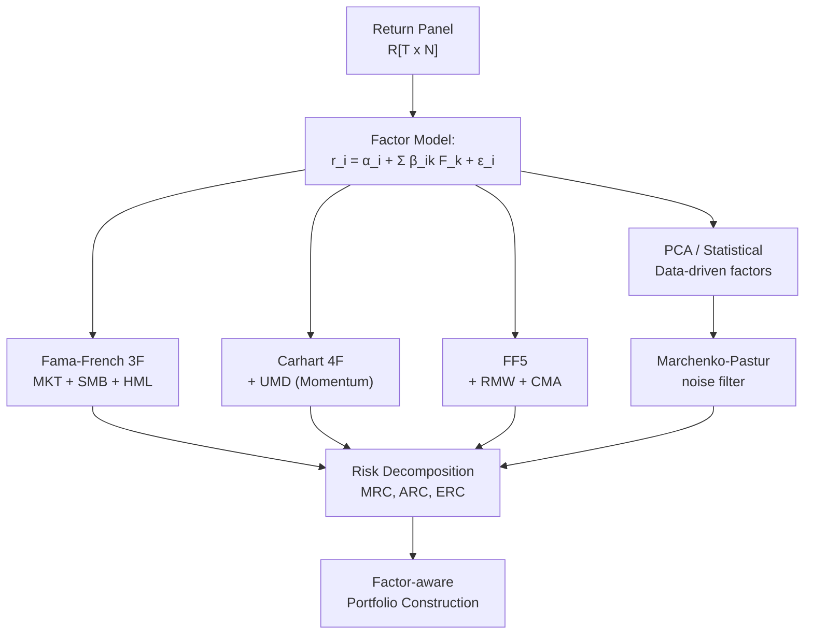

# 🌊 Factor Models

> [!abstract] TL;DR
> CAPM uses one factor (the market). Fama-French (1993) added size (SMB) and value (HML) to explain CAPM's failures. Carhart (1997) added momentum (UMD). Fama-French (2015) added profitability (RMW) and investment (CMA). PCA can extract statistical factors directly from the return covariance matrix — but the Marchenko-Pastur law is essential to separate real structure from noise. Today the "factor zoo" contains 400+ published factors, raising severe data snooping concerns. Risk decomposition (MRC, ARC) and equal-risk contribution portfolios close the loop back to portfolio construction.

---

## Intuition — The Ocean Currents Analogy

CAPM says one ocean tide (the market) drives all stock returns. Factor models say there are *multiple currents* — a size current (small stocks move together), a value current (cheap stocks move together), a momentum current (recent winners move together). A stock's return depends on how much it is exposed to each current. By mapping these exposures (factor loadings), you can:
1. Explain past performance more precisely
2. Build targeted exposure to desired risk premia
3. Decompose portfolio risk to see which "currents" dominate

---

## How It Works



---

## Key Concepts

### Fama-French 3-Factor Model (1993)

$$r_{i,t} - r_{f,t} = \alpha_i + \beta_{i,\text{MKT}}\cdot\text{MKT}_t + \beta_{i,\text{SMB}}\cdot\text{SMB}_t + \beta_{i,\text{HML}}\cdot\text{HML}_t + \epsilon_{i,t}$$

**Factors:**
- $\text{MKT}_t = r_{M,t} - r_{f,t}$: market excess return (same as CAPM)
- $\text{SMB}_t$ (Small Minus Big): return of diversified small-cap portfolio minus large-cap. Captures the **size premium** — small stocks historically earn ~2–3% p.a. extra, attributed to liquidity risk and distress risk.
- $\text{HML}_t$ (High Minus Low): return of high book-to-market stocks minus low B/M (growth) stocks. Captures the **value premium** — value stocks earn ~3–5% p.a. extra, attributed to financial distress risk or investor mispricing.

Fama-French reduces average pricing errors (absolute alpha) by ~60% vs CAPM on US data. The model explains most stock return variation, though $\alpha_i$ for individual stocks often remains insignificant due to noise.

### Carhart 4-Factor Model (1997)

Add the **momentum factor** UMD (Up Minus Down, also called WML — Winners Minus Losers):

$$\text{UMD}_t = r_{\text{winners},t} - r_{\text{losers},t}$$

Winners/losers defined by past 12-month return (skipping the most recent month to avoid short-term reversal). Momentum (~11-month lookback) adds ~4–5% annualized premium. The momentum factor kills most mutual fund "alpha" — most outperforming funds are just momentum-tilted.

### Fama-French 5-Factor Model (2015)

Add two profitability/investment factors to explain the "investment premium" missed by FF3:

- $\text{RMW}$ (Robust Minus Weak): high operating profitability minus low
- $\text{CMA}$ (Conservative Minus Aggressive): low-investment firms minus high-investment firms

$$r_i - r_f = \alpha_i + \beta_{\text{MKT}}\text{MKT} + \beta_{\text{SMB}}\text{SMB} + \beta_{\text{HML}}\text{HML} + \beta_{\text{RMW}}\text{RMW} + \beta_{\text{CMA}}\text{CMA} + \epsilon_i$$

FF5 largely absorbs the value premium ($\text{HML}$ becomes redundant given RMW and CMA), provoking debate in the literature.

### PCA-Based Statistical Factors

Rather than specifying factors a priori, PCA extracts factors directly from the sample covariance matrix $\hat\Sigma$ of returns. Given the eigen-decomposition $\hat\Sigma = V\Lambda V^\top$:

- The top-$K$ eigenvectors (columns of $V$) are the **statistical factors**
- Their eigenvalues $\lambda_1 \geq \lambda_2 \geq \cdots$ measure the variance explained
- Factor returns: $F = RV_K$; loadings: $B = V_K$

**Problem**: with $N$ assets and $T$ observations, random noise creates spurious eigenvalues even when no real factor exists.

### Marchenko-Pastur Noise Bound

For a random matrix with $N$ assets, $T$ observations, and variance $\sigma^2$, the bulk eigenvalue spectrum falls in the Marchenko-Pastur distribution between:

$$\lambda_\pm = \sigma^2\left(1 \pm \sqrt{\frac{N}{T}}\right)^2$$

Eigenvalues **above** $\lambda_+$ correspond to genuine factors; eigenvalues inside $[\lambda_-, \lambda_+]$ are pure noise. This is critical: with $N=500$, $T=252$ (1 year of daily data), $q=N/T\approx2$, the noise bound is very wide. You need much more data than most practitioners realize.

**Practical procedure:**
1. Compute sample correlation matrix from returns
2. Fit $\sigma^2$ to match bulk eigenvalue density
3. Retain only eigenvectors above $\lambda_+$
4. Reconstruct the "cleaned" covariance matrix: $\hat\Sigma_{\text{clean}} = V_{\text{signal}}\Lambda_{\text{signal}}V_{\text{signal}}^\top + \hat\sigma^2_{\text{noise}}I$

This is the basis of the **Random Matrix Theory (RMT)** approach to covariance estimation, also connected to Ledoit-Wolf shrinkage (see [[Portfolio_Optimization]]).

### The Factor Zoo and Data Snooping

Harvey, Liu & Zhu (2016) documented 316 factors published in top journals by 2016; by 2020, the count exceeded 400. The standard 5% $t$-statistic threshold is far too low after testing hundreds of hypotheses — a threshold of $t \geq 3.0$ (controlling family-wise error rate) has been proposed. Key concerns:

- **Multiple testing**: if you test 400 factors, ~20 will be significant at 5% by chance
- **Overfitting to historical US data**: most factors weaken or disappear in out-of-sample international data
- **Publication bias**: negative results not published
- **Implementation friction**: factor premia shrink after publication and after accounting for transaction costs

### Euler Risk Decomposition

For a portfolio with weights $\mathbf{w}$ and covariance $\Sigma$, portfolio volatility is $\sigma_p = \sqrt{\mathbf{w}^\top\Sigma\mathbf{w}}$. By Euler's homogeneous function theorem:

**Marginal Risk Contribution (MRC)**:

$$MRC_i = \frac{\partial\sigma_p}{\partial w_i} = \frac{(\Sigma\mathbf{w})_i}{\sigma_p}$$

**Absolute Risk Contribution (ARC)**:

$$ARC_i = w_i \cdot MRC_i = \frac{w_i(\Sigma\mathbf{w})_i}{\sigma_p}$$

**Summation identity** (Euler): $\sum_i ARC_i = \sigma_p$

This allows decomposing total portfolio volatility into per-asset contributions — essential for risk budgeting.

### Equal Risk Contribution (ERC) Portfolio

The ERC (or "risk parity") portfolio equalizes each asset's absolute risk contribution:

$$ARC_i = ARC_j \quad \forall i, j$$

Equivalently, $w_i \cdot MRC_i = w_j \cdot MRC_j$. There is no closed-form solution; ERC is found numerically:

$$\mathbf{w}^*_{\text{ERC}} = \arg\min_{\mathbf{w}} \sum_{i,j}\left(w_i\cdot MRC_i - w_j\cdot MRC_j\right)^2 \quad \text{s.t.}\quad \mathbf{w}^\top\mathbf{1}=1,\ \mathbf{w}\geq 0$$

ERC portfolios typically over-weight low-volatility assets (bonds in a stock-bond universe). They are popular in risk parity funds and are robust to mean estimation error (like the MVP).

---

## Python Example

```python
import numpy as np
import pandas as pd
import statsmodels.api as sm
from scipy.optimize import minimize

# ── 1. Fama-French Factor Regression ──
# In practice, download from Kenneth French's data library:
# https://mba.tuck.dartmouth.edu/pages/faculty/ken.french/data_library.html
# Here we simulate factor returns for demonstration

np.random.seed(42)
T = 120  # months

MKT = np.random.normal(0.006, 0.045, T)
SMB = np.random.normal(0.002, 0.030, T)
HML = np.random.normal(0.003, 0.030, T)
UMD = np.random.normal(0.004, 0.035, T)
rf_m = 0.04 / 12

# Simulate a stock with known loadings
true = {'alpha': 0.001, 'MKT': 1.1, 'SMB': 0.5, 'HML': -0.3, 'UMD': 0.2}
stock_excess = (true['alpha']
                + true['MKT'] * MKT
                + true['SMB'] * SMB
                + true['HML'] * HML
                + true['UMD'] * UMD
                + np.random.normal(0, 0.02, T))

# Carhart 4-factor regression
factors = pd.DataFrame({'MKT': MKT, 'SMB': SMB, 'HML': HML, 'UMD': UMD})
X = sm.add_constant(factors)
model = sm.OLS(stock_excess, X).fit()
print(model.summary().tables[1])

# ── 2. Marchenko-Pastur Noise Bound ──
N, T2 = 50, 252
sigma2 = 1.0
q = N / T2
lambda_plus  = sigma2 * (1 + np.sqrt(q))**2
lambda_minus = sigma2 * (1 - np.sqrt(q))**2
print(f"\nMarchenko-Pastur bounds for N={N}, T={T2}:")
print(f"  λ+ = {lambda_plus:.4f}  (eigenvalues above this are real factors)")
print(f"  λ- = {lambda_minus:.4f}")

# ── 3. Equal Risk Contribution Portfolio ──
def portfolio_vol(w, Sigma):
    return np.sqrt(w @ Sigma @ w)

def arc(w, Sigma):
    sigma = portfolio_vol(w, Sigma)
    mrc = (Sigma @ w) / sigma
    return w * mrc

def erc_objective(w, Sigma):
    contributions = arc(w, Sigma)
    # Sum of squared differences from equal contribution
    target = portfolio_vol(w, Sigma) / len(w)
    return np.sum((contributions - target)**2)

# Covariance matrix for 3 assets
vols = np.array([0.15, 0.05, 0.20])
corr = np.array([[1.0, -0.1, 0.6],
                 [-0.1, 1.0, -0.05],
                 [0.6, -0.05, 1.0]])
Sigma = np.diag(vols) @ corr @ np.diag(vols)
N_assets = 3

# Solve ERC
w0 = np.ones(N_assets) / N_assets
constraints = [{'type': 'eq', 'fun': lambda w: w.sum() - 1}]
bounds = [(0.01, 1.0)] * N_assets

result = minimize(erc_objective, w0, args=(Sigma,),
                  method='SLSQP', bounds=bounds, constraints=constraints,
                  options={'ftol': 1e-12, 'maxiter': 1000})

w_erc = result.x
contributions = arc(w_erc, Sigma)
print(f"\nERC Portfolio weights: {w_erc.round(4)}")
print(f"Risk contributions:     {contributions.round(4)}")
print(f"Total portfolio vol:   {portfolio_vol(w_erc, Sigma):.4f}")
print(f"Risk contributions sum: {contributions.sum():.4f}")
```

---

## Real-World Notes

- **Factor data**: Kenneth French's data library provides free US and international factor returns since 1926. AQR also publishes factor data.
- **Factor timing is hard**: literature suggests factors are somewhat predictable using valuation spreads, but transaction costs largely eliminate gains from tactical factor rotation.
- **Liquidity of factors**: momentum requires fast trading and has high turnover (~100% p.a.); value is slow (~20% p.a.). Net-of-cost premia matter.
- **Factor crowding**: when many investors target the same factors, they can experience simultaneous drawdowns ("momentum crashes" in 2009, "value crash" in 2020).
- **Risk parity in practice**: requires leverage on the bond side; in a rising-rate environment (2022), this caused severe losses.

---

## Common Pitfalls

- **Using returns instead of excess returns** in factor regressions: the intercept ceases to be a meaningful alpha.
- **Ignoring Marchenko-Pastur**: using all PCA components (including noise) creates overfitted covariance matrices that hurt optimization.
- **Assuming factor premia are stable**: SMB was negative 2010–2020 in the US; don't assume historical factor premia will persist.
- **Double-counting factors**: many published factors are highly correlated (e.g., accruals, investment, and asset growth overlap substantially); dimensionality is much lower than 400 suggests.
- **Forgetting to neutralize factor exposures in attribution**: reported "alpha" from stock selection is contaminated by factor tilts if factors are not controlled for.

---

## Related Concepts

- [[CAPM]] — one-factor special case; factor models reduce CAPM's pricing errors
- [[Modern_Portfolio_Theory]] — efficient frontier provides framework; factor models provide better $\Sigma$
- [[Portfolio_Optimization]] — ERC and factor-tilted portfolios use factor risk decomposition
- [[Performance_Attribution]] — factor-based attribution decomposes returns by systematic exposures
- [[Value_at_Risk]] — factor models enable scenario-based VaR decomposition

---

## Review Questions

1. SMB and HML are "long-short" factor portfolios. Why does forming them as long-short (rather than just long small-cap or long value) control for market exposure? Show algebraically that $\beta_{\text{MKT}}(\text{SMB}) \approx 0$.
2. You have $N=200$ stocks and $T=100$ daily observations. Compute the Marchenko-Pastur bounds. How many PCA factors would you expect to retain, and what does this imply about the covariance matrix?
3. An equal-weight portfolio has 30% of its risk in one position (ARC = 0.30 when portfolio $\sigma_p=0.12$). Describe the qualitative change in weights when you convert to ERC. Which direction does the weight on that position move and why?

---

## Sources

- Fama, E. & French, K. (1993). "Common Risk Factors in the Returns on Stocks and Bonds." *Journal of Financial Economics*, 33(1), 3–56.
- Carhart, M. (1997). "On Persistence in Mutual Fund Performance." *Journal of Finance*, 52(1), 57–82.
- Fama, E. & French, K. (2015). "A Five-Factor Asset Pricing Model." *Journal of Financial Economics*, 116(1), 1–22.
- Marchenko, V. & Pastur, L. (1967). "Distribution of Eigenvalues in Certain Sets of Random Matrices." *Mat. Sb.*, 72, 507–536.
- Harvey, C., Liu, Y. & Zhu, H. (2016). "...and the Cross-Section of Expected Returns." *Review of Financial Studies*, 29(1), 5–68.
- Maillard, S., Roncalli, T. & Teiletche, J. (2010). "The Properties of Equally Weighted Risk Contribution Portfolios." *Journal of Portfolio Management*, 36(4), 60–70.

---

#quantitative-finance #portfolio-theory #advanced #fama-french #factor-models #risk-decomposition
