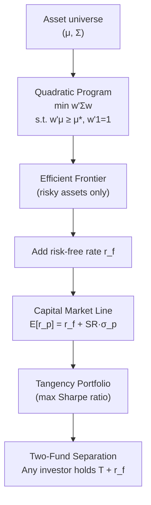

# 📐 Modern Portfolio Theory

> [!abstract] TL;DR
> Harry Markowitz (1952) showed that you should never look at a stock in isolation — only its contribution to portfolio risk matters. By solving a quadratic program, you trace the efficient frontier: the set of portfolios with maximum return for each level of variance. Adding a risk-free asset collapses the frontier to a single line (the CML) and produces the unique tangency (maximum Sharpe) portfolio. The brutal practical caveat: mean estimation is so noisy that tiny errors dominate the optimization, making robust extensions essential.

---

## Intuition — The Ingredient Analogy

Think of building a recipe that maximizes taste per calorie. Each ingredient on its own has a calorie count and a taste score. But some ingredients *complement* each other (olive oil amplifies flavor from garlic far beyond their separate contributions) while others *crowd out* each other (too much salt kills sweetness). You would never choose ingredients purely by their individual taste-per-calorie ratio — you must account for *how they interact*. MPT does exactly this for financial assets: it replaces taste/calorie with return/variance and replaces flavor synergy with correlation.

The key insight: **even if you cannot find a great asset, mixing two mediocre assets with low correlation creates a better portfolio than either alone**.

---

## How It Works



---

## Key Concepts

### Portfolio Statistics

For a portfolio with weight vector $\mathbf{w} \in \mathbb{R}^N$ (summing to 1), expected return and variance are:

$$\mu_p = \mathbf{w}^\top\boldsymbol{\mu}$$

$$\sigma_p^2 = \mathbf{w}^\top\Sigma\mathbf{w}$$

where $\boldsymbol{\mu}$ is the vector of asset expected returns and $\Sigma$ is the $N\times N$ covariance matrix. The off-diagonal terms $\Sigma_{ij} = \rho_{ij}\sigma_i\sigma_j$ encode diversification.

### Diversification Benefit

For a two-asset portfolio with weights $(w, 1-w)$:

$$\sigma_p^2 = w^2\sigma_1^2 + (1-w)^2\sigma_2^2 + 2w(1-w)\sigma_1\sigma_2\rho_{12}$$

When $\rho_{12} < 1$, portfolio variance is strictly less than the weighted average of individual variances. When $\rho_{12} = -1$, a zero-variance portfolio exists at $w^* = \sigma_2/(\sigma_1+\sigma_2)$.

### Quadratic Program (QP) Formulation

The efficient frontier is traced by solving for each target return $\mu^*$:

$$\min_{\mathbf{w}} \quad \mathbf{w}^\top\Sigma\mathbf{w}$$
$$\text{s.t.} \quad \mathbf{w}^\top\boldsymbol{\mu} \geq \mu^*, \quad \mathbf{w}^\top\mathbf{1} = 1$$

This is a convex QP with a unique global solution. Adding long-only ($\mathbf{w} \geq 0$) or turnover constraints keeps convexity. The Lagrangian yields closed-form solutions in the unconstrained case via:

$$\begin{bmatrix}\mathbf{w}^*\\ \lambda_1\\ \lambda_2\end{bmatrix} = \begin{bmatrix}2\Sigma & \boldsymbol{\mu} & \mathbf{1}\\ \boldsymbol{\mu}^\top & 0 & 0\\ \mathbf{1}^\top & 0 & 0\end{bmatrix}^{-1}\begin{bmatrix}\mathbf{0}\\ \mu^*\\ 1\end{bmatrix}$$

### Minimum Variance Portfolio (MVP)

The leftmost point on the efficient frontier — minimizes $\sigma_p^2$ regardless of return:

$$\mathbf{w}_{MVP} = \frac{\Sigma^{-1}\mathbf{1}}{\mathbf{1}^\top\Sigma^{-1}\mathbf{1}}$$

The MVP is important in practice because it is the portfolio *least sensitive* to estimation error in $\boldsymbol{\mu}$ — it requires only $\Sigma$.

### Two-Fund Separation Theorem

Any efficient portfolio is a linear combination of *any two* distinct efficient portfolios. Practically: every investor holds some mix of the **minimum variance portfolio** and the **tangency portfolio**, with the mix determined by risk aversion.

### Capital Market Line (CML)

When a risk-free asset with return $r_f$ exists, the efficient frontier becomes a straight line through $(0, r_f)$ and the tangency portfolio $T$:

$$E[r_p] = r_f + \frac{E[r_M] - r_f}{\sigma_M}\sigma_p$$

The slope is the **Sharpe ratio of the tangency portfolio** — the maximum achievable reward-to-risk ratio. Every rational investor holds $T$ combined with cash (or leverages $T$ if risk-loving).

### Tangency Portfolio (Maximum Sharpe)

$$\mathbf{w}_T = \frac{\Sigma^{-1}(\boldsymbol{\mu} - r_f\mathbf{1})}{\mathbf{1}^\top\Sigma^{-1}(\boldsymbol{\mu} - r_f\mathbf{1})}$$

This is the unique risky portfolio maximizing $S = (\mu_p - r_f)/\sigma_p$.

### Merton Impossibility Theorem (Critical Caveat)

Merton (1980) showed that estimating expected returns requires effectively infinite historical data. For annual returns, the standard error of the mean is $\sigma/\sqrt{T}$. With $\sigma \approx 20\%$ and $T = 10$ years: $SE \approx 6.3\%$ — larger than most return differences between assets. A **1% error in mean estimates dominates the optimization** and causes the optimizer to wildly concentrate in assets with favorable noise. This is why:

- Minimum variance portfolios (which ignore $\boldsymbol{\mu}$) often beat MVO out-of-sample
- Black-Litterman (see [[Portfolio_Optimization]]) is preferred for incorporating views
- Shrinkage estimators and robust optimization are essential

---

## Python Example

```python
import numpy as np
import matplotlib.pyplot as plt

np.random.seed(42)

# ── Asset parameters (3 assets: SPY-like, Bond-like, EM-like) ──
mu = np.array([0.10, 0.04, 0.13])          # expected annual returns
sigma = np.array([0.16, 0.05, 0.22])        # annual volatilities
corr = np.array([[1.0, -0.1, 0.7],
                 [-0.1, 1.0, -0.05],
                 [0.7, -0.05, 1.0]])
Sigma = np.diag(sigma) @ corr @ np.diag(sigma)  # covariance matrix
rf = 0.04

# ── Monte Carlo simulation of random portfolios ──
N_portfolios = 10_000
returns, vols, sharpes = [], [], []

for _ in range(N_portfolios):
    w = np.random.dirichlet(np.ones(3))          # random long-only weights
    r = w @ mu
    v = np.sqrt(w @ Sigma @ w)
    returns.append(r)
    vols.append(v)
    sharpes.append((r - rf) / v)

returns, vols, sharpes = map(np.array, [returns, vols, sharpes])

# ── Analytical minimum variance portfolio ──
inv_Sigma = np.linalg.inv(Sigma)
ones = np.ones(3)
w_mvp = inv_Sigma @ ones / (ones @ inv_Sigma @ ones)
mu_mvp = w_mvp @ mu
sig_mvp = np.sqrt(w_mvp @ Sigma @ w_mvp)

# ── Analytical tangency portfolio ──
excess = mu - rf
w_tan_raw = inv_Sigma @ excess
w_tan = w_tan_raw / w_tan_raw.sum()
mu_tan = w_tan @ mu
sig_tan = np.sqrt(w_tan @ Sigma @ w_tan)
sharpe_tan = (mu_tan - rf) / sig_tan

print(f"MVP  : return={mu_mvp:.2%}, vol={sig_mvp:.2%}, weights={w_mvp.round(3)}")
print(f"Tangency: return={mu_tan:.2%}, vol={sig_tan:.2%}, SR={sharpe_tan:.3f}, weights={w_tan.round(3)}")

# ── Plot efficient frontier region ──
sc = plt.scatter(vols, returns, c=sharpes, cmap='viridis', alpha=0.4, s=5)
plt.colorbar(sc, label='Sharpe Ratio')
plt.scatter(sig_mvp, mu_mvp, color='blue', s=100, zorder=5, label='Min Variance')
plt.scatter(sig_tan, mu_tan, color='red', s=100, zorder=5, label='Tangency (Max SR)')

# Capital Market Line
cml_x = np.linspace(0, 0.25, 100)
cml_y = rf + sharpe_tan * cml_x
plt.plot(cml_x, cml_y, 'r--', label='CML')

plt.xlabel('Volatility'); plt.ylabel('Expected Return')
plt.title('Efficient Frontier (Monte Carlo + Analytical)')
plt.legend(); plt.tight_layout(); plt.show()
```

---

## Real-World Notes

- **Estimation error is the dominant risk**: in practice, use Ledoit-Wolf shrinkage ([[Portfolio_Optimization]]) or factor-model-implied covariance matrices ([[Factor_Models]]) rather than the sample covariance.
- **Long-only constraints change everything**: the efficient frontier with $\mathbf{w}\geq 0$ cannot be solved analytically — use `scipy.optimize.minimize` or `cvxpy`.
- **Rebalancing frequency**: monthly rebalancing for institutional portfolios; quarterly for retail; daily for risk-managed products.
- **The tangency portfolio changes with $r_f$**: rising rates rotate the CML, shifting which portfolio is "optimal."

---

## Common Pitfalls

- **Plugging in sample means directly**: sample mean has huge estimation error; the optimizer will over-fit to noise and produce extreme concentrations.
- **Ignoring the constraint $\mathbf{w}^\top\mathbf{1}=1$**: unconstrained minimization of variance has infinitely many solutions (lever or de-lever arbitrarily).
- **Assuming stationarity**: $\Sigma$ and $\boldsymbol{\mu}$ shift through regimes; a rolling window or EWMA covariance is more realistic.
- **Confusing CML and SML**: the CML lives in $(\sigma, r)$ space and is about *efficient portfolios*; the SML ([[CAPM]]) lives in $(\beta, r)$ space and prices *all assets*.
- **Single-period assumption**: MPT is static; dynamic optimization requires [[Stochastic_Calculus]] and Hamilton-Jacobi-Bellman.

---

## Related Concepts

- [[CAPM]] — equilibrium version where everyone holds the tangency portfolio = market portfolio
- [[Portfolio_Optimization]] — Black-Litterman, risk parity, robust extensions
- [[Factor_Models]] — covariance estimation via factor structure
- [[Value_at_Risk]] — alternative risk measure beyond variance
- [[Stochastic_Calculus]] — dynamic portfolio optimization (Merton's continuous-time solution)

---

## Review Questions

1. Prove that the minimum variance portfolio weights are $\mathbf{w}_{MVP} = \Sigma^{-1}\mathbf{1} / (\mathbf{1}^\top\Sigma^{-1}\mathbf{1})$ using the Lagrangian. What happens if $\Sigma$ is singular?
2. Two assets each have 15% volatility and 8% expected return. For what correlation $\rho$ does an equal-weight portfolio achieve a Sharpe ratio strictly greater than either asset held alone?
3. The Merton impossibility theorem says mean estimation requires near-infinite data. Given this, why is the minimum variance portfolio often used in practice instead of the tangency portfolio?

---

## Sources

- Markowitz, H. (1952). "Portfolio Selection." *Journal of Finance*, 7(1), 77–91.
- Merton, R. C. (1980). "On Estimating the Expected Return on the Market." *Journal of Financial Economics*, 8(4), 323–361.
- Michaud, R. (1989). "The Markowitz Optimization Enigma: Is Optimized Optimal?" *Financial Analysts Journal*, 45(1), 31–42.
- Boyd, S. & Vandenberghe, L. (2004). *Convex Optimization*. Cambridge University Press.

---

#quantitative-finance #portfolio-theory #intermediate #markowitz #efficient-frontier
