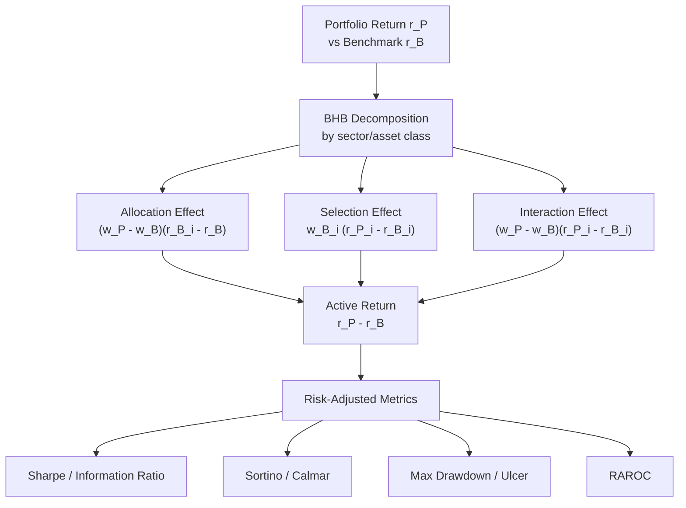

# 📊 Performance Attribution

> [!abstract] TL;DR
> Performance attribution answers: "Did the manager add value, and *how*?" Brinson-Hood-Beebower (1986) decomposes active returns into allocation effect (overweighting sectors that outperformed), selection effect (picking better stocks within sectors), and interaction. Factor-based attribution further decomposes returns into systematic factor premia vs genuine stock-picking alpha. Risk-adjusted metrics — Sharpe, Sortino, Calmar, Ulcer Index, RAROC — account for the risk taken to achieve returns. The uncomfortable finding: most outperformance is ephemeral, explainable by factor exposures or luck.

---

## Intuition — The Post-Game Analysis Analogy

Attribution is like a post-game analysis after a basketball match. You won by 12 points — but *why*? Did you win because you chose to play a zone defence against a driving team (positioning/allocation) or because your point guard outperformed the opponent's (player selection)? The coach who only looks at the final score cannot improve. Brinson attribution is the financial equivalent: it separates the credit between *being in the right sectors* (allocation) and *picking the right stocks within sectors* (selection). Factor attribution then asks whether the "selection" was actually systematic factor exposure dressed up as skill.

---

## How It Works



---

## Key Concepts

### Brinson-Hood-Beebower (BHB) Attribution

BHB (1986) decomposes the active return (portfolio minus benchmark) across $n$ sectors or asset classes.

**Notation**: 
- $w_i^P$, $w_i^B$: portfolio and benchmark weight in sector $i$
- $r_i^P$, $r_i^B$: portfolio and benchmark return in sector $i$
- $r^B = \sum_i w_i^B r_i^B$: total benchmark return

**Allocation Effect** — did the manager over/underweight the right sectors?

$$A_i = (w_i^P - w_i^B)(r_i^B - r^B)$$

Positive when the manager overweights ($w_i^P > w_i^B$) a sector that beats the overall benchmark ($r_i^B > r^B$), or underweights an underperforming sector.

**Selection Effect** — did the manager pick better stocks *within* each sector?

$$S_i = w_i^B(r_i^P - r_i^B)$$

Positive when portfolio return in sector $i$ beats the benchmark sector return. Note: weighted by benchmark weight, not portfolio weight.

**Interaction Effect** — joint effect of allocation and selection:

$$I_i = (w_i^P - w_i^B)(r_i^P - r_i^B)$$

Positive when the manager overweights sectors where they also selected better stocks. Conceptually, it rewards being *both* tilted toward *and* good at a sector.

**Identity**: $r^P - r^B = \sum_i (A_i + S_i + I_i)$

> [!note] Variation: some practitioners combine interaction with selection (Brinson-Fachler variant), making $S_i = w_i^P(r_i^P - r_i^B)$. This is a matter of convention — always specify which variant is used.

### Factor-Based Attribution

Rather than sector buckets, attribute returns to systematic factor exposures (see [[Factor_Models]]):

$$r_i^P - r^B = \underbrace{\hat\alpha}_{\text{true selection}} + \sum_k \beta_k^P F_k + \underbrace{\epsilon_t}_{\text{residual}}$$

where $F_k$ are factor returns (e.g., Fama-French MKT, SMB, HML). The "allocation" to factors plus the security-specific residual replaces the BHB buckets. This approach reveals how much of apparent "selection skill" is actually a systematic factor tilt.

---

### Risk-Adjusted Performance Metrics

#### Sharpe Ratio

The most widely used risk-adjusted return metric:

$$S = \frac{\mu_p - r_f}{\sigma_p}$$

where $\mu_p$ and $\sigma_p$ are the annualized portfolio return and volatility. Standard error (for $T$ monthly observations):

$$SE(S) = \sqrt{\frac{1 + S^2/2}{T}}$$

This SE is crucial: a Sharpe of 0.8 over 3 years ($T=36$) has $SE \approx 0.19$, so a true Sharpe of 0.4 is within 2 standard deviations — statistically indistinguishable from an excellent manager. Rule of thumb: need $\sim 7$–10 years of monthly data to distinguish Sharpe 1.0 from Sharpe 0.5.

> [!warning] Sharpe penalizes both upside and downside volatility equally. A strategy with fat positive tails looks worse than it should.

**Information Ratio (IR)**: same formula but with active return ($r_P - r_B$) over tracking error $\sigma_{r_P - r_B}$. Measures active management skill per unit of active risk.

#### Sortino Ratio

Replaces total volatility with **downside deviation** $\sigma_d$ (semi-deviation below a minimum acceptable return $MAR$, typically 0 or $r_f$):

$$\text{Sortino} = \frac{\mu_p - MAR}{\sigma_d}, \quad \sigma_d = \sqrt{\frac{1}{T}\sum_t \min(r_t - MAR, 0)^2}$$

Sortino is preferred for strategies with positive skew (options selling, private equity). Target: Sortino $\geq 1.0$ is generally good.

#### Maximum Drawdown

Peak-to-trough decline in portfolio value:

$$MDD = \max_{t\in[0,T]}\left(\frac{\max_{\tau\in[0,t]} V_\tau - V_t}{\max_{\tau\in[0,t]} V_\tau}\right)$$

where $V_t$ is the portfolio value at time $t$. MDD captures tail risk of the realized path — missed by Sharpe entirely. Always report alongside annualized return and Sharpe.

**Calmar Ratio**: annualized return divided by MDD:

$$\text{Calmar} = \frac{CAGR}{|MDD|}$$

Target: Calmar $\geq 0.5$ (i.e., return is at least half the worst drawdown). Commodity Trading Advisors (CTAs) typically target Calmar $\geq 0.5$–$1.0$.

#### Ulcer Index

Captures the severity *and duration* of drawdowns — the "ulcer" caused by sustained losses:

$$UI = \sqrt{\frac{1}{T}\sum_{t=1}^T DD_t^2}$$

where $DD_t = (V_t - \text{peak}_t)/\text{peak}_t \times 100$ is the drawdown percentage at time $t$. Unlike MDD (which captures only the worst point), UI penalizes prolonged drawdowns. A fund that fell 20% and recovered in 1 month has lower UI than one that slowly drifted -15% over a year.

**Martin Ratio**: $(\mu_p - r_f)/UI$ — Sharpe-like but using Ulcer Index in the denominator.

#### RAROC (Risk-Adjusted Return on Capital)

Used by banks and risk-budgeted funds:

$$RAROC = \frac{\text{Expected Net Income}}{\text{Economic Capital}} \geq 12\%$$

where economic capital is typically set at the 99.9% VaR or CVaR (see [[Value_at_Risk]]). The 12% hurdle rate corresponds roughly to the cost of equity capital. RAROC $< 12\%$ means the strategy destroys shareholder value on a risk-adjusted basis.

---

### Performance Persistence

A critical empirical finding: **winner's curse and base rate neglect** dominate apparent persistence.

- Carhart (1997): mutual fund alpha persistence largely disappears after controlling for momentum factor loading
- Barras, Scaillet & Wermers (2010): using false discovery rate methods, $\sim 75\%$ of outperforming funds are luck, not skill
- McLean & Pontiff (2016): published anomaly returns decline 58% post-publication
- The Bayesian prior for "this manager has genuine alpha" should be very low (~5–10%)

When evaluating a track record:
1. Control for all relevant factor exposures (FF5 + UMD minimum)
2. Compute the $t$-statistic of alpha: need $|t|\geq 3.0$ for credibility (Harvey et al. 2016)
3. Check whether outperformance came from one regime / one bet or is broad-based
4. Assess capacity: alpha often disappears as AUM grows past the liquidity limit

---

## Python Example

```python
import numpy as np
import pandas as pd

# ── 1. Brinson-Hood-Beebower Attribution ──

def bhb_attribution(w_port, w_bench, r_port_sector, r_bench_sector):
    """
    All inputs are arrays of length n_sectors.
    Returns DataFrame with allocation, selection, interaction per sector.
    """
    r_bench_total = (w_bench * r_bench_sector).sum()

    allocation  = (w_port - w_bench) * (r_bench_sector - r_bench_total)
    selection   = w_bench * (r_port_sector - r_bench_sector)
    interaction = (w_port - w_bench) * (r_port_sector - r_bench_sector)

    sectors = ['Technology', 'Healthcare', 'Financials', 'Energy', 'Consumer']
    df = pd.DataFrame({
        'w_port':      w_port,
        'w_bench':     w_bench,
        'r_port':      r_port_sector,
        'r_bench':     r_bench_sector,
        'Allocation':  allocation,
        'Selection':   selection,
        'Interaction': interaction
    }, index=sectors)
    df['Total Active'] = df[['Allocation','Selection','Interaction']].sum(axis=1)
    return df

# Example data (quarterly)
w_port  = np.array([0.35, 0.20, 0.15, 0.10, 0.20])
w_bench = np.array([0.28, 0.18, 0.20, 0.12, 0.22])
r_port  = np.array([0.08, 0.05, 0.03, -0.02, 0.06])
r_bench = np.array([0.07, 0.04, 0.02, -0.03, 0.05])

result = bhb_attribution(w_port, w_bench, r_port, r_bench)
print("=== BHB Attribution ===")
print(result[['Allocation','Selection','Interaction','Total Active']].round(4))
print(f"\nTotal active return:      {result['Total Active'].sum():.4f}")
print(f"Direct check (rP - rB):   {(w_port*r_port).sum() - (w_bench*r_bench).sum():.4f}")

# ── 2. Performance Metrics ──

def performance_metrics(returns, rf_annual=0.04, mar=0.0):
    """
    returns : array of monthly returns
    rf_annual: annual risk-free rate
    mar      : minimum acceptable return (monthly) for Sortino
    """
    rf_m = rf_annual / 12
    excess = returns - rf_m
    n = len(returns)

    # Annualized stats
    ann_return = np.mean(returns) * 12
    ann_vol    = np.std(returns, ddof=1) * np.sqrt(12)
    sharpe     = (ann_return - rf_annual) / ann_vol
    se_sharpe  = np.sqrt((1 + sharpe**2 / 2) / n)

    # Downside deviation (annualised)
    downside   = np.minimum(returns - mar, 0)
    semi_dev   = np.sqrt(np.mean(downside**2)) * np.sqrt(12)
    sortino    = (ann_return - rf_annual) / semi_dev if semi_dev > 0 else np.nan

    # CAGR
    cagr = (np.prod(1 + returns)) ** (12 / n) - 1

    # Maximum drawdown
    cum_val  = np.cumprod(1 + returns)
    peak     = np.maximum.accumulate(cum_val)
    drawdown = (cum_val - peak) / peak
    mdd      = drawdown.min()

    # Calmar ratio
    calmar   = cagr / abs(mdd) if mdd != 0 else np.nan

    # Ulcer index
    dd_pct   = drawdown * 100
    ulcer    = np.sqrt(np.mean(dd_pct**2))

    return {
        'Ann. Return': f'{ann_return:.2%}',
        'CAGR':        f'{cagr:.2%}',
        'Ann. Vol':    f'{ann_vol:.2%}',
        'Sharpe':      f'{sharpe:.3f}',
        'Sharpe SE':   f'{se_sharpe:.3f}',
        'Sortino':     f'{sortino:.3f}',
        'Max DD':      f'{mdd:.2%}',
        'Calmar':      f'{calmar:.3f}',
        'Ulcer Index': f'{ulcer:.2f}',
    }

# Simulate two strategies
np.random.seed(12)
strategy_A = np.random.normal(0.01, 0.04, 60)    # good manager
strategy_B = np.random.normal(0.008, 0.03, 60)   # benchmark-like

print("\n=== Performance Metrics ===")
metrics_A = performance_metrics(strategy_A)
metrics_B = performance_metrics(strategy_B)
comp = pd.DataFrame({'Strategy A': metrics_A, 'Strategy B': metrics_B})
print(comp.to_string())

# ── 3. Alpha significance test ──
import statsmodels.api as sm

rf_m = 0.04 / 12
market = np.random.normal(0.007, 0.045, 60)
y = strategy_A - rf_m
X = sm.add_constant(market - rf_m)
model = sm.OLS(y, X).fit()
print(f"\nAlpha: {model.params['const']*12:.2%} p.a., t={model.tvalues['const']:.2f}")
print(f"Beta:  {model.params.iloc[1]:.3f}")
print(f"Need |t| >= 3.0 for credible alpha (Harvey et al. 2016)")
```

---

## Real-World Notes

- **Attribution is backward-looking**: a manager can generate positive BHB attribution through luck in a single period; statistical significance requires 5+ years of quarterly data.
- **Benchmark selection is critical**: a tech-heavy manager benchmarked against a broad index will always show large positive "allocation" to tech if tech outperformed — this is benchmark gaming.
- **Time-weighted vs money-weighted returns**: use TWR (time-weighted) for manager evaluation (removes cash flow timing); use MWR/IRR for investor experience (includes cash flow timing). GIPS standards mandate TWR.
- **Sharpe in practice**: strategies with positive skew (selling volatility) have artificially high Sharpe — use Sortino or Omega ratio to complement.
- **RAROC hurdle rate**: 12% is approximate. Banks use their actual cost of equity (CAPM-implied, often 9–14% depending on leverage and credit rating).

---

## Common Pitfalls

- **Ignoring factor exposures in attribution**: a fund overweight "value" stocks in a year when value outperformed shows positive BHB selection — but it may be pure factor exposure, not skill.
- **Annualizing Sharpe incorrectly**: for monthly returns, multiply by $\sqrt{12}$; for daily returns, multiply by $\sqrt{252}$. *Never* multiply Sharpe directly by 12.
- **Reporting MDD without time frame**: a 20% drawdown over 2 weeks is catastrophic; over 3 years it is manageable. Always pair MDD with drawdown duration and recovery time.
- **Comparing Sharpe ratios across strategies with different return distributions**: strategy with fat negative tails will have inflated Sharpe compared to a normal-return strategy at same mean/vol.
- **Survivorship bias in benchmarking**: if you compare your fund to a peer group index, remember the index only includes surviving funds — it overstates the peer benchmark.

---

## Related Concepts

- [[CAPM]] — Jensen's alpha is the simplest performance metric; factor-based attribution extends it
- [[Factor_Models]] — Fama-French factor regression is the foundation of factor-based attribution
- [[Modern_Portfolio_Theory]] — Sharpe ratio is the objective function for tangency portfolio
- [[Portfolio_Optimization]] — Post-hoc attribution validates whether BL views and optimization added value
- [[Value_at_Risk]] — RAROC uses VaR/CVaR as the denominator for economic capital

---

## Review Questions

1. A portfolio has active return of +2.5% for the year. Decompose this into Allocation, Selection, and Interaction effects given: Technology sector — portfolio weight 40% (benchmark 25%), portfolio return +18% (benchmark +15%); all other sectors combined — portfolio weight 60% (benchmark 75%), portfolio return +0% (benchmark -1%). Show the calculation for each effect.
2. Strategy X has Sharpe = 1.2 estimated over 24 monthly returns. Strategy Y has Sharpe = 0.9 over 84 monthly returns. Which estimate is more reliable? Compute the 95% confidence interval for each and comment on whether they are statistically distinguishable.
3. A hedge fund reports Calmar = 2.0 and Sortino = 3.5, but Sharpe = 0.9. What does the divergence between Sharpe and Sortino suggest about the return distribution? What additional metrics would you request before allocating capital?

---

## Sources

- Brinson, G., Hood, R. & Beebower, G. (1986). "Determinants of Portfolio Performance." *Financial Analysts Journal*, 42(4), 39–44.
- Brinson, G., Singer, B. & Beebower, G. (1991). "Determinants of Portfolio Performance II: An Update." *Financial Analysts Journal*, 47(3), 40–48.
- Sharpe, W. (1994). "The Sharpe Ratio." *Journal of Portfolio Management*, 21(1), 49–58.
- Carhart, M. (1997). "On Persistence in Mutual Fund Performance." *Journal of Finance*, 52(1), 57–82.
- Lo, A. (2002). "The Statistics of Sharpe Ratios." *Financial Analysts Journal*, 58(4), 36–52.
- Harvey, C., Liu, Y. & Zhu, H. (2016). "...and the Cross-Section of Expected Returns." *Review of Financial Studies*, 29(1), 5–68.
- Barras, L., Scaillet, O. & Wermers, R. (2010). "False Discoveries in Mutual Fund Performance." *Journal of Finance*, 65(1), 179–216.

---

#quantitative-finance #portfolio-theory #intermediate #attribution #sharpe #drawdown #performance
