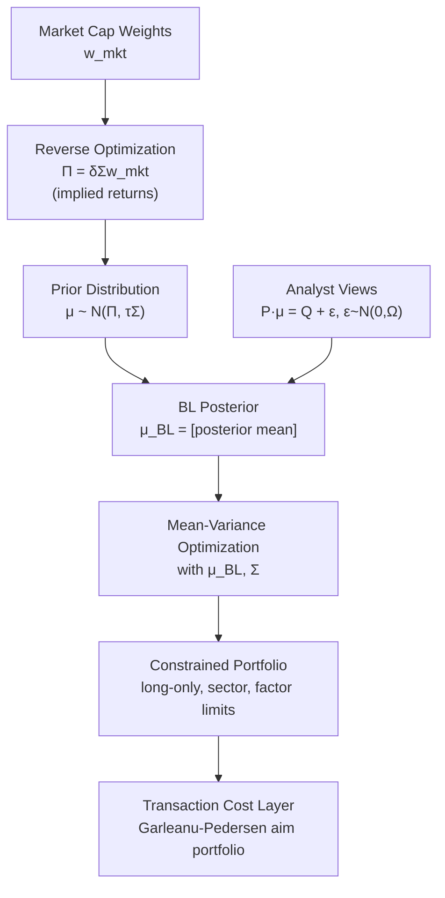

# ⚙️ Portfolio Optimization

> [!abstract] TL;DR
> Unconstrained Markowitz MVO produces extreme, unstable portfolios because it treats noisy sample means as ground truth. Black-Litterman (1990) solves this by starting from a CAPM-implied prior (reverse optimization) and Bayesian-blending analyst views proportionally to confidence. Risk parity equalizes risk contributions. Ledoit-Wolf shrinks the covariance matrix to reduce estimation error. Robust optimization and Garleanu-Pedersen transaction-cost-aware optimization complete the practical toolkit. The common thread: never hand raw sample statistics to an optimizer.

---

## Intuition — The Bayesian Navigator Analogy

A ship's navigator does not throw away GPS data just because a crew member claims to know a shortcut. Instead, she *blends* the GPS position (the prior) with the crew's claim, weighted by how confident she is in each. If the crew member is an expert (low uncertainty), the blend shifts strongly toward the shortcut. If they're unreliable (high uncertainty), the GPS dominates. Black-Litterman is exactly this: the CAPM market equilibrium is the GPS (an objective, data-driven prior), and analyst views are the crew member's claims. The confidence parameter $\Omega$ controls how much the views shift the portfolio away from the market.

---

## How It Works



---

## Key Concepts

### Reverse Optimization (CAPM Prior)

Black-Litterman starts by *inferring* expected returns that would make the market portfolio optimal. Given market-cap weights $\mathbf{w}_{mkt}$ and covariance $\Sigma$, the implied equilibrium excess returns are:

$$\Pi = \delta\Sigma\mathbf{w}_{mkt}$$

where $\delta$ is the market risk aversion coefficient (typically calibrated as $\delta = (E[r_M]-r_f)/\sigma_M^2$, commonly 2.5–4). These **implied returns** are stable, diversified, and not dominated by noise — unlike sample means. The reverse optimization is the key innovation: it uses $\Sigma$ (estimable) to infer $\boldsymbol{\mu}$ (noisy), anchoring optimization to the market's collective wisdom.

### BL Posterior Formula

The prior is: $\boldsymbol{\mu} \sim \mathcal{N}(\Pi, \tau\Sigma)$, where $\tau$ scales the uncertainty in the prior (typically $\tau \in [0.025, 0.05]$, reflecting that the prior is much more precise than individual views).

Analyst views are expressed as a linear constraint: $P\boldsymbol{\mu} = Q + \boldsymbol{\varepsilon}$, where:
- $P$ is a $K\times N$ "pick matrix" ($K$ views, $N$ assets)
- $Q$ is the $K\times 1$ vector of view returns
- $\boldsymbol{\varepsilon}\sim\mathcal{N}(\mathbf{0}, \Omega)$ is the view uncertainty

The BL posterior (standard Bayesian updating of Gaussian priors):

$$\boldsymbol{\mu}_{BL} = \left[(\tau\Sigma)^{-1} + P^\top\Omega^{-1}P\right]^{-1}\left[(\tau\Sigma)^{-1}\Pi + P^\top\Omega^{-1}Q\right]$$

**Interpretation**: $\boldsymbol{\mu}_{BL}$ is a precision-weighted average of the prior $\Pi$ (precision $(\tau\Sigma)^{-1}$) and the view-implied returns $P^\top\Omega^{-1}Q$ (precision $P^\top\Omega^{-1}P$). High-confidence views (small $\Omega$) dominate; low-confidence views barely move $\boldsymbol{\mu}_{BL}$ from $\Pi$.

### $\tau$ Calibration

$\tau$ represents uncertainty about the prior mean $\Pi$. Common choices:
- **$\tau = 1/T$** (He-Litterman): uncertainty proportional to estimation period
- **$\tau = 0.025$–$0.05$** (rule of thumb): conservative, keeps portfolio close to market
- **Idzorek confidence method**: instead of specifying $\Omega$ directly, specify a percentage confidence $c_k \in [0,1]$ for each view; Idzorek solves for $\Omega$ such that $c_k=1$ drives the portfolio fully to the view and $c_k=0$ leaves it at $\Pi$.

### 9-Step BL Implementation

1. Specify asset universe and compute $\Sigma$ (use Ledoit-Wolf or factor model)
2. Obtain market-cap weights $\mathbf{w}_{mkt}$
3. Calibrate $\delta$ from the market Sharpe ratio
4. Compute implied returns: $\Pi = \delta\Sigma\mathbf{w}_{mkt}$
5. Set $\tau$ (e.g., 0.05)
6. Specify views: construct $P$, $Q$, and $\Omega$
7. Compute BL posterior $\boldsymbol{\mu}_{BL}$ and posterior covariance $M^{-1}$ where $M = (\tau\Sigma)^{-1} + P^\top\Omega^{-1}P$
8. Run MVO with $\boldsymbol{\mu}_{BL}$ and $\Sigma$ (or $\Sigma + M^{-1}$ for full posterior covariance)
9. Apply practical constraints (long-only, turnover, sector limits, factor neutrality)

**Why BL solves extreme concentration**: unconstrained MVO with $\Pi$ (not noisy sample means) produces $\mathbf{w}_{mkt}$. Views nudge the portfolio away from the market proportionally to view confidence. This is inherently diversified.

### Ledoit-Wolf Covariance Shrinkage

The sample covariance $\hat\Sigma$ is noisy and often ill-conditioned for $N > T$. Ledoit-Wolf (2004) shrinks toward a structured target $F$ (e.g., the constant-correlation model):

$$\hat\Sigma_{LW} = (1-\alpha)\hat\Sigma + \alpha F$$

The shrinkage intensity $\alpha^*$ is estimated analytically (no cross-validation needed) by minimizing the Frobenius norm to the true $\Sigma$ under a simple limiting model. Ledoit & Wolf (2017) extended this to the nonlinear "Oracle Approximating Shrinkage" (OAS) which is available in `sklearn.covariance.OAS`.

### Practical Constraints in MVO

| Constraint | Formulation | Reason |
|-----------|-------------|--------|
| Long-only | $\mathbf{w}\geq 0$ | No short selling (most funds) |
| Turnover limit | $\|\mathbf{w}_t - \mathbf{w}_{t-1}\|_1 \leq \Delta$ | Transaction costs |
| Sector limits | $\sum_{i\in\text{sector}} w_i \leq u_s$ | Regulatory/mandate |
| Factor exposure | $|B^\top\mathbf{w} - \mathbf{b}^*|\leq\epsilon$ | Risk factor neutrality |
| Position size | $w_i \leq u_i$ | Concentration limits |

All of these preserve convexity when the objective is convex (e.g., variance minimization or Sharpe maximization).

### Garleanu-Pedersen Aim Portfolio

Transaction costs make it suboptimal to immediately trade to the new optimal portfolio. Garleanu & Pedersen (2013) show that the optimal policy is to aim for a weighted average of the current and target portfolios ("aim portfolio"):

$$\mathbf{w}_t^{\text{aim}} = \frac{\rho}{1+\rho}\mathbf{w}^* + \frac{1}{1+\rho}\mathbf{w}_{t-1}$$

where $\rho$ depends on signal decay rate and trading costs. In each period, trade a fraction toward $\mathbf{w}^{\text{aim}}$, not all the way to $\mathbf{w}^*$. The optimal trade is:

$$\Delta\mathbf{w} = \frac{1}{1+\rho}(\mathbf{w}^{\text{aim}} - \mathbf{w}_{t-1})$$

### Bayesian Resampling (Michaud)

Michaud (1998) proposed resampling to address estimation error: generate $S$ bootstrap samples of $(\hat\boldsymbol{\mu}^{(s)}, \hat\Sigma^{(s)})$ from the historical return distribution, solve MVO for each sample, and average the resulting portfolios. The resampled efficient frontier is smoother and less concentrated than the classical frontier. However, it has been criticized for lacking a rigorous Bayesian foundation (BL is theoretically preferable).

### Risk Parity

The ERC/risk parity framework (see [[Factor_Models]]) is a special case of constrained optimization:

- **Vanilla risk parity**: $w_i \propto 1/\sigma_i$ (ignore correlations) — simple but suboptimal
- **True ERC**: equalize $w_i\cdot MRC_i$ — requires iterative solver (see [[Factor_Models]] code)
- **Hierarchical risk parity (HRP)**: Marcos Lopez de Prado's tree-clustering approach — no matrix inversion required, numerically robust for large $N$

---

## Python Example

```python
import numpy as np
from scipy.optimize import minimize

# ── Black-Litterman Implementation ──

def black_litterman(w_mkt, Sigma, tau, P, Q, Omega, delta=3.0):
    """
    w_mkt : (N,) market cap weights
    Sigma  : (N,N) covariance matrix
    tau    : scalar, prior uncertainty
    P      : (K,N) pick matrix (K views)
    Q      : (K,) view returns
    Omega  : (K,K) view uncertainty covariance
    delta  : market risk aversion
    Returns: mu_BL (N,), posterior covariance (N,N)
    """
    N = len(w_mkt)
    Pi = delta * Sigma @ w_mkt          # Implied equilibrium returns

    # Prior precision
    prior_prec = np.linalg.inv(tau * Sigma)
    # View precision
    view_prec  = P.T @ np.linalg.inv(Omega) @ P

    # Posterior precision and mean
    post_prec  = prior_prec + view_prec
    post_cov   = np.linalg.inv(post_prec)
    mu_BL      = post_cov @ (prior_prec @ Pi + P.T @ np.linalg.inv(Omega) @ Q)

    return mu_BL, post_cov

# ── Example: 3 assets ──
np.random.seed(7)
N = 3
vols  = np.array([0.16, 0.08, 0.22])
corr  = np.array([[1.0, 0.2, 0.5],
                  [0.2, 1.0, 0.1],
                  [0.5, 0.1, 1.0]])
Sigma = np.diag(vols) @ corr @ np.diag(vols)

# Market weights (by capitalisation)
w_mkt = np.array([0.60, 0.25, 0.15])
delta = 3.0

# Implied returns
Pi = delta * Sigma @ w_mkt
print("Implied equilibrium returns (annualised):")
for i, p in enumerate(Pi):
    print(f"  Asset {i+1}: {p:.2%}")

# Views: Asset 1 will outperform Asset 3 by 3%
tau = 0.05
P = np.array([[1.0, 0.0, -1.0]])        # relative view
Q = np.array([0.03])                     # 3% outperformance
Omega = np.array([[0.01]])               # moderate confidence

mu_BL, post_cov = black_litterman(w_mkt, Sigma, tau, P, Q, Omega, delta)
print("\nBL posterior returns (annualised):")
for i, m in enumerate(mu_BL):
    print(f"  Asset {i+1}: {m:.2%}  (prior: {Pi[i]:.2%})")

# ── MVO with BL returns ──
rf = 0.04

def neg_sharpe(w, mu, Sigma, rf):
    port_ret = w @ mu
    port_vol = np.sqrt(w @ Sigma @ w)
    return -(port_ret - rf) / port_vol

constraints = [{'type': 'eq', 'fun': lambda w: w.sum() - 1}]
bounds = [(0.0, 1.0)] * N
w0 = w_mkt.copy()

# MVO with raw implied returns (should recover market weights)
res_prior = minimize(neg_sharpe, w0, args=(Pi, Sigma, rf),
                     method='SLSQP', bounds=bounds, constraints=constraints)

# MVO with BL returns
res_bl = minimize(neg_sharpe, w0, args=(mu_BL, Sigma, rf),
                  method='SLSQP', bounds=bounds, constraints=constraints)

print("\nPortfolio weights comparison:")
print(f"{'Asset':<8} {'Market':>10} {'MVO(Prior)':>12} {'BL':>10}")
for i in range(N):
    print(f"Asset {i+1}  {w_mkt[i]:>10.1%} {res_prior.x[i]:>12.1%} {res_bl.x[i]:>10.1%}")

# ── Ledoit-Wolf Shrinkage (via sklearn) ──
try:
    from sklearn.covariance import LedoitWolf
    # Generate synthetic return matrix
    T_obs = 252
    returns = np.random.multivariate_normal(np.zeros(N), Sigma, T_obs)
    lw = LedoitWolf().fit(returns)
    print(f"\nLedoit-Wolf shrinkage coefficient α = {lw.shrinkage_:.4f}")
    Sigma_LW = lw.covariance_
    print("LW covariance diagonal:", np.diag(Sigma_LW).round(6))
except ImportError:
    print("Install scikit-learn for Ledoit-Wolf: pip install scikit-learn")
```

---

## Real-World Notes

- **BL is not a panacea**: if the view is wrong, BL will confidently move away from the diversified market portfolio. Quality of views matters as much as the model.
- **$\tau$ is often poorly calibrated**: setting $\tau$ too large makes BL extremely sensitive to views; too small and views are ignored. Idzorek's confidence-based method is more intuitive.
- **Turnover is often the binding constraint**: a theoretically optimal daily rebalance may cost 50–100 bps per year; risk-adjusted net alpha after costs may be zero.
- **Covariance regimes**: during crises, correlations spike (see [[Value_at_Risk]]). Regime-conditional covariance matrices (MSMS-GARCH, DCC-GARCH) improve robustness.
- **HRP**: particularly popular for large universes ($N > 500$) where inverting $\Sigma$ is numerically unstable — tree-clustering avoids inversion entirely.

---

## Common Pitfalls

- **Treating BL posterior as the full covariance**: the posterior mean uncertainty $M^{-1}$ should be added to $\Sigma$ for the MVO objective, not just using $\Sigma$. Most practitioners skip this.
- **Picking $\Omega$ arbitrarily**: diagonal $\Omega = p(1-p)\text{diag}(P\Sigma P^\top)$ (proportional to variance of view portfolio) is the He-Litterman convention.
- **Forgetting transaction costs entirely**: the BL-optimal portfolio ignores trading costs; the Garleanu-Pedersen aim portfolio is closer to implementable optimality.
- **Risk parity with leverage hidden in bonds**: if bonds are levered 3x to match equity risk, rising rates simultaneously deleverage bonds AND cause losses — double hit.
- **Singular covariance matrix**: for $N > T$, the sample $\Sigma$ is rank-deficient; always regularize (Ledoit-Wolf, Ridge, or factor model) before inverting.

---

## Related Concepts

- [[Modern_Portfolio_Theory]] — BL extends standard MVO; reverse optimization uses MVO's KKT conditions
- [[CAPM]] — BL prior is derived from CAPM reverse optimization
- [[Factor_Models]] — Factor-model covariance is better input to BL than sample covariance; ERC is a related optimization
- [[Performance_Attribution]] — How to evaluate whether the BL-optimized portfolio added value ex post

---

## Review Questions

1. Show that if $P = I_N$ (one view per asset), $Q = \Pi$, and $\Omega \to \infty$ (zero view confidence), the BL posterior $\boldsymbol{\mu}_{BL}$ collapses to $\Pi$. What does this imply for the optimal portfolio?
2. You have $N=100$ assets and $T=252$ daily observations. Explain why the sample covariance matrix is singular and describe two approaches (Ledoit-Wolf and factor model) that address this. What are the trade-offs between them?
3. A client requires at most 20% turnover per quarter. How does the Garleanu-Pedersen framework suggest handling a large alpha signal that would require 60% turnover to fully implement? What information would you need to compute the aim portfolio?

---

## Sources

- Black, F. & Litterman, R. (1992). "Global Portfolio Optimization." *Financial Analysts Journal*, 48(5), 28–43.
- He, G. & Litterman, R. (1999). *The Intuition Behind Black-Litterman Model Portfolios*. Goldman Sachs Investment Management.
- Idzorek, T. (2005). "A Step-by-Step Guide to the Black-Litterman Model." *Working Paper*, Zephyr Associates.
- Ledoit, O. & Wolf, M. (2004). "Honey, I Shrunk the Sample Covariance Matrix." *Journal of Portfolio Management*, 30(4), 110–119.
- Garleanu, N. & Pedersen, L. (2013). "Dynamic Trading with Predictable Returns and Transaction Costs." *Journal of Finance*, 68(6), 2309–2340.
- Maillard, S., Roncalli, T. & Teiletche, J. (2010). "The Properties of Equally Weighted Risk Contribution Portfolios." *Journal of Portfolio Management*, 36(4), 60–70.
- Lopez de Prado, M. (2016). "Building Diversified Portfolios that Outperform Out-of-Sample." *Journal of Portfolio Management*, 42(4), 59–69.

---

#quantitative-finance #portfolio-theory #advanced #black-litterman #risk-parity #covariance-shrinkage
