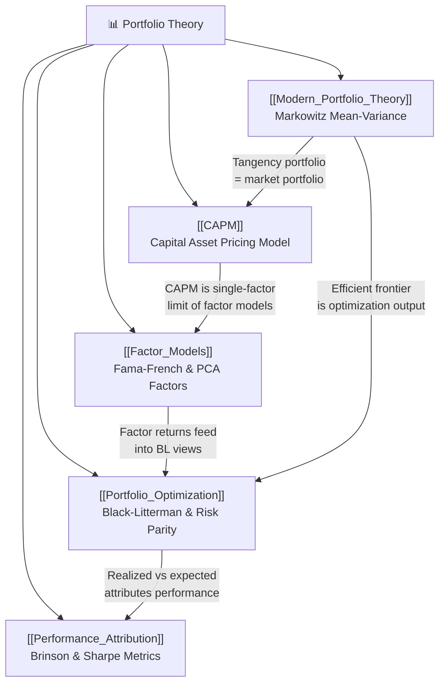

# 📊 Portfolio Theory — Map of Content

> [!abstract] What This Section Covers
> From Markowitz mean-variance optimization to CAPM, multi-factor models, and Black-Litterman: the mathematical machinery of systematic portfolio construction. This section covers how to build portfolios that maximize return per unit of risk, how to decompose risk into systematic factors, and how to measure whether a portfolio actually delivered what it promised.

---

## Concept Map

---

## Learning Path

1. **[[Modern_Portfolio_Theory]]** — Start here. Understand mean-variance optimization, the efficient frontier, and the two-fund separation theorem. This is the mathematical foundation for everything that follows.
2. **[[CAPM]]** — The simplest equilibrium model. Learn why, if everyone does MPT, the market portfolio becomes the tangency portfolio, and how beta prices systematic risk.
3. **[[Factor_Models]]** — CAPM fails empirically. Learn how Fama-French, Carhart, and PCA factors decompose returns into systematic risk premia and why the "factor zoo" demands skepticism.
4. **[[Portfolio_Optimization]]** — Practical portfolio construction. Black-Litterman blends market priors with analyst views; risk parity and robust optimization address the brittleness of unconstrained MVO.
5. **[[Performance_Attribution]]** — Did the portfolio do what it claimed? Learn BHB allocation/selection decomposition, Sharpe/Sortino/Calmar ratios, and why persistence of outperformance is rare.

---

## All Notes at a Glance

| Note | Difficulty | What You'll Learn |
|------|-----------|-------------------|
| [[Modern_Portfolio_Theory]] | Intermediate | Efficient frontier, QP formulation, tangency portfolio, CML |
| [[CAPM]] | Intermediate | Beta, SML, Jensen's alpha, Fama-MacBeth, empirical failures |
| [[Factor_Models]] | Advanced | FF3/4/5, PCA, Marchenko-Pastur, risk decomposition, ERC |
| [[Portfolio_Optimization]] | Advanced | Black-Litterman, risk parity, shrinkage estimators, robust optimization |
| [[Performance_Attribution]] | Intermediate | BHB attribution, Sharpe/Sortino/Calmar/Ulcer Index, persistence |

---

## Key Questions This Section Answers

1. **How do you construct a portfolio that lies on the efficient frontier?** — [[Modern_Portfolio_Theory]] derives the quadratic program and shows why diversification always helps when correlations are below 1.
2. **What return should you demand for holding a risky stock?** — [[CAPM]] gives the Security Market Line: expected excess return is beta times the market risk premium.
3. **Why does CAPM fail, and what replaces it?** — [[Factor_Models]] shows size, value, momentum, profitability, and investment patterns that market beta alone cannot price.
4. **How do you embed analyst views without blowing up the optimization?** — [[Portfolio_Optimization]] covers Black-Litterman's Bayesian blending of equilibrium priors and investor views.
5. **How do you know if your portfolio manager added skill or just got lucky?** — [[Performance_Attribution]] decomposes returns into allocation, selection, and interaction effects and corrects for risk taken.
6. **How do you estimate a covariance matrix without it being garbage?** — [[Portfolio_Optimization]] and [[Factor_Models]] cover Ledoit-Wolf shrinkage and Marchenko-Pastur noise filtering.
7. **What is the right benchmark for comparing two strategies with different risks?** — [[Performance_Attribution]] explains Sharpe, Sortino, Calmar, and RAROC and their statistical properties.

---

## Related Sections

- [[_MOC_Quantitative_Finance_Master|Master MOC]] — Top-level map of all sections
- **Previous:** [[_MOC_Fixed_Income|03 — Fixed Income & Derivatives]]
- **Next:** [[_MOC_Risk_Management|05 — Risk Management]]
- **Cross-links:** [[Value_at_Risk]], [[Stochastic_Calculus]], [[Options_Pricing]]

---

#MOC #QuantitativeFinance #PortfolioTheory
