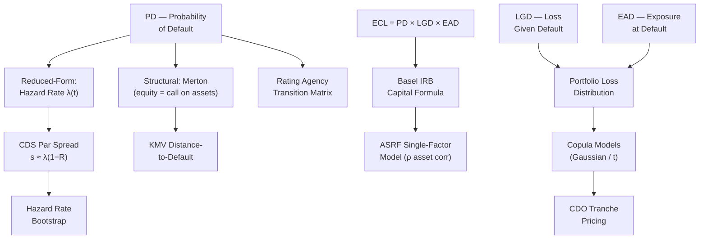

# 🏦 Credit Risk

> [!abstract] TL;DR
> Credit risk is the risk of loss from a borrower or counterparty failing to meet its obligations. The three pillars are **PD** (probability of default), **LGD** (loss given default), and **EAD** (exposure at default). Modelling ranges from actuarial transition matrices and Merton's structural model to reduced-form hazard models and copula-based portfolio loss distributions — with Basel IRB translating these into regulatory capital.

## Intuition — Analogy First

The **Merton structural model** treats a company exactly like a homeowner with a mortgage. The homeowner owns a house (assets $V_A$) and has a mortgage (debt face value $D$). At maturity, if the house is worth more than the mortgage ($V_A > D$), the homeowner pays off the debt and keeps the equity ($V_A - D$). If the house is worth less ($V_A < D$), the homeowner defaults — hands the keys to the bank and walks away.

**Equity is a call option on assets:** $E = \max(V_A - D, 0)$. Default occurs when the asset value falls below the debt barrier. The farther away from that barrier (the higher the Distance-to-Default), the safer the company.

This simple analogy unified corporate finance and options theory in one framework. The practical extension — **KMV** (Kealhofer, McQuown, Vasicek) at Moody's Analytics — made Distance-to-Default a commercially sold risk signal used by thousands of banks globally.

For portfolio credit risk, the **Gaussian copula** CDO model failed during the GFC because it assumed defaults were independent given a single market factor and had zero tail dependence. In reality, when Lehman defaulted, every other bank simultaneously looked shakier — defaults clustered catastrophically, exactly what the Gaussian copula said couldn't happen.

---

## How It Works



---

## Key Concepts

### 1. Expected Credit Loss (ECL)

The fundamental credit loss identity:

$$ECL = PD \times LGD \times EAD$$

- **PD:** Probability that the counterparty defaults within the horizon (typically 1 year for regulatory capital; lifetime for IFRS 9 accounting).
- **LGD:** The fraction of exposure lost if default occurs; $LGD = 1 - R$ where $R$ is the recovery rate ($R \approx 40\%$ for senior unsecured, $\approx 0\%$ for subordinated debt).
- **EAD:** The exposure outstanding at the time of default; for revolving credit facilities, this includes potential draw-down: $EAD = Drawn + CCF \times Undrawn$ where CCF is the credit conversion factor.

IFRS 9 (2018) extended ECL accounting to a three-stage model (12-month ECL, lifetime ECL, credit-impaired), forcing banks to recognise losses earlier than the incurred-loss model of IAS 39.

### 2. Rating Agency Transition Matrix

Credit ratings evolve as a Markov chain. The annual transition matrix $\mathbf{T}$ gives the probability of migrating from rating $i$ to rating $j$:

$$\mathbf{T} = \begin{pmatrix}
p_{AAA \to AAA} & p_{AAA \to AA} & \cdots & p_{AAA \to D} \\
p_{AA \to AAA} & p_{AA \to AA} & \cdots & p_{AA \to D} \\
\vdots & & \ddots & \vdots \\
0 & 0 & \cdots & 1
\end{pmatrix}$$

The default state $D$ is absorbing. The $h$-year PD is obtained from $\mathbf{T}^h$: the last column gives cumulative PDs by rating. Moody's, S&P, and Fitch publish empirical transition matrices annually.

**Generator matrix approach:** for continuous-time, $\mathbf{T}(t) = e^{\mathbf{Q}t}$ where $\mathbf{Q}$ is the transition intensity matrix (off-diagonals = intensities, diagonal = negative row sums). This allows intra-year horizon PDs.

### 3. Merton Structural Model (1974)

**Setup:** Company assets $V_A$ follow GBM: $dV_A = \mu V_A\,dt + \sigma_A V_A\,dW$.

At debt maturity $T$, equity holders receive $\max(V_A - D, 0)$ and debt holders receive $\min(V_A, D)$.

**Equity as a call option on assets:**

$$E = V_A N(d_1) - D e^{-rT} N(d_2)$$

$$d_1 = \frac{\ln(V_A/D) + (r + \sigma_A^2/2)T}{\sigma_A\sqrt{T}}, \qquad d_2 = d_1 - \sigma_A\sqrt{T}$$

**Risk-neutral probability of default:**

$$PD^Q = N(-d_2) = N\!\left(\frac{\ln(D/V_A) - (r - \sigma_A^2/2)T}{\sigma_A\sqrt{T}}\right)$$

**KMV Distance-to-Default:**

$$DD = \frac{V_A - D}{V_A \cdot \sigma_A}$$

DD is expressed in standard deviations. A company with $DD = 4$ is 4 standard deviations away from default — very safe. $DD < 1$ signals distress. KMV maps DD to an **Expected Default Frequency (EDF)** using empirical default frequencies rather than the theoretical $N(-d_2)$.

**Implementation challenge:** $V_A$ and $\sigma_A$ are unobservable. They are extracted from observable equity $E$ and equity vol $\sigma_E$ via the system:

$$E = V_A N(d_1) - D e^{-rT} N(d_2)$$
$$\sigma_E E = N(d_1)\,\sigma_A V_A$$

Solved iteratively (e.g., Newton-Raphson).

### 4. Reduced-Form Hazard Model

Alternative to structural models: treat default as a Poisson arrival with intensity (hazard rate) $h(t) > 0$:

$$Q(0,T) = \exp\!\left(-\int_0^T h(s)\,ds\right) = P(\text{survive to } T)$$

For constant hazard rate $h$: $Q(0,T) = e^{-hT}$ and PD = $1 - e^{-hT}$.

Hazard rates are calibrated from market instruments (CDS spreads). They are risk-neutral rates, not physical-measure default frequencies.

### 5. CDS Par Spread and Hazard Rate Bootstrap

A **Credit Default Swap (CDS)** is insurance against default: the protection buyer pays periodic spread $s$ and receives LGD at default. At par, the present value of protection leg equals the present value of premium leg:

$$s \approx h(1-R) = \lambda \cdot LGD$$

where $\lambda$ is the constant hazard rate and $R$ is the recovery rate. For a 5-year CDS at 100bp with $R=40\%$: $\lambda \approx 100bp/0.6 = 167bp$ per year.

**Hazard rate bootstrap:** Given CDS spreads $s_1 < s_2 < \cdots < s_n$ at maturities $T_1 < T_2 < \cdots < T_n$, bootstrap piecewise-constant hazard rates $h_1, h_2, \ldots, h_n$ sequentially:

For each maturity $T_k$:
$$\sum_{i=1}^{M_k} s_k \cdot \Delta t \cdot D(t_i) \cdot Q(0,t_i) = (1-R)\sum_{j} D(\tau_j) \left[Q(0,\tau_{j-1}) - Q(0,\tau_j)\right]$$

Solve for $h_k$ given known $h_1, \ldots, h_{k-1}$.

**CS01** (Credit Spread DV01): sensitivity of CDS present value to 1bp widening in spread. For a long protection position, CS01 > 0 (gains when spreads widen).

### 6. Basel IRB ASRF Capital Formula

The Basel Internal Ratings-Based (IRB) Asymptotic Single Risk Factor (ASRF) model assumes asset returns $R_i = \sqrt{\rho}\,M + \sqrt{1-\rho}\,\epsilon_i$ where $M$ is a single systematic factor and $\epsilon_i$ is idiosyncratic.

The regulatory capital formula for unexpected loss is:

$$K = LGD \cdot N\!\left(\sqrt{\frac{1}{1-\rho}}\,N^{-1}(PD) + \sqrt{\frac{\rho}{1-\rho}}\,N^{-1}(0.999)\right) - LGD \cdot PD$$

where $\rho$ is the **asset correlation** (prescribed by Basel: 12–24% for corporates, 15% for retail mortgages, etc.), and $N^{-1}(0.999)$ reflects the 99.9% confidence level.

The inner expression $N\!\left(\cdots\right)$ is the **conditional PD** given the worst 0.1% systematic factor realisation — essentially the worst-case PD in a severe recession. Capital = unexpected loss = conditional loss − expected loss.

### 7. Copula Models for Portfolio Credit

For a portfolio of $n$ names, joint defaults are modelled via a copula $C$ on uniform marginal PDs:

**Gaussian copula (Li, 2000):**
$$C^{Gauss}(u_1,\ldots,u_n) = \Phi_n(\Phi^{-1}(u_1),\ldots,\Phi^{-1}(u_n); \mathbf{R})$$

Conditional on market factor $M$, defaults are independent (ASRF assumption). Used for CDO tranche pricing pre-GFC.

**Fatal flaw:** Gaussian copula has **zero tail dependence** ($\lambda_U = 0$): as spreads widen, defaults in different names remain nearly independent in the Gaussian framework. In 2007–2008, this assumption was catastrophically wrong — AAA CDO tranches pricing at spreads implying <1bp default probability experienced 30–50% losses.

**t-copula** (degrees of freedom $\nu$):
$$C^t(u_1,\ldots,u_n;\mathbf{R},\nu) = t_n(t_\nu^{-1}(u_1),\ldots,t_\nu^{-1}(u_n);\mathbf{R},\nu)$$

Upper tail dependence: $\lambda_U = 2t_{\nu+1}\!\left(-\sqrt{(\nu+1)(1-\rho)/(1+\rho)}\right) > 0$.

For $\nu=4, \rho=0.3$: $\lambda_U \approx 0.18$ — a 18% probability that when one name defaults, others follow into the tail. This captures the empirical "contagion" effect that Gaussian copula ignores.

### 8. Wrong-Way Risk (WWR)

Wrong-way risk arises when the exposure to a counterparty **increases** precisely when the counterparty is more likely to default:

- Classic example: a US bank buys protection on EM sovereign bonds from an EM bank. If EM sovereign spreads widen (default risk rises), the protection contract gains value — making the bank *more* exposed to the EM bank exactly when the EM bank is most stressed.
- FX forward example: an EM export firm buys USD/sell EM currency forward from a bank. When EM currency depreciates (firm gains on forward), the firm's creditworthiness improves — this is **right-way risk**. The reverse is wrong-way risk.

WWR requires **joint simulation** of exposure and default — the independence assumption built into standard CVA is violated. WWR-adjusted CVA uses correlated exposure/default Monte Carlo.

---

## Python Example

```python
import numpy as np
from scipy import stats, optimize

# ── Merton Model PD ────────────────────────────────────────────────────────
def merton_pd(V_A: float, D: float, r: float,
              sigma_A: float, T: float = 1.0) -> dict:
    """Compute Merton d1, d2, equity value, risk-neutral PD, and DD."""
    d1 = (np.log(V_A / D) + (r + 0.5 * sigma_A**2) * T) / (sigma_A * np.sqrt(T))
    d2 = d1 - sigma_A * np.sqrt(T)
    equity = V_A * stats.norm.cdf(d1) - D * np.exp(-r * T) * stats.norm.cdf(d2)
    pd_rn  = float(stats.norm.cdf(-d2))
    dd     = (V_A - D) / (V_A * sigma_A)
    return {"d1": d1, "d2": d2, "equity": equity, "PD_rn": pd_rn, "DD": dd}

# ── Solve for Asset Value and Vol from Equity Observables ─────────────────
def merton_calibrate(E: float, sigma_E: float, D: float, r: float,
                     T: float = 1.0) -> tuple:
    """Iterative calibration of V_A and sigma_A from equity market data."""
    def equations(params):
        V_A, sigma_A = params
        d1 = (np.log(V_A/D) + (r + 0.5*sigma_A**2)*T) / (sigma_A*np.sqrt(T))
        d2 = d1 - sigma_A * np.sqrt(T)
        eq1 = V_A*stats.norm.cdf(d1) - D*np.exp(-r*T)*stats.norm.cdf(d2) - E
        eq2 = stats.norm.cdf(d1)*sigma_A*V_A - sigma_E*E
        return [eq1, eq2]
    sol = optimize.fsolve(equations, x0=[E + D, sigma_E], full_output=True)
    V_A_sol, sigma_A_sol = sol[0]
    return float(V_A_sol), float(sigma_A_sol)

# ── CDS Hazard Rate Bootstrap (constant hazard per maturity bucket) ────────
def cds_bootstrap(maturities: list, spreads_bps: list,
                  recovery: float = 0.40, dt: float = 0.5) -> dict:
    """Bootstrap piecewise-constant hazard rates from CDS par spreads.
    maturities: e.g. [1, 2, 3, 5, 7, 10] in years
    spreads_bps: par CDS spreads in basis points"""
    spreads = [s / 10_000 for s in spreads_bps]
    hazards, Q_prev, t_prev = {}, 1.0, 0.0
    breakpoints = [0] + maturities
    for k, (T, s) in enumerate(zip(maturities, spreads)):
        # Objective: price CDS to zero NPV given previous hazard rates
        def cds_npv(h):
            Q, t, pv_prem, pv_prot = Q_prev, t_prev, 0.0, 0.0
            t_grid = np.arange(t + dt, T + 1e-9, dt)
            for ti in t_grid:
                Q_new = Q * np.exp(-h * (ti - t))
                D_i   = np.exp(-0.04 * ti)           # assume flat 4% rate
                pv_prem += s * dt * D_i * Q_new
                pv_prot += (1 - recovery) * D_i * (Q - Q_new)
                Q, t = Q_new, ti
            return pv_prem - pv_prot
        h_k = optimize.brentq(cds_npv, 1e-6, 5.0)
        hazards[T] = h_k
        # Update Q at this maturity
        t_grid = np.arange(t_prev + dt, T + 1e-9, dt)
        for ti in t_grid:
            Q_prev = Q_prev * np.exp(-h_k * (ti - t_prev))
            t_prev = ti
    return hazards

# ── Demo ───────────────────────────────────────────────────────────────────
# Merton model
result = merton_pd(V_A=120, D=100, r=0.04, sigma_A=0.25, T=1.0)
print("Merton Model:")
for k, v in result.items():
    print(f"  {k}: {v:.4f}")

# Calibrate from equity market data
E_market = result["equity"]
sigma_E  = 0.35  # observed equity vol
V_A_cal, sig_A_cal = merton_calibrate(E_market, sigma_E, D=100, r=0.04)
print(f"\nCalibrated: V_A={V_A_cal:.2f}, sigma_A={sig_A_cal:.4f}")

# CDS bootstrap
mats    = [1, 2, 3, 5]
spreads = [80, 100, 115, 130]      # basis points
hazards = cds_bootstrap(mats, spreads)
print("\nBootstrapped Hazard Rates:")
for T, h in hazards.items():
    print(f"  T={T}y: λ = {h*10000:.1f} bps/yr  →  "
          f"PD(T)={100*(1-np.exp(-h*T)):.2f}%")
```

---

## Real-World Notes

- **GFC and Gaussian Copula:** David Li's 2000 paper on the Gaussian copula became the dominant CDO pricing model. Its zero tail dependence assumption led banks to misprice senior CDO tranches massively. The t-copula (and other Archimedean copulas with positive tail dependence) better captures crisis co-movement.
- **IFRS 9 (2018):** Replaced the incurred-loss model with a 3-stage ECL model. Stage 1: 12-month ECL; Stage 2 (significant credit deterioration): lifetime ECL; Stage 3 (credit-impaired): lifetime ECL with interest on net carrying amount.
- **CVA (Credit Valuation Adjustment):** Market value impact of counterparty credit risk on derivatives. $CVA \approx (1-R)\int_0^T \mathbb{E}[EE(t)]h(t)e^{-\int_0^t (r+h)ds}dt$ where $EE(t)$ is expected positive exposure. Basel III introduced CVA capital charges.
- **SA-CCR (2020):** Replaced CEM (Current Exposure Method) for measuring EAD of derivatives under Basel. Uses alpha-scaled replacement cost plus potential future exposure add-ons.

---

## Common Pitfalls

- **Assuming constant hazard rates:** Real credit curves are not flat. Bootstrapping is essential for term-structure consistency; using a single spread for all maturities misprices long-dated exposure.
- **Ignoring LGD uncertainty:** LGD is stochastic (dependent on collateral quality, recovery process duration, macroeconomic conditions). Treating LGD as a constant underestimates tail risk.
- **Merton model for short-term PDs:** Merton's 1-year continuous-time framework gives poor short-term default predictions (structural models "know" default is coming; real markets don't). Reduced-form models are better for short-horizon trading applications.
- **Gaussian copula for structured products:** As demonstrated in the GFC, zero tail dependence is catastrophically wrong for correlated credit portfolios. Always stress-test copula choice.
- **Wrong-way risk blindspot:** Standard CVA calculations assume exposure and default are independent. For correlated counterparties (sovereign risk, sector concentration), WWR-adjusted CVA is materially larger.

---

## Related Concepts

- [[Value_at_Risk]] — 99.9% 1-year VaR is the backbone of Basel IRB capital
- [[Expected_Shortfall]] — coherent capital allocation across credit sub-portfolios
- [[Market_Risk]] — CVA sits at the market/credit boundary; traded in credit desks
- [[Operational_Risk]] — third Basel pillar alongside credit and market risk

---

## Review Questions

1. A company has asset value $V_A = \$150M$, debt $D = \$100M$, asset volatility $\sigma_A = 20\%$, and risk-free rate $r = 3\%$. Compute the Merton Distance-to-Default and the risk-neutral 1-year PD. If the physical-measure PD is 0.5%, what does the difference imply about the risk premium?
2. Explain why the Gaussian copula has zero upper tail dependence. How does the t-copula fix this, and what parameter controls the degree of tail dependence?
3. A 5-year CDS trades at 120 bps with a 40% recovery rate. Assuming a flat hazard rate and 4% risk-free rate, compute the implied hazard rate and the 5-year risk-neutral probability of default.

---

## Sources

- Merton, R.C. "On the Pricing of Corporate Debt: The Risk Structure of Interest Rates." *Journal of Finance* 29(2), 1974.
- Li, D.X. "On Default Correlation: A Copula Function Approach." *Journal of Fixed Income* 9(4), 2000.
- Basel Committee on Banking Supervision. *Basel II: International Convergence of Capital Measurement and Capital Standards* (2004).
- McNeil, A., Frey, R., Embrechts, P. *Quantitative Risk Management* (2nd ed., 2015). Chapters 9–11.
- Lando, D. *Credit Risk Modeling: Theory and Applications* (2004).
- Gregory, J. *The XVA Challenge: Counterparty Credit Risk, Funding, Collateral, Capital and Initial Margin* (4th ed., 2020).

#quantitative-finance #risk-management #advanced #credit-risk #Merton #CDS #Basel-IRB #copula
