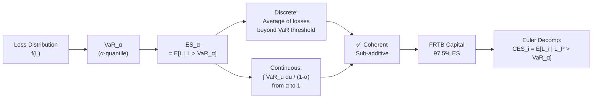

# 📊 Expected Shortfall

> [!abstract] TL;DR
> Expected Shortfall ($ES_\alpha$) is the **expected loss conditional on losses exceeding VaR** — the average severity of tail events. Unlike [[Value_at_Risk]], ES is a *coherent* risk measure (it satisfies sub-additivity), making it theoretically superior for portfolio aggregation and capital allocation. Basel FRTB (2019) replaced 99% VaR with 97.5% ES as the standard for trading-book market risk capital.

## Intuition — Analogy First

[[Value_at_Risk]] is a security guard who says "99% of the time, you won't lose more than \$10M." Expected Shortfall is the claims adjuster who asks: "On those rare days when you *do* lose more than \$10M — how much do you actually lose, on average?"

A concrete framing: imagine sorting 100 worst trading days from history. VaR at 99% is the **boundary** of the worst 1 day — it barely grazes the tail. ES at 99% is the **average** of those 1 worst days. ES at 97.5% averages the worst 2.5 days. Both cut at different points, but ES goes deeper by averaging rather than merely marking a threshold.

The analogy extends to flood insurance: VaR tells you the water level at the 99th percentile flood. ES tells you the average water level across all floods worse than that — which is what actually matters when sizing levees and evacuation plans. ES forces you to think about the *magnitude* of catastrophe, not just its probability.

The regulatory switch to ES reflects painful GFC lessons: banks held capital against 99% VaR and were still insolvent because the tail beyond the VaR threshold was catastrophically large.

---

## How It Works



---

## Key Concepts

### 1. Formal Definition

$$ES_\alpha = \mathbb{E}[L \mid L > VaR_\alpha] = \frac{1}{1-\alpha}\int_\alpha^1 VaR_u\,du$$

The integral form shows that ES is a **weighted average of quantiles** above $\alpha$ — it integrates across the entire tail, not just a single quantile. This is why ES captures tail thickness in a way VaR cannot.

Alternative name: **CVaR** (Conditional VaR) or **Expected Tail Loss (ETL)** — all synonymous in continuous distributions. (In discrete distributions, CVaR and ES can differ slightly at the boundary; ES is the more robust definition.)

### 2. Normal ES

For normally distributed losses $L \sim \mathcal{N}(\mu, \sigma^2)$:

$$ES_\alpha = \mu + \sigma\,\frac{\phi(z_\alpha)}{1-\alpha}$$

where $\phi(\cdot)$ is the standard normal PDF and $z_\alpha = \Phi^{-1}(\alpha)$. For $\alpha = 0.99$: $z_\alpha \approx 2.326$, $\phi(z_\alpha) \approx 0.0267$, giving:

$$ES_{99\%} \approx \mu + \sigma \cdot 2.665$$

Compare to $VaR_{99\%} = \mu + \sigma \cdot 2.326$: ES is roughly 15% larger under normality.

### 3. Student-t ES

For $L \sim t_\nu(\mu, \sigma^2)$ with $\nu$ degrees of freedom:

$$ES_\alpha = \mu + \sigma\,\frac{f_\nu\!\left(t_\nu^{-1}(\alpha)\right)}{1-\alpha}\,\cdot\frac{\nu + \left(t_\nu^{-1}(\alpha)\right)^2}{\nu - 1}$$

where $f_\nu(\cdot)$ is the t-distribution PDF and $t_\nu^{-1}(\alpha)$ its quantile. As $\nu \to \infty$, this reduces to the normal formula. For small $\nu$ (heavy tails), t-ES is significantly larger than normal ES — capturing the fat-tail premium.

### 4. ES via Historical Data

Sort all $T$ observations by loss (largest to smallest). Let $k = \lfloor T(1-\alpha) \rfloor$ be the number of tail observations:

$$\widehat{ES}_\alpha = \frac{1}{k}\sum_{i=1}^{k} L_{(i)}$$

where $L_{(1)} \geq L_{(2)} \geq \cdots$ are order statistics of losses. For 250 observations at 97.5%: average the worst $250 \times 0.025 = 6.25 \approx 6$ observations.

### 5. ES is Sub-Additive (Coherent)

$$ES_\alpha(A + B) \leq ES_\alpha(A) + ES_\alpha(B)$$

This holds for all distributions (with finite mean), making ES a **coherent risk measure** in the sense of Artzner et al. (1999). [[Value_at_Risk]] fails this property — two individually safe portfolios can appear riskier when combined under VaR, a mathematical absurdity that ES avoids.

Sub-additivity means ES correctly rewards diversification: merging two portfolios never produces a combined ES larger than the sum of individual ESs.

### 6. Regulatory Equivalence: $ES_{97.5\%} \approx VaR_{99\%}$ Under Normality

Under the normal distribution:

$$ES_{97.5\%} = \mu + \sigma\,\frac{\phi(1.960)}{0.025} \approx \mu + \sigma \cdot 2.338 \approx VaR_{99\%}$$

This approximate equivalence motivated Basel's FRTB switch: 97.5% ES gives similar average capital to 99% VaR under normality, but responds to tail thickness correctly when normality breaks down (exactly in stress scenarios, when it matters most).

### 7. Euler ES Decomposition

As with VaR, ES decomposes into position-level **Component ES**:

$$CES_i = \mathbb{E}[L_i \mid L_P > VaR_\alpha]$$

This is the expected loss from position $i$ on the days when portfolio loss exceeds VaR. CES components sum to total ES:

$$ES_\alpha = \sum_i CES_i$$

In practice, $CES_i$ is estimated as the average of the P&L contribution of position $i$ across the tail scenarios (days when $L_P > VaR_\alpha$). This is used for risk capital attribution in trading desks.

### 8. ES Backtesting (Harder Than VaR)

VaR backtesting counts binary exceptions. ES backtesting must assess the *magnitude* of tail losses, which is intrinsically harder because there are fewer observations in the tail.

**Acerbi-Szekely (2014) Test:** constructs a test statistic based on the sum of standardised losses in the tail:

$$Z_1 = \frac{1}{T(1-\alpha)\,ES_\alpha}\sum_{t=1}^{T} L_t\,\mathbf{1}_{L_t > VaR_\alpha} + 1$$

$H_0: \mathbb{E}[Z_1] = 0$. Monte Carlo simulation under the model generates the null distribution. A significantly negative $Z_1$ indicates underestimation of ES.

Under **Basel FRTB**, ES backtesting uses a "two-stage" approach: first pass the VaR coverage test (Kupiec), then check ES scale using the Acerbi-Szekely statistic.

### 9. Comparison Table: VaR vs ES

| Property | VaR | ES |
|---|---|---|
| Definition | $\alpha$-quantile of loss | Mean of losses $> VaR$ |
| Coherent | No (fails sub-additivity) | Yes |
| Estimability | Easy — single quantile | Harder — tail average |
| Backtestability | Easy (count exceptions) | Hard (test tail magnitudes) |
| Regulatory standard | Basel II/III (pre-FRTB) | Basel FRTB (2019) |
| Sensitivity to tail | Ignores beyond VaR | Full tail-sensitive |
| Euler decomposition | Component VaR | Component ES |
| Diversification | Can penalise | Always rewards |

---

## Python Example

```python
import numpy as np
from scipy import stats

# ── Parametric Normal ES ───────────────────────────────────────────────────
def normal_es(mu: float, sigma: float, alpha: float = 0.975) -> float:
    z = stats.norm.ppf(alpha)
    return -mu + sigma * stats.norm.pdf(z) / (1 - alpha)

# ── Parametric Student-t ES ────────────────────────────────────────────────
def student_t_es(mu: float, sigma: float, nu: float,
                 alpha: float = 0.975) -> float:
    t_alpha = stats.t.ppf(alpha, df=nu)
    pdf_val  = stats.t.pdf(t_alpha, df=nu)
    es = -mu + sigma * pdf_val / (1 - alpha) * (nu + t_alpha**2) / (nu - 1)
    return float(es)

# ── Historical ES ──────────────────────────────────────────────────────────
def historical_es(returns: np.ndarray, alpha: float = 0.975) -> float:
    """Returns positive ES (loss convention)."""
    losses = -returns
    threshold = np.quantile(losses, alpha)
    tail_losses = losses[losses > threshold]
    return float(tail_losses.mean()) if len(tail_losses) > 0 else threshold

# ── Euler Component ES ─────────────────────────────────────────────────────
def component_es(position_returns: np.ndarray,
                 portfolio_returns: np.ndarray,
                 alpha: float = 0.975) -> np.ndarray:
    """
    Compute CES_i = E[L_i | L_P > VaR_alpha].
    position_returns: (T, n) array; portfolio_returns: (T,) array.
    """
    portfolio_losses = -portfolio_returns
    var_threshold = np.quantile(portfolio_losses, alpha)
    tail_mask = portfolio_losses > var_threshold
    if tail_mask.sum() == 0:
        return np.zeros(position_returns.shape[1])
    return (-position_returns[tail_mask]).mean(axis=0)

# ── Demo ───────────────────────────────────────────────────────────────────
np.random.seed(0)
T, n = 1000, 3
cov = np.array([[1.0, 0.6, 0.3],
                [0.6, 1.0, 0.2],
                [0.3, 0.2, 1.0]]) * 0.02**2
returns = np.random.multivariate_normal(mean=[0]*n, cov=cov, size=T)
weights = np.array([0.4, 0.3, 0.3])
port_ret = returns @ weights

var_97 = np.quantile(-port_ret, 0.975)
es_hist = historical_es(port_ret, alpha=0.975)
es_norm = normal_es(mu=port_ret.mean(), sigma=port_ret.std(), alpha=0.975)
ces      = component_es(returns, port_ret, alpha=0.975)

print(f"Portfolio 97.5% VaR   : {var_97:.5f}")
print(f"Portfolio 97.5% ES (Historical): {es_hist:.5f}")
print(f"Portfolio 97.5% ES (Normal)    : {es_norm:.5f}")
print(f"\nComponent ES per asset : {ces}")
print(f"Sum of Component ES    : {ces.sum():.5f}  (should ≈ {es_hist:.5f})")
```

---

## Real-World Notes

- **FRTB (2019):** The Fundamental Review of the Trading Book replaced 99% 10-day VaR with 97.5% ES for trading book capital. This was the most significant change to market risk capital rules since Basel II.
- **Liquidity Horizons:** FRTB uses different ES horizons (10, 20, 40, 60 days) for different risk factor classes (equity, credit, FX) rather than a single 10-day horizon.
- **Internal Model Approval:** Under FRTB, banks must pass both P&L attribution tests and backtesting at the desk level to use internal models. Failure reverts the desk to the Standardized Approach, which is typically more punitive.
- **ES and tail dependence:** ES aggregation still requires a correlation/copula assumption for multi-asset portfolios. Using Gaussian copulas underestimates diversified ES in stress (same flaw as [[Credit_Risk]] CDO pricing).

---

## Common Pitfalls

- **Calling CVaR and ES identical:** In continuous distributions they agree; in discrete distributions (finite scenarios) they can differ. Use the integral definition of ES as the reference.
- **Backtesting with too few tail observations:** At 97.5% and 250 days, only ~6 observations fall in the tail — statistical power is very low. Regulators accept this limitation but it means ES models are hard to validate with short histories.
- **Ignoring liquidity horizons in FRTB:** Applying a single 10-day horizon to all risk factors overstates diversification; different horizons by asset class capture liquidity-adjusted risk.
- **ES ≠ coherent for all distributions:** ES is coherent for distributions with finite mean. For extremely heavy-tailed distributions ($\alpha$-stable with $\alpha < 1$), ES may not even exist.

---

## Related Concepts

- [[Value_at_Risk]] — ES extends VaR; always $ES_\alpha \geq VaR_\alpha$
- [[Market_Risk]] — FRTB uses ES as the capital measure; desk-level ES backtesting
- [[Credit_Risk]] — Coherent capital allocation via ES Euler decomposition
- [[Operational_Risk]] — 99.9% VaR/ES on aggregate loss distribution

---

## Review Questions

1. Prove algebraically that $ES_{97.5\%} \approx VaR_{99\%}$ under the standard normal distribution. What does this imply about the regulatory motivation for the FRTB switch?
2. A risk manager argues that computing Component ES is "too noisy" because it averages only a handful of tail observations. Propose two methods to reduce this estimation noise without abandoning the Euler decomposition framework.
3. Why is backtesting ES fundamentally harder than backtesting VaR? What additional information does an ES backtest require that a VaR backtest does not?

---

## Sources

- Artzner, P., Delbaen, F., Eber, J.-M., Heath, D. "Coherent Measures of Risk." *Mathematical Finance* 9(3), 1999.
- Acerbi, C., Szekely, B. "Backtesting Expected Shortfall." *Risk Magazine*, November 2014.
- Basel Committee on Banking Supervision. *Fundamental Review of the Trading Book* (FRTB, 2019).
- McNeil, A., Frey, R., Embrechts, P. *Quantitative Risk Management* (2nd ed., 2015). Chapter 8.
- Rockafellar, R.T., Uryasev, S. "Conditional Value-at-Risk for General Loss Distributions." *Journal of Banking & Finance* 26(7), 2002.

#quantitative-finance #risk-management #intermediate #ES #CVaR #coherent #FRTB
