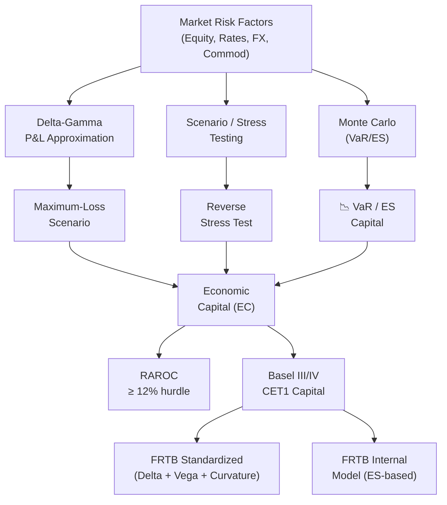

# 🌊 Market Risk

> [!abstract] TL;DR
> Market risk is the risk of loss from adverse movements in market prices — equity, interest rates, FX, and commodities. The measurement toolkit combines delta-gamma P&L approximation, scenario analysis, VaR/ES models, and stress tests. The Basel FRTB framework translates these into Tier 1 capital requirements, while RAROC links risk-adjusted returns to capital consumption.

## Intuition — Analogy First

Market risk is knowing your portfolio's **Achilles heel** — which market move, in which direction, would cause the most damage. A diversified equity portfolio fears a 1987-style crash (sudden 20% gap down). An interest rate book fears a parallel shift in the yield curve. A currency desk fears a flash crash in the USD/JPY.

Think of it like a structural engineer stress-testing a bridge. The engineer doesn't just ask "what's the average load?" — they ask "what is the maximum-credible load, in the worst-case direction, and does the bridge survive?" Market risk management asks the same: what is the worst plausible market move (the maximum-loss scenario), and is the firm's capital sufficient to absorb it?

The distinction between *normal* market risk (covered by VaR) and *tail* market risk (covered by stress tests and ES) mirrors the difference between sizing a building for daily weather versus a once-in-100-year hurricane. Both matter; only the tools and capital buffers differ.

---

## How It Works



---

## Key Concepts

### 1. Risk Factor Taxonomy

Market risk decomposes into four primary risk factor classes:

| Asset Class | Key Risk Factors | Typical Greek Sensitivities |
|---|---|---|
| Equity | Spot price, implied vol surface | Delta, Gamma, Vega |
| Interest Rates | Yield curve (parallel, tilt, curvature), vol surface | DV01, Convexity, Vega |
| FX | Spot rate, cross-currency basis | Delta (FX01), Vega |
| Commodities | Spot, futures curve, convenience yield | Delta, Roll, Vega |

### 2. Delta-Gamma P&L Approximation

For a portfolio with positions in $n$ risk factors $x = (x_1, \ldots, x_n)$, the P&L for a shift $\Delta x$ is:

$$\Delta P\&L \approx \underbrace{\delta^\top \Delta x}_{\text{delta (linear)}} + \underbrace{\frac{1}{2}\Delta x^\top \Gamma \Delta x}_{\text{gamma (convexity)}}$$

where:
- $\delta = \partial V / \partial x$ is the gradient (delta vector, e.g., DV01 for bonds)
- $\Gamma = \partial^2 V / \partial x \partial x^\top$ is the Hessian (gamma matrix)

For vanilla options this reduces to the standard Black-Scholes delta and gamma. For multi-asset books, $\Gamma$ captures cross-gammas between risk factors (e.g., how a rates move affects an FX option's P&L through cross-currency delta).

### 3. Maximum-Loss Scenario via Mahalanobis Constraint

Given a covariance matrix $\Sigma$ of risk factor changes, the **plausible scenario space** is the ellipsoid:

$$\Delta x^\top \Sigma^{-1} \Delta x \leq c^2$$

where $c$ controls the "how many sigma" boundary ($c = 2.326$ gives 99% for normals). The **maximum delta-loss scenario** — the direction of worst P&L within this ellipsoid — has the closed-form solution:

$$\Delta x^* = -c\,\frac{\Sigma\,\delta}{\sqrt{\delta^\top \Sigma\,\delta}}$$

This is the eigenvector of steepest descent constrained to the ellipsoid. The worst-case P&L is:

$$\Delta P\&L^* = -c\,\sqrt{\delta^\top \Sigma\,\delta}$$

which is exactly the parametric VaR formula for a delta-linear portfolio. For delta-gamma portfolios, the maximum-loss problem becomes a quadratic program (QP) and requires numerical solution.

### 4. Historical Stress Events

Understanding real tail events calibrates stress scenario severity:

| Event | Peak-to-Trough | Duration | Primary Impact |
|---|---|---|---|
| 1987 Black Monday | −22.6% (single day) | 1 day | Equity |
| 1998 LTCM / Russia | −19.3% (S&P Aug–Oct) | 3 months | Credit spreads, fixed income |
| 2001 Dot-Com / 9/11 | −49.1% (Nasdaq 2000–2002) | 2.5 years | Tech equity |
| 2008 GFC | −50% (S&P 2007–2009) | 17 months | Credit, equity, funding |
| 2010 Flash Crash | −9.2% intraday, recovered | 1 hour | Equity, microstructure |
| 2020 COVID (March) | −34% (S&P, 1 month) | 4 weeks | All asset classes |

Regulatory stress scenarios (BCBS), internal stress scenarios, and **hypothetical scenarios** (e.g., China hard-landing, EM currency crisis) are applied to mark the portfolio to stress P&L.

### 5. Reverse Stress Testing

Standard stress tests ask: "what is the P&L under scenario $S$?" Reverse stress tests invert the question: **"what is the minimum scenario that causes the firm to fail (e.g., capital < minimum regulatory requirement)?"**

Formally: find $\Delta x$ such that:
$$\Delta P\&L(\Delta x) = -L_{failure} \quad \text{subject to minimal scenario "plausibility"}$$

The plausibility metric is usually the Mahalanobis distance $\sqrt{\Delta x^\top \Sigma^{-1} \Delta x}$. Reverse stress testing is mandated by UK PRA and EBA guidelines and surfaces hidden concentrations that forward stress tests miss.

### 6. Economic Capital and Euler Allocation

**Economic Capital (EC)** is the capital a firm must hold to cover unexpected losses at the 99.9% confidence level over a 1-year horizon, minus expected losses:

$$EC = VaR_{99.9\%,\,1yr} - EL$$

**Marginal (Euler) EC** allocates total EC to business lines or positions using the conditional expectation:

$$MEC_i = \mathbb{E}\left[L_i \mid L_P = VaR_\alpha\right]$$

This is the expected loss of unit $i$ given that the portfolio loss equals the VaR threshold. Like Component [[Value_at_Risk]], $MEC_i$ components sum to total $EC$:

$$EC = \sum_i MEC_i$$

In practice, $MEC_i$ is estimated by the average contribution of position $i$ across scenarios near the VaR quantile.

### 7. RAROC — Risk-Adjusted Return on Capital

RAROC standardises performance across business lines by normalising revenue by risk-adjusted capital consumption:

$$RAROC = \frac{(\text{Revenue} - EL - \text{Operating Cost})(1 - \tau)}{EC} \geq 12\%$$

where $\tau$ is the effective tax rate. The **12% hurdle rate** (approximately the equity cost of capital for a large bank) separates value-creating from value-destroying activities. A desk with high revenue but also high EC may have lower RAROC than a seemingly smaller desk that uses capital efficiently.

RAROC drives strategic capital allocation: desks below the hurdle rate should reduce risk, reprice products, or be wound down.

### 8. Basel III/IV Capital Requirements

The Basel framework mandates minimum capital ratios for banks:

| Capital Tier | Definition | Minimum (G-SIBs) |
|---|---|---|
| CET1 (Core) | Common equity + retained earnings | ~10–12% |
| Tier 1 | CET1 + AT1 (hybrid instruments) | ~12% |
| Total Capital | Tier 1 + Tier 2 (subordinated debt) | ~14–16% |
| Leverage Ratio | Tier 1 / Total Exposure | ≥3% |

G-SIBs (Globally Systemically Important Banks) must hold additional CET1 buffers (0.5–3.5%) calibrated to systemic importance score.

### 9. FRTB Sensitivities-Based Method (SBM)

The FRTB Standardized Approach uses a **Sensitivities-Based Method** where capital $K_{SBM}$ = delta capital + vega capital + curvature capital:

$$K_{delta} = \sqrt{\left[\sum_b\left(\sum_k S_{k}\right)^2 + \sum_{b \neq b'}\gamma_{bb'}\sum_k S_k \sum_{k'} S_{k'}\right]}$$

where $S_k = RW_k \cdot s_k$ are risk-weighted sensitivities, $RW_k$ are prescribed risk weights, and $\gamma_{bb'}$ are regulatory correlation parameters across buckets $b$.

**Curvature capital** captures second-order (gamma) effects not covered by the linear delta capital and is computed as a stressed P&L for prescribed up/down shifts.

---

## Python Example

```python
import numpy as np
from scipy.optimize import minimize

# ── Delta-Gamma P&L ────────────────────────────────────────────────────────
def pnl_delta_gamma(delta: np.ndarray, gamma: np.ndarray,
                    dx: np.ndarray) -> float:
    """Approximate P&L for risk factor shift dx."""
    return float(delta @ dx + 0.5 * dx @ gamma @ dx)

# ── Maximum-Loss Scenario (delta-only) ────────────────────────────────────
def max_loss_scenario_delta(delta: np.ndarray, cov: np.ndarray,
                             c: float = 2.326) -> tuple:
    """Closed-form worst-case scenario for linear portfolio.
    Returns (scenario dx, worst-case P&L)."""
    sig_delta = cov @ delta
    sigma_p   = np.sqrt(delta @ cov @ delta)
    dx_star   = -c * sig_delta / sigma_p
    worst_pnl = float(delta @ dx_star)            # = -c * sigma_p
    return dx_star, worst_pnl

# ── Maximum-Loss Scenario (delta-gamma, QP) ────────────────────────────────
def max_loss_scenario_qp(delta: np.ndarray, gamma: np.ndarray,
                          cov: np.ndarray, c: float = 2.326,
                          n_restarts: int = 20) -> tuple:
    """Numerical max-loss for delta-gamma portfolio."""
    cov_inv = np.linalg.inv(cov)
    n = len(delta)
    best_pnl, best_dx = np.inf, None
    for _ in range(n_restarts):
        x0 = np.random.randn(n)
        x0 /= np.sqrt(x0 @ cov_inv @ x0 / c**2)
        res = minimize(
            fun=lambda dx: pnl_delta_gamma(delta, gamma, dx),
            x0=x0,
            constraints={'type': 'ineq',
                         'fun': lambda dx: c**2 - dx @ cov_inv @ dx},
            method='SLSQP'
        )
        if res.success and res.fun < best_pnl:
            best_pnl, best_dx = res.fun, res.x
    return best_dx, best_pnl

# ── Scenario P&L for Historical Stress Events ─────────────────────────────
def scenario_pnl(delta: np.ndarray, scenarios: dict[str, np.ndarray],
                 gamma: np.ndarray = None) -> dict:
    results = {}
    for name, dx in scenarios.items():
        pnl = float(delta @ dx)
        if gamma is not None:
            pnl += 0.5 * float(dx @ gamma @ dx)
        results[name] = pnl
    return results

# ── Demo ───────────────────────────────────────────────────────────────────
np.random.seed(7)
n_factors = 4  # e.g., S&P, 10y UST, EUR/USD, Oil
delta = np.array([50_000, -20_000, 15_000, -8_000])  # USD sensitivities
gamma_diag = np.array([500, 200, 100, 50])
gamma = np.diag(gamma_diag)

# Annualised daily vol (%) → covariance
vols = np.array([0.01, 0.005, 0.007, 0.015])
corr = np.array([[1.0,  -0.3,  0.2,  0.5],
                 [-0.3,  1.0, -0.1, -0.2],
                 [0.2,  -0.1,  1.0,  0.3],
                 [0.5,  -0.2,  0.3,  1.0]])
cov = np.outer(vols, vols) * corr

dx_star, worst_linear = max_loss_scenario_delta(delta, cov)
print("Maximum-loss scenario (delta-only):")
for i, v in enumerate(dx_star):
    print(f"  Factor {i+1}: {v*100:.3f}%")
print(f"Worst-case P&L (linear): ${worst_linear:,.0f}")

dx_qp, worst_qp = max_loss_scenario_qp(delta, gamma, cov)
print(f"\nWorst-case P&L (delta-gamma QP): ${worst_qp:,.0f}")

# Historical scenarios
scenarios = {
    "Black Monday 1987": np.array([-0.226, 0.02, 0.01, -0.08]),
    "GFC 2008 (-50%)":   np.array([-0.50,  0.03, 0.05, -0.60]),
    "COVID March 2020":  np.array([-0.34,  0.04, 0.03, -0.55]),
}
spnls = scenario_pnl(delta, scenarios, gamma)
print("\nHistorical stress P&L:")
for name, pnl in spnls.items():
    print(f"  {name}: ${pnl:,.0f}")
```

---

## Real-World Notes

- **Intraday VaR vs overnight risk:** Trading desks run real-time intraday VaR (often 1-day, 95%) for limit monitoring, and overnight 10-day 99% VaR for regulatory capital. Intraday breaches trigger escalation but do not directly affect capital.
- **Correlation collapse in stress:** Normal-period correlations understate risk in crises. During GFC, equity correlations spiked to >0.9; cross-asset diversification disappeared precisely when needed. Stressed covariance matrices (from 2007–2009) are essential.
- **Model risk:** The P&L explained (PLA) test under FRTB requires that the risk model's theoretical P&L closely tracks the hypothetical P&L from full revaluation. Desks failing PLA must switch to the Standardized Approach, which typically requires 1.5–2× more capital.
- **Sensitivity to vol-of-vol:** Vega P&L depends on implied vol moves; but implied vol itself can gap. Vanna (dVega/dSpot) and Volga (dVega/dVol) measure second-order vol sensitivities that matter for exotic options desks.

---

## Common Pitfalls

- **Linear approximation for large moves:** Delta-gamma approximation breaks down for large shifts (>5%) or for products with discontinuous payoffs (digitals, barriers). Full revaluation is required for stress tests.
- **Ignoring cross-gamma:** Setting $\Gamma$ to a diagonal matrix misses cross-risk-factor convexity. For a multi-asset correlation trade, cross-gammas are often the dominant risk.
- **Static scenario library:** Stress scenarios built from historical events become stale. New risks (cyber, AI, climate, geopolitical) require hypothetical scenarios expert-designed, not just historical replays.
- **RAROC denominator choices:** Using VaR instead of EC, or 1-day instead of 1-year horizon, can make RAROC look misleadingly high for desks that earn carry in quiet regimes but implode in stress.

---

## Related Concepts

- [[Value_at_Risk]] — the quantile measure underlying market risk capital
- [[Expected_Shortfall]] — FRTB capital standard; replaces VaR in IMA
- [[Credit_Risk]] — counterparty credit risk (CVA) sits at the boundary of market and credit risk
- [[Operational_Risk]] — three pillars of Basel capital: market + credit + operational

---

## Review Questions

1. Derive the maximum-loss scenario formula $\Delta x^* = -c\,\Sigma\delta / \sqrt{\delta^\top\Sigma\delta}$ using Lagrange multipliers on the Mahalanobis constraint. What does the formula imply about the relationship between the worst-case market move and the portfolio's risk factor exposures?
2. A desk has annualised RAROC of 9% against a 12% hurdle rate. The desk's revenue is stable but its EC is high due to a large concentrated equity position. Describe two specific strategies to bring RAROC above the hurdle rate without simply increasing revenue.
3. Under Basel FRTB, what are the two tests a trading desk must pass to qualify for the Internal Model Approach, and what happens if it fails either one?

---

## Sources

- Basel Committee on Banking Supervision. *Minimum Capital Requirements for Market Risk* (FRTB, 2019).
- Roncalli, T. *Handbook on Financial Risk Management* (2020). Chapters 3–5.
- Glasserman, P. *Monte Carlo Methods in Financial Engineering* (2003). Chapter 9.
- McNeil, A., Frey, R., Embrechts, P. *Quantitative Risk Management* (2nd ed., 2015). Chapters 3–4.
- Mahalanobis, P.C. "On the Generalised Distance in Statistics." *Proceedings of the National Institute of Sciences of India* 2(1), 1936.

#quantitative-finance #risk-management #advanced #market-risk #FRTB #delta-gamma #RAROC #Basel
