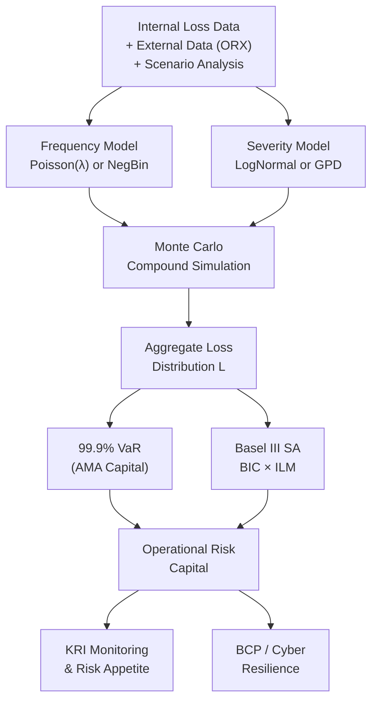

# ⚙️ Operational Risk

> [!abstract] TL;DR
> Operational risk is the risk of loss from failed or inadequate internal processes, people, systems, or external events. Unlike [[Market_Risk]] and [[Credit_Risk]], it cannot be hedged in markets — it must be managed through controls, insurance, and capital buffers. The Loss Distribution Approach (LDA) models aggregate operational losses via compound distributions, and Basel capital is determined at the 99.9% VaR of that distribution.

## Intuition — Analogy First

Operational risk is like the risk of your house **burning down despite a perfect financial plan**. You could have a perfectly optimised investment portfolio, zero credit exposure, and fully hedged market risk — and then a rogue employee causes a $440M loss in 45 minutes (Knight Capital, 2012). No financial model predicts that; no hedge prevents it.

The analogy extends further: fire risk in a house is rare but potentially catastrophic, driven by a combination of **how often fires start** (frequency) and **how big they get** (severity). The Loss Distribution Approach mirrors this: model the *number* of operational loss events (frequency distribution) and the *size* of each event (severity distribution) separately, then combine them to get the aggregate loss distribution. Capital is the 99.9th percentile of that distribution — the amount that covers all but the most extreme 0.1% of years.

What makes operational risk unique is the **data problem**: severe tail events are so rare that a single bank may see only 2–3 per decade. This forces practitioners to supplement internal loss data with external data (ORX consortium), scenario analysis (expert elicitation), and Bayesian updating — a modelling challenge unlike anything in market or credit risk.

---

## How It Works



---

## Key Concepts

### 1. Definition and Basel 7 Event Categories

The Basel II definition: "the risk of loss resulting from inadequate or failed internal processes, people and systems or from external events" — this includes legal risk but excludes strategic and reputational risk.

Basel II mandated seven **event type categories** for operational loss data collection:

| # | Category | Examples |
|---|---|---|
| 1 | Internal Fraud | Rogue trading, embezzlement, unauthorised positions |
| 2 | External Fraud | Phishing attacks, cybercrime, third-party theft |
| 3 | Employment Practices & Workplace Safety | Discrimination claims, health & safety violations |
| 4 | Clients, Products & Business Practices | Mis-selling, market manipulation, AML failures |
| 5 | Damage to Physical Assets | Natural disasters, terrorism, fire |
| 6 | Business Disruption & System Failures | IT outages, software bugs, exchange connectivity loss |
| 7 | Execution, Delivery & Process Management | Trade booking errors, settlement failures, data errors |

The largest historical losses by value tend to cluster in categories 1 (rogue trading), 4 (mis-selling / conduct), and 2 (external fraud/cyber).

### 2. Loss Distribution Approach (LDA)

LDA models aggregate operational loss $L = \sum_{i=1}^N X_i$ as a **compound distribution**:

- **Frequency:** $N \sim \text{Poisson}(\lambda)$ (expected events per year), or **Negative Binomial** $(\mu, r)$ if overdispersed ($\text{Var}(N) > \mathbb{E}[N]$).
- **Severity:** Each loss $X_i$ is an i.i.d. draw from a severity distribution. Common choices:
  - **LogNormal$(\mu, \sigma^2)$**: light tail, good for medium-severity losses. $\mathbb{E}[X] = e^{\mu + \sigma^2/2}$
  - **GPD (Generalised Pareto Distribution)**: heavy tail, required for rare catastrophic losses above a threshold.

The aggregate loss $L = X_1 + X_2 + \cdots + X_N$ has no closed-form CDF in general — Monte Carlo simulation is the standard approach.

**For Poisson-LogNormal:** moment approximations via Panjer recursion or FFT can compute the aggregate distribution semi-analytically, but Monte Carlo is more flexible and transparent.

### 3. Generalised Pareto Distribution (GPD) Tail Estimation

For losses exceeding a high threshold $u$ (Extreme Value Theory):

$$P(X > u + x \mid X > u) \approx \left(1 + \frac{\xi\,x}{\beta}\right)^{-1/\xi}$$

where:
- $\xi > 0$: shape parameter (heavier tail for larger $\xi$; for $\xi \geq 1$, mean is infinite)
- $\beta > 0$: scale parameter
- $u$: threshold (chosen via mean excess plot, around 90th–95th percentile of severity)

**Mean Excess Function:** $e(u) = \mathbb{E}[X - u \mid X > u]$. For GPD: $e(u) = (\beta + \xi u)/(1-\xi)$ (linear in $u$). Plotting sample mean excess vs $u$ and looking for the linear region guides threshold selection.

Parameters $(\xi, \beta)$ are estimated by MLE on exceedances. The GPD tail is spliced onto a parametric body (e.g., LogNormal below $u$) to form a **spliced severity model**.

### 4. Regulatory Capital: AMA vs Basel III SA

**Advanced Measurement Approach (AMA) — Basel II:**
- Banks with robust internal models could use their own 99.9% 1-year VaR of the aggregate loss distribution as operational risk capital.
- Required four data elements: internal loss data, external loss data, scenario analysis, business environment & internal control factors (BEICFs).
- Introduced 2004; criticised for excessive model variability across banks (same risk, very different capital).

**Basel III Standardised Approach (SA) — Effective 2023:**
- Replaced AMA with a single non-model-based formula to reduce variability.
- Capital = **Business Indicator Component (BIC)** × **Internal Loss Multiplier (ILM)**

$$BIC = \sum_i \alpha_i \cdot BI_i$$

where Business Indicator (BI) = Interest, Lease, & Dividend component + Services component + Financial component, and $\alpha_i$ are marginal coefficients (12%, 15%, 18% for three BI buckets).

$$ILM = \ln\!\left(e^1 - 1 + \left(\frac{10yr\text{ Average Losses}}{BIC}\right)^{0.8}\right)$$

Banks with higher loss history pay more capital than peers with similar revenues — a direct loss-sensitisation mechanism.

### 5. Scenario Analysis

Scenario analysis fills the **data gap** for tail events: rare, severe losses that have never occurred internally. Expert panels (front office, risk, legal, operations) estimate:
- **Frequency:** How many times per decade could this occur?
- **Severity:** What is the expected loss? What is the maximum plausible loss (99th percentile)?

Bayesian updating combines expert scenarios with internal loss data:

$$\pi_{posterior}(\lambda) \propto L(\text{data} \mid \lambda) \times \pi_{prior}(\lambda)$$

For Poisson-Gamma conjugate: if prior is $\text{Gamma}(a, b)$ and observed $N$ events in $T$ years, posterior is $\text{Gamma}(a+N, b+T)$. Expert opinion sets the Gamma hyperparameters; loss data updates them.

### 6. Key Risk Indicators (KRIs) and Risk Appetite

KRIs are forward-looking metrics that signal emerging operational risk before it crystallises into losses:

| KRI | Category | Threshold Signal |
|---|---|---|
| Number of unresolved audit findings | Process | >50 open items |
| IT system downtime (hours/month) | Systems | >4 hours |
| Staff turnover in control functions | People | >20% annual |
| Failed trades ratio | Execution | >0.5% of volume |
| Cyber vulnerability patches outstanding | External | >30 days |

The **risk appetite framework** defines tolerance levels: indicators in the "amber" zone trigger management action; "red" triggers escalation to the Board.

### 7. High-Profile Case Studies

| Firm | Year | Loss | Event Type | Root Cause |
|---|---|---|---|---|
| Barings Bank | 1995 | \$1.4B | Internal Fraud (Cat 1) | Nick Leeson — unauthorised futures speculation in Nikkei; no segregation of duties |
| Société Générale | 2008 | \$7.2B | Internal Fraud (Cat 1) | Jérôme Kerviel — concealed €50B directional equity index positions for months |
| JPMorgan London Whale | 2012 | \$6.2B | Clients/Products (Cat 4) | Bruno Iksil — CDS index portfolio exceeded VaR limits; model error masked risk |
| Knight Capital | 2012 | \$440M | Execution (Cat 7) | Accidental deployment of legacy trading algorithm; 45 minutes of automated erroneous trades |
| Wells Fargo | 2016–20 | \$3B+ settlement | Clients/Products (Cat 4) | Fake accounts scandal; 3.5M unauthorised accounts opened; systemic incentive failure |

These cases illustrate that the **largest operational losses** tend to involve complex combinations of control failure, inadequate oversight, and perverse incentives — not simple accidents.

### 8. Business Continuity Planning (BCP) and Cyber Risk

BCP ensures critical business functions can continue through disruption (natural disaster, pandemic, system failure). Key components:
- Recovery Time Objective (RTO): maximum acceptable downtime.
- Recovery Point Objective (RPO): maximum acceptable data loss.
- Backup processing sites: hot site (immediate failover), warm site (hours), cold site (days).

**Cyber risk** has become the dominant emerging operational risk:
- Ransomware attacks targeting financial infrastructure (e.g., ION Trading 2023 disrupted derivatives clearing).
- Third-party/supply-chain risk: concentration in cloud providers (AWS, Azure) creates single points of failure.
- Basel BCBS 239 (risk data aggregation) and DORA (EU 2025) impose IT resilience standards.

---

## Python Example

```python
import numpy as np
from scipy import stats

# ── Compound Loss Simulation (Poisson-LogNormal) ──────────────────────────
def simulate_aggregate_loss(
    lambda_freq: float,
    lognorm_mu: float,
    lognorm_sigma: float,
    n_simulations: int = 100_000,
    seed: int = 42,
) -> np.ndarray:
    """Simulate aggregate annual operational loss via Monte Carlo."""
    rng = np.random.default_rng(seed)
    freq = rng.poisson(lambda_freq, size=n_simulations)
    total_events = freq.sum()
    # Sample all severity values at once (efficient)
    log_losses = rng.normal(lognorm_mu, lognorm_sigma, size=total_events)
    severities = np.exp(log_losses)
    # Aggregate: assign events to each simulation
    agg_losses = np.zeros(n_simulations)
    idx = 0
    for i, n in enumerate(freq):
        agg_losses[i] = severities[idx:idx+n].sum()
        idx += n
    return agg_losses

# ── GPD Tail Fitting ───────────────────────────────────────────────────────
def fit_gpd_tail(losses: np.ndarray, threshold_quantile: float = 0.90):
    """Fit GPD to exceedances above threshold."""
    u = np.quantile(losses, threshold_quantile)
    exceedances = losses[losses > u] - u
    # MLE via scipy
    shape, loc, scale = stats.genpareto.fit(exceedances, floc=0)
    return {"threshold": u, "xi": shape, "beta": scale,
            "n_exceedances": len(exceedances)}

# ── VaR and ES from Simulated Loss Distribution ───────────────────────────
def loss_quantiles(agg_losses: np.ndarray, alpha: float = 0.999) -> dict:
    var = np.quantile(agg_losses, alpha)
    es  = agg_losses[agg_losses > var].mean()
    return {"VaR_99.9": var, "ES_99.9": es,
            "Mean": agg_losses.mean(), "Std": agg_losses.std()}

# ── Basel III SA: Business Indicator Component ────────────────────────────
def bic_capital(bi: float, avg_losses_10yr: float) -> dict:
    """Simplified Basel III SA. bi in USD millions."""
    if bi <= 1_000:
        bic = 0.12 * bi
    elif bi <= 30_000:
        bic = 120 + 0.15 * (bi - 1_000)
    else:
        bic = 120 + 4_350 + 0.18 * (bi - 30_000)
    ratio = avg_losses_10yr / bic if bic > 0 else 0
    ilm = np.log(np.e - 1 + ratio**0.8)
    capital = bic * ilm
    return {"BIC": bic, "ILM": ilm, "SA_Capital": capital}

# ── Demo ───────────────────────────────────────────────────────────────────
# Simulate: 20 events/yr, LogNormal severity (mean ~$500K, heavy tail)
lognorm_mu    = 12.5   # ln($500K) ≈ 13.1; calibrate to desired mean
lognorm_sigma = 2.0    # heavy tail
lambda_freq   = 20     # expected events per year

agg = simulate_aggregate_loss(lambda_freq, lognorm_mu, lognorm_sigma)
q   = loss_quantiles(agg)

print("Aggregate Loss Distribution (Poisson-LogNormal):")
print(f"  Mean Annual Loss  : ${q['Mean']:,.0f}")
print(f"  StdDev            : ${q['Std']:,.0f}")
print(f"  99.9% VaR (capital): ${q['VaR_99.9']:,.0f}")
print(f"  99.9% ES          : ${q['ES_99.9']:,.0f}")

# GPD tail fit
gpd = fit_gpd_tail(agg, threshold_quantile=0.95)
print(f"\nGPD Tail (threshold={gpd['threshold']:,.0f}):")
print(f"  Shape ξ = {gpd['xi']:.3f}, Scale β = {gpd['beta']:,.0f}")
print(f"  Exceedances: {gpd['n_exceedances']} / {len(agg)}")

# Basel III SA
bic_res = bic_capital(bi=5_000, avg_losses_10yr=50)  # BI=$5B, avg losses=$50M
print(f"\nBasel III SA Capital: ${bic_res['SA_Capital']:.1f}M "
      f"(BIC={bic_res['BIC']:.1f}M, ILM={bic_res['ILM']:.3f})")
```

---

## Real-World Notes

- **ORX (Operational Riskdata eXchange):** Industry consortium of 100+ banks that pool anonymised operational loss data to overcome the internal data scarcity problem. Members contribute their losses above €20K and receive aggregated external benchmarks.
- **Basel III SA implementation (2023):** The AMA was formally retired. Banks with loss-intensive histories (category 4 conduct risk) saw capital requirements increase substantially vs AMA; banks with better loss records saw decreases.
- **Climate and ESG operational risk:** Regulators (ECB, PRA, OSFI) now expect banks to incorporate climate physical risk (floods, extreme weather damaging infrastructure) and transition risk (litigation, stranded-asset write-downs) into scenario analysis.
- **Model risk as operational risk:** Model errors that cause material losses (e.g., London Whale's VaR model change that halved reported VaR) are classified under Category 4 or 7 operational risk events in loss databases.

---

## Common Pitfalls

- **Fitting parametric bodies to the whole severity distribution:** Fitting a single LogNormal or Weibull to all losses conflates body and tail dynamics. The body is well-described by LogNormal; the tail requires GPD. Always splice.
- **Too low a threshold for GPD:** Including too many observations in the tail fit biases the GPD estimate. Use the mean excess plot to identify the threshold where the tail is "asymptotically GPD."
- **Ignoring dependence between business lines:** LDA typically fits independent frequency-severity models per business line and event type, then sums for total capital. If severe events are correlated across lines (e.g., a cyber attack hits multiple units simultaneously), simple summation understates capital.
- **Scenario bias:** Expert scenario estimates are subject to anchoring, availability bias, and overconfidence. Structured facilitation and calibration against external data are essential to elicit reliable probability judgements.
- **Confusing EL with capital:** Economic capital covers **unexpected** losses (the tail beyond the mean). Expected operational losses should be **priced into products** and recovered through revenue — not funded by capital.

---

## Related Concepts

- [[Value_at_Risk]] — operational risk capital uses 99.9% VaR of aggregate loss distribution
- [[Expected_Shortfall]] — ES at 99.9% is a more coherent alternative to VaR for operational capital
- [[Market_Risk]] — third Basel pillar; operational risk capital sits alongside market and credit capital
- [[Credit_Risk]] — Basel SA replaces AMA; similar regulatory standardisation trend across pillars

---

## Review Questions

1. A bank estimates 15 operational loss events per year (Poisson) with LogNormal severity (mean \$1M, std \$3M). Explain why the 99.9% VaR of the aggregate loss distribution is dramatically larger than 15 × \$1M, and how the severity distribution's tail determines the capital requirement.
2. Contrast the AMA and Basel III SA approaches to operational risk capital. What are the theoretical advantages of AMA and the practical advantages of SA that motivated the switch?
3. The Knight Capital failure ($440M in 45 minutes) is classified under Basel event type 7 (Execution, Delivery & Process Management). What specific internal controls — if in place — would have prevented or limited this loss? Map each control to a KRI that could have provided early warning.

---

## Sources

- Basel Committee on Banking Supervision. *Sound Practices for the Management and Supervision of Operational Risk* (2011).
- Basel Committee on Banking Supervision. *Basel III: Finalising Post-Crisis Reforms* (Basel IV, 2017) — SA for Operational Risk.
- Cruz, M. *Modeling, Measuring and Hedging Operational Risk* (2002).
- Embrechts, P., Klüppelberg, C., Mikosch, T. *Modelling Extremal Events* (1997) — EVT/GPD.
- McNeil, A., Frey, R., Embrechts, P. *Quantitative Risk Management* (2nd ed., 2015). Chapter 13.
- Patterson, S. *Dark Pools* (2012); Lewis, M. *Flash Boys* (2014) — narrative context for execution risk.

#quantitative-finance #risk-management #intermediate #operational-risk #LDA #GPD #Basel #BCP
