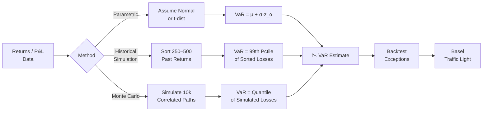

# 📉 Value at Risk

> [!abstract] TL;DR
> Value at Risk ($VaR_\alpha$) is the $\alpha$-quantile of the portfolio loss distribution: the threshold loss that is exceeded only $(1-\alpha)$% of the time. It answers "how much can I lose on a bad day?" but says nothing about *how bad* the worst days are — that gap is addressed by [[Expected_Shortfall]].

## Intuition — Analogy First

Think of VaR like checking the **flood level of a river** at the 99th percentile of historical annual maxima. The 99% VaR says: in 99 out of 100 years, the water will not exceed this mark. You build your levees to that height. But what happens in the 1 in 100 year flood? The levee offers zero information — the river might be 1 cm over or 10 metres over. VaR is silent about the severity of tail events; it only demarcates where the tail begins.

Another framing: a bank's 1-day 99% VaR of \$10M means "we are 99% confident we will not lose more than \$10M tomorrow." On any given trading day there is a 1% chance (roughly 2.5 days per year) that losses exceed \$10M. Whether those exceedance days average \$11M or \$50M in losses is irrelevant to VaR — which is precisely its most dangerous blind spot, corrected by [[Expected_Shortfall]].

VaR became the industry standard post-J.P. Morgan's RiskMetrics (1994) and is embedded in Basel II/III market risk capital rules. Its appeal is communicability: one number, one horizon, one confidence level. Its weakness is that it is not a **coherent risk measure** — specifically, it fails sub-additivity.

---

## How It Works



---

## Key Concepts

### 1. Formal Definition

For a loss random variable $L$ with CDF $F_L$, the VaR at confidence level $\alpha$ is:

$$VaR_\alpha = F_L^{-1}(\alpha) = \inf\{l : F_L(l) \geq \alpha\}$$

Common conventions: $\alpha = 0.99$ (Basel II trading book), $\alpha = 0.999$ (Basel II banking book), 1-day or 10-day horizon.

### 2. Parametric (Normal) VaR

Assuming portfolio returns are normally distributed with mean $\mu_P$ and volatility $\sigma_P$ over horizon $h$ days:

$$VaR = -\mu_P h + \sigma_P\sqrt{h}\,z_\alpha$$

where $z_\alpha = \Phi^{-1}(\alpha)$ is the standard normal quantile ($z_{0.99} \approx 2.326$, $z_{0.95} \approx 1.645$).

**Cornish-Fisher expansion** adjusts $z_\alpha$ for skewness $\gamma_1$ and excess kurtosis $\gamma_2$:

$$z_{CF} = z_\alpha + \frac{z_\alpha^2 - 1}{6}\gamma_1 + \frac{z_\alpha^3 - 3z_\alpha}{24}\gamma_2 - \frac{2z_\alpha^3 - 5z_\alpha}{36}\gamma_1^2$$

This is critical for options portfolios where returns are far from normal.

### 3. Component VaR — Euler Decomposition

For a portfolio of positions with weights $w_i$, the **Component VaR** of position $i$ is its marginal contribution to portfolio VaR, obtained via Euler's homogeneity theorem:

$$CVaR_i = \rho_{i,P}\,\sigma_i\,w_i\,z_\alpha$$

where $\rho_{i,P}$ is the correlation of asset $i$ with the portfolio. Component VaRs sum exactly to total portfolio VaR:

$$VaR_P = \sum_i CVaR_i$$

This additivity makes Component VaR the standard tool for risk budgeting and limit-setting.

### 4. Historical Simulation (HS)

The simplest non-parametric approach:
1. Collect $T$ (typically 250–500) daily P&L observations.
2. Rank losses from largest to smallest.
3. Take the $(1-\alpha)\cdot T$-th worst loss as the VaR estimate.

For 250 observations at 99%: VaR = the 2nd or 3rd worst loss (2.5th percentile).

**BRW (Boudoukh-Richardson-Whitelaw) age-weighting:** assign exponentially decaying weights $w_t \propto \lambda^{T-t}$ (typically $\lambda = 0.99$) so recent observations receive more weight. Solves the "ghost effect" where a crisis from 2 years ago falls out of the window abruptly.

**Hull-White Filtered HS:** scale each historical return by the ratio of current volatility to the volatility at the time of observation:

$$\tilde{r}_t = r_t \cdot \frac{\hat{\sigma}_{today}}{\hat{\sigma}_t}$$

This rescaled series captures current volatility dynamics while preserving empirical fat tails.

### 5. Monte Carlo VaR

1. Estimate the covariance matrix $\Sigma$ of asset returns.
2. Cholesky-decompose: $\Sigma = LL^\top$.
3. Simulate $n$ scenarios: $\Delta x^{(k)} = L\,z^{(k)}$ where $z^{(k)} \sim \mathcal{N}(0,I)$.
4. Compute P&L for each scenario; take the $\alpha$-quantile.

For fatter tails, replace normal draws with **t-copula** draws — draw $u^{(k)}$ from a t-distribution with $\nu$ degrees of freedom, then map through marginal CDFs.

### 6. Scaling Rule

$$VaR_{10d} = VaR_{1d}\,\sqrt{10}$$

This square-root-of-time scaling assumes **i.i.d. daily returns** and no serial correlation. In practice it overestimates VaR for mean-reverting assets and underestimates for trending/persistent ones. Basel II mandated this scaling for convenience; Basel IV encourages direct 10-day simulation.

### 7. VaR is NOT Coherent

A coherent risk measure must satisfy: monotonicity, translation invariance, positive homogeneity, and **sub-additivity**. VaR fails sub-additivity:

$$VaR_\alpha(A + B) \leq VaR_\alpha(A) + VaR_\alpha(B) \quad \text{(NOT always true)}$$

Classic counterexample: two uncorrelated digital options each with 0.6% default probability. Individual 99% VaR = 0 (each has <1% chance of loss). Combined portfolio 99% VaR > 0 (joint loss probability exceeds 1%). Diversification appears to *increase* risk — a regulatory absurdity. [[Expected_Shortfall]] is sub-additive and thus coherent.

### 8. Backtesting

**Kupiec Unconditional Coverage (UC) Test:**

$$LR_{UC} = 2\ln\!\left[(1-p)^{T-N}p^N\right] - 2\ln\!\left[(1-\hat{p})^{T-N}\hat{p}^N\right]$$

Under $H_0: p = 1-\alpha$, $LR_{UC} \sim \chi^2(1)$. Here $N$ = number of VaR exceptions in $T$ days.

**Christoffersen Test** adds the **independence** component — exceptions should not cluster (violations on consecutive days signal autocorrelated errors in the model):

$$LR_{CC} = LR_{UC} + LR_{ind} \sim \chi^2(2)$$

**Basel Traffic Light:**
| Exceptions (250-day) | Zone | Capital Multiplier |
|---|---|---|
| 0–4 | Green | 3.0× |
| 5–9 | Yellow | 3.4×–3.85× |
| 10+ | Red | 4.0× |

---

## Python Example

```python
import numpy as np
import pandas as pd
from scipy import stats

# ── Historical Simulation VaR ──────────────────────────────────────────────
def historical_var(returns: np.ndarray, alpha: float = 0.99) -> float:
    """1-day Historical Simulation VaR at confidence alpha.
    Returns a positive number (loss convention)."""
    return float(np.quantile(-returns, alpha))

# ── Parametric Normal VaR ──────────────────────────────────────────────────
def parametric_var(returns: np.ndarray, alpha: float = 0.99,
                   horizon: int = 1) -> float:
    mu = returns.mean() * horizon
    sigma = returns.std(ddof=1) * np.sqrt(horizon)
    z = stats.norm.ppf(alpha)
    return float(-mu + sigma * z)

# ── Kupiec Backtest ────────────────────────────────────────────────────────
def kupiec_test(returns: np.ndarray, var_series: np.ndarray,
                alpha: float = 0.99):
    """Kupiec UC test. returns and var_series must be aligned."""
    exceptions = (-returns > var_series)
    N, T = exceptions.sum(), len(returns)
    p_hat = N / T
    p_null = 1 - alpha
    if N == 0 or N == T:
        return None, None
    lr_uc = 2 * (N * np.log(p_hat / p_null) +
                 (T - N) * np.log((1 - p_hat) / (1 - p_null)))
    p_value = 1 - stats.chi2.cdf(lr_uc, df=1)
    return lr_uc, p_value

# ── Demo ───────────────────────────────────────────────────────────────────
np.random.seed(42)
returns = np.random.standard_t(df=5, size=500) * 0.01  # fat-tailed returns

hs_var   = historical_var(returns)
norm_var = parametric_var(returns)

print(f"Historical Sim VaR (99%): {hs_var:.4f}")
print(f"Parametric Normal VaR (99%): {norm_var:.4f}")

# Rolling 250-day backtest
window = 250
var_series = np.array([
    historical_var(returns[i:i+window]) for i in range(len(returns) - window)
])
test_returns = returns[window:]
lr, pval = kupiec_test(test_returns, var_series)
exceptions = (-test_returns > var_series).sum()
print(f"\nBacktest: {exceptions} exceptions out of {len(test_returns)} days")
print(f"Kupiec LR = {lr:.3f}, p-value = {pval:.3f}")
```

---

## Real-World Notes

- **Basel II** required banks to hold capital = $\max(VaR_{t-1}, \frac{1}{60}\sum_{i=1}^{60}VaR_{t-i}) \times$ multiplier (3–4×).
- **RiskMetrics (1994):** J.P. Morgan's EWMA variance with $\lambda=0.94$ daily — still widely used as a fast parametric VaR.
- **Stressed VaR (SVaR):** Basel 2.5 added a second VaR computed on a stressed historical window (e.g., 2007–2009 GFC), doubling capital requirements.
- The **ghost effect** in plain HS: a large loss from exactly 250 days ago drops out of the window on day 251, causing VaR to drop sharply despite no new information.

---

## Common Pitfalls

- **Assuming normality for options books:** Delta-normal VaR misses the convexity of options entirely. Always use full revaluation or at minimum delta-gamma.
- **Ignoring serial correlation:** The $\sqrt{h}$ scaling breaks down for autocorrelated returns (trending or mean-reverting strategies).
- **VaR as a standalone limit:** A desk that optimises to the VaR constraint may load up on tail risk that barely shows in the 99% number (e.g., short OTM puts).
- **Overfitting in parametric models:** Using too many parameters for the return distribution increases estimation error, especially in small samples.
- **Conflating 1-day and 10-day horizons:** Regulatory 10-day VaR is for capital; 1-day VaR is for daily P&L management. Do not mix.

---

## Related Concepts

- [[Expected_Shortfall]] — coherent extension of VaR; averages losses beyond the VaR threshold
- [[Market_Risk]] — applies VaR/ES to specific risk factor classes
- [[Credit_Risk]] — 99.9% 1-year VaR underpins Economic Capital
- [[Operational_Risk]] — 99.9% VaR on compound loss distribution

---

## Review Questions

1. Two uncorrelated bonds each have a 0.6% annual default probability and a 100% LGD. Compute the 99% 1-year VaR for each bond individually, and then for the combined portfolio. What does this reveal about VaR sub-additivity?
2. Explain why the Hull-White filtered historical simulation is superior to plain historical simulation for a portfolio whose volatility has recently spiked.
3. A bank records 8 VaR exceptions in a 250-day backtest at 99% confidence. Where does this fall on the Basel traffic light? What is the qualitative implication for regulatory capital?

---

## Sources

- J.P. Morgan. *RiskMetrics Technical Document* (4th ed., 1996).
- Jorion, P. *Value at Risk: The New Benchmark for Managing Financial Risk* (3rd ed., 2007).
- Basel Committee on Banking Supervision. *Minimum Capital Requirements for Market Risk* (FRTB, 2019).
- Christoffersen, P. "Evaluating Interval Forecasts." *International Economic Review* 39(4), 1998.
- Kupiec, P. "Techniques for Verifying the Accuracy of Risk Measurement Models." *Journal of Derivatives* 3(2), 1995.

#quantitative-finance #risk-management #intermediate #VaR #backtesting #Basel
