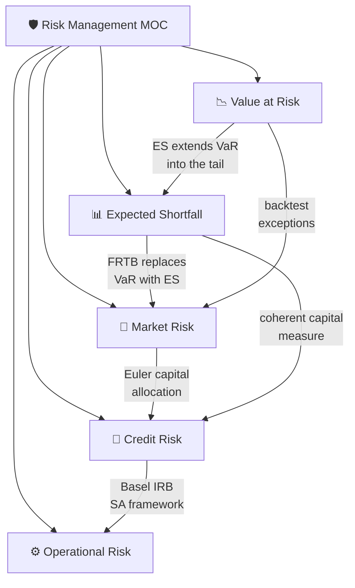

# 🛡️ Risk Management — Map of Content

> [!abstract] Risk management quantifies uncertainty of loss using tools such as Value at Risk (VaR) and Expected Shortfall (ES), while the Basel regulatory framework translates those measures into mandatory capital buffers. Market risk, credit risk, and operational risk each demand distinct modelling paradigms — from delta-gamma Greeks and Merton's structural model to compound loss distributions — yet they share the common goal of ensuring institutions can absorb tail events without insolvency.

## Concept Map

## Learning Path

| Step | Note | Why Here |
|------|------|----------|
| 1 | [[Value_at_Risk]] | Foundation measure — everything else references VaR |
| 2 | [[Expected_Shortfall]] | Coherent extension; FRTB regulatory standard |
| 3 | [[Market_Risk]] | Applies VaR/ES to equity, rates, FX, commodities |
| 4 | [[Credit_Risk]] | Structural and reduced-form models; CDS; Basel IRB |
| 5 | [[Operational_Risk]] | LDA, GPD tails, Basel SA; completes the risk trilogy |

## All Notes at a Glance

| Note | Core Idea | Key Formula | Difficulty |
|------|-----------|-------------|------------|
| [[Value_at_Risk]] | Quantile of loss distribution | $VaR_\alpha = F_L^{-1}(\alpha)$ | Intermediate |
| [[Expected_Shortfall]] | Conditional mean of tail losses | $ES_\alpha = \frac{1}{1-\alpha}\int_\alpha^1 VaR_u\,du$ | Intermediate |
| [[Market_Risk]] | P&L sensitivity to market moves | $\delta^\top\Delta x + \frac{1}{2}\Delta x^\top\Gamma\Delta x$ | Advanced |
| [[Credit_Risk]] | Probability, loss, and exposure | $ECL = PD \times LGD \times EAD$ | Advanced |
| [[Operational_Risk]] | Process/people/system failures | LDA via Monte Carlo compound loss | Intermediate |

## Key Questions

1. Why is VaR **not** a coherent risk measure, and what property does it violate?
2. How does Basel FRTB (2019) justify switching from 99% VaR to 97.5% ES?
3. In the Merton structural model, what is the economic intuition behind Distance-to-Default?
4. Why did Gaussian copula CDO pricing fail during the GFC, and how does the t-copula address the flaw?
5. What is the Euler decomposition and why is it the natural method for allocating portfolio risk to sub-positions?
6. What is the difference between the Advanced Measurement Approach and the Basel III Standardized Approach for operational risk capital?
7. How do stress tests and reverse stress tests complement VaR/ES as risk measures?

## Related Sections

- [[_MOC_QF_Master|Quantitative Finance Master MOC]]
- [[_MOC_Portfolio_Theory|Portfolio Theory MOC]] — mean-variance, efficient frontier, risk budgeting
- [[_MOC_Statistical_Methods|Statistical Methods MOC]] — copulas, EVT, time-series models
- [[_MOC_Advanced_Derivatives|Advanced Derivatives MOC]] — Greeks, options pricing, exotics

#MOC #QuantitativeFinance #RiskManagement
