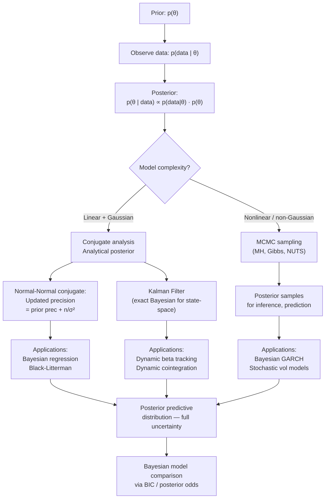

# Bayesian Methods in Finance

> [!abstract] TL;DR
> Bayesian inference provides a coherent framework for updating beliefs about financial model parameters as data arrives, combining prior knowledge (economic theory, expert views) with the likelihood of observed data. In finance, this manifests as analytical conjugate posteriors for linear models, MCMC for complex posteriors, the Kalman filter as an exact Bayesian filter for linear Gaussian state-space models, and Black-Litterman as Bayesian portfolio optimization. The Bayesian paradigm is especially valuable when data is sparse, parameters drift over time, or you need full uncertainty quantification rather than point estimates.

---

## Intuition — The Detective Updating Their Suspect List

A classical statistician is like a judge who rules only after all evidence is in — either guilty or not, based on a significance threshold. A Bayesian is like a detective who starts with prior suspicions (based on motive and opportunity), then continuously updates the probability assigned to each suspect as new clues emerge.

In finance, the "prior" encodes what you know before looking at returns data — perhaps economic theory says the equity risk premium is positive, or factor exposures are bounded between $-2$ and $2$. The "likelihood" is what the data says. The posterior combines both, weighted by their relative certainty. When data is abundant (long return histories), the likelihood dominates and the posterior concentrates near the MLE. When data is scarce (a new factor, a new regime), the prior has outsized influence — and should therefore be chosen carefully.

The Kalman filter makes this sequential updating precise for state-space models: at every timestep, it predicts the next state (propagating uncertainty forward), then updates based on the new observation, maintaining a Gaussian posterior exactly. This is Bayesian inference run in real time, one data point at a time.

---

## How It Works



---

## Key Concepts

### Bayes' Theorem

$$p(\theta \mid \text{data}) \propto p(\text{data} \mid \theta) \cdot p(\theta)$$

$$\underbrace{p(\theta \mid \text{data})}_{\text{posterior}} \propto \underbrace{p(\text{data} \mid \theta)}_{\text{likelihood}} \times \underbrace{p(\theta)}_{\text{prior}}$$

The normalizing constant $p(\text{data}) = \int p(\text{data}|\theta)p(\theta)\,d\theta$ (marginal likelihood or model evidence) is often intractable for complex models — motivating MCMC.

### Normal-Normal Conjugate Prior

Suppose observations $y_i | \mu \stackrel{\text{i.i.d.}}{\sim} N(\mu, \sigma^2)$ (known $\sigma^2$) and prior $\mu \sim N(\mu_0, \tau^2)$.

The posterior is analytically:

$$\mu | \text{data} \sim N(\mu_1, \nu^2)$$

where the posterior precision (inverse variance) is additive:

$$\frac{1}{\nu^2} = \frac{1}{\tau^2} + \frac{n}{\sigma^2}$$

and the posterior mean is a precision-weighted average:

$$\mu_1 = \nu^2 \left(\frac{\mu_0}{\tau^2} + \frac{n\bar{y}}{\sigma^2}\right) = \frac{\tau^{-2}\mu_0 + n\sigma^{-2}\bar{y}}{\tau^{-2} + n\sigma^{-2}}$$

As $n \to \infty$, $\mu_1 \to \bar y$ (data dominates). As $\tau \to 0$ (very tight prior), $\mu_1 \to \mu_0$ (prior dominates). This is exactly the Black-Litterman mechanism for blending model equilibrium returns with investor views.

### Normal-Inverse-Gamma Conjugate

When both $\mu$ and $\sigma^2$ are unknown, the conjugate prior is Normal-Inverse-Gamma (NIG):

$$\sigma^2 \sim \text{Inv-Gamma}(a_0, b_0), \quad \mu | \sigma^2 \sim N(\mu_0, \sigma^2/\kappa_0)$$

The posterior is NIG with updated parameters, and the **predictive distribution** for a new observation $y_{n+1}$ is Student-$t$ with $2a_0$ degrees of freedom — heavier tails than Normal. This is the natural Bayesian answer to "what is the distribution of tomorrow's return, given today's data?" — and it automatically produces fat tails without assuming non-Gaussian errors.

### Zellner g-Prior for Regression

For the regression model $y = X\beta + \epsilon$, $\epsilon \sim N(0, \sigma^2 I)$, Zellner's g-prior is:

$$\beta | \sigma^2, g \sim N\!\left(0,\; g\sigma^2 (X^\top X)^{-1}\right)$$

The MAP estimate is:

$$\hat\beta_{MAP} = \frac{g}{1+g}(X^\top X)^{-1}X^\top y$$

This is exactly Ridge regression with $\lambda = 1/g$. Choosing $g = n$ (unit information prior) gives a standard default. The g-prior provides the Bayesian foundation for regularized regression in factor models — see [[Regression_in_Finance]].

### MCMC: Metropolis-Hastings and Gibbs Sampling

When no conjugate posterior exists (e.g., Bayesian GARCH, stochastic volatility models):

**Metropolis-Hastings:** At each step, propose $\theta^* \sim q(\theta^* | \theta^{(t)})$ and accept with probability:

$$A = \min\left(1,\; \frac{p(\theta^*)}{p(\theta^{(t)})} \cdot \frac{q(\theta^{(t)}|\theta^*)}{q(\theta^*|\theta^{(t)})}\right)$$

**Gibbs Sampling:** Cycle through parameters, drawing each from its full conditional distribution. Works when all conditionals are tractable (e.g., in conjugate hierarchical models).

**MCMC Diagnostics:**
- **$\hat{R}$ (Gelman-Rubin):** $\hat{R} < 1.1$ for each parameter indicates convergence across multiple chains
- **Effective Sample Size (ESS):** $\text{ESS} > 100$ per parameter; accounts for within-chain autocorrelation
- **Trace plots:** chains should look like "fuzzy caterpillars" — mixing well and stationary

### HMC / NUTS

Hamiltonian Monte Carlo (HMC) and the No-U-Turn Sampler (NUTS, Hoffman & Gelman 2014) use the gradient of the log-posterior to make much larger, more correlated jumps than random-walk Metropolis. Implemented in Stan and PyMC. For high-dimensional posteriors (many parameters), HMC requires $O(d)$ gradient evaluations vs $O(d^2)$ for random-walk MH — orders of magnitude more efficient.

### Kalman Filter — Exact Bayesian State-Space Filter

For the linear Gaussian state-space model:

$$\text{State transition:} \quad x_t = F x_{t-1} + Q^{1/2} \epsilon_t, \quad \epsilon_t \sim N(0, I)$$
$$\text{Observation:} \quad y_t = H x_t + R^{1/2} \eta_t, \quad \eta_t \sim N(0, I)$$

The Kalman filter maintains the exact Gaussian posterior $x_t | \mathcal{F}_t \sim N(\hat x_t, P_t)$:

**Predict step:**
$$\hat x_{t|t-1} = F \hat x_{t-1}, \quad P_{t|t-1} = F P_{t-1} F^\top + Q$$

**Update step (observe $y_t$):**
$$K_t = P_{t|t-1} H^\top (H P_{t|t-1} H^\top + R)^{-1} \quad \text{(Kalman gain)}$$
$$\hat x_t = \hat x_{t|t-1} + K_t(y_t - H\hat x_{t|t-1})$$
$$P_t = (I - K_t H) P_{t|t-1}$$

The innovation $\nu_t = y_t - H\hat x_{t|t-1}$ is the "surprise" at time $t$. The Kalman gain $K_t$ weights the innovation by its relative precision vs the prediction.

**Finance applications:**
- **Dynamic hedge ratios:** state = $\beta_t$, observation = return spread (see [[Cointegration]])
- **Dynamic factor exposures:** tracking time-varying Fama-French betas
- **Yield curve level/slope/curvature** in Nelson-Siegel models
- **Pairs trading spread tracking** when $\beta$ is non-stationary

The Kalman smoother (Rauch-Tung-Striebel) adds a backward pass that improves estimates using *all* observations — useful for parameter estimation but not for real-time trading.

### Black-Litterman as Bayesian Portfolio Optimization

Black-Litterman (1990, 1992) frames portfolio optimization in a Bayesian conjugate normal framework:

- **Prior $\Pi$:** implied equilibrium returns from market cap weights (reverse-optimized: $\Pi = \delta\Sigma w_{mkt}$)
- **Views $Q$:** investor's views on $k$ portfolios: $P r \sim N(Q, \Omega)$
- **Posterior expected returns:**

$$\mu_{BL} = \left[(\tau\Sigma)^{-1} + P^\top \Omega^{-1} P\right]^{-1} \left[(\tau\Sigma)^{-1}\Pi + P^\top\Omega^{-1}Q\right]$$

This is exactly the Normal-Normal posterior mean formula: precision of the prior plus precision of the views, weighted accordingly. When $\Omega \to \infty$ (very uncertain views), $\mu_{BL} \to \Pi$ (revert to equilibrium). When $\Omega \to 0$ (confident views), $\mu_{BL}$ moves toward the view values.

### Bayesian Model Comparison

The Bayesian Information Criterion (BIC) approximates the log marginal likelihood:

$$\text{BIC} = -2\ln \hat{L} + k\ln n$$

where $\hat L$ is the maximized likelihood, $k$ is the number of parameters, and $n$ is sample size. BIC penalizes complexity more heavily than AIC (which uses $2k$ instead of $k\ln n$), making it preferable for model selection in large-sample financial settings.

**Posterior model probability:** given models $M_1, M_2$, the Bayes Factor is:

$$\text{BF}_{12} = \frac{p(\text{data}|M_1)}{p(\text{data}|M_2)} \approx \exp\left(\frac{\text{BIC}(M_2) - \text{BIC}(M_1)}{2}\right)$$

---

## Python Example

```python
import numpy as np
import pandas as pd
from scipy import stats
import matplotlib.pyplot as plt
import yfinance as yf

# ===================================================
# 1. Bayesian Linear Regression — Conjugate Posterior
# ===================================================
np.random.seed(42)
T = 120  # months
sigma2_known = 0.04  # assume known noise variance (4% vol squared)

# Simulate: r_i = 0.6 + 0.4*x_i + eps_i (true beta=0.4)
x = np.random.randn(T)
y = 0.6 + 0.4 * x + np.sqrt(sigma2_known) * np.random.randn(T)

# g-prior: beta ~ N(0, g*sigma2*(X'X)^-1), g=T
X = np.column_stack([np.ones(T), x])
g = T

# Prior parameters
mu0 = np.array([0., 0.])  # prior mean for coefficients
V0 = g * sigma2_known * np.linalg.inv(X.T @ X)  # g-prior covariance

# OLS estimate
beta_ols = np.linalg.solve(X.T @ X, X.T @ y)

# Posterior (Normal-Normal conjugate)
V0_inv = np.linalg.inv(V0)
Vn_inv = V0_inv + X.T @ X / sigma2_known
Vn = np.linalg.inv(Vn_inv)
mu_n = Vn @ (V0_inv @ mu0 + X.T @ y / sigma2_known)

print("=== Bayesian Linear Regression (g-prior) ===")
print(f"OLS beta     : intercept={beta_ols[0]:.4f}, slope={beta_ols[1]:.4f}")
print(f"Posterior mean: intercept={mu_n[0]:.4f}, slope={mu_n[1]:.4f}")
print(f"Posterior SD  : intercept={np.sqrt(Vn[0,0]):.4f}, slope={np.sqrt(Vn[1,1]):.4f}")

# 95% credible interval for slope
slope_ci = stats.norm.interval(0.95, loc=mu_n[1], scale=np.sqrt(Vn[1,1]))
print(f"95% Credible Interval for slope: [{slope_ci[0]:.4f}, {slope_ci[1]:.4f}]")

# ===================================================
# 2. Kalman Filter — Dynamic Hedge Ratio
# ===================================================
# Download GLD and SLV
data = yf.download(["GLD", "SLV"], start="2018-01-01", end="2024-01-01",
                   auto_adjust=True)["Close"].dropna()
log_prices = np.log(data)
Y = log_prices["GLD"].values
X_kf = log_prices["SLV"].values
T_kf = len(Y)

# Kalman filter: state = [beta_t], obs = Y_t - beta_t*X_t
# State: beta_t = beta_{t-1} + eta, eta ~ N(0, Q)
# Obs: Y_t = beta_t * X_t + eps, eps ~ N(0, R)
Q = 1e-5   # state noise (how fast beta can drift)
R = 1e-4   # observation noise

beta_filtered = np.zeros(T_kf)
P_filtered = np.zeros(T_kf)
beta_f = 1.0  # initial state estimate
P_f = 1.0    # initial state variance

for t in range(T_kf):
    # Predict
    beta_pred = beta_f
    P_pred = P_f + Q
    # Update
    H_t = X_kf[t]
    innovation = Y[t] - H_t * beta_pred
    S_t = H_t**2 * P_pred + R
    K_t = P_pred * H_t / S_t  # Kalman gain
    beta_f = beta_pred + K_t * innovation
    P_f = (1 - K_t * H_t) * P_pred
    # Store
    beta_filtered[t] = beta_f
    P_filtered[t] = P_f

# Dynamic spread
spread_dynamic = Y - beta_filtered * X_kf

print(f"\n=== Kalman Filter Dynamic Hedge Ratio ===")
print(f"Mean beta   : {np.mean(beta_filtered):.4f}")
print(f"Beta range  : [{beta_filtered.min():.4f}, {beta_filtered.max():.4f}]")
print(f"Spread mean : {np.mean(spread_dynamic):.6f}")
print(f"Spread std  : {np.std(spread_dynamic):.6f}")

# Plot
fig, axes = plt.subplots(2, 1, figsize=(12, 8), sharex=True)
axes[0].plot(log_prices.index, beta_filtered, color="navy")
axes[0].set_title("Kalman Filter: Dynamic Hedge Ratio (GLD ~ SLV)")
axes[0].set_ylabel("beta_t")
axes[1].plot(log_prices.index, spread_dynamic, color="darkgreen", lw=0.7)
axes[1].axhline(0, color="black", lw=0.5, linestyle="--")
axes[1].set_title("Dynamic Spread (GLD - beta_t * SLV)")
plt.tight_layout()
plt.show()

# ===================================================
# 3. MCMC Sketch — Bayesian Mean Return (MH sampler)
# ===================================================
data_ret = 100 * np.log(yf.download("SPY", start="2020-01-01", end="2024-01-01",
                                     auto_adjust=True)["Close"] /
                        yf.download("SPY", start="2020-01-01", end="2024-01-01",
                                    auto_adjust=True)["Close"].shift(1)).dropna().values.flatten()

sigma_known = np.std(data_ret)
n_obs = len(data_ret)
y_bar = np.mean(data_ret)

# Prior: mu ~ N(0, 10^2) - vague prior
mu0_mcmc, tau2 = 0.0, 100.0
sigma2 = sigma_known**2

# Analytical posterior (for validation)
nu2 = 1 / (1/tau2 + n_obs/sigma2)
mu1 = nu2 * (mu0_mcmc/tau2 + n_obs*y_bar/sigma2)
print(f"\n=== Bayesian Inference on SPY Daily Mean Return ===")
print(f"Sample mean (MLE)       : {y_bar:.4f}%")
print(f"Posterior mean          : {mu1:.4f}%")
print(f"Posterior SD            : {np.sqrt(nu2):.4f}%")
print(f"95% Credible Interval   : [{mu1 - 1.96*np.sqrt(nu2):.4f}%, {mu1 + 1.96*np.sqrt(nu2):.4f}%]")

# Metropolis-Hastings MCMC
def log_posterior(mu):
    log_prior = stats.norm.logpdf(mu, loc=mu0_mcmc, scale=np.sqrt(tau2))
    log_lik = np.sum(stats.norm.logpdf(data_ret, loc=mu, scale=sigma_known))
    return log_prior + log_lik

n_iter = 10000
samples = np.zeros(n_iter)
current = y_bar  # start at MLE
proposal_std = 0.02

for i in range(n_iter):
    proposed = current + proposal_std * np.random.randn()
    log_alpha = log_posterior(proposed) - log_posterior(current)
    if np.log(np.random.rand()) < log_alpha:
        current = proposed
    samples[i] = current

burnin = 2000
samples_post = samples[burnin:]
print(f"\nMCMC posterior mean : {np.mean(samples_post):.4f}%  (analytical: {mu1:.4f}%)")
print(f"MCMC posterior SD   : {np.std(samples_post):.4f}%  (analytical: {np.sqrt(nu2):.4f}%)")
print(f"Acceptance rate     : {np.mean(np.diff(samples) != 0):.2%}")
```

---

## Real-World Notes

- **Black-Litterman is the dominant Bayesian tool in institutional asset management.** It avoids the "garbage in, garbage out" problem of classical mean-variance optimization by anchoring expected returns to market equilibrium before tilting with views.
- **Bayesian GARCH** (Nakatsuma 2000; Vrontos et al. 2000) allows uncertainty quantification around volatility forecasts — standard GARCH gives a point estimate of $\sigma_t$ with no uncertainty; Bayesian GARCH gives a full posterior distribution.
- **PyMC and Stan** have dramatically lowered the barrier to Bayesian modeling — a Bayesian stochastic volatility model that required custom C++ code in 2005 can be written in 30 lines of PyMC today.
- **Sequential Monte Carlo (SMC/particle filters)** extends the Kalman filter to nonlinear, non-Gaussian models — relevant for stochastic volatility and jump-diffusion models where the Kalman filter is no longer exact.
- **Bayesian model averaging (BMA)** is increasingly used in factor model selection — rather than picking one model, it averages across all models weighted by their posterior probabilities, naturally handling model uncertainty.

---

## Common Pitfalls

- **Improper priors leading to improper posteriors:** flat/uniform priors over infinite parameter ranges can result in posteriors that don't integrate to 1 — always verify integrability.
- **Ignoring MCMC diagnostics:** running too few iterations and declaring convergence; always check $\hat R$ and trace plots across multiple chains.
- **Confusing credible intervals with confidence intervals:** a 95% Bayesian credible interval means "95% probability the parameter is in this range" (conditional on the prior + data); a frequentist CI means "95% of such intervals cover the true value." These are different statements.
- **Over-confident priors in Black-Litterman:** setting $\Omega$ too small forces the portfolio to chase views aggressively, removing diversification.
- **Using the Kalman filter when the state-space model is nonlinear** (e.g., stochastic volatility with $\ln\sigma_t$ as state) — the filter is no longer exact; use the extended Kalman filter (EKF), unscented KF (UKF), or particle filter.
- **BIC for model comparison only when sample size is large:** in small-$n$ settings, use WAIC or leave-one-out cross-validation instead.

---

## Related Concepts

- [[Regression_in_Finance]] — Ridge regression = MAP with g-prior; Newey-West + Bayesian SEs are complementary
- [[Cointegration]] — Kalman filter tracks dynamic cointegrating vector; Bayesian VECM handles regime uncertainty
- [[GARCH_Models]] — Bayesian GARCH replaces MLE with full posterior; stochastic volatility is the Bayesian alternative
- [[Time_Series_Analysis]] — Kalman filter is a Bayesian state-space time series model; regime-switching can be Bayesian

---

## Review Questions

1. You have 24 months of returns for a new factor strategy. The sample Sharpe is 0.8, but you suspect the true Sharpe is lower. Write out the conjugate prior-posterior update for the mean return, and explain how a skeptical prior ($\mu_0 = 0$) would shrink the estimate.
2. You implement a Kalman filter to track the dynamic beta between two cointegrated stocks. The Q (state noise) parameter controls how fast beta can change. What happens if Q is set too high versus too low, and how would you calibrate it?
3. In Black-Litterman, you express a view that Tech will outperform Utilities by 3% annually with 95% confidence. Translate this into the $P$, $Q$, and $\Omega$ matrices, and explain how the posterior expected return changes relative to the market-implied equilibrium.

---

## Sources

- Bayes, T. (1763). An Essay towards Solving a Problem in the Doctrine of Chances. *Philosophical Transactions of the Royal Society*.
- Black, F., & Litterman, R. (1992). Global Portfolio Optimization. *Financial Analysts Journal*.
- Kalman, R. E. (1960). A New Approach to Linear Filtering and Prediction Problems. *Journal of Basic Engineering*.
- Zellner, A. (1986). On Assessing Prior Distributions and Bayesian Regression Analysis with g-Prior Distributions. In *Bayesian Inference and Decision Techniques*.
- Gelman, A., Carlin, J. B., Stern, H. S., Dunson, D. B., Vehtari, A., & Rubin, D. B. (2013). *Bayesian Data Analysis* (3rd ed.). CRC Press.
- Hoffman, M. D., & Gelman, A. (2014). The No-U-Turn Sampler. *JMLR*.

#quantitative-finance #statistical-methods #advanced #Bayesian #Kalman-filter #MCMC #Black-Litterman
