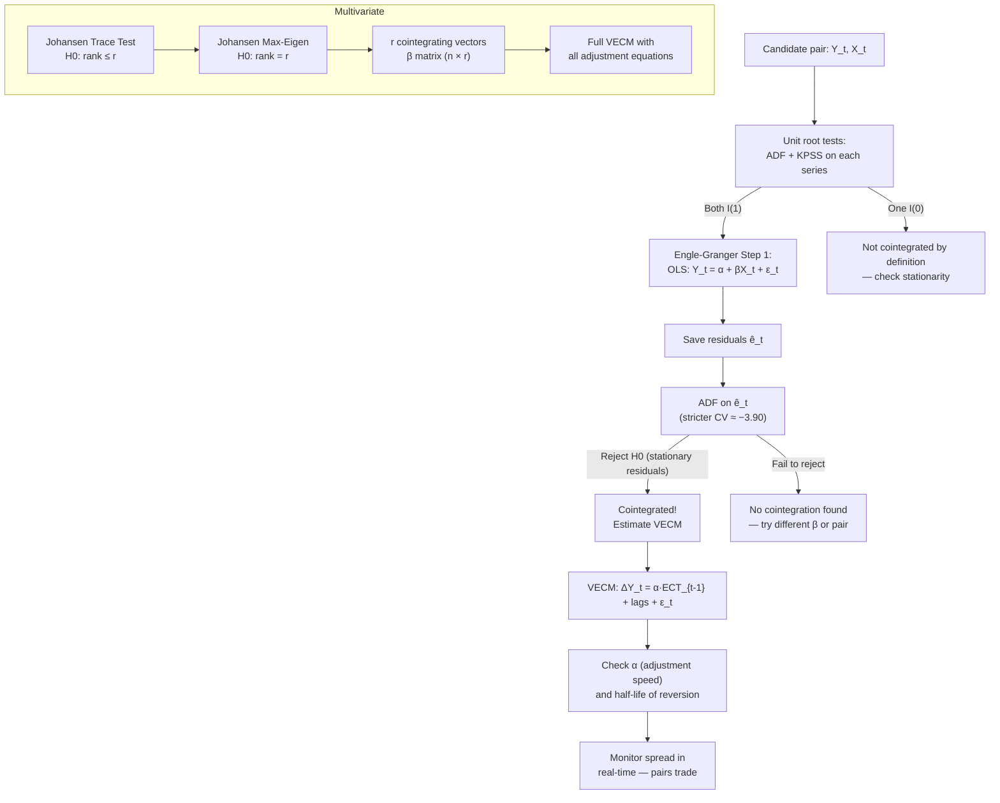

# Cointegration

> [!abstract] TL;DR
> Cointegration describes a long-run equilibrium relationship between non-stationary series: each series wanders individually (I(1)), but a specific linear combination of them is stationary (I(0)). This is the formal statistical foundation for pairs trading — if two asset prices are cointegrated, their spread mean-reverts and can be exploited systematically. The Engle-Granger two-step procedure tests for a single cointegrating vector; the Johansen framework handles multiple series and multiple vectors simultaneously. The Vector Error Correction Model (VECM) ties the short-run dynamics to the long-run equilibrium.

---

## Intuition — Two Drunk Friends Walking Home

Imagine two friends leaving a bar at 2am, each making a random walk toward home. Individually, neither can predict where they'll be in 30 minutes — their paths are non-stationary. But they're close friends: if one strays too far from the other, the other turns back. The gap between them — the *spread* — never explodes. It's stationary.

This is cointegration. Stock prices of Coca-Cola and Pepsi both wander randomly over years. But their price ratio (or log-spread) is anchored by economic fundamentals — similar costs, substitutable products, overlapping demand. The spread will occasionally widen, but economic arbitrage (and pairs traders) pull it back.

What makes cointegration powerful — and different from correlation — is that it captures *long-run* equilibrium, not just short-run co-movement. Two series can be highly correlated in a window yet not cointegrated (the correlation might be spurious), or uncorrelated in some windows yet cointegrated (temporarily diverging from a stable long-run anchor). The stationarity of the spread is the formal criterion.

---

## How It Works



---

## Key Concepts

### Cointegration: Formal Definition

Let $Y_t$ and $X_t$ both be $I(1)$. They are cointegrated ($\text{CI}(1,1)$) if there exists a constant $\beta$ such that:

$$Z_t = Y_t - \beta X_t \sim I(0)$$

$\beta$ is called the **cointegrating vector** (in the bivariate case, a scalar). The vector $(1, -\beta)^\top$ is the cointegrating vector normalized on $Y$. In an $n$-variable system, there can be up to $r < n$ cointegrating vectors forming the cointegrating matrix $\beta \in \mathbb{R}^{n \times r}$.

**Key insight:** Cointegration implies a common stochastic trend. Two $I(1)$ series share one common trend $\Rightarrow$ one cointegrating relationship. $n$ series with $r$ cointegrating vectors share $n-r$ common stochastic trends.

### Engle-Granger Two-Step

**Step 1:** Estimate the long-run relationship via OLS:

$$Y_t = \alpha + \beta X_t + \hat{e}_t$$

**Step 2:** Apply ADF to residuals $\hat{e}_t$:

$$\Delta\hat{e}_t = \gamma \hat{e}_{t-1} + \sum_{j=1}^p \delta_j \Delta\hat{e}_{t-j} + \nu_t$$

- $H_0: \gamma = 0$ (residuals have a unit root — no cointegration)
- **5% critical value $\approx -3.90$** (stricter than standard ADF $-2.86$ because $\beta$ was pre-estimated)
- Exact CVs depend on sample size and number of variables (MacKinnon 1991 response surfaces)

**Limitations:** (1) OLS estimate of $\beta$ is consistent but not efficient; (2) only tests for one cointegrating vector; (3) asymmetric — results can differ depending on which variable is the LHS.

### Johansen Trace and Maximum Eigenvalue Tests

The Johansen (1988) VECM maximum likelihood framework tests for $r$ cointegrating vectors jointly.

**Trace statistic** ($H_0$: cointegration rank $\leq r$):

$$\lambda_{trace}(r) = -T \sum_{i=r+1}^{n} \ln(1 - \hat\lambda_i)$$

**Maximum eigenvalue statistic** ($H_0$: rank $= r$ vs. $r+1$):

$$\lambda_{max}(r, r+1) = -T \ln(1 - \hat\lambda_{r+1})$$

where $\hat\lambda_i$ are eigenvalues of the long-run impact matrix. Critical values are non-standard (Johansen 1988 tables); proceed sequentially: test $H_0: r=0$ first, then $r=1$, etc.

**Johansen vs Engle-Granger:**
- 2 series, single vector → Engle-Granger suffices
- 3+ series, or potential multiple vectors → use Johansen
- Johansen is asymptotically efficient; EG is consistent but not efficient

### Vector Error Correction Model (VECM)

The VECM links short-run dynamics to long-run equilibrium:

$$\Delta Y_t = \alpha \underbrace{(\beta^\top Y_{t-1})}_{\text{ECT}} + \sum_{j=1}^{k-1} \Gamma_j \Delta Y_{t-j} + \epsilon_t$$

where:
- $\beta^\top Y_{t-1}$ = **Error Correction Term (ECT)** = the lagged cointegrating residual (the spread)
- $\alpha$ = **adjustment speed** matrix — how fast each variable responds when the spread deviates from zero
- $\Gamma_j$ = short-run dynamic coefficients

For a simple bivariate pair $Y_t, X_t$ with one cointegrating vector:

$$\Delta Y_t = \alpha_Y (Y_{t-1} - \beta X_{t-1}) + \text{lags} + \epsilon_t^Y$$
$$\Delta X_t = \alpha_X (Y_{t-1} - \beta X_{t-1}) + \text{lags} + \epsilon_t^X$$

Typically, $\alpha_Y < 0$ (if spread is positive, $Y$ adjusts downward) and $\alpha_X > 0$ (if spread is positive, $X$ adjusts upward), though in practice one variable may be the "leader" with $|\alpha| \gg 0$.

### Half-Life of Mean Reversion

**Discrete AR(1) approximation:** If the ECT follows $\hat{e}_t = \rho \hat{e}_{t-1} + \nu_t$ with $|\rho| < 1$, the half-life is:

$$t_{1/2} = \frac{-\ln 2}{\ln \rho} = \frac{\ln 2}{\ln(1/\rho)}$$

**Continuous Ornstein-Uhlenbeck:** If $dZ_t = -\kappa Z_t\, dt + \sigma\, dW_t$ (the spread follows OU), then:

$$t_{1/2} = \frac{\ln 2}{\kappa}$$

$\kappa = -\ln(|\hat\alpha|)$ links the discrete VECM to the continuous OU. Typical pairs trading requires $t_{1/2} < 30$ trading days to be tradeable.

### Kalman Filter for Dynamic Beta

The static Engle-Granger $\beta$ may change over time (regime shifts, fundamental repricing). A Kalman filter tracks this dynamically:

$$\text{State:} \quad \beta_t = \beta_{t-1} + \eta_t, \quad \eta_t \sim N(0, Q)$$
$$\text{Observation:} \quad Y_t = \beta_t X_t + \epsilon_t, \quad \epsilon_t \sim N(0, R)$$

The posterior distribution $\beta_t | \mathcal{F}_t$ remains Gaussian, updated at each observation. See [[Bayesian_Methods_Finance]] for the full predict-update cycle. Dynamic $\beta$ produces a cleaner spread when the true relationship shifts gradually.

### Spurious Cointegration Risk

Data mining across thousands of pairs will produce apparent cointegration by chance. Safeguards:
1. **Economic rationale first** — only test pairs with a fundamental link (substitutes, same supply chain, ETF arbitrage)
2. **Out-of-sample validation** — in-sample cointegration must persist post-estimation
3. **Multiple testing corrections** — if testing 1000 pairs, 50 will appear cointegrated at 5% by chance alone
4. **Transaction cost hurdle** — half-life must be short enough for profit after bid-ask and commissions

---

## Python Example

```python
import numpy as np
import pandas as pd
import yfinance as yf
from statsmodels.tsa.stattools import coint, adfuller
from statsmodels.tsa.vector_ar.vecm import coint_johansen, VECM

# --- Download cointegration candidate pair ---
tickers = ["GLD", "SLV"]  # Gold and Silver ETFs
data = yf.download(tickers, start="2015-01-01", end="2024-01-01",
                   auto_adjust=True)["Close"].dropna()
log_prices = np.log(data)

Y = log_prices["GLD"].values
X = log_prices["SLV"].values

# --- Engle-Granger two-step ---
# Step 1: OLS
import statsmodels.api as sm
X_const = sm.add_constant(X)
ols_res = sm.OLS(Y, X_const).fit()
beta_hat = ols_res.params[1]
alpha_hat = ols_res.params[0]
spread = Y - beta_hat * X - alpha_hat

print("=== Engle-Granger Cointegration Test ===")
print(f"Long-run beta (GLD ~ SLV): {beta_hat:.4f}")

# Step 2: ADF on spread (use stricter CV)
adf_spread = adfuller(spread, autolag="AIC")
print(f"ADF Statistic on spread : {adf_spread[0]:.4f}")
print(f"p-value                 : {adf_spread[1]:.4f}")
print(f"1% CV                   : {adf_spread[4]['1%']:.4f}")
print(f"5% CV                   : {adf_spread[4]['5%']:.4f}")
# Note: use statsmodels coint() which applies proper MacKinnon CVs
eg_stat, eg_pval, eg_crit = coint(Y, X)
print(f"\nstatsmodels coint() p-value: {eg_pval:.4f}")
if eg_pval < 0.05:
    print("→ Cointegration found at 5%")

# --- Half-life estimation ---
spread_lag = pd.Series(spread).shift(1).dropna()
delta_spread = pd.Series(spread).diff().dropna()
ar1_res = sm.OLS(delta_spread, sm.add_constant(spread_lag)).fit()
rho = 1 + ar1_res.params[1]  # AR(1) coefficient of spread level
half_life_discrete = -np.log(2) / np.log(rho)
kappa = -ar1_res.params[1]  # mean-reversion speed
half_life_ou = np.log(2) / kappa
print(f"\nHalf-life (discrete AR1): {half_life_discrete:.1f} days")
print(f"Half-life (OU approx)   : {half_life_ou:.1f} days")

# --- Johansen Test ---
print("\n=== Johansen Test ===")
joh_result = coint_johansen(log_prices.values, det_order=0, k_ar_diff=1)
print("Trace statistics:", joh_result.lr1)
print("5% CVs (trace)  :", joh_result.cvt[:, 1])
print("Max-Eigen stats :", joh_result.lr2)
print("5% CVs (max-eig):", joh_result.cvm[:, 1])

# --- VECM estimation ---
vecm_model = VECM(log_prices.values, k_ar_diff=1, coint_rank=1, deterministic="ci")
vecm_fit = vecm_model.fit()
print("\n=== VECM Summary ===")
print(vecm_fit.summary())
print(f"\nCointegrating vector (normalized): {vecm_fit.beta.flatten()}")
print(f"Adjustment speeds (alpha)        : {vecm_fit.alpha.flatten()}")
```

---

## Real-World Notes

- **Fixed income pairs:** short-end Treasury yields (2Y vs 5Y) are frequently cointegrated; the spread is the basis for relative value trades.
- **FX pairs:** USD/EUR and USD/GBP may have a stationary relationship through purchasing power parity, though PPP cointegration is notoriously slow-reverting ($t_{1/2}$ of years).
- **Commodity pairs:** GLD/SLV, WTI/Brent crude are classic cointegrated pairs with economic rationale.
- **Equity pairs break down** during crises — a merger arbitrage pair (or sector pair) that was cointegrated can permanently decouple on fundamental news. Robust risk management requires monitoring ECT and re-testing quarterly.
- **VECM with $r > 1$:** In a basket of N stocks (e.g., S&P 500 sector ETFs), there may be multiple cointegrating vectors, enabling sector-neutral multi-asset mean-reversion portfolios.

---

## Common Pitfalls

- **Using ADF critical values ($-2.86$) instead of the cointegrating regression CV ($-3.90$)** for the Engle-Granger second step — leads to spurious cointegration findings.
- **Not adjusting for data mining** when testing many pairs — at 5% significance, 1 in 20 unrelated pairs will appear cointegrated.
- **Ignoring structural breaks:** a regime change (e.g., a merger announcement) can permanently alter $\beta$; the Johansen test on the full sample will then fail or mislead.
- **Trading with a very long half-life (> 60 days):** capital is tied up for months and transaction costs consume the expected profit.
- **Static $\beta$ when the relationship evolves:** using a fixed Engle-Granger $\beta$ for a pair whose relationship slowly drifts leads to biased spread estimates; use Kalman filter.
- **Not including lag terms in the VECM:** omitting short-run dynamics leads to residual autocorrelation and inefficient estimates of $\alpha$.

---

## Related Concepts

- [[Time_Series_Analysis]] — I(1) processes and unit root testing are prerequisite; spurious regression is the risk cointegration solves
- [[Regression_in_Finance]] — Engle-Granger step 1 is OLS; VECM is a structured regression system
- [[Bayesian_Methods_Finance]] — Kalman filter provides dynamic $\beta$ estimation; see state-space model derivation
- [[07_Quant_Strategies/_MOC_Quant_Strategies]] — pairs trading and statistical arbitrage strategies depend directly on this material

---

## Review Questions

1. Two asset price series both fail to reject the ADF null. Your Engle-Granger test rejects the unit root on the residuals with a test statistic of $-3.50$. Are the series cointegrated? What critical value should you compare to?
2. In a VECM for a cointegrated pair $(Y, X)$, you find $\alpha_Y = -0.05$ and $\alpha_X = 0.001$. Which asset adjusts to close deviations from the long-run equilibrium, and how quickly (in trading days)?
3. You run Johansen tests on 500 pairs in an equity universe. At the 5% level, how many false positives do you expect, and what does this imply for your trading strategy construction?

---

## Sources

- Engle, R. F., & Granger, C. W. J. (1987). Co-integration and Error Correction. *Econometrica*.
- Johansen, S. (1988). Statistical Analysis of Cointegration Vectors. *Journal of Economic Dynamics and Control*.
- MacKinnon, J. G. (1991). Critical Values for Cointegration Tests. In *Long-Run Economic Relationships* (Engle & Granger eds.).
- Gatev, E., Goetzmann, W., & Rouwenhorst, K. (2006). Pairs Trading: Performance of a Relative-Value Arbitrage Rule. *Review of Financial Studies*.
- Vidyamurthy, G. (2004). *Pairs Trading: Quantitative Methods and Analysis*. Wiley.

#quantitative-finance #statistical-methods #advanced #cointegration #VECM #pairs-trading #Johansen
