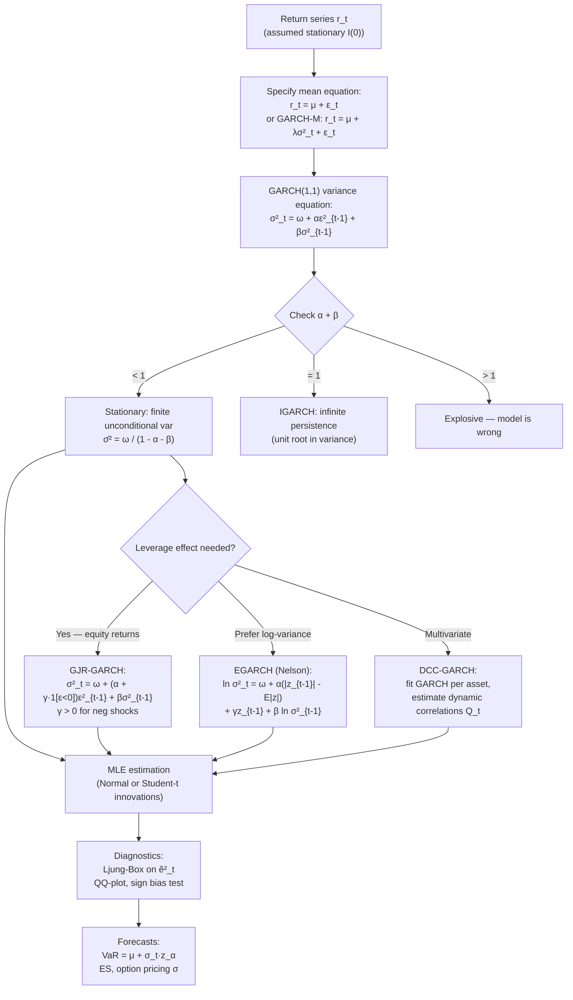

# GARCH Models

> [!abstract] TL;DR
> GARCH (Generalized Autoregressive Conditional Heteroskedasticity) models the time-varying variance of financial returns by letting today's volatility depend on yesterday's volatility and yesterday's shock. The baseline GARCH(1,1) captures the two most important stylized facts — volatility clustering and fat tails — in just three parameters. Extensions handle the leverage effect (GJR, EGARCH), multivariate correlations (DCC), and risk-premium-in-mean (GARCH-M). GARCH volatility forecasts feed directly into VaR, options pricing, and portfolio optimization.

---

## Intuition — Turbulence in a Flight

A GARCH model encodes a simple but powerful insight: volatile periods tend to cluster. This is exactly like turbulence on a flight. When you hit a rough patch of air, the plane doesn't immediately return to smooth sailing — turbulence persists, eases gradually, and the transition back to calm takes time. But eventually, you do return to smooth air; the system is mean-reverting (as long as $\alpha + \beta < 1$).

GARCH says: tomorrow's variance is a blend of (1) the long-run average variance $\bar\sigma^2$, (2) yesterday's squared surprise $\epsilon^2_{t-1}$ (how large was the shock?), and (3) yesterday's estimated variance $\sigma^2_{t-1}$ (how volatile was yesterday already?). The weights $\alpha$ and $\beta$ determine how responsive and persistent the volatility is.

The leverage effect adds a further twist: bad news (negative returns) causes more volatility than equally-sized good news. This asymmetry — documented empirically by Black (1976) — means the turbulence analogy needs updating: flying into a storm is rougher than the equivalent tailwind.

---

## How It Works



---

## Key Concepts

### Stylized Facts of Financial Returns

Before modeling, empirical regularities motivate GARCH:

1. **Volatility clustering:** large moves tend to be followed by large moves; small moves by small moves. The autocorrelation of squared returns $\text{Corr}(r_t^2, r_{t-h}^2) > 0$ for many lags.
2. **Fat tails (leptokurtosis):** the unconditional return distribution has excess kurtosis > 0 (heavier tails than Gaussian).
3. **Leverage effect:** negative returns increase subsequent volatility more than positive returns of equal magnitude (asymmetry).
4. **Mean reversion of volatility:** unlike prices, volatility does not trend indefinitely; it reverts to a long-run level.
5. **Long memory:** the autocorrelation of squared returns decays very slowly, consistent with near-unit-root behavior in variance.

### GARCH(1,1) — The Benchmark

**Mean equation:**
$$r_t = \mu + \epsilon_t, \quad \epsilon_t = \sigma_t z_t, \quad z_t \stackrel{\text{i.i.d.}}{\sim} D(0,1)$$

**Variance equation:**
$$\sigma^2_t = \omega + \alpha \epsilon^2_{t-1} + \beta \sigma^2_{t-1}$$

Parameters: $\omega > 0$, $\alpha \geq 0$, $\beta \geq 0$.

**Stationarity condition:** $\alpha + \beta < 1$

**Unconditional (long-run) variance:**
$$\bar\sigma^2 = \frac{\omega}{1 - \alpha - \beta}$$

**Half-life of a variance shock** (time for the effect to halve):
$$t_{1/2} = \frac{\ln(0.5)}{\ln(\alpha + \beta)}$$

For typical equity markets, $\alpha \approx 0.09$, $\beta \approx 0.90$, giving $\alpha + \beta \approx 0.99$ and a half-life $\approx 69$ trading days — showing how persistent equity volatility is.

**IGARCH (Integrated GARCH):** $\alpha + \beta = 1$. Variance shocks are permanent; no unconditional variance exists. RiskMetrics' EWMA model is a special case ($\omega = 0$, $\alpha + \beta = 1$, $\lambda = \beta$): $\sigma^2_t = (1-\lambda)\epsilon^2_{t-1} + \lambda\sigma^2_{t-1}$.

### GJR-GARCH — Leverage Effect

Glosten, Jagannathan, and Runkle (1993):

$$\sigma^2_t = \omega + \left(\alpha + \gamma \cdot \mathbf{1}[\epsilon_{t-1} < 0]\right)\epsilon^2_{t-1} + \beta\sigma^2_{t-1}$$

When $\epsilon_{t-1} < 0$ (negative return yesterday), the effective ARCH coefficient is $\alpha + \gamma$, amplifying the variance response. The leverage effect requires $\gamma > 0$.

**Stationarity condition:** $\alpha + \gamma/2 + \beta < 1$

**News impact curve:** the function mapping $\epsilon_{t-1}$ to $\sigma^2_t$ is asymmetric — a V-shape tilted rightward (negative shocks have a steeper slope).

### EGARCH — Nelson (1991)

The exponential GARCH operates on $\ln \sigma^2_t$, ensuring variance is always positive without parameter constraints:

$$\ln \sigma^2_t = \omega + \alpha\left(\frac{|\epsilon_{t-1}|}{\sigma_{t-1}} - \mathbb{E}\left|\frac{\epsilon_{t-1}}{\sigma_{t-1}}\right|\right) + \gamma \frac{\epsilon_{t-1}}{\sigma_{t-1}} + \beta \ln \sigma^2_{t-1}$$

The standardized shock $z_{t-1} = \epsilon_{t-1}/\sigma_{t-1}$:
- $\alpha > 0$: size effect (large shocks increase $\ln\sigma^2$)
- $\gamma < 0$: asymmetry (negative $z$ further increases $\ln\sigma^2$)
- $\beta$ close to 1: high persistence

No non-negativity constraints on $\omega, \alpha, \beta$. The MLE is numerically cleaner than GARCH.

### DCC-GARCH — Engle (2002)

For $n$ assets, multivariate GARCH becomes intractable with $O(n^2)$ parameters. DCC uses a two-step approach:

**Step 1:** Fit univariate GARCH to each asset; extract standardized residuals $z_{it} = \epsilon_{it}/\sigma_{it}$.

**Step 2:** Estimate dynamic conditional correlations:

$$Q_t = (1 - a - b)\bar{Q} + a z_{t-1} z_{t-1}^\top + b Q_{t-1}$$

$$R_t = \text{diag}(Q_t)^{-1/2} Q_t \, \text{diag}(Q_t)^{-1/2}$$

where $\bar{Q}$ is the unconditional correlation matrix of $z_t$, and $a + b < 1$ for stationarity. The time-varying covariance matrix is:

$$H_t = D_t R_t D_t, \quad D_t = \text{diag}(\sigma_{1t}, \ldots, \sigma_{nt})$$

DCC is parsimonious (only 2 additional parameters $a, b$) while capturing time-varying correlations — essential for portfolio risk estimation.

### GARCH-M — Risk Premium in the Mean

$$r_t = \mu + \lambda \sigma^2_t + \epsilon_t$$

$\lambda > 0$ implies investors demand higher expected returns for higher variance — directly testable from data. Alternative: use $\lambda\sigma_t$ (linear in volatility) rather than $\lambda\sigma^2_t$.

### GARCH vs HAR-RV

| Feature | GARCH | HAR-RV |
|---------|-------|--------|
| Data needed | Daily close prices | Intraday tick data (5-min) |
| Variance measure | Conditional variance (latent) | Realized variance (observable) |
| Estimation | MLE (parametric) | OLS (non-parametric) |
| Multi-step forecasts | Analytical recursion | Multi-scale OLS lags |
| Out-of-sample | Good | Typically better for daily |
| Long memory | Approximate (IGARCH) | Natural (multi-scale) |

See [[Time_Series_Analysis]] for the HAR-RV formulation.

### VaR Computation from GARCH

The 1-day VaR at confidence level $\alpha$ using filtered historical simulation:

$$\text{VaR}_{t,\alpha} = \mu_t + \sigma_t \cdot z_\alpha$$

where $z_\alpha$ is the $\alpha$-quantile of the standardized innovations distribution (Normal: $z_{0.01} = -2.326$; Student-$t_\nu$: use $t$-quantile). GARCH-based VaR dramatically outperforms EWMA or historical simulation because $\sigma_t$ adapts in real-time to volatility regimes.

---

## Python Example

```python
import numpy as np
import pandas as pd
import yfinance as yf
from arch import arch_model
import matplotlib.pyplot as plt

# --- Download data ---
ticker = "SPY"
data = yf.download(ticker, start="2015-01-01", end="2024-01-01", auto_adjust=True)
ret = 100 * np.log(data["Close"] / data["Close"].shift(1)).dropna()  # scale to %

# --- GARCH(1,1) with Normal innovations ---
garch_11 = arch_model(ret, vol="Garch", p=1, q=1, dist="normal", mean="Constant")
result_garch = garch_11.fit(disp="off")

print("=== GARCH(1,1) Parameter Estimates ===")
print(result_garch.summary())

omega = result_garch.params["omega"]
alpha = result_garch.params["alpha[1]"]
beta  = result_garch.params["beta[1]"]
mu    = result_garch.params["Const"]

print(f"\nomega: {omega:.6f}")
print(f"alpha: {alpha:.4f}")
print(f"beta : {beta:.4f}")
print(f"alpha + beta: {alpha + beta:.4f}")

# Unconditional volatility (annualized)
uncond_var = omega / (1 - alpha - beta)
uncond_vol_ann = np.sqrt(uncond_var * 252)
print(f"Unconditional vol (annualized): {uncond_vol_ann:.2f}%")

# Half-life of vol shock
half_life = np.log(0.5) / np.log(alpha + beta)
print(f"Half-life of vol shock       : {half_life:.1f} trading days")

# --- GJR-GARCH for leverage effect ---
gjr = arch_model(ret, vol="Garch", p=1, o=1, q=1, dist="studentst", mean="Constant")
result_gjr = gjr.fit(disp="off")
gamma_gjr = result_gjr.params["gamma[1]"]
print(f"\n=== GJR-GARCH ===")
print(f"gamma (leverage): {gamma_gjr:.4f}")
print(f"Leverage effect present: {gamma_gjr > 0}")

# --- EGARCH ---
egarch = arch_model(ret, vol="EGARCH", p=1, q=1, dist="studentst", mean="Constant")
result_egarch = egarch.fit(disp="off")
print(f"\n=== EGARCH ===")
print(result_egarch.params.to_string())

# --- Conditional volatility plot ---
cond_vol = result_garch.conditional_volatility * np.sqrt(252)  # annualized
fig, axes = plt.subplots(2, 1, figsize=(12, 8), sharex=True)
axes[0].plot(ret.index, ret, lw=0.5, color="steelblue", alpha=0.8)
axes[0].set_title("SPY Daily Log Returns (%)")
axes[1].plot(ret.index, cond_vol, lw=0.8, color="crimson")
axes[1].set_title("GARCH(1,1) Conditional Volatility (Annualized %)")
plt.tight_layout()
plt.show()

# --- 1-day VaR from GARCH ---
forecast = result_garch.forecast(horizon=1, reindex=False)
sigma_1d = np.sqrt(forecast.variance.iloc[-1, 0])
z_01 = -2.3263  # 1% Normal quantile
VaR_1pct = mu + sigma_1d * z_01
print(f"\n=== 1-day 99% VaR (last observation) ===")
print(f"Conditional sigma (daily %): {sigma_1d:.4f}")
print(f"99% VaR (daily %)         : {VaR_1pct:.4f}")
print(f"99% VaR on $1M position   : ${abs(VaR_1pct / 100) * 1e6:,.0f}")
```

---

## Real-World Notes

- **Student-t innovations** almost always improve model fit over Normal for daily equity data — the fat tails of returns are not fully captured by GARCH variance dynamics alone.
- **GARCH(1,1) is remarkably robust:** despite its simplicity, it beats most higher-order GARCH(p,q) models out-of-sample (Hansen and Lunde 2005). Start here.
- **DCC-GARCH** is the industry standard for multivariate risk systems (portfolio VaR, covariance matrix estimation for optimization). Implemented in R's `rmgarch` and Python's `mgarch` packages.
- **VaR back-testing (Basel III):** banks must formally back-test internal GARCH-VaR models. Violations (actual losses exceeding VaR) are counted over 250 trading days; > 10 violations trigger regulatory penalties.
- **Realized GARCH (Hansen et al. 2012):** uses intraday realized variance as an additional observation equation, bridging GARCH and HAR-RV frameworks.

---

## Common Pitfalls

- **Not scaling returns before fitting:** the `arch` library expects percentage returns (multiply log returns by 100). Extremely small values cause numerical issues in MLE.
- **Confusing $\alpha + \beta > 1$ with stationarity violation:** some software will converge to explosive solutions; always check and constrain if needed.
- **Using GARCH for forecasting more than a few days out:** GARCH multi-step variance forecasts converge quickly to the unconditional variance — use implied volatility or HAR-RV for longer horizons.
- **Ignoring the leverage effect for equities:** using plain GARCH(1,1) on stock returns without testing for asymmetry systematically underestimates downside volatility.
- **DCC correlation instability:** during crises, correlations spike toward 1 — DCC captures the trend but the convergence is imperfect; robust correlations or shrinkage may be preferred for portfolio construction.
- **Fitting GARCH to aggregated/non-return data** (e.g., price levels or I(1) series) — always model stationary (differenced) series.

---

## Related Concepts

- [[Time_Series_Analysis]] — ARIMA models the conditional mean; GARCH models the conditional variance; HAR-RV is an alternative using realized variance
- [[Regression_in_Finance]] — GARCH-M includes $\sigma^2_t$ in the mean equation; Newey-West SEs are needed when residuals are GARCH-heteroskedastic
- [[Bayesian_Methods_Finance]] — Bayesian GARCH via MCMC allows prior beliefs on $\alpha, \beta$; Kalman filter is the Bayesian analogue for linear state-space
- [[05_Risk_Management/_MOC_Risk_Management]] — GARCH is the primary input to dynamic VaR and Expected Shortfall models

---

## Review Questions

1. A GARCH(1,1) model is estimated with $\hat\alpha = 0.10$ and $\hat\beta = 0.88$. Compute the unconditional daily volatility given $\hat\omega = 0.0002$ (returns in decimal). What is the half-life of a volatility shock in trading days?
2. You estimate GARCH(1,1) and GJR-GARCH on S&P 500 daily returns. The GJR model gives $\hat\gamma = 0.08$ with a t-statistic of 4.2. What does this tell you, and how does it affect VaR estimates asymmetrically for long vs short positions?
3. Your risk system uses EWMA ($\lambda = 0.94$) for portfolio covariance. A colleague proposes switching to DCC-GARCH. What are the three main advantages of DCC, and what practical challenges do you face implementing it for a 200-asset portfolio?

---

## Sources

- Bollerslev, T. (1986). Generalized Autoregressive Conditional Heteroskedasticity. *Journal of Econometrics*.
- Nelson, D. B. (1991). Conditional Heteroskedasticity in Asset Returns. *Econometrica*.
- Glosten, L. R., Jagannathan, R., & Runkle, D. E. (1993). On the Relation between the Expected Value and Volatility of Nominal Excess Returns. *Journal of Finance*.
- Engle, R. F. (2002). Dynamic Conditional Correlation. *Journal of Business & Economic Statistics*.
- Hansen, P. R., & Lunde, A. (2005). A Forecast Comparison of Volatility Models. *Journal of Applied Econometrics*.
- Sheppard, K. (2023). `arch` Python library documentation. https://arch.readthedocs.io/

#quantitative-finance #statistical-methods #advanced #GARCH #volatility-modeling #VaR #leverage-effect
