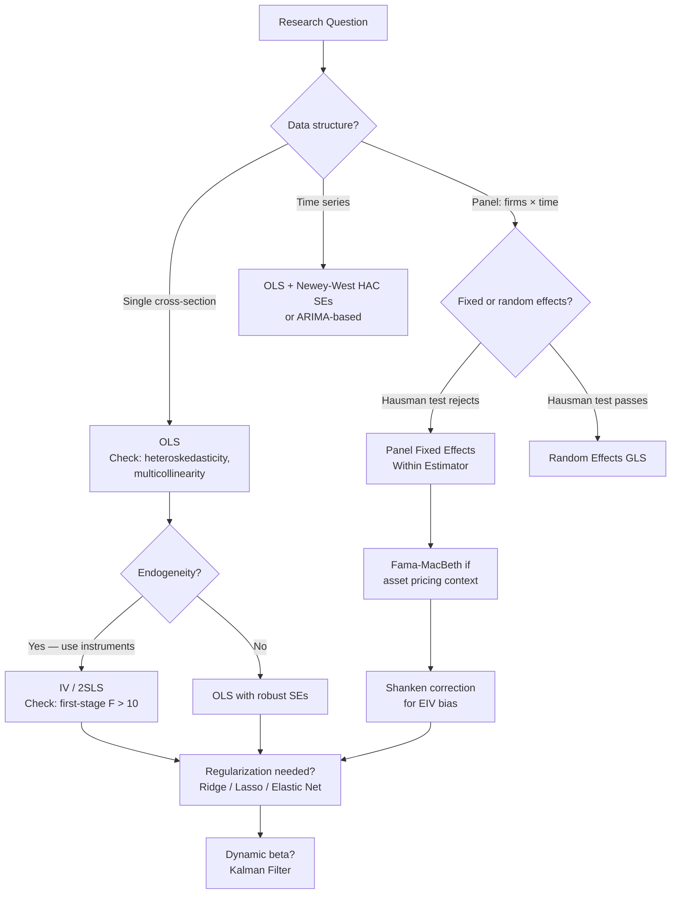

# Regression in Finance

> [!abstract] TL;DR
> Regression is the workhorse of empirical finance — from estimating factor betas to running Fama-MacBeth cross-sectional asset pricing tests. OLS is optimal only under Gauss-Markov assumptions; financial data routinely violates these through heteroskedasticity, autocorrelation, and multicollinearity. Modern extensions — Newey-West standard errors, panel fixed effects, IV/2SLS, Ridge, Lasso, and the Kalman filter — address each violation systematically. Understanding when and why to upgrade from plain OLS is as important as knowing how to implement it.

---

## Intuition — Snapshots vs. the Full Movie

Plain OLS is like taking a single photograph of a crowd and asking "who is the tallest person?" — straightforward if everyone stays still. In asset pricing, stocks move every day, betas change, and characteristics evolve. Running a single pooled regression of returns on characteristics treats every observation identically, ignoring time and entity heterogeneity.

Fama-MacBeth (1973) is like filming 60 monthly photographs and asking "who *tends* to be tallest?" You run a separate cross-sectional regression each month across 3000 stocks, collect 60 monthly estimates of each risk premium, and then average them. The standard error of that average captures the true uncertainty about the premium — not the noise from cross-correlations that plague pooled regressions.

Panel fixed effects is like giving each stock its own intercept — controlling for any time-invariant unobservable (quality, industry culture) that might confound the relationship. Instrumental variables goes further: when a regressor is endogenous (correlated with the error), you need an exogenous instrument that shifts the regressor without directly affecting the outcome.

---

## How It Works



---

## Key Concepts

### OLS and Gauss-Markov

The OLS estimator:

$$\hat{\beta} = (X^\top X)^{-1} X^\top y$$

is the Best Linear Unbiased Estimator (BLUE) under the Gauss-Markov conditions:
1. Linearity in parameters
2. Random sampling (or exogeneity: $\mathbb{E}[\epsilon | X] = 0$)
3. No perfect multicollinearity
4. Homoskedasticity: $\text{Var}(\epsilon | X) = \sigma^2 I$
5. No autocorrelation

Financial returns routinely violate (4) and (5). OLS point estimates remain unbiased but standard errors are wrong — leading to false inference.

### Frisch-Waugh-Lovell Theorem

In a regression $y = X_1\beta_1 + X_2\beta_2 + \epsilon$, the coefficient $\hat\beta_2$ equals the coefficient from regressing $M_{X_1}y$ on $M_{X_1}X_2$, where $M_{X_1} = I - X_1(X_1^\top X_1)^{-1}X_1^\top$ is the residual-maker matrix. In words: $\hat\beta_2$ captures the relationship between $y$ and $X_2$ after partialling out $X_1$.

This is the theoretical foundation of the within estimator in panel data — demeaning by entity is equivalent to including entity dummies, by FWL.

### Newey-West HAC Standard Errors

When errors are heteroskedastic and/or autocorrelated, OLS SEs are wrong. The Newey-West heteroskedasticity-and-autocorrelation-consistent (HAC) estimator:

$$\hat{V}_{NW} = (X^\top X)^{-1} \hat{\Omega}_{NW} (X^\top X)^{-1}$$

$$\hat{\Omega}_{NW} = \hat{\Gamma}_0 + \sum_{l=1}^{L} w_l (\hat{\Gamma}_l + \hat{\Gamma}_l^\top), \quad w_l = 1 - \frac{l}{L+1}$$

where $\hat{\Gamma}_l = \frac{1}{T}\sum_{t=l+1}^T \hat\epsilon_t \hat\epsilon_{t-l} x_t x_{t-l}^\top$ and the bandwidth:

$$L = \left\lfloor 4\left(\frac{T}{100}\right)^{2/9}\right\rfloor$$

**Rule:** Use Newey-West whenever you suspect autocorrelation or heteroskedasticity — i.e., almost always in financial time series.

### Regularized Regression: Ridge, Lasso, Elastic Net

When $p$ is large or $X^\top X$ is nearly singular:

**Ridge (L2):**
$$\hat{\beta}_{ridge} = \arg\min_\beta \|y - X\beta\|^2 + \lambda\|\beta\|^2 = (X^\top X + \lambda I)^{-1} X^\top y$$

Biased but lower MSE when predictors are collinear. The Bayesian interpretation: ridge = MAP estimate under a Gaussian prior on $\beta$ (see [[Bayesian_Methods_Finance]]).

**Lasso (L1):**
$$\hat{\beta}_{lasso} = \arg\min_\beta \|y - X\beta\|^2 + \lambda\|\beta\|_1$$

L1 penalty induces sparsity — many coefficients go exactly to zero. Acts as automatic variable selection. Key in factor zoo settings where 200+ characteristics compete.

**Elastic Net:** $\lambda_1\|\beta\|_1 + \lambda_2\|\beta\|^2$ — combines both penalties; handles correlated predictors better than pure Lasso.

### Fama-MacBeth Two-Pass Regression

The standard methodology for testing whether risk exposures command a premium:

**Pass 1 (Time-Series):** For each asset $i$, estimate factor betas:
$$r_{it} = \alpha_i + \beta_i^\top f_t + \epsilon_{it}$$

**Pass 2 (Cross-Sectional):** For each time period $t$, regress returns on estimated betas:
$$r_{it} = \lambda_{0t} + \lambda_t^\top \hat\beta_i + \nu_{it}$$

The risk premium estimates $\hat\lambda_t$ vary month-by-month. The final estimate:
$$\bar\lambda = \frac{1}{T}\sum_{t=1}^T \hat\lambda_t, \quad SE(\bar\lambda) = \frac{s(\hat\lambda_t)}{\sqrt{T}}$$

**Shanken (1992) correction** adjusts for errors-in-variables (EIV) bias from using estimated betas:
$$\text{Var}_{Shanken} = \frac{1}{T}\left[\Sigma_{\hat\lambda} + (1 + \bar\lambda^\top \Sigma_f^{-1}\bar\lambda)\Sigma_\epsilon\right]$$

where $\Sigma_f$ is the factor covariance matrix.

### Panel Fixed Effects and Hausman Test

**Within (FE) estimator:** Demean each entity:
$$\tilde{y}_{it} = \tilde{X}_{it}\beta + \tilde{\epsilon}_{it}, \quad \tilde{y}_{it} = y_{it} - \bar{y}_i$$

By FWL, this is equivalent to OLS with entity dummies. Controls for any time-invariant unobservable correlated with regressors.

**Hausman test** for FE vs RE:
$$H = (\hat\beta_{FE} - \hat\beta_{RE})^\top [V_{FE} - V_{RE}]^{-1} (\hat\beta_{FE} - \hat\beta_{RE}) \sim \chi^2_K$$

Reject $H_0$ (both consistent) → use FE. Fail to reject → RE is efficient.

### IV / 2SLS

When regressor $X$ is endogenous ($\text{Cov}(X, \epsilon) \neq 0$), find instrument $Z$ with:
- **Relevance:** $\text{Cov}(Z, X) \neq 0$ — tested by first-stage F-statistic ($> 10$ rule, Staiger-Stock 1997)
- **Exclusion:** $\text{Cov}(Z, \epsilon) = 0$ — not directly testable; requires economic argument

**2SLS:**
- Stage 1: regress $X$ on $Z$ → fitted values $\hat X$
- Stage 2: regress $y$ on $\hat X$

$$\hat\beta_{2SLS} = (\hat X^\top X)^{-1} \hat X^\top y$$

### Kalman Filter for Dynamic Hedge Ratios

For a time-varying hedge ratio $\beta_t$ (e.g., in a pairs trade):

$$\text{State:} \quad \beta_t = \beta_{t-1} + \eta_t, \quad \eta_t \sim N(0, Q)$$
$$\text{Observation:} \quad y_t = x_t \beta_t + \epsilon_t, \quad \epsilon_t \sim N(0, R)$$

The Kalman filter propagates a Gaussian posterior on $\beta_t$, updating at each tick. This is the dynamic alternative to rolling OLS for tracking changing factor exposures. See [[Bayesian_Methods_Finance]] for the full Kalman derivation.

---

## Python Example

```python
import numpy as np
import pandas as pd
import yfinance as yf
import statsmodels.api as sm
from linearmodels.asset_pricing import LinearFactorModel

# --- Fama-MacBeth with Newey-West SEs ---
# Download monthly returns for 10 stocks as example
tickers = ["AAPL", "MSFT", "JPM", "GS", "XOM", "JNJ", "PG", "AMZN", "TSLA", "NVDA"]
spy = yf.download("SPY", start="2015-01-01", end="2024-01-01",
                  auto_adjust=True)["Close"]
prices = yf.download(tickers, start="2015-01-01", end="2024-01-01",
                     auto_adjust=True)["Close"]

# Monthly log returns
mkt_ret = np.log(spy / spy.shift(1)).resample("ME").sum().dropna()
ret = np.log(prices / prices.shift(1)).resample("ME").sum().dropna()

# Align
ret, mkt_ret = ret.align(mkt_ret, join="inner", axis=0)
mkt_ret = mkt_ret.loc[ret.index]

# Pass 1: time-series betas
betas = {}
for col in ret.columns:
    y = ret[col].values
    X = sm.add_constant(mkt_ret.values)
    res = sm.OLS(y, X).fit()
    betas[col] = res.params[1]

beta_series = pd.Series(betas, name="beta")

# Pass 2: monthly cross-sectional regressions
monthly_lambdas = []
for t in ret.index:
    y_t = ret.loc[t].values
    X_t = sm.add_constant(beta_series.values)
    try:
        cs_res = sm.OLS(y_t, X_t).fit()
        monthly_lambdas.append(cs_res.params[1])
    except Exception:
        monthly_lambdas.append(np.nan)

lambda_series = pd.Series(monthly_lambdas, index=ret.index).dropna()
lambda_mean = lambda_series.mean()
# Newey-West SE on the time series of lambdas
nw_model = sm.OLS(lambda_series, np.ones(len(lambda_series))).fit(
    cov_type="HAC", cov_kwds={"maxlags": 3}
)
print("=== Fama-MacBeth Risk Premium Estimate ===")
print(f"Market beta premium (monthly): {lambda_mean:.4f} ({lambda_mean*1200:.2f}% annualized)")
print(f"Newey-West SE                : {nw_model.bse[0]:.4f}")
print(f"t-statistic                  : {lambda_mean / nw_model.bse[0]:.2f}")

# --- Ridge vs OLS on factor exposures ---
from sklearn.linear_model import Ridge, Lasso, ElasticNet
from sklearn.preprocessing import StandardScaler

np.random.seed(42)
T, p = 120, 10
X_sim = np.random.randn(T, p)
true_beta = np.array([1.5, 0.8, 0, 0, -0.5, 0, 0, 0.3, 0, 0])
y_sim = X_sim @ true_beta + np.random.randn(T) * 0.5

scaler = StandardScaler()
X_s = scaler.fit_transform(X_sim)

# OLS
ols_beta = np.linalg.solve(X_s.T @ X_s, X_s.T @ y_sim)

# Ridge
ridge = Ridge(alpha=1.0).fit(X_s, y_sim)

# Lasso
lasso = Lasso(alpha=0.05).fit(X_s, y_sim)

results = pd.DataFrame({
    "True": true_beta,
    "OLS": ols_beta,
    "Ridge": ridge.coef_,
    "Lasso": lasso.coef_
}, index=[f"X{i}" for i in range(p)])
print("\n=== Coefficient Comparison ===")
print(results.round(3))
```

---

## Real-World Notes

- In empirical asset pricing, **Fama-MacBeth is the industry standard** for testing whether a characteristic (size, value, momentum) earns a cross-sectional risk premium, precisely because it avoids pooled OLS's biased standard errors under cross-sectional correlation.
- **Lasso has become dominant** in the "factor zoo" literature (Green, Hand, Zhang 2017; Gu, Kelly, Xiu 2020) — with 200+ candidate predictors, sparsity is essential.
- **Newey-West bandwidth selection** is a real choice: some papers use $L = \lfloor T^{1/3}\rfloor$, others use $4(T/100)^{2/9}$. Report which formula you use.
- **Weak instruments are dangerous:** if first-stage $F < 10$, 2SLS is barely better than OLS and can be severely biased. Stock, Wright, Yogo (2002) provide formal testing.
- **Hausman test can fail** when errors are heteroskedastic — use a robust Hausman test (Wooldridge 2002).

---

## Common Pitfalls

- **Using OLS SE with heteroskedastic or autocorrelated errors** — always plot residuals and run a Breusch-Pagan or DW test; default to Newey-West in time series.
- **Ignoring Shanken correction in Fama-MacBeth** — makes SEs look too tight and overestimates significance of risk premia.
- **Running Lasso on raw factors without standardization** — L1 penalty is scale-dependent; always standardize $X$ first.
- **Not checking for multicollinearity** (VIF > 10) before OLS — Ridge or principal components regression are the remedies.
- **First-pass beta estimation with too few observations** — rolling 12-month betas on monthly data are noisy; use at least 36 months.
- **Interpreting fixed-effects within estimator causally** — FE removes time-invariant confounders but not time-varying ones.

---

## Related Concepts

- [[Time_Series_Analysis]] — stationarity testing before any regression; HAC SEs require autocorrelation structure
- [[Cointegration]] — VECM is a specialized regression system for cointegrated I(1) series
- [[Bayesian_Methods_Finance]] — Ridge = MAP with Gaussian prior; Kalman = dynamic regression; Black-Litterman = constrained OLS
- [[GARCH_Models]] — GARCH-M puts conditional variance in the mean equation; regression on heteroskedastic series

---

## Review Questions

1. A time-series regression of a hedge fund return on the Fama-French 5 factors yields significant alphas with OLS. Your colleague says to use Newey-West SEs instead. Why, and will the alpha more likely increase or decrease in significance?
2. You run a Fama-MacBeth regression of monthly stock returns on market beta and book-to-market. The average $\hat\lambda_{BtM}$ is positive but the Shanken-corrected SE is twice the naive SE. What does this tell you about the precision of the book-to-market premium?
3. You want to test whether analyst coverage causally affects a firm's stock liquidity. Propose an instrument, explain how you would verify its relevance, and describe what the exclusion restriction requires economically.

---

## Sources

- Fama, E. F., & MacBeth, J. D. (1973). Risk, Return, and Equilibrium: Empirical Tests. *JPE*.
- Newey, W. K., & West, K. D. (1987). A Simple, Positive Semi-Definite, Heteroskedasticity and Autocorrelation Consistent Covariance Matrix. *Econometrica*.
- Shanken, J. (1992). On the Estimation of Beta-Pricing Models. *Review of Financial Studies*.
- Staiger, D., & Stock, J. H. (1997). Instrumental Variables Regression with Weak Instruments. *Econometrica*.
- Tibshirani, R. (1996). Regression Shrinkage and Selection via the Lasso. *JRSS-B*.
- Gu, S., Kelly, B., & Xiu, D. (2020). Empirical Asset Pricing via Machine Learning. *Review of Financial Studies*.

#quantitative-finance #statistical-methods #intermediate #OLS #Fama-MacBeth #panel-data #ridge #lasso
