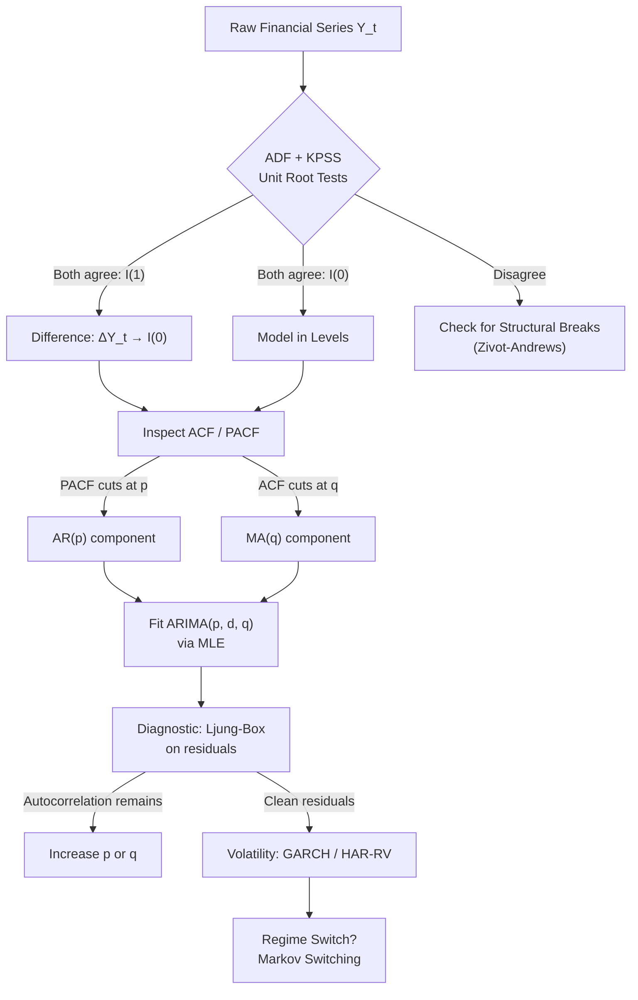

# Time Series Analysis

> [!abstract] TL;DR
> Financial time series are rarely well-behaved. Stationarity — a series with constant mean and variance — is the fundamental prerequisite for valid inference. The ADF and KPSS tests diagnose whether a series needs differencing; ARIMA models capture autocorrelation structure; HAR-RV extends these ideas to realized volatility using multi-scale daily/weekly/monthly lags; and Markov regime-switching models allow the data-generating process itself to change over time.

---

## Intuition — The Wandering City Temperature Analogy

Think of a stationary time series like a city's average summer temperature recorded year after year. It fluctuates around a fixed value — maybe 28°C with some noise — but it never drifts persistently upward or downward. You can make meaningful predictions because the process has a "home base" it gravitates toward.

A non-stationary series, by contrast, is like a random walk: each step is equally likely to go up or down, and there is no gravitational pull back toward any center. Stock prices are the canonical example. After 1000 steps, a random walk can be anywhere — its variance grows without bound as $\text{Var}(Y_t) = t\sigma^2$. Running a regression between two such independent wanderers can produce a high R² purely by chance (spurious regression), which is why diagnosing stationarity before any regression is non-negotiable.

The regime-switching intuition is different again: imagine a city that has two distinct climate regimes — summer and winter — and the series behaves differently in each. A single ARIMA model cannot capture both. Hamilton's Markov switching model allows the hidden "state" (regime) to govern the parameters, with the transitions between states following a Markov chain estimated from the data.

---

## How It Works



---

## Key Concepts

### Weak Stationarity

A process $\{Y_t\}$ is weakly (covariance) stationary if:

$$\mathbb{E}[Y_t] = \mu \quad \forall t$$
$$\text{Var}(Y_t) = \sigma^2 < \infty \quad \forall t$$
$$\text{Cov}(Y_t, Y_{t+h}) = \gamma(h) \quad \text{depends only on lag } h, \text{ not on } t$$

The autocovariance function $\gamma(h)$ and autocorrelation $\rho(h) = \gamma(h)/\gamma(0)$ are central objects. Strong stationarity additionally requires the entire joint distribution to be time-invariant — a stricter condition rarely needed in practice.

### Random Walk and I(1) Series

A random walk:

$$Y_t = Y_{t-1} + \epsilon_t, \quad \epsilon_t \sim \text{i.i.d.}(0, \sigma^2)$$

is non-stationary because $\text{Var}(Y_t) = t\sigma^2$ grows without bound. Such a series is integrated of order 1, written $Y_t \sim I(1)$. Differencing once yields $\Delta Y_t = \epsilon_t \sim I(0)$.

**Spurious regression (Granger-Newbold 1974):** Regressing two independent $I(1)$ series on each other yields $R^2 \to 1$ as $T \to \infty$ — a completely false signal of relationship. The t-statistics and F-statistics also diverge, making standard inference invalid.

### ADF Test

The Augmented Dickey-Fuller test embeds the unit root test inside an OLS regression:

$$\Delta y_t = \alpha + \beta t + \gamma y_{t-1} + \sum_{j=1}^{p} \delta_j \Delta y_{t-j} + \epsilon_t$$

- $H_0: \gamma = 0$ (unit root — non-stationary)
- $H_1: \gamma < 0$ (stationary)
- Lag order $p$ chosen by AIC/BIC
- 5% critical value $\approx -2.86$ (with constant, no trend); $\approx -3.41$ (with trend)
- The distribution is non-standard (Dickey-Fuller, not Student-t) — use tabulated CVs

### KPSS Test

The KPSS test reverses the null hypothesis:

- $H_0$: series is stationary (no unit root)
- $H_1$: unit root present
- Test statistic based on partial sums of OLS residuals
- 5% critical value $= 0.463$ (level stationarity)

**Joint interpretation strategy:**

| ADF result | KPSS result | Conclusion |
|------------|-------------|------------|
| Reject $H_0$ (stationary) | Fail to reject $H_0$ (stationary) | Stationary — proceed in levels |
| Fail to reject (unit root) | Reject (unit root) | I(1) — difference |
| Reject | Reject | Structural break — investigate |
| Fail to reject | Fail to reject | Long memory or near-unit-root — be cautious |

### ARIMA(p, d, q)

The general ARIMA model combines:
- **AR(p):** $Y_t = \phi_1 Y_{t-1} + \cdots + \phi_p Y_{t-p} + \epsilon_t$
- **MA(q):** $Y_t = \epsilon_t + \theta_1\epsilon_{t-1} + \cdots + \theta_q\epsilon_{t-q}$
- **d:** number of differences needed to achieve stationarity

ACF/PACF identification rules:
- **AR(p):** PACF cuts off sharply at lag $p$; ACF decays exponentially
- **MA(q):** ACF cuts off sharply at lag $q$; PACF decays exponentially
- **ARMA(p,q):** both decay gradually — use information criteria for selection

### HAR-RV Model

The Heterogeneous Autoregressive model of Realized Variance exploits the multi-scale structure of volatility:

$$RV_t = \beta_0 + \beta_d RV_{t-1} + \beta_w \overline{RV}_{t-5,t-1} + \beta_m \overline{RV}_{t-22,t-1} + \epsilon_t$$

where $\overline{RV}_{t-5,t-1} = \frac{1}{5}\sum_{j=1}^{5}RV_{t-j}$ (weekly average) and $\overline{RV}_{t-22,t-1}$ is the monthly average. This OLS regression on realized variance (from intraday 5-min returns) typically outperforms GARCH out-of-sample for daily variance forecasting.

### Markov Regime-Switching

Hamilton's (1989) model allows different means and variances across hidden states:

$$Y_t = \mu_{S_t} + \epsilon_t, \quad \epsilon_t \sim N(0, \sigma^2_{S_t})$$

where $S_t \in \{1, 2, \ldots, K\}$ follows a Markov chain with transition matrix $P_{ij} = \Pr(S_t = j \mid S_{t-1} = i)$. The hidden state is inferred via the Hamilton filter. Common application: identifying bull/bear regimes in equity returns, or high/low volatility regimes.

---

## Python Example

```python
import numpy as np
import pandas as pd
import yfinance as yf
from statsmodels.tsa.stattools import adfuller, kpss
from statsmodels.tsa.arima.model import ARIMA
from statsmodels.graphics.tsaplots import plot_acf, plot_pacf
import matplotlib.pyplot as plt

# --- Download data ---
ticker = "SPY"
data = yf.download(ticker, start="2015-01-01", end="2024-01-01", auto_adjust=True)
prices = data["Close"].dropna()
log_returns = np.log(prices / prices.shift(1)).dropna()

# --- ADF Test ---
adf_result = adfuller(log_returns, autolag="AIC")
print("=== ADF Test on Log Returns ===")
print(f"ADF Statistic : {adf_result[0]:.4f}")
print(f"p-value       : {adf_result[1]:.4f}")
print(f"Lags used     : {adf_result[2]}")
print(f"5% CV         : {adf_result[4]['5%']:.4f}")
if adf_result[1] < 0.05:
    print("→ Reject H0: series is stationary")
else:
    print("→ Fail to reject H0: possible unit root")

# --- KPSS Test ---
kpss_result = kpss(log_returns, regression="c", nlags="auto")
print("\n=== KPSS Test on Log Returns ===")
print(f"KPSS Statistic: {kpss_result[0]:.4f}")
print(f"p-value       : {kpss_result[1]:.4f}")
print(f"5% CV         : {kpss_result[3]['5%']:.4f}")
if kpss_result[0] < kpss_result[3]["5%"]:
    print("→ Fail to reject H0: series is stationary")
else:
    print("→ Reject H0: possible unit root")

# --- ACF / PACF visual ---
fig, axes = plt.subplots(1, 2, figsize=(12, 4))
plot_acf(log_returns, lags=30, ax=axes[0], title="ACF — SPY Log Returns")
plot_pacf(log_returns, lags=30, ax=axes[1], title="PACF — SPY Log Returns")
plt.tight_layout()
plt.show()

# --- ARIMA fit (simple AR(1) baseline) ---
model = ARIMA(log_returns, order=(1, 0, 0))
result = model.fit()
print("\n=== ARIMA(1,0,0) Summary ===")
print(result.summary())

# --- HAR-RV OLS (using daily squared returns as RV proxy) ---
rv = log_returns**2
rv_df = pd.DataFrame({"RV": rv})
rv_df["RV_w"] = rv_df["RV"].rolling(5).mean().shift(1)
rv_df["RV_m"] = rv_df["RV"].rolling(22).mean().shift(1)
rv_df["RV_lag1"] = rv_df["RV"].shift(1)
rv_df = rv_df.dropna()

import statsmodels.api as sm
X = sm.add_constant(rv_df[["RV_lag1", "RV_w", "RV_m"]])
y = rv_df["RV"]
har_model = sm.OLS(y, X).fit(cov_type="HAC", cov_kwds={"maxlags": 5})
print("\n=== HAR-RV Regression ===")
print(har_model.summary())
```

---

## Real-World Notes

- **Equity log returns** are almost always stationary (ADF strongly rejects). **Price levels** and **yield series** are typically I(1) or I(2).
- **Macro series** (GDP, CPI) often require both differencing and seasonal adjustment before modeling.
- The ADF test has **low power** against near-unit-root alternatives (e.g., AR(1) with $\phi = 0.97$). Use both ADF and KPSS.
- **HAR-RV** consistently outperforms GARCH for multi-step realized variance forecasts because it captures long-memory via the overlapping averages rather than exponential decay.
- Regime-switching models are computationally intensive but valuable for identifying regime-conditional risk — crucial for portfolio rebalancing triggers.

---

## Common Pitfalls

- **Running OLS on two I(1) series without testing** for cointegration first — produces spurious results with inflated R² and t-stats.
- **Using standard t-distribution critical values** for the ADF test — the Dickey-Fuller distribution has fatter left tails.
- **Over-differencing:** differencing an already-stationary series introduces MA(1) errors and loses information.
- **ARIMA on financial returns:** returns have almost no linear autocorrelation, but *squared* returns do. ARIMA fits the mean; GARCH fits the variance.
- **Ignoring structural breaks:** a single break in level or trend can cause the ADF test to falsely signal a unit root (Perron 1989).

---

## Related Concepts

- [[Cointegration]] — two I(1) series can share a stationary linear combination; requires understanding of unit roots
- [[GARCH_Models]] — models the conditional variance of (stationary) return series; complements ARIMA for the mean
- [[Regression_in_Finance]] — spurious regression risk makes stationarity testing a prerequisite
- [[Bayesian_Methods_Finance]] — Kalman filter is a Bayesian state-space model for dynamic time series

---

## Review Questions

1. A colleague regresses the 10-year Treasury yield on the S&P 500 price level and gets $R^2 = 0.82$ and a significant t-statistic. What is the most likely problem, and how would you diagnose it?
2. Explain why the ADF test critical value ($-2.86$) differs from the standard OLS t-statistic critical value ($-1.96$), and in which direction.
3. You fit an ARIMA(2,1,0) to a price series and find the Ljung-Box test rejects at lag 12. What does this tell you, and what should you do next?

---

## Sources

- Hamilton, J. D. (1994). *Time Series Analysis*. Princeton University Press.
- Dickey, D. A., & Fuller, W. A. (1979). Distribution of the Estimators for Autoregressive Time Series with a Unit Root. *JASA*.
- Kwiatkowski, D., Phillips, P. C. B., Schmidt, P., & Shin, Y. (1992). Testing the Null Hypothesis of Stationarity. *Journal of Econometrics*.
- Corsi, F. (2009). A Simple Approximate Long-Memory Model of Realized Volatility. *Journal of Financial Econometrics*.
- Granger, C. W. J., & Newbold, P. (1974). Spurious Regressions in Econometrics. *Journal of Econometrics*.

#quantitative-finance #statistical-methods #intermediate #time-series #stationarity #ARIMA
