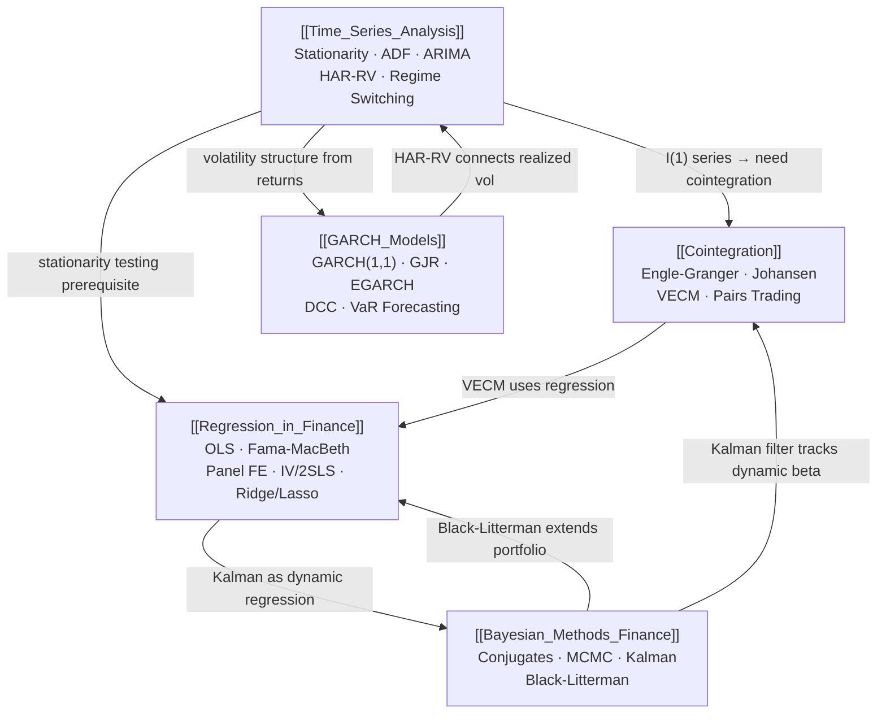

# Statistical Methods — Map of Content

> [!abstract] Statistical methods form the empirical backbone of quantitative finance, providing rigorous tools to model financial time series, estimate relationships between assets, and quantify uncertainty. This section covers everything from foundational time series theory through advanced volatility modeling and Bayesian inference — the toolkit every quant relies on before building strategies or pricing models. Mastering these methods separates practitioners who understand *why* a model works from those who merely run code.

---

## Concept Map

---

## Learning Path

| Step | Note | Why First |
|------|------|-----------|
| 1 | [[Time_Series_Analysis]] | Foundation — stationarity and unit roots underpin everything else |
| 2 | [[Regression_in_Finance]] | OLS and extensions are the workhorse for factor models and panels |
| 3 | [[Cointegration]] | Requires I(1) intuition from Time Series + regression mechanics |
| 4 | [[GARCH_Models]] | Needs returns series concepts; builds on time series structure |
| 5 | [[Bayesian_Methods_Finance]] | Synthesizes all prior tools under a probabilistic framework |

---

## All Notes at a Glance

| Note | Core Idea | Key Methods | Difficulty | Applications |
|------|-----------|-------------|------------|--------------|
| [[Time_Series_Analysis]] | Stationarity, ARIMA, regime switching | ADF, KPSS, ACF/PACF, HAR-RV | Intermediate | Vol forecasting, macro modeling |
| [[Regression_in_Finance]] | OLS and modern extensions for finance | Fama-MacBeth, Panel FE, Ridge, Lasso | Intermediate | Factor premia, asset pricing |
| [[Cointegration]] | Long-run equilibrium between I(1) series | Engle-Granger, Johansen, VECM | Advanced | Pairs trading, FX, rates |
| [[GARCH_Models]] | Conditional heteroskedasticity modeling | GARCH, GJR, EGARCH, DCC | Advanced | VaR, risk management, options |
| [[Bayesian_Methods_Finance]] | Probabilistic updating of beliefs | Conjugates, MCMC, Kalman, BL | Advanced | Portfolio optimization, filtering |

---

## Key Questions

1. When should you difference a series before regression, and what are the consequences of failing to do so?
2. Why does Fama-MacBeth produce different standard errors than a pooled OLS on the same data?
3. What is the economic intuition behind cointegration, and how does it differ from correlation?
4. How does GARCH(1,1) capture volatility clustering, and what parameter condition ensures mean reversion?
5. What does the Kalman filter's predict-update cycle have in common with Bayes' theorem?
6. In pairs trading, why is a stationary spread necessary, and what is the risk if cointegration breaks down?
7. How does the leverage effect in GJR-GARCH reflect the asymmetric behavior of equity markets?

---

## Related Sections

- [[_MOC_QuantFinance_Master]] — Master vault entry point
- [[05_Risk_Management/_MOC_Risk_Management]] — GARCH models feed directly into VaR and ES calculations
- [[07_Quant_Strategies/_MOC_Quant_Strategies]] — Cointegration and time series methods power statistical arbitrage
- [[09_ML_for_Finance/_MOC_ML_Finance]] — Bayesian methods and regularized regression (Ridge/Lasso) bridge stats and ML

---

#MOC #QuantitativeFinance #StatisticalMethods
