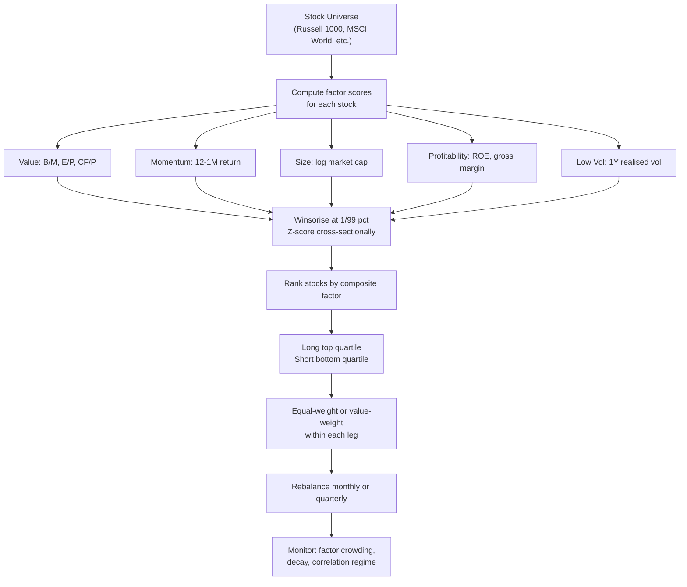

# Factor Investing

> [!abstract] **TL;DR** Factor investing is the systematic capture of return premia associated with persistent risk or behavioural factors — value, momentum, size, profitability, low volatility, and carry. These premia arise from either compensation for bearing systematic risk or from persistent behavioural biases that arbitrage cannot fully eliminate. The "factor zoo" problem (400+ published factors) demands rigorous multiple-testing correction (t > 3.0 post-2003). Across asset classes, the universal carry factor provides a unified framework: the expected return when nothing changes. Factor crowding and post-publication decay are the primary real-world risks.

---

## Intuition

Factor investing is like identifying recurring weather patterns in financial markets. Just as a meteorologist discovers that certain atmospheric conditions (high pressure, low humidity) reliably predict clear days, a factor investor discovers that certain stock characteristics (cheap valuation, strong past returns) reliably predict higher future returns. The weather patterns do not work every day — you get false signals, unexpected storms — but they are statistically robust over long periods.

The analogy extends further: just as a diversified farmer plants crops suited for different seasons (wheat for spring, corn for summer, root vegetables for autumn), a factor investor diversifies across value (which works in certain market regimes), momentum (different regime), carry (yet another), and profitability. No single factor works in all conditions, but the combination is more robust than any individual bet.

The key debate is whether these premia represent **compensation for risk** (you earn extra return because the factor exposes you to a genuine systematic risk that cannot be diversified away) or **behavioural mispricing** (investors systematically overpay for glamour/growth and underpay for value, and arbitrage is imperfect due to limits-to-arbitrage). In practice, most factors have both components — and both can generate real, persistent premia.

---

## How It Works



---

## Key Concepts

### 1. Core Equity Factors

| Factor | Construction | Ann. Sharpe (gross) | Economic Rationale |
|--------|-------------|---------------------|-------------------|
| Market (MKT) | Portfolio − $R_f$ | ~0.4–0.5 | Compensation for undiversifiable systematic risk |
| Size (SMB) | Small-cap minus Large-cap | ~0.2–0.3 | Liquidity premium; small firms are harder to arbitrage |
| Value (HML) | High B/M minus Low B/M | ~0.3–0.4 | Distress risk; overreaction to growth expectations |
| Momentum (UMD) | 12-1M winners minus losers | ~0.5–0.7 | Behavioural underreaction to news |
| Profitability (RMW) | Robust minus Weak gross profit | ~0.3–0.4 | Mispricing; high-quality firms undervalued |
| Low Volatility | Low-vol minus High-vol | ~0.3 | Leverage constraints; investor preference for lottery stocks |

**Fama-French three-factor model:**
$$r_i - r_f = \alpha_i + \beta_i^{MKT}(r_m - r_f) + \beta_i^{SMB}\,SMB + \beta_i^{HML}\,HML + \epsilon_i$$

**Five-factor extension** adds $RMW$ (profitability) and $CMA$ (investment/asset growth).

### 2. Factor Construction Details

**Scoring pipeline:**
1. For each stock $i$, compute raw characteristic $X_i$ (e.g., book-to-market ratio)
2. **Winsorise** at 1st and 99th percentile to remove extreme outliers: $X_i^{win} = \max(X_{P1}, \min(X_{P99}, X_i))$
3. **Z-score** cross-sectionally: $z_i = (X_i^{win} - \bar{X}) / \sigma_X$
4. **Portfolio construction**: long top quartile ($z > 0.67$), short bottom quartile ($z < -0.67$)
5. **Weighting**: equal-weight (simpler, avoids mega-cap domination) or value-weight (more capacity)

**Composite signal**: combine multiple factors (e.g., composite value = mean z-score of B/M, E/P, S/P). IC-weighted combination improves if factors have different predictive power.

### 3. The Factor Zoo Problem

Cochrane (2011) "Discount Rates" presidential address highlighted that academia had published hundreds of stock return predictors, most of which were likely statistical artefacts. Harvey, Liu & Zhu (2016) catalogued **400+ published factors** and argued that with massive multiple testing, spurious discovery rates are extremely high.

**Post-2003 threshold**: McLean & Pontiff (2016) showed that factors earn $\sim 26\%$ lower returns after publication — suggesting that at least part of the premia is behavioural mispricing that arbitrageurs erode. The recommended t-statistic threshold:

$$t_{\text{threshold}} = 3.0 \quad (\text{post-2003, to control for multiple testing})$$

This corresponds to p < 0.003 rather than the conventional 0.05 threshold (which gives t = 2.0).

### 4. Universal Carry (AMP Framework)

Asness, Moskowitz & Pedersen (2013) define **carry** as the expected return if asset prices remain unchanged:

$$C_i = \frac{F_{t+1}^{expected} - P_t}{P_t}$$

Universal carry across asset classes:

| Asset Class | Carry Measure | Economic Interpretation |
|-------------|---------------|------------------------|
| FX | Forward premium $(F - S)/S$ | Interest rate differential |
| Equities | Dividend yield $- r_f$ | Earnings yield minus financing |
| Fixed Income | Bond yield $- r_f$ | Term premium |
| Commodities | Spot $-$ Futures (backwardation) | Convenience yield + storage cost |

Combined multi-asset carry achieves Sharpe $\approx 0.5$–$0.8$. Combined with value and momentum (AMP), Sharpe $\approx 1.0$–$1.3$.

### 5. The Fama Puzzle (UIP Failure)

Under Uncovered Interest Rate Parity (UIP), high-interest currencies should depreciate to offset the yield advantage — eliminating FX carry returns. Instead, the Fama (1984) regression:

$$\Delta s_{t+1} = \alpha + \beta (f_t - s_t) + \epsilon_{t+1}$$

finds $\hat{\beta} \approx -0.8$ instead of the UIP-implied $+1.0$. High-yield currencies tend to **appreciate** further — the carry trade works. The HML_FX carry Sharpe is approximately $0.5$–$0.8$ historically, with crash risk during global risk-off episodes (e.g., 2008).

### 6. Factor Crowding and Post-Publication Decay

**Crowding dynamics**: As more capital flows into factor strategies, the spread compresses. Monitoring tools:
- **Factor momentum**: if value factor has been profitable for 12 months, more capital enters → future returns lower
- **Option-implied correlations**: high correlation between factor-long stocks signals crowding
- **Short interest**: high short interest on factor-short stocks signals potential short squeeze

**McLean-Pontiff decay**: factors earn $\sim 32\%$ of pre-publication alpha post-publication. This implies systematic post-publication discounts should be built into factor return expectations.

---

## Python Example

```python
import numpy as np
import pandas as pd

def construct_factor_portfolio(characteristics: pd.DataFrame,
                                factor_name: str,
                                top_pct: float = 0.25,
                                winsor_bounds: tuple = (0.01, 0.99)) -> pd.Series:
    """
    Construct a long-short factor portfolio from stock characteristics.
    
    Args:
        characteristics: DataFrame (rows=dates, cols=stocks) with raw factor scores
        factor_name:      Name for display
        top_pct:          Fraction to long/short (0.25 = top/bottom quartile)
        winsor_bounds:    Winsorisation percentiles
    
    Returns:
        Daily/monthly factor portfolio returns
    """
    portfolio_returns_list = []
    
    for date, row in characteristics.iterrows():
        valid = row.dropna()
        if len(valid) < 10:
            continue
        
        # Winsorise
        lo, hi = valid.quantile(winsor_bounds[0]), valid.quantile(winsor_bounds[1])
        winsorised = valid.clip(lo, hi)
        
        # Z-score
        z = (winsorised - winsorised.mean()) / winsorised.std()
        
        # Long top quartile, short bottom quartile
        long_stocks = z[z >= z.quantile(1 - top_pct)].index
        short_stocks = z[z <= z.quantile(top_pct)].index
        
        n_long, n_short = len(long_stocks), len(short_stocks)
        weights = pd.Series(0.0, index=valid.index)
        if n_long > 0:
            weights[long_stocks] = 1.0 / n_long
        if n_short > 0:
            weights[short_stocks] = -1.0 / n_short
        
        portfolio_returns_list.append({'date': date, 'weights': weights})
    
    return portfolio_returns_list


def factor_backtest(stock_returns: pd.DataFrame,
                    factor_scores_dict: dict) -> pd.DataFrame:
    """
    Backtest multiple factors and compare cumulative returns.
    
    Args:
        stock_returns:      Monthly returns (rows=dates, cols=stocks)
        factor_scores_dict: {factor_name: characteristics_DataFrame}
    
    Returns:
        DataFrame of monthly factor portfolio returns
    """
    factor_pnl = {}
    
    for fname, chars in factor_scores_dict.items():
        monthly_ret = []
        for t in range(1, len(chars)):
            date = chars.index[t]
            scores = chars.iloc[t-1]   # use lagged scores to avoid look-ahead
            valid = scores.dropna()
            
            if len(valid) < 10 or date not in stock_returns.index:
                continue
            
            lo, hi = valid.quantile(0.01), valid.quantile(0.99)
            z = (valid.clip(lo, hi) - valid.mean()) / valid.std()
            
            long_s = z[z >= z.quantile(0.75)].index
            short_s = z[z <= z.quantile(0.25)].index
            
            common_l = long_s.intersection(stock_returns.columns)
            common_s = short_s.intersection(stock_returns.columns)
            
            ret_t = stock_returns.loc[date]
            pnl = 0.0
            if len(common_l) > 0:
                pnl += ret_t[common_l].mean()
            if len(common_s) > 0:
                pnl -= ret_t[common_s].mean()
            
            monthly_ret.append({'date': date, fname: pnl})
        
        if monthly_ret:
            factor_pnl[fname] = (pd.DataFrame(monthly_ret)
                                   .set_index('date')[fname])
    
    result = pd.DataFrame(factor_pnl)
    
    # Summary statistics
    print("\n=== Factor Performance Summary ===")
    for col in result.columns:
        ann_ret = result[col].mean() * 12
        ann_vol = result[col].std() * np.sqrt(12)
        sharpe = ann_ret / ann_vol if ann_vol > 0 else 0
        print(f"{col:15s} | Ann. Ret: {ann_ret:.2%} | Vol: {ann_vol:.2%} | "
              f"Sharpe: {sharpe:.2f} | Skew: {result[col].skew():.2f}")
    
    return result


# --- Synthetic multi-factor demonstration ---
np.random.seed(2024)
n_stocks, n_months = 200, 120
dates = pd.date_range("2015-01-01", periods=n_months, freq="ME")
tickers = [f"STOCK_{i:03d}" for i in range(n_stocks)]

# True factor premia
value_alpha = np.random.randn(n_stocks) * 0.002    # value scores → return
mom_alpha = np.random.randn(n_stocks) * 0.003      # momentum → return

stock_returns = pd.DataFrame(
    np.random.randn(n_months, n_stocks) * 0.05,
    index=dates, columns=tickers
) + value_alpha + mom_alpha

# Simulated factor scores (B/M for value, 12M return for momentum)
value_scores = pd.DataFrame(
    np.random.randn(n_months, n_stocks) + value_alpha * 100,
    index=dates, columns=tickers
)
momentum_scores = pd.DataFrame(
    np.random.randn(n_months, n_stocks) + mom_alpha * 100,
    index=dates, columns=tickers
)

results = factor_backtest(stock_returns, {
    'Value (HML)': value_scores,
    'Momentum (UMD)': momentum_scores
})

# Cumulative returns
cum_returns = (1 + results).cumprod()
print("\nFinal cumulative values:")
print(cum_returns.iloc[-1].round(3))
```

---

## Real-World Notes

- **AQR Capital Management**: The leading academic-practitioner factor shop. Their value+momentum+carry combination (AMP portfolio) achieves Sharpe ~1.0–1.3 in live portfolios, though the last decade of value underperformance (2009–2021) tested investor patience severely.
- **Value underperformance 2009–2021**: The longest-running value drought in history raised questions about whether the premium had disappeared. Evidence suggests: (1) value is cyclical, not dead; (2) intangible assets require book-value adjustments; (3) crowded long-short implementation creates unnecessary factor timing risk.
- **ETF proliferation**: "Smart beta" ETFs (iShares, Invesco) now offer factor exposure at 10–30 bps expense ratios, making factor investing accessible beyond institutional investors. This increased inflows may have compressed the premia, though evidence is mixed.
- **Factor timing**: Attempting to time which factor will outperform is notoriously difficult. The marginal benefit of factor timing vs. strategic allocation is small, and timing errors are costly.

---

## Common Pitfalls

- **Ignoring turnover in backtests**: Factor portfolios with monthly rebalancing generate 100–200% turnover. At 10–20 bps round-trip TC, this is 1–4% annual drag — often eliminating the stated alpha.
- **Data snooping in factor construction**: Tuning the scoring period, lookback, and portfolio construction rules on the same data that "discovers" the factor is a textbook overfitting error.
- **Single-metric factors**: Using only one valuation metric (e.g., P/E alone) is noisier than a composite (P/E + P/B + P/CF). Composites are more robust to industry accounting differences.
- **Ignoring the quality of factor exposure**: An ETF claiming "value exposure" may simply hold low-momentum stocks (sector concentration in energy/financials). Verify actual factor loadings with Fama-French regression.
- **Survivorship bias in long-run returns**: Long historical backtests (pre-1990) are subject to extreme data survivorship bias. Focus on out-of-sample evidence and live fund returns.

---

## Related Concepts

- [[Momentum_Strategies]] — UMD factor in detail; cross-sectional and time-series momentum
- [[Statistical_Arbitrage]] — uses PCA factors to define fair value; stat arb is factor-neutral
- [[Pairs_Trading]] — a factor-neutral two-asset long-short; must verify sector/factor exposures
- [[Mean_Reversion]] — value investing is a form of long-horizon mean reversion (P/fundamental → mean)
- [[_MOC_Risk_Management]] — factor exposure limits, crowding monitoring, factor VaR
- [[_MOC_Backtesting]] — walk-forward tests, multiple testing correction, out-of-sample validation

---

## Review Questions

1. The Fama-French HML factor has a historical Sharpe of ~0.35. Post-2010, it has been close to zero. Give two non-mutually-exclusive explanations: one risk-based and one mispricing-based. What evidence would distinguish between them?
2. You discover a new factor with t-statistic of 2.8 over a 20-year backtest. Should you trade it? What additional tests would you require before allocating capital?
3. Explain why a factor investor needs to care about **crowding** even if they believe the factor premium is driven by genuine risk compensation rather than behavioural mispricing.

---

## Sources

- Fama, E. & French, K. (1993). "Common Risk Factors in the Returns on Stocks and Bonds." *Journal of Financial Economics*, 33(1), 3–56.
- Asness, C., Moskowitz, T. & Pedersen, L. (2013). "Value and Momentum Everywhere." *Journal of Finance*, 68(3), 929–985.
- Cochrane, J. (2011). "Presidential Address: Discount Rates." *Journal of Finance*, 66(4), 1047–1108.
- Harvey, C., Liu, Y. & Zhu, H. (2016). "… and the Cross-Section of Expected Returns." *Review of Financial Studies*, 29(1), 5–68.
- McLean, R. & Pontiff, J. (2016). "Does Publishing Research Destroy Stock Return Predictability?" *Journal of Finance*, 71(1), 5–32.
- Fama, E. (1984). "Forward and Spot Exchange Rates." *Journal of Monetary Economics*, 14(3), 319–338.

#quantitative-finance #quant-strategies #advanced #factor-investing #smart-beta #value #momentum #carry #factor-zoo
