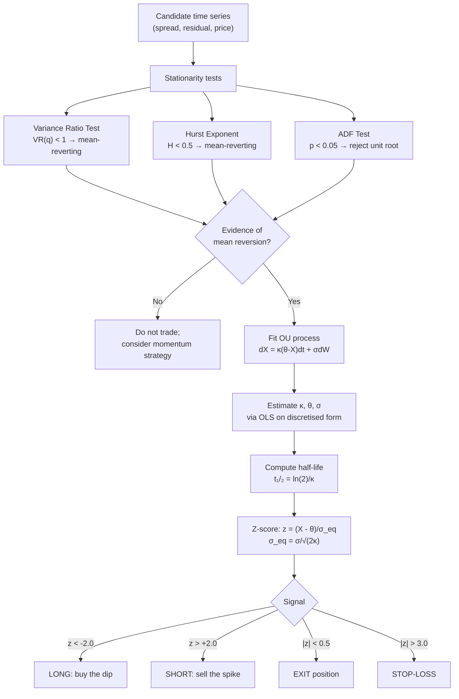

# Mean Reversion

> [!abstract] **TL;DR** Mean reversion is the empirical tendency of prices or spreads to return toward a long-run average after deviating from it. It is diagnosed with the variance ratio test, Hurst exponent, and autocorrelation analysis, then operationalised via the Ornstein-Uhlenbeck (OU) process. The OU half-life governs trading frequency; a z-score signal drives entry/exit; and Kelly-optimal sizing exploits the magnitude of deviation. Mean reversion is the statistical engine powering [[Pairs_Trading]] and [[Statistical_Arbitrage]].

---

## Intuition

Mean reversion is like a rubber band. When you stretch it away from its natural resting length, the restoring force grows proportionally — the further you pull, the harder it snaps back. But there is an important limit: if you stretch it too far, it breaks. In financial terms, "breaking" is a regime change — a structural shift in the underlying asset that means the old equilibrium no longer exists.

This rubber-band analogy carries two critical trading implications. First, the strength of the signal grows with the deviation: a z-score of −3 is a stronger long signal than a z-score of −1, so position size should scale with the z-score. Second, there must always be a stop-loss — because if the band breaks (a company goes bankrupt, a currency regime collapses, a central bank changes policy), waiting for reversion is catastrophic. The discipline is identifying situations where the rubber band is merely stretched versus situations where it has snapped.

Practically, mean reversion operates on **spreads and residuals**, not raw prices. Equity prices themselves tend to be random walks (non-stationary); you cannot reliably bet that Amazon's stock will revert to $100. But the spread between two structurally linked stocks, or the factor-neutralised residual of a single stock, can exhibit genuine mean-reversion because a cointegrating relationship ties them together.

---

## How It Works



---

## Key Concepts

### 1. Diagnosing Mean Reversion

**Variance Ratio Test:**

The variance ratio at lag $q$ is:

$$VR(q) = \frac{\text{Var}(r_{t,t+q})}{q \cdot \text{Var}(r_t)}$$

For a random walk, $VR(q) = 1$ by construction (variance scales linearly). $VR < 1$ signals mean reversion (negative serial correlation); $VR > 1$ signals momentum.

**Hurst Exponent:**

The rescaled range statistic measures how the range of increments scales with the observation horizon $\tau$:

$$\mathbb{E}\left[\|X(t + \tau) - X(t)\|\right] \propto \tau^H$$

| $H$ value | Regime |
|-----------|--------|
| $H < 0.5$ | Mean-reverting (anti-persistent) |
| $H = 0.5$ | Random walk (geometric Brownian motion) |
| $H > 0.5$ | Trending (persistent) |

**Negative lag-1 autocorrelation:** $\rho_1 = \text{Corr}(r_t, r_{t-1}) < 0$ is a simple but noisy diagnostic.

### 2. The Ornstein-Uhlenbeck Process

The OU process is the continuous-time mean-reverting diffusion:

$$dX = \kappa(\theta - X)\,dt + \sigma\,dW$$

where:
- $\kappa > 0$: speed of mean reversion (higher = faster)
- $\theta$: long-run mean level
- $\sigma$: diffusion volatility
- $W$: standard Brownian motion

The equilibrium (stationary) distribution is $X_\infty \sim \mathcal{N}(\theta,\, \sigma^2 / 2\kappa)$, giving equilibrium standard deviation:

$$\sigma_{eq} = \frac{\sigma}{\sqrt{2\kappa}}$$

### 3. Parameter Estimation via OLS

Discretise the OU SDE to an AR(1):

$$\Delta X_t = a + b X_{t-1} + \epsilon_t$$

Regress $\Delta X_t$ on $X_{t-1}$. Then recover OU parameters:

$$\kappa = -\frac{\ln(1 + b)}{\Delta t}, \quad \theta = -\frac{a}{b}, \quad \sigma = \frac{\text{std}(\epsilon)}{\sqrt{\Delta t}}$$

For daily data, $\Delta t = 1/252$ (annualised) or $1$ (daily scale).

### 4. Half-Life and Trading Frequency

The **half-life** is the expected time for the process to move halfway back to its mean from an extreme:

$$t_{1/2} = \frac{\ln 2}{\kappa}$$

This directly governs strategy frequency:
- $t_{1/2} = 2$ days: trade intraday; extremely sensitive to transaction costs
- $t_{1/2} = 5$–$15$ days: daily rebalancing is appropriate
- $t_{1/2} = 30$ days: weekly rebalancing; moderate turnover
- $t_{1/2} = 90$ days: monthly; suitable for less liquid instruments
- $t_{1/2} > 90$ days: spread recovers too slowly to overcome TC per round trip

### 5. Z-Score Signal and Kelly Sizing

The standardised z-score positions the current value relative to the OU equilibrium:

$$z_t = \frac{X_t - \theta}{\sigma_{eq}}$$

**Standard thresholds:**

| Condition | Action |
|-----------|--------|
| $z_t < -k_e = -2.0$ | Open long |
| $z_t > +k_e = +2.0$ | Open short |
| $\|z_t\| < k_x = 0.5$ | Exit position |
| $\|z_t\| > k_s = 3.0$ | Stop-loss exit |

**Kelly-optimal sizing for OU strategy:**

$$f^* = \frac{\kappa(\theta - X) - r_f}{\sigma^2} = \frac{\kappa \cdot z \cdot \sigma_{eq} - r_f}{\sigma^2}$$

Proportional to $-z$ (scale up when further from mean), adjusted for risk-free rate and risk aversion.

### 6. Real-World Applications Beyond Spreads

- **Index Rebalancing**: Stocks added to an index spike on announcement; their price mean-reverts over subsequent weeks as initial demand pressure subsides.
- **VIX Mean Reversion**: The VIX consistently reverts to $\sim 20\%$. Elevated VIX ($> 30$) is a statistically attractive time to sell (far out-of-the-money) put options — a form of volatility mean-reversion trade.
- **Interest Rate Spreads**: Credit spreads, swap spreads, and basis between on/off-the-run Treasuries all exhibit mean-reverting behaviour.

---

## Python Example

```python
import numpy as np
import pandas as pd
from scipy.stats import linregress

def hurst_exponent(ts: np.ndarray, max_lag: int = 100) -> float:
    """
    Compute Hurst exponent via the rescaled range (R/S) method.
    H < 0.5: mean-reverting | H = 0.5: random walk | H > 0.5: trending
    """
    lags = range(2, max_lag)
    rs_values = []
    for lag in lags:
        # Divide series into chunks of size `lag`
        n_chunks = len(ts) // lag
        rs_chunk = []
        for c in range(n_chunks):
            chunk = ts[c * lag:(c + 1) * lag]
            detrended = chunk - np.mean(chunk)
            cumulative = np.cumsum(detrended)
            R = cumulative.max() - cumulative.min()
            S = np.std(chunk, ddof=1)
            if S > 0:
                rs_chunk.append(R / S)
        if rs_chunk:
            rs_values.append(np.mean(rs_chunk))
    
    log_lags = np.log(list(lags)[:len(rs_values)])
    log_rs = np.log(rs_values)
    H, _, _, _, _ = linregress(log_lags, log_rs)
    return H


def fit_ou_parameters(X: np.ndarray, dt: float = 1.0) -> dict:
    """
    Fit OU parameters by OLS on the discretised form:
    ΔX_t = a + b * X_{t-1} + ε_t
    
    Returns dict with: kappa, theta, sigma, sigma_eq, half_life
    """
    delta_X = np.diff(X)
    X_lag = X[:-1]
    
    slope, intercept, r, p, se = linregress(X_lag, delta_X)
    b, a = slope, intercept
    
    kappa = -np.log(1 + b) / dt if (1 + b) > 0 else 1e-6
    theta = -a / b if b != 0 else np.mean(X)
    
    residuals = delta_X - (a + b * X_lag)
    sigma = np.std(residuals) / np.sqrt(dt)
    sigma_eq = sigma / np.sqrt(2 * max(kappa, 1e-6))
    half_life = np.log(2) / max(kappa, 1e-6)
    
    return {
        'kappa': round(kappa, 6),
        'theta': round(theta, 6),
        'sigma': round(sigma, 6),
        'sigma_eq': round(sigma_eq, 6),
        'half_life_days': round(half_life, 2),
        'ar1_coef_b': round(b, 6),
        'r_squared': round(r**2, 4)
    }


def mean_reversion_backtest(X: pd.Series, k_entry: float = 2.0,
                             k_exit: float = 0.5, k_stop: float = 3.0,
                             lookback: int = 252) -> pd.DataFrame:
    """
    Z-score mean reversion strategy on a single time series X.
    Returns daily P&L, cumulative P&L, and z-scores.
    """
    params = fit_ou_parameters(X.values[:lookback])
    theta = params['theta']
    sigma_eq = params['sigma_eq']
    
    # Rolling z-score for out-of-sample portion
    z = pd.Series(index=X.index, dtype=float)
    for t in range(lookback, len(X)):
        mu_t = X.iloc[t-lookback:t].mean()
        std_t = X.iloc[t-lookback:t].std()
        z.iloc[t] = (X.iloc[t] - mu_t) / std_t if std_t > 0 else 0.0
    
    position = pd.Series(0.0, index=X.index)
    pos = 0.0
    
    for t in range(lookback, len(z)):
        zt = z.iloc[t]
        if np.isnan(zt):
            continue
        if pos == 0.0:
            if zt < -k_entry:
                pos = 1.0
            elif zt > k_entry:
                pos = -1.0
        elif pos == 1.0:
            if zt > -k_exit or zt > k_stop:
                pos = 0.0
        elif pos == -1.0:
            if zt < k_exit or zt < -k_stop:
                pos = 0.0
        position.iloc[t] = pos
    
    daily_pnl = position.shift(1) * X.diff()
    result = pd.DataFrame({
        'X': X, 'z_score': z, 'position': position,
        'daily_pnl': daily_pnl, 'cumulative_pnl': daily_pnl.cumsum()
    })
    
    ann_sharpe = daily_pnl.mean() / daily_pnl.std() * np.sqrt(252)
    print(f"OU params: {params}")
    print(f"Sharpe: {ann_sharpe:.2f} | Total P&L: {daily_pnl.sum():.4f}")
    return result


# --- Smoke test: simulate an OU process and trade it ---
np.random.seed(42)
n = 1000
dt = 1.0
kappa_true, theta_true, sigma_true = 0.05, 0.0, 0.02
X_sim = np.zeros(n)
for t in range(1, n):
    X_sim[t] = X_sim[t-1] + kappa_true * (theta_true - X_sim[t-1]) * dt \
               + sigma_true * np.sqrt(dt) * np.random.randn()

ts = pd.Series(X_sim, index=pd.date_range("2020-01-01", periods=n, freq="B"))

print("=== OU Parameter Estimation ===")
est = fit_ou_parameters(X_sim)
print(f"True κ={kappa_true}, Estimated κ={est['kappa']}")
print(f"True σ={sigma_true}, Estimated σ={est['sigma']}")

print(f"\n=== Hurst Exponent ===")
H = hurst_exponent(X_sim)
print(f"Estimated H = {H:.3f} (< 0.5 confirms mean reversion)")

print("\n=== Backtest ===")
bt = mean_reversion_backtest(ts, lookback=100)
```

---

## Real-World Notes

- **VIX Mean Reversion**: The VIX has a long-run mean near 18–20%. Studies show the OU half-life for VIX is roughly 10–15 days. This underpins systematic volatility-selling strategies (e.g., short VIX ETPs) that were profitable for years until the February 2018 "Volmageddon" event demonstrated catastrophic tail risk.
- **Intraday vs Multi-day**: Intraday mean reversion (seconds to minutes) is driven by bid-ask bounce and market microstructure. Multi-day reversion is driven by fundamental anchoring. The two regimes require completely different infrastructure (co-location vs daily data) and different risk management.
- **Commodity mean reversion**: Agricultural commodity prices revert to a cost-of-production floor over multi-year horizons — a genuine economic anchor that is distinct from pure statistical noise.

---

## Common Pitfalls

- **Non-stationarity of raw prices**: Never apply z-score signals directly to absolute price levels without testing stationarity. Most prices are I(1) random walks.
- **Hurst estimation sensitivity**: The R/S method is sensitive to the max-lag parameter and has substantial estimation error for short series. Use multiple methods (variance ratio, ADF, Hurst) and require agreement.
- **OU estimation in trending markets**: During strong trends, short-window OLS yields spuriously negative $b$ (apparent mean reversion) because the residuals from the mean are serially correlated with the trend component. Detrend first.
- **Ignoring the "band breaks" case**: No stop-loss is the most common reason mean-reversion strategies suffer catastrophic drawdowns. Always define the regime-change condition before entering.
- **Overfitting $\kappa$ to short samples**: With $T = 60$ days, the standard error on $\kappa$ can be $> 50\%$ of the estimate. Use at least 3–5 half-lives of data for reliable estimation.

---

## Related Concepts

- [[Statistical_Arbitrage]] — applies OU/z-score framework to factor-neutralised equity residuals
- [[Pairs_Trading]] — applies mean reversion to the spread between cointegrated pairs
- [[Momentum_Strategies]] — the opposite regime: $H > 0.5$, trending markets
- [[Factor_Investing]] — value factor is implicitly a mean-reversion bet on price-to-fundamental ratios
- [[_MOC_Statistical_Methods]] — ADF test, variance ratio, cointegration — the diagnostic toolkit

---

## Review Questions

1. A time series has Hurst exponent $H = 0.35$. What does this imply about its return autocorrelation? Derive the relationship between $H$ and the autocorrelation of increments.
2. You estimate an OU process on a spread and find $\kappa = 0.02$ (daily). Compute the half-life in calendar days. Given round-trip costs of 5 bps and a $\sigma_{eq} = 0.03$, is a z-score entry at $\pm 2.0$ economically viable?
3. Explain why applying a mean-reversion z-score strategy directly to raw equity prices (rather than to a spread or factor residual) is likely to fail, even if the price series shows negative lag-1 autocorrelation in some sample.

---

## Sources

- Avellaneda, M. & Lee, J. (2010). "Statistical Arbitrage in the US Equities Market." *Quantitative Finance*, 10(7), 761–782.
- Chan, E. (2013). *Algorithmic Trading: Winning Strategies and Their Rationale*. Wiley. (Chapters 4–5)
- Lo, A. & MacKinlay, A. (1988). "Stock Market Prices Do Not Follow Random Walks." *Review of Financial Studies*, 1(1), 41–66.
- Hurst, H. (1951). "Long-Term Storage Capacity of Reservoirs." *Transactions of the American Society of Civil Engineers*, 116, 770–799.

#quantitative-finance #quant-strategies #intermediate #mean-reversion #ornstein-uhlenbeck #hurst #variance-ratio
