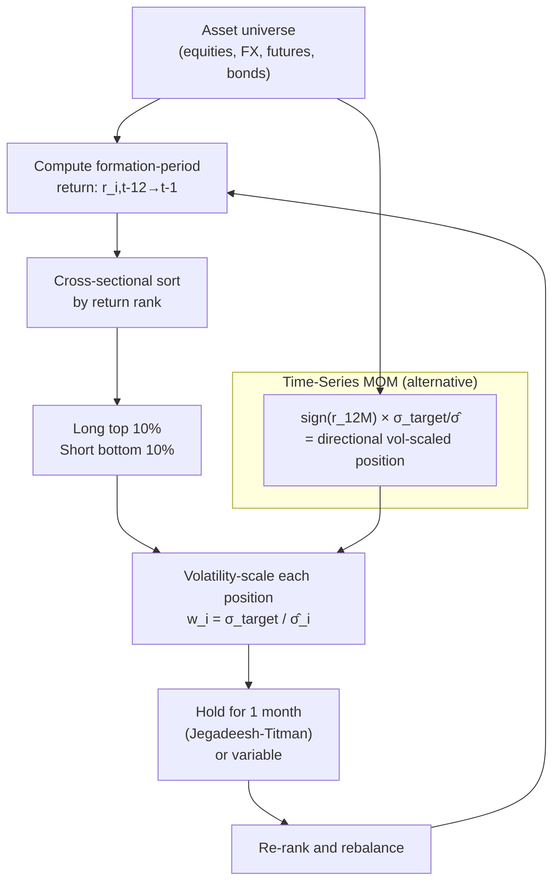

# Momentum Strategies

> [!abstract] **TL;DR** Momentum is the empirical finding that assets with strong recent performance continue to outperform (and vice versa) over the subsequent 1–12 months. Two flavours: cross-sectional momentum sorts assets by relative rank (long top decile, short bottom decile), while time-series momentum (TSMOM) takes directional positions proportional to each asset's own past return. Both strategies require volatility scaling to maintain constant risk exposure. The critical weakness is momentum crashes during sharp market reversals — the strategy is implicitly short put options on recent losers.

---

## Intuition

Think of momentum like a boulder rolling downhill. Once it gains speed, gravity and inertia keep it moving in the same direction. It takes a substantial obstacle — a cliff face, a counterslope — to stop or reverse it. For months on end it simply keeps rolling, and the smart bet is to ride alongside rather than stand in front of it.

But here is the key danger: when a boulder hits a wall, it does not stop — it bounces back with surprising force. The 2009 momentum crash exemplifies this. After a prolonged bear market, previous losers (beaten-down financial stocks) surged violently during the initial recovery while previous winners (defensive stocks) lagged. Momentum portfolios, heavily short the recent losers, were devastated. The boulder hit the wall of a bear market rally and rebounded into the strategy.

The "frog-in-the-pan" hypothesis offers a behavioural explanation: when information arrives in small, continuous doses, investors underreact incrementally — updating their views slowly — which creates persistent return continuation. When information arrives as a single large shock, investors react immediately and fully, causing reversal rather than momentum. This explains why earnings drift (small continuous surprises) generates momentum, while post-earnings announcement jumps tend to mean-revert.

---

## How It Works



---

## Key Concepts

### 1. Cross-Sectional Momentum (Jegadeesh-Titman 1993)

Rank all stocks by their past 12-to-1 month return (skip the most recent month to avoid short-term reversal):

$$r_{i, \text{formation}} = \frac{P_{i,t-1}}{P_{i,t-12}} - 1$$

Long the top decile (winners), short the bottom decile (losers). Equal-weight within each decile. The original Jegadeesh-Titman paper found **~1%/month gross alpha** in US equities, robust to most controls.

**Note:** Skip 1 month between formation and holding period because of short-term reversal at lag-1 (bid-ask bounce + microstructure).

### 2. Time-Series Momentum (TSMOM, Moskowitz-Ooi-Pedersen 2012)

TSMOM takes each asset's own past 12-month return as signal, regardless of cross-asset ranking:

$$w_{i,t} = \text{sign}(r_{i,t-12:t-1}) \times \frac{\sigma_{target}}{\hat{\sigma}_{i,t}}$$

Properties:
- Diversifies across asset classes (equities, FX, rates, commodities)
- Sign gives direction; volatility scaling gives consistent risk contribution
- Approximately equivalent to a delta-hedged straddle: profits from large moves in either direction when the signal is right

### 3. Volatility Scaling

Without scaling, high-volatility assets dominate P&L. The scaling formula:

$$w_{i,t}^{scaled} = \frac{\sigma_{target}}{\hat{\sigma}_{i,t}} \times \text{signal}_{i,t}$$

where $\hat{\sigma}_{i,t}$ is the exponentially weighted historical volatility (common: $\lambda = 0.94$, i.e., EWMA with 20-day half-life). This targets a constant ex-ante risk per position and roughly halves volatility relative to an unscaled portfolio.

### 4. Multi-Lookback Signal Combination

Different investors react on different horizons. Combine signals with IC-weighted blending:

$$\text{IC}(h) \approx \text{IC}(1) \cdot e^{-\rho h}$$

For lookback horizons $h \in \{1, 3, 6, 12\}$ months, the composite signal:

$$\text{Signal}_{i,t} = \sum_h \text{IC}(h) \cdot r_{i,t-h:t-1} / \hat{\sigma}_{i,t-h:t-1}$$

Weights are the information coefficients — how predictive each lookback is for next-period returns.

### 5. Momentum Crash Mechanism (Daniel-Moskowitz 2016)

A momentum portfolio that is long winners and short losers is implicitly **short put options** on the losers. Here is why:

- After a prolonged bear market, losers (the short leg) have high optionality — they can recover dramatically if bad news reverses
- When the market reverses sharply (bear market rally), these losers spike: the short leg loses while the long leg (recent winners = defensive stocks) lags
- The momentum portfolio experiences a crash driven by option-like convexity in the losers

Empirically: momentum strategies exhibit **negative skewness of −1.5 to −2.0** and occasional large drawdowns (−50% to −80%) during bear-market reversals. The 2001 dotcom reversal and 2009 recovery rally are canonical examples.

**Crash mitigation:**

| Method | Implementation |
|--------|---------------|
| VIX regime filter | Scale down positions when VIX $> 25$ |
| Drawdown control | Reduce gross exposure when portfolio DD $> 10\%$ |
| Momentum of momentum | Only trade assets with stable recent momentum |
| Bear market filter | Reduce short leg exposure when SPX $< 200$-day MA |

### 6. Cross-Asset Momentum Evidence

| Asset Class | Evidence | Annual Gross Sharpe |
|-------------|----------|---------------------|
| Equities | Very strong (Jegadeesh-Titman) | ~0.5–0.7 |
| Commodities | Moderate | ~0.3–0.5 |
| FX | Moderate | ~0.3–0.5 |
| Fixed Income | Weaker | ~0.2–0.4 |
| Multi-asset TSMOM | Diversified | ~0.8–1.2 |

---

## Python Example

```python
import numpy as np
import pandas as pd

def cross_sectional_momentum(returns: pd.DataFrame,
                              formation_months: int = 12,
                              skip_months: int = 1,
                              top_pct: float = 0.1,
                              sigma_target: float = 0.15) -> pd.DataFrame:
    """
    Monthly cross-sectional momentum strategy.
    
    Args:
        returns:          Monthly returns DataFrame (rows=dates, cols=assets)
        formation_months: Lookback window in months
        skip_months:      Months to skip before holding (reversal avoidance)
        top_pct:          Fraction of universe to long/short
        sigma_target:     Target annualised volatility per position
    
    Returns:
        DataFrame with weights, gross signal, and portfolio return
    """
    monthly_weights = []
    portfolio_returns = []
    
    monthly_vol = returns.rolling(12).std() * np.sqrt(12)  # annualised vol
    
    for t in range(formation_months + skip_months, len(returns)):
        # Formation period: t - formation_months - skip_months  to  t - skip_months
        start = t - formation_months - skip_months
        end = t - skip_months
        formation_ret = (1 + returns.iloc[start:end]).prod() - 1
        
        # Rank and select top/bottom decile
        ranked = formation_ret.rank(pct=True)
        long_stocks = ranked[ranked >= (1 - top_pct)].index
        short_stocks = ranked[ranked <= top_pct].index
        
        # Build raw weights
        n_long, n_short = len(long_stocks), len(short_stocks)
        weights = pd.Series(0.0, index=returns.columns)
        weights[long_stocks] = 1.0 / n_long if n_long > 0 else 0
        weights[short_stocks] = -1.0 / n_short if n_short > 0 else 0
        
        # Volatility scaling
        vol_t = monthly_vol.iloc[t]
        vol_t = vol_t.replace(0, np.nan).fillna(monthly_vol.iloc[t].mean())
        scaling = sigma_target / vol_t.clip(lower=0.05)   # cap scaling at 20x
        weights_scaled = weights * scaling
        
        # Holding period return
        port_ret = (weights_scaled * returns.iloc[t]).sum()
        
        monthly_weights.append(weights_scaled)
        portfolio_returns.append({'date': returns.index[t], 'return': port_ret})
    
    pnl = pd.DataFrame(portfolio_returns).set_index('date')
    pnl['cumulative'] = (1 + pnl['return']).cumprod()
    
    ann_ret = pnl['return'].mean() * 12
    ann_vol = pnl['return'].std() * np.sqrt(12)
    sharpe = ann_ret / ann_vol
    skewness = pnl['return'].skew()
    
    print(f"Ann. Return: {ann_ret:.2%} | Ann. Vol: {ann_vol:.2%} | "
          f"Sharpe: {sharpe:.2f} | Skew: {skewness:.2f}")
    return pnl


# --- TSMOM signal ---
def tsmom_signal(returns: pd.DataFrame, lookback: int = 12,
                 sigma_target: float = 0.15) -> pd.DataFrame:
    """Time-series momentum: sign(past return) * vol-scaled weight."""
    cum_ret = (1 + returns).rolling(lookback).apply(np.prod) - 1
    direction = np.sign(cum_ret)
    monthly_vol = returns.rolling(12).std() * np.sqrt(12)
    weights = direction * (sigma_target / monthly_vol.clip(lower=0.05))
    portfolio_return = (weights.shift(1) * returns).mean(axis=1)
    return portfolio_return


# --- Smoke test with synthetic data ---
np.random.seed(7)
n_assets, n_months = 100, 120
dates = pd.date_range("2015-01-01", periods=n_months, freq="ME")

# Inject cross-sectional momentum: past winner tends to win next month
true_alpha = np.random.randn(n_assets) * 0.01
returns_sim = pd.DataFrame(
    np.random.randn(n_months, n_assets) * 0.06 + true_alpha,
    index=dates,
    columns=[f"ASSET_{i:03d}" for i in range(n_assets)]
)

pnl_cs = cross_sectional_momentum(returns_sim)
tsmom_ret = tsmom_signal(returns_sim)
print(f"\nTSMOM Sharpe: {tsmom_ret.mean()/tsmom_ret.std()*np.sqrt(12):.2f}")
```

---

## Real-World Notes

- **Implementation**: AQR, Cliff Asness. Their AQR Momentum fund (AMOMX) is one of the most studied real-world implementations. The live Sharpe (post-costs) is roughly 0.3–0.5, well below backtest levels.
- **Transaction costs**: Monthly rebalancing is standard to avoid excessive turnover. The strategy naturally generates ~100–150% annual turnover; at 10–15 bps round-trip, this costs ~1–2% annually.
- **Momentum everywhere**: The factor works across equities, fixed income, FX, and commodities — see AQR's multi-asset momentum paper. This cross-asset evidence strengthens the behavioural (rather than pure risk) interpretation.
- **Industry vs individual stocks**: Industry momentum (Moskowitz-Grinblatt 1999) is as strong as individual stock momentum and less affected by microstructure issues.

---

## Common Pitfalls

- **No volatility scaling**: Unscaled momentum has highly variable risk — calm periods with low volatility positions, then crashes as vol spikes. Volatility scaling is non-optional.
- **Skipping the skip**: Forgetting to exclude the most recent month introduces short-term reversal contamination, significantly reducing alpha.
- **Ignoring crash risk**: Naive backtests look great (Sharpe ~0.7+) but mask −50% drawdown events. Regime filters are essential for real portfolios.
- **Survivorship bias**: Studying only stocks that survived (are currently in the index) inflates momentum returns. Use point-in-time universe data.
- **Confusing with trend following**: TSMOM on individual assets is sometimes called "trend following" in the futures/CTA world. The mechanics are similar; the asset class and implementation differ.

---

## Related Concepts

- [[Factor_Investing]] — momentum is one of the canonical equity factors (UMD: Up Minus Down)
- [[Mean_Reversion]] — the opposite phenomenon; both coexist at different time horizons
- [[Statistical_Arbitrage]] — stat arb eliminates momentum exposures through factor neutralisation
- [[_MOC_Backtesting]] — measuring momentum's crash risk requires careful backtest design
- [[_MOC_Risk_Management]] — regime filters and drawdown controls for crash mitigation

---

## Review Questions

1. Explain the mechanism by which a momentum portfolio is implicitly short put options on the losers. What market conditions cause this to produce a crash?
2. A cross-sectional momentum strategy is formed on months t-12 to t-1. Why is the most recent month (t-1 to t) skipped, and what empirical phenomenon does this avoid?
3. You observe that momentum works strongly in equities and FX but weakly in government bonds. Using the information-diffusion framework, give an economic reason why this pattern makes sense.

---

## Sources

- Jegadeesh, N. & Titman, S. (1993). "Returns to Buying Winners and Selling Losers." *Journal of Finance*, 48(1), 65–91.
- Moskowitz, T., Ooi, Y. & Pedersen, L. (2012). "Time Series Momentum." *Journal of Financial Economics*, 104(2), 228–250.
- Daniel, K. & Moskowitz, T. (2016). "Momentum Crashes." *Journal of Financial Economics*, 122(2), 221–247.
- Asness, C., Moskowitz, T. & Pedersen, L. (2013). "Value and Momentum Everywhere." *Journal of Finance*, 68(3), 929–985.

#quantitative-finance #quant-strategies #intermediate #momentum #cross-sectional #tsmom #factor
