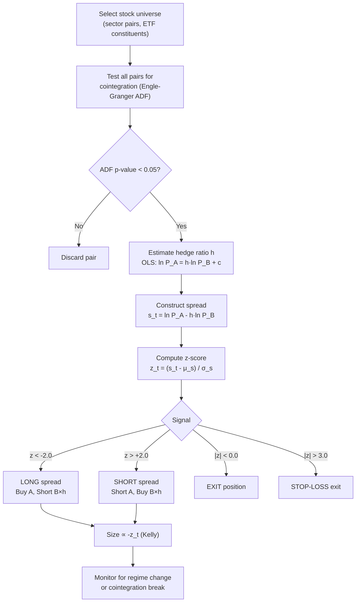

# Pairs Trading

> [!abstract] **TL;DR** Pairs trading is a market-neutral strategy that constructs a long-short position in two cointegrated securities, profiting when their price spread reverts to its historical mean. The pipeline: test for cointegration with Engle-Granger, estimate the hedge ratio, compute a z-score on the spread, and trade at standard deviations of +/- 2. Dynamic hedge ratios via Kalman filter and Kelly-optimal position sizing improve performance. The main failure modes are regime changes that break cointegration (M&A, sector rotation) and insufficient OU speed to overcome transaction costs.

---

## Intuition

Consider two racehorses — Secretariat and Seattle Slew — who have raced against each other dozens of times. Historically they always finish within three seconds of each other: sometimes Secretariat is ahead, sometimes Seattle Slew, but they always converge. Now you observe a race where Secretariat finishes ten seconds ahead. You do not know why — perhaps Seattle Slew had a bad day, perhaps Secretariat got an unusually clean run. But your model says: historically, they are three seconds apart, and ten seconds is extraordinary. You bet that in the next race, the gap will narrow back toward three seconds.

This is the intuition behind pairs trading. The "distance" between the horses is the spread between two stock prices. Their historical tendency to stay close is cointegration — a long-run equilibrium relationship maintained by fundamental linkages (same industry, correlated cash flows, regulatory environment). When the spread widens beyond statistical norms, you bet on convergence: buy the laggard, sell the leader.

The critical insight is that you are not betting on whether stocks go up or down — you are betting on the spread narrowing. A well-constructed pairs trade is neutral to broad market movements, sector moves, and most macro events. Your P&L depends entirely on the relative performance of the two stocks. This is why it is sometimes called a **relative value** or **market-neutral** strategy.

---

## How It Works



---

## Key Concepts

### 1. Cointegration vs Correlation

Two prices $P_t^A$ and $P_t^B$ are **cointegrated** if a linear combination is stationary, even though each individually is a non-stationary I(1) process:

$$s_t = \ln P_t^A - h \cdot \ln P_t^B \sim I(0)$$

**Correlation** measures short-run co-movement; cointegration measures a long-run equilibrium relationship. Two correlated series can drift apart indefinitely, making convergence bets unprofitable. Only cointegrated pairs guarantee (under the statistical model) that the spread is mean-reverting.

**Engle-Granger test:**
1. Estimate $h$ via OLS: $\ln P_t^A = c + h \cdot \ln P_t^B + u_t$
2. Apply the Augmented Dickey-Fuller test to the residuals $\hat{u}_t$
3. Reject the unit root hypothesis (ADF p-value $< 0.05$) to confirm cointegration

### 2. Spread Construction and Z-Score

The log-price spread with OLS hedge ratio $h$:

$$s_t = \ln P_t^A - h \cdot \ln P_t^B$$

Rolling z-score over a lookback window $W$ (typically 252 days):

$$z_t = \frac{s_t - \mu_s}{\sigma_s}, \quad \mu_s = \frac{1}{W}\sum_{i=0}^{W-1}s_{t-i}, \quad \sigma_s = \text{std}(s_{t-W:t})$$

**Standard signal thresholds:**

| Signal | Condition | Default value |
|--------|-----------|---------------|
| Entry (long spread) | $z_t < -k_{entry}$ | $k_{entry} = 2.0$ |
| Entry (short spread) | $z_t > +k_{entry}$ | $k_{entry} = 2.0$ |
| Exit | $\|z_t\| < k_{exit}$ | $k_{exit} = 0.0$ |
| Stop-loss | $\|z_t\| > k_{stop}$ | $k_{stop} = 3.0$ |

### 3. Dynamic Hedge Ratio via Kalman Filter

Static OLS assumes constant cointegration. In practice, the hedge ratio $h_t$ drifts as business conditions change. Model:

$$\ln P_t^A = h_t \cdot \ln P_t^B + c_t + \epsilon_t$$
$$h_t = h_{t-1} + \eta_t, \quad \eta_t \sim \mathcal{N}(0, Q)$$

The Kalman filter tracks $h_t$ as a hidden state, updating it each day. This prevents the hedge ratio from becoming stale during slow structural shifts while not over-reacting to noise.

### 4. Half-Life and Trading Horizon

The spread follows an OU process $ds = \kappa(\bar{s} - s)dt + \sigma dW$ with half-life:

$$t_{1/2} = \frac{\ln 2}{\kappa}$$

| Half-life | Appropriate frequency |
|-----------|----------------------|
| $< 2$ days | HFT — likely impractical after costs |
| 2–10 days | Daily rebalancing |
| 10–30 days | Weekly rebalancing |
| 30–90 days | Monthly — slower mean reversion |
| $> 90$ days | Too slow; TC unlikely recoverable |

### 5. Kelly Position Sizing

Optimal Kelly fraction for a mean-reverting spread:

$$f^* \propto -z_t$$

This is aggressive: the more extreme the z-score, the larger the position. In practice, apply a fraction of Kelly (0.25–0.5) and cap at maximum position limits. The Kelly signal naturally pyramids into positions as they become more attractive.

### 6. Transaction Cost Break-Even

For a pairs trade with round-trip cost $c_{TC}$ (bps), the strategy only profits if the expected mean-reversion gain exceeds costs:

$$\text{Expected gain} = k_{entry} \cdot \sigma_s - k_{exit} \cdot \sigma_s = (k_{entry} - k_{exit}) \cdot \sigma_s > c_{TC}$$

This means fast-reverting, wide-spread pairs in liquid instruments are preferred.

---

## Python Example

```python
import numpy as np
import pandas as pd
from scipy import stats
from statsmodels.tsa.stattools import adfuller, coint

def find_cointegrated_pairs(prices: pd.DataFrame, significance: float = 0.05):
    """Test all pairs for cointegration. Returns list of (s1, s2, p_value, hedge_ratio)."""
    tickers = prices.columns.tolist()
    cointegrated = []
    
    for i, t1 in enumerate(tickers):
        for t2 in tickers[i+1:]:
            p1, p2 = np.log(prices[t1].dropna()), np.log(prices[t2].dropna())
            common = p1.index.intersection(p2.index)
            p1, p2 = p1[common], p2[common]
            
            # OLS hedge ratio
            slope, intercept, *_ = stats.linregress(p2.values, p1.values)
            spread = p1.values - slope * p2.values
            
            # ADF test on spread
            adf_result = adfuller(spread, maxlags=1, autolag=None)
            p_value = adf_result[1]
            
            if p_value < significance:
                cointegrated.append((t1, t2, round(p_value, 4), round(slope, 4)))
    
    return cointegrated


def pairs_backtest(prices: pd.DataFrame, stock_a: str, stock_b: str,
                   k_entry: float = 2.0, k_exit: float = 0.0,
                   k_stop: float = 3.0, lookback: int = 252) -> pd.DataFrame:
    """
    End-to-end pairs trading backtest.
    Returns DataFrame with spread, z-score, signal, and daily P&L.
    """
    ln_a = np.log(prices[stock_a])
    ln_b = np.log(prices[stock_b])
    
    # Estimate hedge ratio on first lookback window (in-sample)
    h = np.polyfit(ln_b.iloc[:lookback], ln_a.iloc[:lookback], 1)[0]
    spread = ln_a - h * ln_b
    
    # Rolling z-score (out-of-sample portion)
    mu = spread.rolling(lookback).mean()
    sigma = spread.rolling(lookback).std()
    z = (spread - mu) / sigma
    
    # Signal generation
    position = pd.Series(0.0, index=z.index)
    pos = 0.0
    
    for t in range(lookback, len(z)):
        zt = z.iloc[t]
        if np.isnan(zt):
            continue
        if pos == 0:
            if zt < -k_entry:
                pos = 1.0    # Long spread
            elif zt > k_entry:
                pos = -1.0   # Short spread
        elif pos == 1.0:
            if zt > -k_exit or zt > k_stop:
                pos = 0.0
        elif pos == -1.0:
            if zt < k_exit or zt < -k_stop:
                pos = 0.0
        position.iloc[t] = pos
    
    # Daily P&L: position in spread changes, 1 unit = long A, short h units B
    spread_returns = spread.diff()
    pnl = position.shift(1) * spread_returns
    
    result = pd.DataFrame({
        'spread': spread,
        'z_score': z,
        'position': position,
        'daily_pnl': pnl,
        'cumulative_pnl': pnl.cumsum()
    })
    
    # Summary stats
    ann_sharpe = pnl.mean() / pnl.std() * np.sqrt(252)
    print(f"Pair: {stock_a} / {stock_b} | Hedge ratio h = {h:.4f}")
    print(f"Total P&L: {pnl.sum():.4f} | Annualised Sharpe: {ann_sharpe:.2f}")
    print(f"Trade count: {(position.diff() != 0).sum()} | Hit rate: "
          f"{(pnl[pnl != 0] > 0).mean():.1%}")
    
    return result


# --- Demo with synthetic cointegrated pair ---
np.random.seed(99)
n = 756
dates = pd.date_range("2022-01-01", periods=n, freq="B")
noise_common = np.cumsum(np.random.randn(n) * 0.01)      # shared random walk
noise_a = np.cumsum(np.random.randn(n) * 0.005)          # idiosyncratic noise A
noise_b = np.cumsum(np.random.randn(n) * 0.005)          # idiosyncratic noise B
# Spread mean-reverts via OU
spread_noise = np.zeros(n)
for t in range(1, n):
    spread_noise[t] = spread_noise[t-1] * 0.95 + np.random.randn() * 0.01

prices_demo = pd.DataFrame({
    'STOCK_A': np.exp(noise_common + noise_a + spread_noise),
    'STOCK_B': np.exp(noise_common + noise_b),
}, index=dates)

result = pairs_backtest(prices_demo, 'STOCK_A', 'STOCK_B')
print(result[['z_score', 'position', 'cumulative_pnl']].tail(5))
```

---

## Real-World Notes

- **Classic pairs**: GLD/SLV, XOM/CVX, Coca-Cola/PepsiCo, paired bank stocks in same region. ETF constituent pairs (e.g., within SPY) tend to have more stable cointegration.
- **M&A risk**: Merger announcements break cointegration instantly — the target jumps to the bid price and the spread never reverts. Monitor corporate events continuously.
- **Sector rotation**: When a sector undergoes a fundamental repricing (e.g., energy during 2020 oil collapse), previously cointegrated pairs diverge permanently. Use rolling cointegration tests to detect breaks.
- **Liquidity mismatch**: If the two stocks have very different liquidity profiles, the spread can widen due to microstructure friction, generating false signals.

---

## Common Pitfalls

- **Spurious cointegration**: With many pairs tested, some will appear cointegrated by chance. Apply Bonferroni correction or require longer sample periods.
- **Look-ahead bias in hedge ratio**: Estimating $h$ on the full backtest period then trading historically overstates returns. Always use only historical data at each point.
- **Static z-score windows**: A 252-day lookback is appropriate for medium-frequency pairs. For faster pairs, shorter windows (30–60 days) are needed.
- **Correlation = Cointegration confusion**: Two tech stocks may have correlation of 0.9 over a year but show no cointegration if their valuations diverge structurally.
- **Ignoring short-borrow costs**: When the spread widens, you're often shorting the more expensive stock, which may have a high borrow rate (1–5%+ annualised), eating into P&L.

---

## Related Concepts

- [[Statistical_Arbitrage]] — generalises pairs trading to N-asset factor residual models
- [[Mean_Reversion]] — the OU process foundation underlying the spread model
- [[Factor_Investing]] — factor exposures must be checked to ensure the pair is not just a sector bet
- [[_MOC_Statistical_Methods]] — Engle-Granger, ADF, Kalman filter theory

---

## Review Questions

1. Two stocks have a Pearson correlation of 0.92 over the past year. Is this sufficient evidence to pairs-trade them? What additional test is required, and what does it measure?
2. A pairs trade has $k_{entry} = 2.0$, $k_{exit} = 0.0$, $\sigma_s = 0.05$ (spread std), and round-trip transaction cost of 20 bps. Is the strategy theoretically profitable? Compute the break-even spread return per trade.
3. Explain why using a Kalman filter for the hedge ratio is superior to a static OLS estimate in a regime of slow structural change.

---

## Sources

- Engle, R. & Granger, C. (1987). "Co-integration and Error Correction." *Econometrica*, 55(2), 251–276.
- Vidyamurthy, G. (2004). *Pairs Trading: Quantitative Methods and Analysis*. Wiley.
- Pole, A. (2007). *Statistical Arbitrage*. Wiley.
- Gatev, E., Goetzmann, W. & Rouwenhorst, K. (2006). "Pairs Trading." *Review of Financial Studies*, 19(3), 797–827.

#quantitative-finance #quant-strategies #intermediate #pairs-trading #cointegration #mean-reversion
