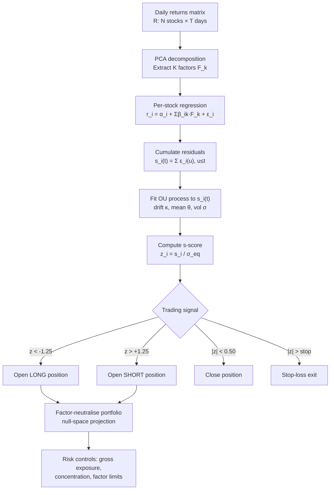

# Statistical Arbitrage

> [!abstract] **TL;DR** Statistical arbitrage is a market-neutral equity strategy that builds long-short portfolios by identifying stocks whose prices have deviated from a statistical model of fair value — typically derived from PCA factor residuals fit to an Ornstein-Uhlenbeck process. The Avellaneda-Lee (2010) framework operationalises this: estimate factors, compute residuals, fit OU parameters, then trade s-scores. The strategy is capacity-constrained (~$1–10B), sensitive to crowding, and requires rigorous factor neutrality to avoid disguised beta exposure.

---

## Intuition

Imagine you are a coin-grading expert at a large auction house. You have developed a precise model of what each coin is worth based on its age, mint, condition, and scarcity. Every day, you observe hundreds of coins selling above or below your model price. You do not care whether the overall coin market rises or falls — you simply buy coins trading too cheap relative to your model and short coins trading too expensive, confident the market will correct. Your edge is the precision of your model, not a directional view on coin prices. This is statistical arbitrage.

The "statistical" part is crucial: unlike pure arbitrage, there is no guaranteed convergence. Your model may be wrong, the mispricing may widen before correcting, or the regime may change so that the model breaks down entirely. The discipline is about having a model with sufficient signal-to-noise, a risk framework that limits exposure when the model is confused, and position sizing that survives the inevitable drawdowns.

In equities, the "model of fair value" is constructed from common risk factors — sectors, market beta, macro exposures. After removing these shared drivers, the residual return of each stock should behave like noise around zero. When a stock's cumulative residual drifts far from zero, that is the trading signal: the stock is mispriced relative to the factor model, and the bet is that it will revert.

---

## How It Works



---

## Key Concepts

### 1. PCA Factor Extraction

Given the returns matrix $\mathbf{R} \in \mathbb{R}^{N \times T}$, decompose:

$$\mathbf{R} \approx \mathbf{B}\mathbf{F} + \mathbf{E}$$

where $\mathbf{F} \in \mathbb{R}^{K \times T}$ are the $K$ principal components (statistical factors), $\mathbf{B} \in \mathbb{R}^{N \times K}$ are loadings, and $\mathbf{E}$ is the residual matrix. Typically $K = 15$–$50$ factors explain $\sim 60$–$80\%$ of variance in large equity universes.

### 2. Residual Cumulation and OU Fitting

For stock $i$, the cumulated residual:

$$s_i(t) = \sum_{u \leq t} \epsilon_i(u)$$

is modelled as an Ornstein-Uhlenbeck process:

$$ds_i = \kappa_i(\bar{s}_i - s_i)\,dt + \sigma_i\,dW$$

Discretising: $\Delta s_i(t) = a_i + b_i s_i(t-1) + \eta_i(t)$, so:

$$\kappa_i = -\ln(1 + b_i)/\Delta t, \quad \bar{s}_i = -a_i/b_i, \quad \sigma_i^2 = \text{Var}(\eta_i)$$

The **equilibrium standard deviation** of the OU process is:

$$\sigma_{eq,i} = \frac{\sigma_i}{\sqrt{2\kappa_i}}$$

### 3. The s-Score (Z-Score)

$$z_i(t) = \frac{s_i(t) - \bar{s}_i}{\sigma_{eq,i}}$$

This standardises the cumulated residual by its long-run fluctuation. A stock with $z_i = -2$ has its residual $2$ equilibrium standard deviations below its mean — a strong mean-reversion long signal.

**Trading rules (Avellaneda-Lee):**

| Condition | Action | Typical threshold |
|-----------|--------|-------------------|
| $z_i < -s_{bo}$ | Open long | $s_{bo} = 1.25$ |
| $z_i > +s_{bo}$ | Open short | $s_{bo} = 1.25$ |
| $\|z_i\| < s_{bc}$ | Close position | $s_{bc} = 0.50$ |
| $\|z_i\| > s_{stop}$ | Stop-loss exit | $s_{stop} = 3.5$ |

### 4. Factor Neutrality

A naive long-short portfolio built on s-scores still carries residual factor exposures. True market-neutrality requires projecting portfolio weights $\mathbf{w}$ into the null space of the factor loading matrix $\mathbf{B}$:

$$\mathbf{w}^* = \mathbf{w} - \mathbf{B}(\mathbf{B}^\top\mathbf{B})^{-1}\mathbf{B}^\top\mathbf{w}$$

This removes dollar, beta, sector, and all statistical factor exposures simultaneously. Without this step, the portfolio may look like stat arb but secretly carries hidden directional bets.

### 5. Signal Decay and Half-Life

The half-life of the OU process:

$$t_{1/2} = \frac{\ln 2}{\kappa}$$

governs strategy frequency. If $t_{1/2} = 5$ days, rebalance daily. If $t_{1/2} = 30$ days, weekly is sufficient. Fast-decaying signals require lower transaction costs per trade — which constrains the universe to liquid large-caps.

---

## Python Example

```python
import numpy as np
import pandas as pd
from sklearn.decomposition import PCA
from sklearn.linear_model import LinearRegression

def compute_avellaneda_lee_scores(returns: pd.DataFrame, n_factors: int = 20) -> pd.DataFrame:
    """
    Compute Avellaneda-Lee s-scores for a universe of stocks.
    
    Args:
        returns: DataFrame of daily returns (rows=dates, cols=stocks)
        n_factors: Number of PCA factors to extract
    
    Returns:
        DataFrame of z-scores (s-scores) indexed by date
    """
    R = returns.dropna(axis=1).values  # N_stocks x T_days transposed
    # PCA on the transposed matrix: T x N
    pca = PCA(n_components=n_factors)
    F = pca.fit_transform(R)           # T x K factor scores
    B = pca.components_.T              # N x K loadings

    residuals = np.zeros_like(R)
    kappas, sigmas, s_means = [], [], []
    
    for i in range(R.shape[1]):
        # Regress stock i returns on factors
        reg = LinearRegression().fit(F, R[:, i])
        eps = R[:, i] - reg.predict(F)   # residuals
        
        # Cumulate residuals
        s = np.cumsum(eps)
        
        # Fit OU via OLS on discretised form: Δs_t = a + b*s_{t-1} + η
        delta_s = np.diff(s)
        s_lag = s[:-1]
        reg_ou = LinearRegression().fit(s_lag.reshape(-1, 1), delta_s)
        a, b = reg_ou.intercept_, reg_ou.coef_[0]
        
        kappa = -np.log(1 + b)      # reversion speed (daily)
        s_bar = -a / b              # equilibrium mean
        sigma_eta = np.std(delta_s - reg_ou.predict(s_lag.reshape(-1, 1)))
        sigma_eq = sigma_eta / np.sqrt(2 * max(kappa, 1e-6))
        
        residuals[:, i] = s
        kappas.append(kappa)
        sigmas.append(sigma_eta)
        s_means.append(s_bar)
    
    # Compute z-scores
    s_means_arr = np.array(s_means)
    sigma_eqs = np.array(sigmas) / np.sqrt(2 * np.maximum(np.array(kappas), 1e-6))
    z_scores = (residuals - s_means_arr) / sigma_eqs
    
    return pd.DataFrame(z_scores, index=returns.dropna(axis=1).index,
                        columns=returns.dropna(axis=1).columns)


def generate_signals(z_scores: pd.DataFrame,
                     s_bo: float = 1.25, s_bc: float = 0.50) -> pd.DataFrame:
    """Generate +1 (long), -1 (short), 0 (flat) signals from s-scores."""
    signals = pd.DataFrame(0, index=z_scores.index, columns=z_scores.columns)
    signals[z_scores < -s_bo] = 1
    signals[z_scores > s_bo] = -1
    signals[(z_scores.abs() < s_bc)] = 0
    return signals


# --- Quick smoke test ---
np.random.seed(42)
n_stocks, n_days = 50, 504
fake_returns = pd.DataFrame(
    np.random.randn(n_days, n_stocks) * 0.01,
    index=pd.date_range("2022-01-01", periods=n_days, freq="B"),
    columns=[f"STOCK_{i:02d}" for i in range(n_stocks)]
)
z = compute_avellaneda_lee_scores(fake_returns, n_factors=10)
signals = generate_signals(z)
print("Mean z-score:", z.iloc[-1].mean().round(4))
print("Long positions today:", (signals.iloc[-1] == 1).sum())
print("Short positions today:", (signals.iloc[-1] == -1).sum())
```

---

## Real-World Notes

- **Capacity**: A single stat-arb strategy running in liquid US equities handles roughly $1–10B before market impact erodes returns. At that scale, execution cost becomes the primary alpha drag.
- **August 2007 Quant Crisis**: Multiple stat-arb funds simultaneously deleveraged in response to subprime losses elsewhere. Because they held nearly identical factor-neutral long-short books, their selling created a self-reinforcing cascade. Strategies that were statistically "correct" posted −5 to −30% in a single week before eventually recovering as the forced selling ended. This demonstrated that even well-designed stat-arb strategies carry **crowding risk** that is invisible in normal backtests.
- **Turnover**: Daily rebalancing generates $\sim$20–100% annual turnover. At 5–10 bps round-trip cost, transaction costs consume 1–5% annually — a large fraction of gross alpha.
- **Universe construction**: Typically 500–2000 liquid US or global equities; filter for minimum ADV ($50M+) to ensure positions can be entered/exited cleanly.

---

## Common Pitfalls

- **Insufficient factor neutrality**: Omitting sector or size factors leaves hidden beta exposures that inflate backtest Sharpe but collapse in live trading.
- **Overfitting OU parameters**: Estimating $\kappa$ on the same period used for signal generation leads to optimistic half-life estimates. Use rolling out-of-sample estimation.
- **Ignoring short-selling constraints**: ETB (easy-to-borrow) availability limits the short leg; real portfolios have a 20–30% haircut on theoretical short capacity.
- **Underestimating crowding**: When many funds share the same factor model, their residuals become correlated. The 2007 crisis is the canonical example.
- **Static thresholds**: Fixed $s_{bo}$ values ignore volatility regimes. Consider adaptive thresholds based on recent residual volatility.

---

## Related Concepts

- [[Pairs_Trading]] — two-asset special case of statistical arbitrage
- [[Mean_Reversion]] — the statistical foundation; OU process estimation
- [[Factor_Investing]] — factor models that define the "fair value" baseline
- [[Momentum_Strategies]] — orthogonal strategy; can be combined for diversification
- [[_MOC_Backtesting]] — walk-forward validation critical for stat arb
- [[_MOC_Execution]] — market impact and transaction costs define live capacity
- [[_MOC_Risk_Management]] — gross exposure, factor limits, crowding monitoring

---

## Review Questions

1. In the Avellaneda-Lee framework, why do we cumulate the residuals $\epsilon_i$ before fitting the OU process, rather than modelling the raw residuals directly?
2. Explain why the August 2007 Quant Crisis is evidence of **crowding risk**, and describe two metrics a risk manager could monitor to detect crowding ex-ante.
3. A stock has OU parameters $\kappa = 0.05$ (daily), $\sigma = 0.01$. Compute $\sigma_{eq}$, the half-life, and explain at what rebalancing frequency this signal should be traded.

---

## Sources

- Avellaneda, M. & Lee, J. (2010). "Statistical Arbitrage in the US Equities Market." *Quantitative Finance*, 10(7), 761–782.
- Khandani, A. & Lo, A. (2007). "What Happened to the Quants in August 2007?" MIT Working Paper.
- Pole, A. (2007). *Statistical Arbitrage*. Wiley.

#quantitative-finance #quant-strategies #advanced #stat-arb #mean-reversion
