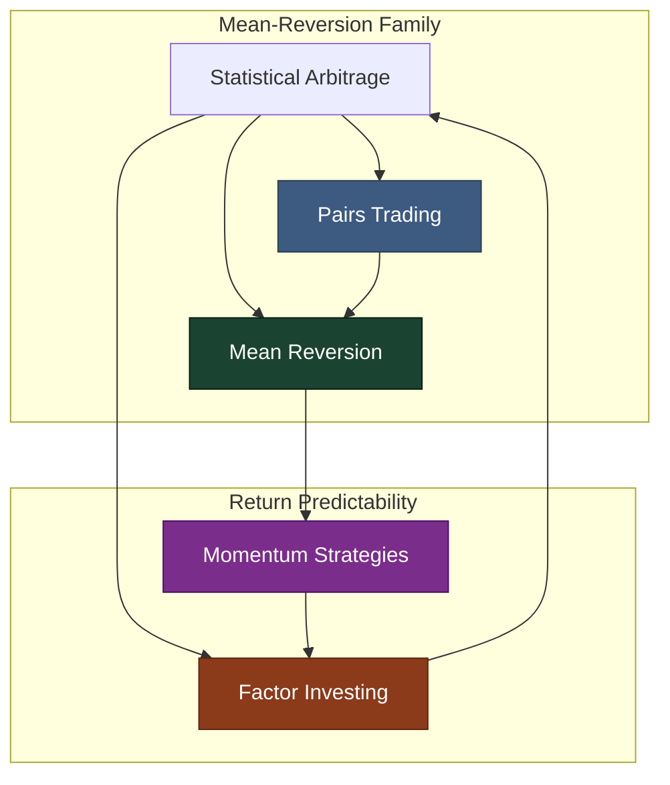

# Quantitative Strategies — Map of Content

> [!abstract] Quantitative strategies are systematic, rules-based approaches to generating alpha that exploit persistent market anomalies — mispricing, momentum, factor premia, and statistical relationships — using mathematical models rather than discretionary judgment. These strategies form the core of modern hedge fund management, blending statistical rigor with economic intuition. Understanding them requires synthesizing time-series econometrics, portfolio construction, and execution mechanics into deployable trading systems.

---

## Concept Map

**Key relationships:**
- [[Pairs_Trading]] is a specific, two-asset implementation of [[Statistical_Arbitrage]]
- [[Statistical_Arbitrage]] generalises pairs trading to N-asset factor residual models
- [[Mean_Reversion]] is the statistical phenomenon that both stat arb and pairs trading exploit
- [[Momentum_Strategies]] is the opposite phenomenon — return continuation; the two co-exist across different time horizons
- [[Factor_Investing]] subsumes momentum as a factor and provides the risk framework that explains stat arb exposures

---

## Learning Path

| Step | Note | Why First |
|------|------|-----------|
| 1 | [[Mean_Reversion]] | Core statistical phenomenon underlying half of all quant strategies |
| 2 | [[Pairs_Trading]] | Simplest operational implementation of mean reversion — two assets, one spread |
| 3 | [[Statistical_Arbitrage]] | Generalises pairs trading to factor-based residual models at scale |
| 4 | [[Factor_Investing]] | The risk-factor lens that unifies all systematic premia |
| 5 | [[Momentum_Strategies]] | Counterpoint to mean reversion; understanding both gives the full picture |

---

## All Notes at a Glance

| Note | Core Idea | Key Technique | Difficulty |
|------|-----------|---------------|------------|
| [[Statistical_Arbitrage]] | Market-neutral equity alpha via pricing anomalies | Avellaneda-Lee PCA + OU s-score | Advanced |
| [[Pairs_Trading]] | Long/short cointegrated pair spread | Engle-Granger + z-score signal | Intermediate |
| [[Momentum_Strategies]] | Winners keep winning, losers keep losing | Cross-sectional sort + vol scaling | Intermediate |
| [[Mean_Reversion]] | Prices revert to long-run mean | Hurst exponent + OU estimation | Intermediate |
| [[Factor_Investing]] | Systematic factor premia (value, momentum, size…) | Long-short factor portfolios | Advanced |

---

## Key Questions

1. Why does statistical arbitrage require **factor neutrality** rather than just market neutrality, and how does the null-space projection achieve this?
2. What is the difference between **correlation** and **cointegration**, and why does pairs trading require the latter?
3. How does **momentum crash risk** arise mechanically, and what regime filters can mitigate it?
4. How does the **Hurst exponent** distinguish trending, random-walk, and mean-reverting time series, and how do you estimate it in practice?
5. What is the **factor zoo problem**, and what t-statistic threshold should new factors clear post-2003?
6. How does **volatility scaling** in TSMOM keep risk constant across regimes, and what is its effect on the Sharpe ratio?
7. What is **carry** in a universal sense, and how does it manifest across equities, FX, bonds, and commodities?

---

## Related Sections

| Section | Link | Relevance |
|---------|------|-----------|
| Master MOC | [[_MOC_Quantitative_Finance]] | Top-level entry point |
| Statistical Methods | [[_MOC_Statistical_Methods]] | Time-series tools: cointegration, OU, ADF underpinning all strategies |
| Execution & Market Microstructure | [[_MOC_Execution]] | Transaction costs, market impact — the make-or-break for live stat arb |
| Backtesting & Performance | [[_MOC_Backtesting]] | Walk-forward validation, Sharpe, look-ahead bias — how to verify strategies |
| Risk Management | [[_MOC_Risk_Management]] | Factor exposure limits, gross exposure controls, drawdown management |

---

#MOC #QuantitativeFinance #QuantStrategies
