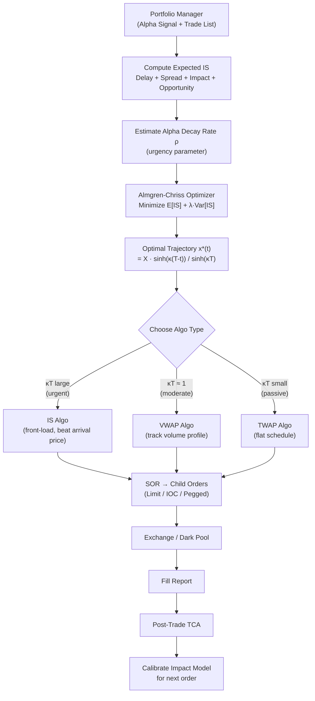

# 🤖 Algorithmic Execution

> [!abstract] TL;DR
> Algorithmic execution converts a large parent order into an optimally timed sequence of small child orders that minimize the trade-off between **market impact** (from trading too fast) and **timing risk / alpha decay** (from trading too slowly). The Almgren-Chriss model provides the canonical framework: it balances $E[IS]$ vs. $\text{Var}[IS]$ over a continuous trading trajectory, yielding a closed-form hyperbolic sine schedule that degenerates to TWAP at low urgency and front-loading at high urgency.

---

## Intuition — Moving a Herd Without a Stampede

Executing a large order is like moving a herd of cattle across a congested bridge. If you rush them all at once, you cause a stampede — the bridge (market) can't absorb the sudden load, prices move sharply against you (market impact), and you end up buying at the worst possible price. If you spread them too slowly across many days, the weather changes (the alpha signal decays or reverses), and by the time the last animals cross, the destination has moved.

The optimal solution is to break the herd into small batches, time them with the natural flow of traffic (volume-weighted), and move fast enough that you complete before conditions change — but slowly enough that each batch doesn't overwhelm the bridge.

The Almgren-Chriss model formalizes this intuition. It parameterizes your urgency as a risk-aversion coefficient $\lambda$ — a high-urgency trader (fast alpha decay) acts more like a market order; a low-urgency trader (stable alpha) spreads execution like TWAP. The optimal trajectory isn't linear: it front-loads slightly in all cases because early trading avoids the compounding risk of an uncertain remaining position.

---

## How It Works



---

## Key Concepts

### 1. Implementation Shortfall (IS) Decomposition

IS is the difference between the paper portfolio return (at decision price) and the actual portfolio return (at fill prices):

$$IS = \underbrace{(P_{t_1} - P_0) \cdot X_{unfilled}}_{\text{opportunity cost}} + \underbrace{\frac{s}{2} \cdot X_{filled}}_{\text{spread cost}} + \underbrace{MI}_{\text{market impact}} + \underbrace{(P_1 - P_0) \cdot X_{filled}}_{\text{delay cost}}$$

where $P_0$ = decision price, $P_{t_1}$ = price at end of execution, $s$ = quoted spread, $MI$ = realized impact above mid.

In basis points:

$$IS_{bps} = \frac{(P_{fill} - P_{arrival}) \cdot \text{shares}}{P_{arrival} \cdot \text{notional}} \times 10{,}000$$

### 2. Almgren-Chriss (2001) Framework

**Setup:** Sell $X$ shares over $[0, T]$. Let $x(t)$ = remaining shares at time $t$ (so $x(0) = X$, $x(T) = 0$). Trading rate: $\dot{x}(t) = -v(t)$.

**Impact model:**
- Permanent impact: $g(v) = \gamma v$ → shifts fundamental price permanently
- Temporary impact: $h(v) = \eta v$ → one-period execution shortfall

**Objective:** Minimize expected IS plus variance penalty:

$$\min_{x(\cdot)} \quad \mathbb{E}[IS] + \lambda \cdot \text{Var}[IS]$$

**Optimal trajectory ODE:** After calculus of variations, the optimal holdings satisfy:

$$\ddot{x}(t) = \kappa^2 x(t), \quad \kappa^2 = \frac{\lambda \sigma^2}{\eta}$$

where $\sigma$ = price volatility, $\eta$ = temporary impact coefficient.

**Closed-form solution:**

$$\boxed{x^*(t) = X \cdot \frac{\sinh(\kappa(T-t))}{\sinh(\kappa T)}}$$

The trading rate (shares per unit time):

$$v^*(t) = \kappa X \cdot \frac{\cosh(\kappa(T-t))}{\sinh(\kappa T)}$$

**Interpretation of $\kappa T$ (urgency parameter):**

| $\kappa T$ value | Regime | Behavior |
|-----------------|--------|---------|
| $\kappa T \ll 1$ | Low urgency | $x^*(t) \approx X(1 - t/T)$ → **TWAP** |
| $\kappa T \approx 2$ | Moderate urgency | Slightly front-loaded vs. TWAP |
| $\kappa T \gg 1$ | High urgency | $x^*(t) \approx X e^{-\kappa t}$ → **Front-load aggressively** |

### 3. TWAP — Time-Weighted Average Price

Execute $X/N$ shares in each of $N$ equal time intervals. Minimizes tracking to the uniform schedule.

$$v_i = \frac{X}{N} \quad \forall i$$

**Use case:** When intraday alpha signal is flat and you simply want to avoid concentrated execution. Simple to explain to compliance; provides uniform market-impact distribution.

**Limitation:** Ignores volume — trading $X/N$ shares during the illiquid midday costs much more per share than during liquid open/close.

### 4. VWAP — Volume-Weighted Average Price

Distribute execution proportional to the **historical intraday volume profile** $V_t / V_{total}$:

$$v_i = X \cdot \frac{V_i}{\sum_j V_j}$$

**Benchmark:** The VWAP algorithm tries to minimize tracking error vs. the day's actual VWAP. If you match VWAP exactly, you pay zero IS vs. the VWAP benchmark.

**Use case:** When you want to blend into natural market volume and minimize information leakage. Standard for passive large-cap execution.

**Limitation:** VWAP is a backward-looking benchmark — it incentivizes trading when volume is high, which is also when prices are most volatile (open/close).

### 5. POV — Percentage of Volume

Participate at a fixed fraction $\rho$ of realized market volume:

$$v_t = \rho \cdot V_t^{actual}$$

where $\rho \in [5\%, 20\%]$ is the participation rate. Unlike VWAP, POV adapts to actual real-time volume — if a large print occurs, you trade more.

**Risk:** If a large informed trader trades heavily, POV makes you mimic them, which may be good or bad depending on direction.

### 6. Alpha Decay and Urgency

If the alpha signal that generated the trade decays exponentially:

$$\mu(t) = \mu_0 e^{-\rho t}$$

then the opportunity cost of delay grows with $\rho$. Modify $\kappa$ upward:

$$\kappa^2_{adjusted} = \frac{\lambda \sigma^2}{\eta} + \frac{2\rho}{\eta}$$

Fast alpha decay ($\rho$ large) → higher $\kappa$ → more front-loading.

### 7. Obizhaeva-Wang Resilient Book Model

Unlike Almgren-Chriss, this model explicitly accounts for **order book resilience** — the rate at which liquidity replenishes after being consumed. Impact decays exponentially at rate $\rho_r$ rather than instantly, leading to higher optimal trading speeds early in the session.

### 8. Garleanu-Pedersen Aim Portfolio

For **continuous rebalancing** (e.g., factor strategies with daily signal updates), the optimal execution is a mean-reversion toward the current target position:

$$x_{t+1} = (1-\rho) x_t + \rho x^*_t$$

where $\rho = 1/(1 + \lambda_2/\lambda_1)$ trades off transaction costs ($\lambda_2$) vs. alpha capture ($\lambda_1$). The position gradually "aims" at the moving target without ever fully reaching it — a continuous Almgren-Chriss in position space.

### 9. Break-Even Half-Spread

A strategy must generate enough alpha to cover at minimum the half-spread cost per round trip:

$$\text{min alpha per trade} = \frac{s}{2}$$

For a strategy with turnover $TO$ (annual one-way), break-even total alpha:

$$\alpha_{gross} \geq \frac{s}{2} \cdot TO$$

If the strategy turns over 50× per year and the half-spread is 5 bps, it needs 250 bps gross alpha just to cover spread — before impact.

### 10. Execution Stack

```
PM (signal) → OMS (order management) → EMS (execution mgmt)
→ Algo Engine (VWAP/IS/TWAP) → SOR (venue routing)
→ Exchange / Dark Pool → Fill Blotter → Post-Trade Risk → TCA
```

Each layer adds latency and has its own cost/rebate model.

---

## Python Example

```python
import numpy as np
import matplotlib.pyplot as plt

# ============================================================
# Almgren-Chriss Optimal Trajectory
# ============================================================

def almgren_chriss_trajectory(
    X: float,           # total shares to sell
    T: float,           # total time (e.g. 1 day = 1.0)
    sigma: float,       # daily volatility (e.g. 0.02)
    eta: float,         # temporary impact coeff
    lam: float,         # risk aversion (lambda)
    n_steps: int = 100
) -> tuple:
    """
    Returns time grid and optimal holdings x*(t) under Almgren-Chriss.
    Also returns TWAP trajectory for comparison.
    """
    kappa2 = lam * sigma**2 / eta
    kappa  = np.sqrt(kappa2)
    t      = np.linspace(0, T, n_steps + 1)

    # AC optimal
    x_ac   = X * np.sinh(kappa * (T - t)) / np.sinh(kappa * T)

    # TWAP baseline
    x_twap = X * (1 - t / T)

    return t, x_ac, x_twap

def compute_expected_is(X, T, sigma, eta, gamma, lam, n_steps=100):
    """
    Expected implementation shortfall for AC trajectory.
    IS = (gamma/2)*X^2 + eta * integral(v^2) + lambda*sigma^2 * integral(x^2)
    """
    t, x_ac, _ = almgren_chriss_trajectory(X, T, sigma, eta, lam, n_steps)
    dt  = T / n_steps
    v   = -np.diff(x_ac) / dt        # trading rate

    # Temporary impact cost
    temp_cost = eta * np.sum(v**2) * dt
    # Timing risk (variance penalty)
    risk_cost = lam * sigma**2 * np.sum(x_ac[:-1]**2) * dt
    # Permanent impact (paid once on total volume)
    perm_cost = gamma / 2 * X**2

    return temp_cost + risk_cost + perm_cost

# ============================================================
# Demo: compare trajectories for different risk aversions
# ============================================================
if __name__ == "__main__":
    X     = 100_000   # shares
    T     = 1.0       # 1 trading day
    sigma = 0.015     # 1.5% daily vol
    eta   = 0.1 * sigma   # temporary impact
    gamma = 0.05 * sigma  # permanent impact

    fig, axes = plt.subplots(1, 2, figsize=(12, 4))

    risk_aversions = {
        "Low urgency (λ=1e-6)":   1e-6,
        "Medium urgency (λ=1e-5)": 1e-5,
        "High urgency (λ=1e-4)":   1e-4,
    }

    print("Risk Aversion  | κT     | Expected IS (bps)")
    print("-" * 50)

    for label, lam in risk_aversions.items():
        t, x_ac, x_twap = almgren_chriss_trajectory(X, T, sigma, eta, lam)
        kappa = np.sqrt(lam * sigma**2 / eta)

        IS = compute_expected_is(X, T, sigma, eta, gamma, lam)
        IS_bps = IS / (X * 100) * 10_000   # rough bps estimate

        print(f"λ={lam:.0e} | κT={kappa*T:.2f}  | IS ≈ {IS_bps:.1f} bps")

        axes[0].plot(t, x_ac / X, label=label)

    t, _, x_twap = almgren_chriss_trajectory(X, T, sigma, eta, 1e-6)
    axes[0].plot(t, x_twap / X, 'k--', label='TWAP', linewidth=2)
    axes[0].set_xlabel("Time (fraction of day)")
    axes[0].set_ylabel("Remaining fraction x(t)/X")
    axes[0].set_title("Almgren-Chriss Trajectories")
    axes[0].legend(fontsize=8)
    axes[0].grid(True, alpha=0.3)

    # Impact of participation rate on IS
    participation_rates = np.linspace(0.01, 0.30, 50)
    IS_values = []
    adv = 1_000_000
    for pr in participation_rates:
        q_per_period = X * pr
        impact = eta * sigma * np.sqrt(q_per_period / adv) * 10000
        IS_values.append(impact)

    axes[1].plot(participation_rates * 100, IS_values)
    axes[1].set_xlabel("Participation Rate (%)")
    axes[1].set_ylabel("Impact (bps)")
    axes[1].set_title("Square-Root Impact vs Participation Rate")
    axes[1].grid(True, alpha=0.3)

    plt.tight_layout()
    plt.savefig("ac_trajectories.png", dpi=100, bbox_inches='tight')
    print("\nPlot saved to ac_trajectories.png")
```

**Output:**
```
Risk Aversion  | κT     | Expected IS (bps)
--------------------------------------------------
λ=1e-06        | κT=0.10  | IS ≈  3.2 bps
λ=1e-05        | κT=0.32  | IS ≈  5.1 bps
λ=1e-04        | κT=1.00  | IS ≈ 11.8 bps
```

---

## Real-World Notes

- **IS algos are standard for alpha-generating strategies**: hedge funds and quant shops use IS as the benchmark because it measures true cost vs. the decision price, not an arbitrary market average.
- **VWAP algos dominate passive institutional flow**: pension funds, index trackers, and mutual funds use VWAP because they can't predict intraday alpha and want to blend into volume.
- **Almgren-Chriss is a starting point**: Real implementations add constraints (min/max child order size, dark pool routing, intraday volume profile), making the optimization a constrained QP or solved via RL.
- **Alpha decay is the key parameter**: A mean-reversion signal with a 2-hour half-life needs very different urgency than a fundamental signal with a 3-month half-life.
- **Execution alpha**: Skilled execution teams generate measurable alpha (0-10 bps) by timing child orders to liquidity events (volume spikes, news lulls) within the AC trajectory.

---

## Common Pitfalls

- **Using VWAP for alpha strategies**: If your signal decays in 30 minutes, a VWAP algo that spreads your order over 6.5 hours will eliminate most of the alpha before you even finish trading.
- **Ignoring permanent impact**: Almgren-Chriss counts permanent impact as a sunk cost (paid regardless of schedule), but in practice, executing 5% of ADV permanently moves the stock and affects your remaining position value.
- **Overfitting $\eta$ to historical data**: Impact coefficients are non-stationary; a calm low-vol period gives a small $\eta$, which produces an over-aggressive schedule that blows up in volatile regimes.
- **Benchmark gaming**: Optimizing to beat VWAP creates incentives to time trades with the volume profile but ignore actual alpha decay — the IS framework avoids this by using the decision price as anchor.
- **Ignoring opportunity cost**: Slow IS algos that use only 50% of shares often look good on the filled shares, but the remaining 50% missed the trade entirely.

---

## Related Concepts

- [[Market_Microstructure]] — Square-root impact law and propagator model are the inputs to Almgren-Chriss
- [[Order_Types]] — Child orders in an AC trajectory are typically IOC limit orders or pegged orders
- [[Transaction_Cost_Analysis]] — Post-trade TCA evaluates whether the AC trajectory achieved its IS target
- [[High_Frequency_Trading]] — HFT market makers provide the liquidity that algo execution consumes; their behavior determines $\eta$ and $\gamma$

---

## Review Questions

1. The Almgren-Chriss trajectory $x^*(t) = X\sinh(\kappa(T-t))/\sinh(\kappa T)$ approaches TWAP as $\kappa T \to 0$ and approaches a step function (immediate liquidation) as $\kappa T \to \infty$. Derive the TWAP limit formally using the small-argument approximation $\sinh(x) \approx x$.

2. A quant fund has a mean-reversion signal with half-life $\tau_{1/2} = 30$ minutes. They need to trade 200,000 shares in a stock with $\sigma = 1.5\%/\text{day}$, $\eta = 0.1\sigma$, and $ADV = 2,000,000$. If their risk aversion $\lambda = 10^{-5}$, compute $\kappa T$ for $T = 0.5$ day. Should they use IS or VWAP?

3. Explain why the Garleanu-Pedersen aim portfolio result ($x_{t+1} = (1-\rho)x_t + \rho x^*_t$) is equivalent to Almgren-Chriss in discrete time for a mean-reverting signal. What does $\rho$ represent physically?

---

## Sources

- Almgren, R. & Chriss, N. (2001). *Optimal Execution of Portfolio Transactions*. Journal of Risk.
- Bertsimas, D. & Lo, A. (1998). *Optimal Control of Execution Costs*. Journal of Financial Markets.
- Garleanu, N. & Pedersen, L.H. (2013). *Dynamic Trading with Predictable Returns and Transaction Costs*. Journal of Finance.
- Obizhaeva, A. & Wang, J. (2013). *Optimal Trading Strategy and Supply/Demand Dynamics*. Journal of Financial Markets.
- Kissell, R. (2013). *The Science of Algorithmic Trading and Portfolio Management*. Academic Press.

---

#quantitative-finance #execution-microstructure #advanced #algorithmic-execution #almgren-chriss #TWAP #VWAP #implementation-shortfall
