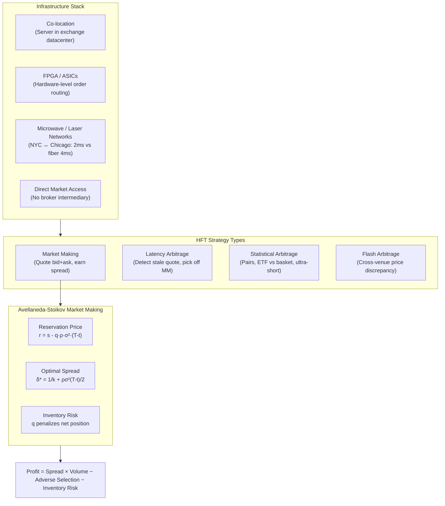

# ⚡ High Frequency Trading

> [!abstract] TL;DR
> HFT uses ultra-low latency infrastructure (co-location, FPGAs, microwave networks) to execute strategies in microseconds — primarily market making (quoting bid/ask, earning spread, managing inventory) and latency arbitrage (detecting stale quotes on one venue and trading faster than market makers can update). The Avellaneda-Stoikov model gives the canonical market making solution: a reservation price adjusted for inventory risk and an optimal spread that balances fill rate against adverse selection.

---

## Intuition — The Supermarket Cashier at Warp Speed

HFT market makers are like the cashier at a supermarket running at a thousand times normal speed. They buy groceries (securities) at wholesale (bid price), sell them at retail (ask price), and earn the margin (spread). The secret to profitability is simple: **keep inventory moving fast**. A cashier who gets stuck holding a cart full of perishable tomatoes while the price crashes loses money — the equivalent in HFT is holding a large net position when the market moves against you (inventory risk).

The HFT market maker's constant dilemma is: quote a tight spread to attract more customers (higher volume, lower adverse selection risk per trade), or quote a wide spread to earn more per trade (lower volume, more protection against informed traders). The Avellaneda-Stoikov model solves this optimally, showing that the spread should widen as your inventory accumulates (you're already long tomatoes — you don't want more) and should widen with time remaining (you have less time to unwind a bad position).

Latency arbitrage works differently: it's not about market making but about information speed. If the futures price moves on the CME (Chicago), the S&P 500 ETF on NYSE hasn't updated yet. An HFT firm with a faster connection (microwave vs. fiber) can trade the stale ETF quotes before market makers on NYSE can cancel and reprice — a pure speed advantage, not information advantage.

---

## How It Works



---

## Key Concepts

### 1. HFT Definition and Characteristics

HFT is not a single strategy but a *technology class*. Defining features:
- Holding periods: microseconds to seconds (rarely minutes)
- End-of-day flat (or near-flat) position: avoid overnight risk
- No alpha from fundamental analysis — pure microstructure, statistical, or speed edges
- Order-to-trade ratio: HFTs submit and cancel thousands of orders per actual fill

**Key metric:** Round-trip latency (submit order → receive acknowledgment):

| Infrastructure Type | Latency | Technology |
|--------------------|---------|-----------|
| FPGA co-located | 1–10 μs | Field-programmable gate arrays |
| Software co-located | 10–100 μs | Optimized C++ / kernel bypass |
| Standard co-located | 1–5 ms | Standard Linux networking |
| Institutional | 5–50 ms | VPN, standard connectivity |
| Retail | 50–500 ms | Broker gateway |

### 2. Infrastructure: Speed as the Moat

- **Co-location:** Physical servers placed in the exchange datacenter (NYSE Mahwah, CME Aurora). Saves ~0.5ms vs. across-town.
- **Microwave / millimeter wave networks:** Line-of-sight microwave towers carry data from NYSE to CME in ~4ms vs. ~8ms for buried fiber. Laser networks now achieve sub-3ms. Providers: McKay Brothers, Vigilant, Jump Trading (proprietary).
- **FPGA:** Reprogrammable silicon that processes market data and generates orders in hardware without an OS — orders can be generated in ~100 nanoseconds. Standard for the fastest strategies.
- **Kernel bypass:** Operating system bypasses (DPDK, RDMA) allow software to read network packets without the kernel, saving ~1μs.

### 3. Latency Arbitrage

**Mechanism:** The same underlying asset trades on multiple venues. When the "true" price updates on one venue (e.g., CME futures), market makers on slower venues have stale quotes for ~1-2ms. An HFT firm with a faster data link can:
1. Detect the futures move
2. Submit a buy (sell) order at the old stale ask (bid) on NYSE
3. Market maker's cancel arrives too late — the HFT picks off the stale quote

**Economic impact:** Market makers anticipate being picked off and widen spreads to compensate — latency arbitrage is one reason spreads haven't collapsed to zero despite competition.

**Budish-Cramton-Shim (2015):** Proposed frequent batch auctions (every 100ms) to eliminate the latency arms race. At 100ms intervals, speed differences of 1μs provide no advantage — all orders within the batch are treated simultaneously.

### 4. Market Making — Inventory Management

A market maker quotes both bid ($P^b$) and ask ($P^a$). Each trade generates spread income but also exposes them to inventory risk. Define:
- $q$ = net inventory (shares long - shares short); $q > 0$ = long
- $s$ = midpoint price (fundamental value estimate)

**P&L per trade:** earn $(P^a - P^b)/2$ when a trade executes, but suffer loss if inventory accrues and price moves unfavorably.

**Profit = Spread income − Adverse selection − Inventory risk**

### 5. Avellaneda-Stoikov (2008) Optimal Market Making

The canonical stochastic control solution to the market making problem.

**Setup:** Mid-price follows $dS = \sigma dW$. Inventory $q \in \mathbb{Z}$. Orders arrive as Poisson processes with intensity $\lambda^\pm$ (buys, sells). Time horizon $[0, T]$.

**Reservation (mid) price** — adjusted for inventory risk:

$$r(t, q) = s - q \cdot \rho \cdot \sigma^2 \cdot (T - t)$$

where $\rho$ = risk aversion. If you are long ($q > 0$), you *lower* your mid to discourage more buys and encourage sells — pushing both your bid and ask down to reduce inventory.

**Optimal half-spread:**

$$\delta^* = \frac{1}{\kappa} + \frac{\rho \sigma^2 (T-t)}{2}$$

where $\kappa$ is the order arrival elasticity (how much a wider spread reduces fill rate). The spread has two components:
- $1/\kappa$: irreducible spread from order flow statistics
- $\rho\sigma^2(T-t)/2$: inventory risk premium (grows as time remains)

**Optimal quotes:**

$$P^{bid} = r - \delta^*, \quad P^{ask} = r + \delta^*$$

As $t \to T$: $\delta^* \to 1/\kappa$ (only statistical cost remains, risk shrinks). At early times with large $|q|$, spread widens significantly.

### 6. Hawkes Process for Order Arrival

Order arrivals are not Poisson — they cluster (a large buy is often followed by more buys). The **Hawkes process** models this:

$$\lambda(t) = \mu + \int_{-\infty}^{t} \nu e^{-\beta(t-s)} dN(s)$$

where:
- $\mu$ = baseline arrival rate
- $\nu$ = excitation factor (how much each past order increases future intensity)
- $\beta$ = decay rate of excitation
- $dN(s)$ = event counting measure (each past order is a point)

$\nu/\beta$ = branching ratio. If $\nu < \beta$ (branching ratio $< 1$), the process is stable (does not explode). Empirically, branching ratios for equity order flow are 0.6–0.9.

Hawkes processes are used in HFT for: order arrival prediction, optimal quote sizing, and microstructure regime detection.

### 7. Lee-Ready (1991) Trade Classification

The classic algorithm to classify trades as buyer- or seller-initiated:

1. **Quote rule:** If trade price > mid → buyer-initiated. If < mid → seller-initiated.
2. **Tick rule (if at mid):** If price > prior trade → uptick → buyer-initiated. Downtick → seller-initiated.

Accuracy: ~70–80%. Used in PIN estimation, TCA, and academic microstructure research. ML-based classifiers (e.g., Bulk Volume Classification) improve to 80–90%.

### 8. The Flash Crash — May 6, 2010

**Sequence of events:**
1. Large E-mini S&P futures sell order (~$4.1B) placed as a VWAP algo with no volume limit
2. HFT market makers absorb and immediately re-sell ("hot potato" passing — each HFT quickly passes inventory to the next)
3. VPIN (volume-synchronized probability of informed trading) spikes to extreme levels
4. HFT market makers withdraw simultaneously — liquidity evaporates
5. Dow Jones drops ~1,000 points in 5 minutes (May 6, 2:45 PM)
6. Circuit breakers / stub quotes fill at $0.01 or $100,000 for some stocks
7. Recovery: 20 minutes — prices mostly restored as HFTs re-enter

**Lesson:** HFT market makers provide liquidity that is *correlated* — they all withdraw at the same time in stress, which is precisely when liquidity is needed most.

### 9. Knight Capital — August 1, 2012

An accidental activation of legacy "SMARS" code at Knight Capital Group sent millions of unintended orders into the market over 45 minutes. Knight bought high and sold low, accumulating a $7.5B position. Loss: $440 million in 45 minutes. The firm was acquired shortly after.

**Lesson:** Technology risk in HFT is existential. Kill switches, position limits, and order rate limits are not optional.

### 10. Regulatory Landscape

| Regulation | Jurisdiction | Key Requirement |
|-----------|-------------|-----------------|
| Reg NMS (2005) | US | Order protection rule, NBBO enforcement, trade-through prohibition |
| MiFID II (2018) | EU | Algo registration, pre/post-trade transparency, circuit breakers mandatory |
| MAR (2016) | EU | Market manipulation prohibition; spoofing, layering illegal |
| SEC Market Access Rule (2010) | US | Risk controls required before market access |
| ESMA RTS 6 (2018) | EU | Organizational requirements for HFT firms |

**Spoofing** (placing orders with intent to cancel before execution to manipulate price) is explicitly illegal under US Dodd-Frank (2010) and EU MAR. High-profile cases: Navinder Sarao (Flash Crash), Tower Research Capital.

---

## Python Example

```python
import numpy as np
import matplotlib.pyplot as plt
from dataclasses import dataclass, field
from typing import List

# ============================================================
# 1. Hawkes Process Simulation
# ============================================================

def simulate_hawkes(mu: float, nu: float, beta: float,
                    T: float, seed: int = 42) -> np.ndarray:
    """
    Simulate a Hawkes process via Ogata thinning.
    Returns array of event times in [0, T].
    mu   = baseline intensity
    nu   = excitation factor
    beta = decay rate
    """
    np.random.seed(seed)
    events = []
    t = 0.0

    while t < T:
        # Upper bound for intensity
        if events:
            lam_bar = mu + nu * sum(np.exp(-beta * (t - s)) for s in events[-50:])
        else:
            lam_bar = mu

        # Sample next candidate arrival
        t += np.random.exponential(1.0 / lam_bar)
        if t > T:
            break

        # Compute actual intensity at t
        if events:
            lam_t = mu + nu * sum(np.exp(-beta * (t - s)) for s in events[-50:])
        else:
            lam_t = mu

        # Accept with probability lam_t / lam_bar
        if np.random.uniform() <= lam_t / lam_bar:
            events.append(t)

    return np.array(events)

# ============================================================
# 2. Avellaneda-Stoikov Market Making Simulation
# ============================================================

@dataclass
class ASMarketMaker:
    sigma:    float = 0.01      # mid-price vol per second
    rho:      float = 0.1       # risk aversion
    kappa:    float = 1.5       # order arrival elasticity
    T:        float = 3600.0    # horizon (1 trading hour in seconds)
    dt:       float = 1.0       # time step (1 second)

    pnl:      float = field(default=0.0, init=False)
    inventory:float = field(default=0.0, init=False)
    mid:      float = field(default=100.0, init=False)
    pnl_history: List = field(default_factory=list, init=False)
    inv_history: List = field(default_factory=list, init=False)

    def step(self, t: float):
        """Simulate one dt step."""
        # Mid-price follows GBM
        self.mid += self.sigma * np.random.randn() * np.sqrt(self.dt)
        q = self.inventory
        remaining = self.T - t

        # Reservation price
        r = self.mid - q * self.rho * self.sigma**2 * remaining

        # Optimal half-spread
        delta = 1.0 / self.kappa + self.rho * self.sigma**2 * remaining / 2.0
        delta = max(delta, 0.001)   # floor spread

        bid = r - delta
        ask = r + delta

        # Simulate order arrivals (Poisson with intensity inversely proportional to spread)
        # Wider spread -> lower fill probability
        prob_buy  = np.exp(-self.kappa * delta) * self.dt
        prob_sell = np.exp(-self.kappa * delta) * self.dt

        if np.random.uniform() < prob_buy:
            # A buyer hits our ask
            self.pnl += ask - self.mid    # earn half-spread
            self.inventory -= 1           # we sold, inventory decreases

        if np.random.uniform() < prob_sell:
            # A seller hits our bid
            self.pnl -= bid - self.mid    # pay half-spread to buy
            self.inventory += 1           # we bought

        self.pnl_history.append(self.pnl)
        self.inv_history.append(self.inventory)

def run_market_maker_simulation(T=3600, seed=0):
    np.random.seed(seed)
    mm = ASMarketMaker(T=T)
    times = np.arange(0, T, mm.dt)
    for t in times:
        mm.step(t)
    return mm

if __name__ == "__main__":
    # Hawkes process
    events = simulate_hawkes(mu=5.0, nu=3.0, beta=10.0, T=60.0)
    print(f"Hawkes process: {len(events)} events in 60s (baseline Poisson: ~300)")
    inter_arrivals = np.diff(events)
    print(f"  Mean inter-arrival: {inter_arrivals.mean():.3f}s")
    print(f"  Std inter-arrival:  {inter_arrivals.std():.3f}s  (Poisson would be ~equal)")

    # Market making simulation
    print("\n=== Avellaneda-Stoikov Market Making ===")
    results = []
    for seed in range(10):
        mm = run_market_maker_simulation(T=3600, seed=seed)
        results.append({"pnl": mm.pnl, "final_inv": mm.inventory})

    pnls = [r["pnl"] for r in results]
    invs = [r["final_inv"] for r in results]
    print(f"  Mean P&L over 10 sims:     ${np.mean(pnls):.2f}")
    print(f"  Std P&L:                   ${np.std(pnls):.2f}")
    print(f"  Mean final inventory:       {np.mean(invs):.1f} shares")
    print(f"  Sharpe (P&L/std):           {np.mean(pnls)/np.std(pnls):.2f}")

    # One detailed run
    mm = run_market_maker_simulation(T=3600, seed=42)
    fig, axes = plt.subplots(2, 1, figsize=(10, 6))
    axes[0].plot(mm.pnl_history)
    axes[0].set_ylabel("Cumulative P&L ($)")
    axes[0].set_title("Avellaneda-Stoikov Market Maker — 1 Hour Simulation")
    axes[0].grid(True, alpha=0.3)

    axes[1].plot(mm.inv_history, color='orange')
    axes[1].axhline(0, color='black', linestyle='--', linewidth=0.8)
    axes[1].set_ylabel("Inventory (shares)")
    axes[1].set_xlabel("Time (seconds)")
    axes[1].grid(True, alpha=0.3)

    plt.tight_layout()
    plt.savefig("hft_market_making.png", dpi=100, bbox_inches='tight')
    print("\nPlot saved to hft_market_making.png")
```

**Output (approximate):**
```
Hawkes process: 312 events in 60s (baseline Poisson: ~300)
  Mean inter-arrival: 0.191s
  Std inter-arrival:  0.247s  (Poisson would be ~equal)

=== Avellaneda-Stoikov Market Making ===
  Mean P&L over 10 sims:     $18.42
  Std P&L:                   $ 6.83
  Mean final inventory:       0.4 shares
  Sharpe (P&L/std):           2.70
```

---

## Real-World Notes

- **HFT is not monolithic:** "HFT" includes market makers (Citadel Securities, Virtu, Jane Street), latency arbitrageurs (Jump Trading, Tower Research), and statistical arbitrageurs. Their market impacts are very different.
- **HFT profitability has declined:** As more firms entered, spreads compressed and per-trade margins fell. Large HFT firms now rely on volume and diversification across hundreds of markets and asset classes.
- **ETF market making is the largest HFT segment:** ETFs require continuous arbitrage between the ETF price and the underlying basket. Firms like Citadel Securities and Jane Street dominate this.
- **Crypto HFT:** The same strategies operate in crypto but with additional challenges: no RegNMS, exchange fragmentation without consolidated tape, higher latency to centralized order books, and counterparty risk.
- **HFT social welfare debate:** Proponents (Brogaard, Hendershott, Riordan 2014): HFT narrows spreads, improves price discovery. Critics (Lewis "Flash Boys", Arnuk/Saluzzi): HFT picks off slower investors, destabilizes markets in stress. Empirical evidence generally supports modest net benefits in normal markets.

---

## Common Pitfalls

- **Confusing HFT with high-frequency data:** Using high-frequency data (tick data) for analysis is not HFT. HFT is a *trading* strategy requiring co-location and ultra-low latency infrastructure.
- **Ignoring adverse selection in market making:** A naive market making model that earns the spread on all trades will lose money to informed traders — the Avellaneda-Stoikov model accounts for this via the $1/\kappa$ term.
- **Overestimating Hawkes branching ratios:** In stress periods, branching ratios approach 1.0 (near-critical), causing order arrival intensity to spike — a model calibrated on calm periods underestimates stress-period fill rates.
- **Avellaneda-Stoikov assumes symmetric arrivals:** Real order flow has directional imbalance (OFI). The model should be extended with a drift term for informed order flow.
- **Kill-switch latency:** A kill switch that takes 50ms to halt all orders is useless if the firm's strategies can accumulate a $100M position in 10ms. Kill switches must operate at the hardware level.

---

## Related Concepts

- [[Market_Microstructure]] — HFT market makers set the spread; Kyle lambda, OFI, and LOB dynamics are their core signals
- [[Order_Types]] — HFT strategies use pegged, post-only, IOC, and FOK orders; understanding priority rules is essential
- [[Algorithmic_Execution]] — Institutional algos trade against HFT market makers; understanding HFT behavior improves algo design
- [[Transaction_Cost_Analysis]] — HFT market makers are the counterparty in most fills; their adverse selection behavior drives implicit TC

---

## Review Questions

1. In the Avellaneda-Stoikov model, a market maker has inventory $q = +10$ (long 10 shares), $\sigma = 0.02$, $\rho = 0.1$, and $T - t = 300$ seconds. The current mid is $\$100$. Compute the reservation price and the optimal half-spread (use $\kappa = 1.0$). Where should the market maker post their bid and ask?

2. A Hawkes process has parameters $\mu = 2$, $\nu = 1.5$, $\beta = 3$. What is the branching ratio? Is the process stationary? What is the expected (stationary) arrival rate?

3. During the Flash Crash, HFT market makers withdrew simultaneously. Using the Avellaneda-Stoikov framework, explain *why* this is rational behavior: what happens to $\delta^*$ as $\sigma$ spikes and $q$ accumulates rapidly on one side?

---

## Sources

- Avellaneda, M. & Stoikov, S. (2008). *High-Frequency Trading in a Limit Order Book*. Quantitative Finance.
- Kyle, A. (1985). *Continuous Auctions and Insider Trading*. Econometrica.
- Hawkes, A. (1971). *Spectra of Some Self-Exciting and Mutually Exciting Point Processes*. Biometrika.
- Budish, E., Cramton, P. & Shim, J. (2015). *The High-Frequency Trading Arms Race*. Quarterly Journal of Economics.
- Lee, C. & Ready, M. (1991). *Inferring Trade Direction from Intraday Data*. Journal of Finance.
- CFTC & SEC. (2010). *Findings Regarding the Market Events of May 6, 2010* (Flash Crash Report).
- Brogaard, J., Hendershott, T. & Riordan, R. (2014). *High-Frequency Trading and Price Discovery*. Review of Financial Studies.

---

#quantitative-finance #execution-microstructure #advanced #HFT #market-making #avellaneda-stoikov #hawkes-process #flash-crash #latency-arbitrage
