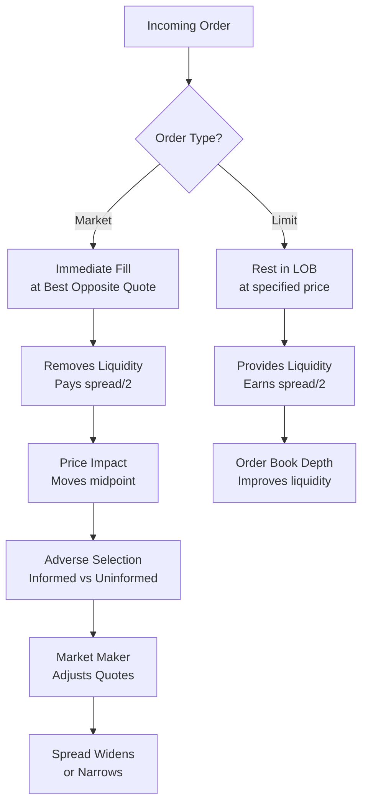

# 🔬 Market Microstructure

> [!abstract] TL;DR
> Market microstructure studies price formation at the level of individual orders and trades. Key results: spreads have three components (processing, inventory, adverse selection); market impact scales as the **square root** of order size; order flow imbalance explains 60-80% of short-term price moves; and Kyle's lambda quantifies how quickly informed order flow moves prices.

---

## Intuition — The Plumbing Beneath the Price

Think of market microstructure as studying the plumbing of a market — not the big price movements you see on a daily chart, but the tiny pipes and valves (order book, spreads, market makers) that determine how orders actually flow and how prices actually form. Just as a city's water pressure depends on pipe diameter, pump capacity, and friction, a security's price moves depend on order book depth, market-maker inventory, and adverse selection risk.

A market maker is like a foreign exchange kiosk at an airport. They quote you a buy price and a sell price — the gap between them (the spread) is their profit. But unlike a kiosk, a market maker faces a serious problem: some of their customers *know* the exchange rate will move, and they will systematically trade against the market maker. The spread must be wide enough to cover these losses to informed traders, plus inventory costs of holding a position, plus basic operating costs.

At the millisecond level, the limit order book (LOB) is a live record of all outstanding buy and sell intentions. The "microprice" — a weighted mid that accounts for which side has more size — is a better predictor of the next trade price than the simple midpoint. Order book imbalance (OBI) captures whether there is more buying or selling pressure at the top of the book, and it has strong short-term predictive power.

---

## How It Works



---

## Key Concepts

### 1. Limit Order Book (LOB) and Microprice

The LOB records all resting limit orders by price level. The best bid and best ask define the quoted spread $s = P_{ask} - P_{bid}$.

The **LOB microprice** weights the midpoint by opposite-side quantities:

$$P_\mu = \frac{P_{ask} \cdot Q_{bid} + P_{bid} \cdot Q_{ask}}{Q_{bid} + Q_{ask}}$$

This is more informative than the simple midpoint $m = (P_{ask} + P_{bid})/2$ because it tilts toward the side with *less* liquidity — if the ask has thin size, the price is likely to move up.

### 2. Order Book Imbalance (OBI)

$$OBI = \frac{Q_{bid} - Q_{ask}}{Q_{bid} + Q_{ask}} \in [-1, 1]$$

- $OBI > 0$: more liquidity on bid → price likely to move **up** (bid absorbs sells)
- $OBI < 0$: more liquidity on ask → price likely to move **down**

OBI is a standard feature in short-term price prediction models (ML order book models).

### 3. Spread Decomposition — Stoll (1978)

The bid-ask spread has three components:

$$s = s_{op} + s_{inv} + s_{adv}$$

| Component | Symbol | Source | Typical Share |
|-----------|--------|--------|--------------|
| Order processing | $s_{op}$ | Fixed operational costs | 20-30% |
| Inventory | $s_{inv}$ | Risk of holding net position | 20-40% |
| Adverse selection | $s_{adv}$ | Cost of trading with informed | 30-60% |

In liquid large-cap stocks, $s_{adv}$ dominates. In illiquid small-caps, $s_{op}$ and $s_{inv}$ are larger.

### 4. Roll (1984) Spread Estimator

Without knowing quotes, you can estimate the effective spread from trade prices alone using the **serial covariance of price changes**:

$$\hat{s} = 2\sqrt{-\text{Cov}(\Delta P_t, \Delta P_{t-1})}$$

**Intuition:** If prices bounce between bid and ask, successive changes are negatively correlated (up then down). The magnitude of this bounce-back identifies the round-trip spread. Requires $\text{Cov}(\Delta P_t, \Delta P_{t-1}) < 0$.

### 5. Kyle (1985) Model — Market Impact and Informed Trading

Kyle's $\lambda$ (lambda) measures how much the market maker moves the price per unit of net order flow:

$$\lambda = \frac{\sigma_v}{2\sigma_u}$$

where $\sigma_v$ = standard deviation of asset value, $\sigma_u$ = noise trader volume. The price update is:

$$\Delta P = \lambda \cdot \text{net order flow}$$

- **Large $\lambda$**: thin, illiquid market — small trades move price a lot
- **Small $\lambda$**: deep, liquid market — you can trade large size with little impact

Kyle's model is foundational: it shows that informed traders optimally **camouflage** their trades within noise trader volume, and market makers set $\lambda$ to break even.

### 6. Order Flow Imbalance — Cont, Kukanov & Stoikov (2014)

$$\Delta P_t \approx \theta \cdot OFI_t$$

where $OFI_t$ is order flow imbalance: the net signed volume of limit order events (adds, cancels, fills) at the best quotes. At 1-minute horizons, this regression achieves $R^2 \approx 60\text{-}80\%$ — among the strongest predictive results in high-frequency finance.

### 7. Square-Root Market Impact Law

Empirically, temporary price impact scales as:

$$MI = \eta \sigma \sqrt{\frac{Q}{V}}$$

where $Q$ = order size, $V$ = average daily volume, $\sigma$ = daily volatility, $\eta \approx 0.1\text{-}0.3$.

**Key insight:** Doubling order size increases impact by only $\sqrt{2} \approx 41\%$, not 100%. This is because large orders attract more liquidity providers as the price moves. The law is robust across asset classes and time periods.

### 8. Propagator Model — Impact Decay

Impact does not persist forever — it decays as:

$$G(\tau) = G_0 \cdot \tau^{-\beta}, \quad \beta \approx 0.5$$

Impact decays as the square root of time elapsed since the trade. This is the **transient impact** component; the residual **permanent impact** reflects information content.

### 9. Amihud ILLIQ Measure

$$ILLIQ_t = \frac{|r_t|}{P_t V_t}$$

Monthly average of daily ILLIQ provides a cross-sectional illiquidity measure. Higher ILLIQ → more price impact per dollar traded → more illiquid.

### 10. PIN — Probability of Informed Trading

$$PIN = \frac{\alpha \mu}{\alpha \mu + \epsilon_b + \epsilon_s}$$

where $\alpha$ = probability of an information event, $\mu$ = informed trading rate, $\epsilon_{b/s}$ = uninformed buy/sell rates. Estimated from daily buy/sell order counts via MLE. High PIN stocks have higher adverse selection costs.

### 11. VPIN — Volume-Synchronized Probability of Informed Trading

VPIN (Easley, López de Prado, O'Hara 2012) uses trade classification by volume buckets rather than time, making it suitable for HFT environments. VPIN spikes preceded the 2010 Flash Crash.

### 12. Intraday Volume Profile

Volume follows a **U-shaped** intraday pattern: high at open (price discovery), low at midday, high at close (rebalancing, index hedges). VWAP algorithms exploit this by executing proportional to expected volume.

---

## Python Example

```python
import numpy as np
import pandas as pd

# ============================================================
# 1. Order Book Imbalance (OBI) from LOB snapshot
# ============================================================
def compute_obi(bid_size: float, ask_size: float) -> float:
    """Order Book Imbalance: positive => more bid-side liquidity => price up."""
    total = bid_size + ask_size
    if total == 0:
        return 0.0
    return (bid_size - ask_size) / total

# ============================================================
# 2. LOB Microprice
# ============================================================
def microprice(bid_price: float, ask_price: float,
               bid_size: float, ask_size: float) -> float:
    """
    LOB microprice: weighted mid, weighted by OPPOSITE side size.
    More ask size => weight on bid price (expect downward move).
    """
    total = bid_size + ask_size
    return (ask_price * bid_size + bid_price * ask_size) / total

# ============================================================
# 3. Roll (1984) Spread Estimator
# ============================================================
def roll_spread(prices: np.ndarray) -> float:
    """
    Estimate effective spread from trade price series.
    s_hat = 2 * sqrt(-Cov(dP_t, dP_{t-1}))
    Returns NaN if covariance is non-negative (no bounce).
    """
    dp = np.diff(prices)
    cov = np.cov(dp[:-1], dp[1:])[0, 1]
    if cov >= 0:
        return np.nan
    return 2 * np.sqrt(-cov)

# ============================================================
# 4. Square-Root Market Impact Model
# ============================================================
def sqrt_market_impact(order_size: float,
                       adv: float,
                       daily_vol: float,
                       eta: float = 0.1) -> float:
    """
    Temporary market impact in fractional terms.
    MI = eta * sigma * sqrt(Q / ADV)
    """
    participation = order_size / adv
    return eta * daily_vol * np.sqrt(participation)

# ============================================================
# Demo
# ============================================================
if __name__ == "__main__":
    # LOB snapshot
    bid_p, ask_p = 100.00, 100.05
    bid_q, ask_q = 500, 200

    obi   = compute_obi(bid_q, ask_q)
    micro = microprice(bid_p, ask_p, bid_q, ask_q)
    print(f"OBI:        {obi:+.3f}  (positive => expect up)")
    print(f"Microprice: {micro:.4f}  (vs mid {(bid_p+ask_p)/2:.4f})")

    # Roll spread estimator
    np.random.seed(42)
    # Simulate prices bouncing bid-ask
    true_spread = 0.05
    prices = np.cumsum(np.random.randn(500) * 0.02)
    prices += np.where(np.random.rand(500) > 0.5, true_spread/2, -true_spread/2)
    est_spread = roll_spread(prices)
    print(f"\nRoll spread estimate: {est_spread:.4f}  (true: {true_spread:.4f})")

    # Impact scaling: 10k vs 20k shares, ADV=1M, vol=1.5%
    for q in [10_000, 20_000, 50_000]:
        mi = sqrt_market_impact(q, adv=1_000_000, daily_vol=0.015)
        print(f"  Q={q:>6,}: impact = {mi*100:.3f}%  ({mi*10000:.1f} bps)")
```

**Output (approximate):**
```
OBI:        +0.429  (positive => expect up)
Microprice: 100.020  (vs mid 100.025)

Roll spread estimate: 0.0487  (true: 0.0500)

  Q= 10,000: impact = 0.047%  (4.7 bps)
  Q= 20,000: impact = 0.067%  (6.7 bps)
  Q= 50,000: impact = 0.106%  (10.6 bps)
```

Note the sub-linear scaling: doubling Q from 10k to 20k increases impact by 41%, not 100%.

---

## Real-World Notes

- **Tick size matters**: Dodd-Frank pilot programs showed that increasing tick size reduced liquidity in small-caps. The optimal tick is approximately the adverse-selection component of the spread.
- **Reg NMS** in the US requires trades to execute at the NBBO (national best bid/offer), preventing markets from trading at inferior prices.
- **Dark pools** execute at the midpoint, bypassing the spread — but have slower fills and opaque order routing.
- **ETF arbitrage**: ETF market makers continuously compare ETF price vs. NAV; their activity enforces the square-root impact law across equity baskets.
- The **Cont-Kukanov-Stoikov** OFI result ($R^2 \approx 65\%$) only holds within a stock; cross-asset OFI has lower predictive power.

---

## Common Pitfalls

- **Confusing permanent vs. temporary impact**: Only the permanent component reflects information; temporary impact fully reverses and is a pure TC cost.
- **Assuming linear impact**: Using $MI \propto Q$ instead of $MI \propto \sqrt{Q}$ dramatically overestimates TC for large orders and underestimates it for small orders.
- **Roll estimator requires negative covariance**: If the market is trending, $\text{Cov}(\Delta P_t, \Delta P_{t-1}) > 0$ and the formula breaks. Use only in mean-reverting microstructure regimes.
- **PIN estimation is fragile**: The MLE for PIN has a flat likelihood landscape; many papers use simplified or Bayesian versions.
- **Ignoring queue position**: A limit order at the best bid with 10,000 shares ahead has very different fill probability than one at the front of the queue.

---

## Related Concepts

- [[Order_Types]] — The primitive orders that create the order book; understanding fills requires knowing priority rules
- [[Algorithmic_Execution]] — Uses spread and impact models to optimize execution schedules
- [[Transaction_Cost_Analysis]] — Measures actual spread paid and impact realized
- [[High_Frequency_Trading]] — HFT market makers set spreads dynamically; Avellaneda-Stoikov extends Kyle's framework

---

## Review Questions

1. The bid is 99.90 ($Q_{bid}=1000$) and the ask is 100.10 ($Q_{ask}=200$). Compute the simple midpoint, the microprice, and the OBI. Which direction does the microprice predict the next trade will occur?

2. You observe consecutive trade prices: 100.00, 99.95, 100.00, 99.95, 100.00. Compute the Roll spread estimator. What assumption is this estimator making about the market structure?

3. A fund needs to trade $Q = 100{,}000$ shares in a stock with $ADV = 5{,}000{,}000$ and $\sigma_{daily} = 2\%$. Using $\eta = 0.15$, estimate the temporary market impact in basis points. If the fund splits the order into 5 equal tranches, how does total impact change?

---

## Sources

- Kyle, A. (1985). *Continuous Auctions and Insider Trading*. Econometrica.
- Roll, R. (1984). *A Simple Implicit Measure of the Effective Bid-Ask Spread*. Journal of Finance.
- Stoll, H. (1978). *The Supply of Dealer Services in Securities Markets*. Journal of Finance.
- Cont, R., Kukanov, A., & Stoikov, S. (2014). *The Price Impact of Order Book Events*. Journal of Financial Econometrics.
- Almgren, R. et al. (2005). *Direct Estimation of Equity Market Impact*. Risk.
- Amihud, Y. (2002). *Illiquidity and Stock Returns*. Journal of Financial Markets.
- Easley, D., López de Prado, M., & O'Hara, M. (2012). *Flow Toxicity and Liquidity*. Review of Financial Studies.

---

#quantitative-finance #execution-microstructure #advanced #market-microstructure #order-book #spread #market-impact
