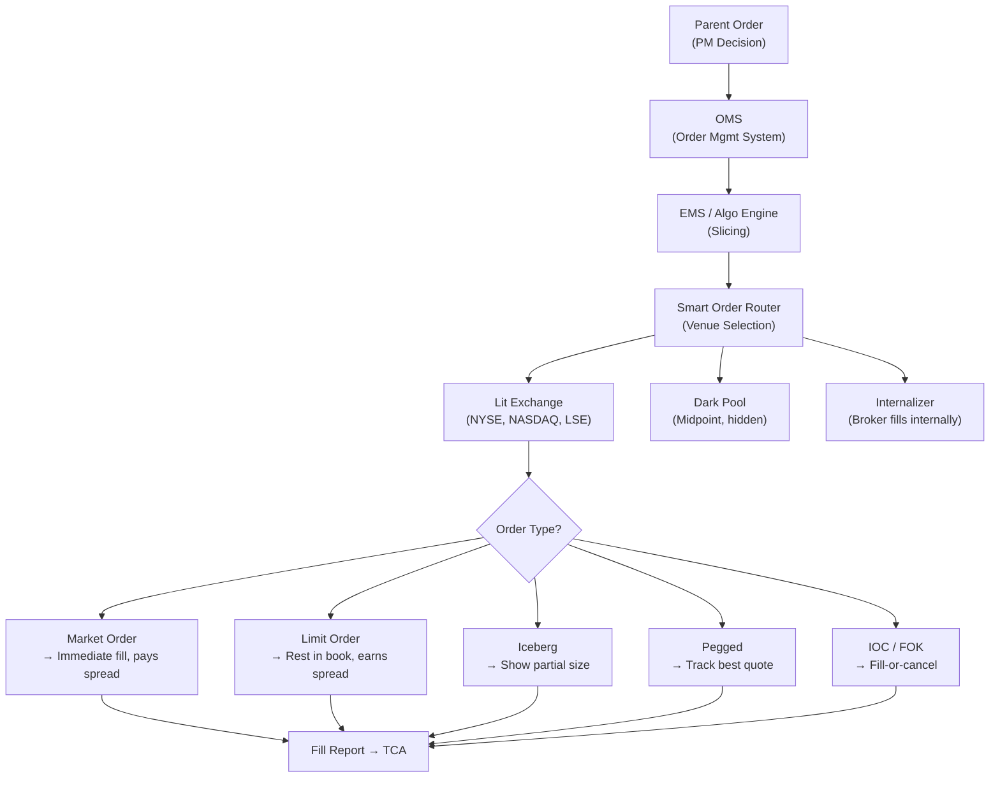

# 📋 Order Types

> [!abstract] TL;DR
> An order type is a set of instructions telling the market *when*, *where*, and *how* to fill your trade. The choice between market, limit, iceberg, IOC, and pegged orders determines whether you pay the spread or earn it, whether you reveal your size to the market, and how you handle partial fills. Smart Order Routers (SOR) optimize across venues using a cost-per-share model.

---

## Intuition — Delivery Options for Your Trade

Order types are like delivery options for a package. A **market order** is same-day express delivery — you pay a premium (the spread) but you're guaranteed to get it. A **limit order** is free standard delivery — it's cheap but might never arrive if no one offers your price. An **iceberg order** is like shipping a container by hiding most of it underground and only showing the shipping label — you avoid scaring the market with your true size.

The difference matters enormously at scale. A retail investor buying 100 shares with a market order pays maybe $0.05 in spread cost — negligible. A fund buying 500,000 shares with a sequence of market orders will move the price against itself by far more than the quoted spread, because each successive fill depletes available liquidity and signals intent to the market. This is why professional execution is a carefully orchestrated sequence of order types and timing.

Market fragmentation (dozens of venues in the US, EU, and Asia) adds another dimension: the same stock may be cheaper to trade on one venue vs. another at any given millisecond. Smart Order Routers exist precisely to solve this multi-venue optimization, splitting each "child order" across venues to minimize total cost.

---

## How It Works



---

## Key Concepts

### 1. Market Order

**Definition:** Execute immediately at the best available price on the opposite side of the book.

- **Guarantee:** Execution is certain (as long as the market is open)
- **Cost:** You always **pay the spread** — you take liquidity rather than provide it
- **Risk:** In fast markets or for large sizes, you may receive a much worse price than the quoted ask (market impact, slippage)
- **When to use:** When certainty of execution is paramount and TC is secondary (e.g., stop-loss on a sharp move)

### 2. Limit Order

**Definition:** Buy/sell only at your specified price or better. The order rests in the LOB until filled or cancelled.

- **Guarantee:** Price certainty, but **no execution guarantee** — the market may never reach your price
- **Benefit:** You **provide liquidity** and earn the spread (in maker-taker pricing, you receive a rebate of ~$0.002/share)
- **Adverse selection risk:** The limit order gets filled most reliably when the market moves *against* you (the "winner's curse" of limit orders)
- **When to use:** When you have time and price sensitivity matters more than certainty

### 3. Price Improvement

When a market order fills at a price *better* than the quoted NBBO, the buyer/seller achieves **price improvement**. Common in:
- Dark pools (always fill at the midpoint, beating the spread by half)
- Auction mechanisms
- Internalizers (brokers who fill retail orders internally)

### 4. Stop Orders

**Stop-Market:** Becomes a market order when the stop price is touched. Guarantees execution but not price.
**Stop-Limit:** Becomes a limit order when stop price is touched. **Gap risk:** If the market jumps through the stop price, the limit may never fill.

| Type | Triggers at | Executes as | Fill guaranteed? |
|------|-------------|-------------|-----------------|
| Stop-Market | Stop price | Market order | Yes (at unknown price) |
| Stop-Limit | Stop price | Limit order | No (may gap through) |

### 5. Iceberg / Reserve Orders

An iceberg order displays only a **peak size** (e.g., 500 shares) while the **total size** (e.g., 50,000 shares) is hidden. When the displayed portion fills, a new peak is automatically replenished from the hidden reserve.

- **Purpose:** Minimize information leakage about true order size
- **Downside:** Other market participants (especially HFTs) have algorithms to detect iceberg orders by observing the replenishment pattern
- **Exchange support:** Most lit exchanges support iceberg natively; some call them "reserve orders"

### 6. Immediate-or-Cancel (IOC) and Fill-or-Kill (FOK)

| Order | Behavior | Use Case |
|-------|----------|----------|
| **IOC** | Fill whatever is available immediately, cancel the rest | Sweep the book, then move on |
| **FOK** | Fill the entire quantity immediately or cancel entirely | Need atomic complete fills |

Both are used by algorithms to aggressively take liquidity at specific price levels without leaving resting orders.

### 7. Good-Till-Cancel (GTC)

A limit order that persists in the book until explicitly cancelled by the trader (or when the exchange's max resting time is hit, typically 90 days). Contrast with **Day orders** that auto-expire at market close.

### 8. Pegged Orders

Pegged orders automatically track the best bid/offer:

| Peg Type | Tracks | Typical Use |
|----------|--------|-------------|
| **Mid-peg** | Midpoint of NBBO | Dark pools; earns half-spread |
| **Primary peg** | Same-side best quote (bid for buys) | Passive, top-of-book access |
| **Discretionary peg** | Rests at primary but discretion to fill up to mid | Flexible liquidity sourcing |

### 9. Dark Pool Orders

Dark pool orders are **non-displayed** — they do not appear in the public order book. Key properties:
- Execution at midpoint (no spread cost, but half-spread vs. taker on a lit exchange)
- Zero market impact signal (trade not seen until post-trade tape)
- Lower fill rate: requires a matching counterparty to also be in the dark pool
- Regulatory requirement (MiFID II): dark pool volume capped at ~8% per stock per year (double volume cap)

### 10. Smart Order Router (SOR)

A SOR algorithmically allocates a child order across $K$ venues to minimize total execution cost. The KKT optimal allocation is:

$$q_k^* = \frac{\mu - s_k/2}{2\lambda_k}$$

where $\mu$ = value of execution, $s_k$ = effective spread at venue $k$, $\lambda_k$ = price impact coefficient at venue $k$. This is derived from minimizing:

$$\min_{\{q_k\}} \sum_k \left[\frac{s_k}{2} q_k + \lambda_k q_k^2 \right] \quad \text{s.t. } \sum_k q_k = Q$$

The quadratic term captures impact: larger venues ($\lambda_k$ small) receive more flow.

### 11. Order Priority Rules

- **Price-time priority (FIFO):** Orders at better prices fill first; ties broken by arrival time. Used on most equity exchanges.
- **Pro-rata:** Orders at a given price level filled proportionally to their size. Common on some options and futures exchanges (CME Eurodollar).
- **Price-broker-time:** Some exchanges give priority to members, then time.

### 12. Maker-Taker Economics and Post-Only Orders

Most exchanges charge takers (market orders) and rebate makers (limit orders):

| Role | Action | Fee/Rebate |
|------|--------|-----------|
| Maker | Adds limit order to book | +$0.002/share rebate |
| Taker | Removes liquidity with market/IOC | −$0.003/share fee |

**Post-only orders** are limit orders that are automatically cancelled if they would immediately execute (i.e., if they would "take" liquidity). This guarantees maker status and the rebate.

### 13. Market Fragmentation: RegNMS and MiFID II

- **RegNMS (US, 2005):** Order Protection Rule requires trades to occur at the NBBO. Trade-through prohibition. Drove proliferation of electronic exchanges.
- **MiFID II (EU, 2018):** Best execution requirements, pre/post-trade transparency, algo registration, SI (systematic internaliser) framework.

---

## Python Example

```python
from dataclasses import dataclass, field
from typing import List, Tuple
import heapq

# ============================================================
# Simple Limit Order Book with Price-Time Priority
# ============================================================

@dataclass(order=True)
class Order:
    price: float
    time: int          # arrival sequence number
    size: float = field(compare=False)
    side: str  = field(compare=False)   # 'buy' or 'sell'
    order_id: int = field(compare=False)

class LimitOrderBook:
    """
    Minimal LOB demonstrating price-time priority and market order fills.
    Bids: max-heap (negate price); Asks: min-heap.
    """
    def __init__(self):
        self.bids: List[Tuple] = []   # (-price, time, size, id)
        self.asks: List[Tuple] = []   # ( price, time, size, id)
        self._time = 0
        self._id   = 0

    def add_limit(self, side: str, price: float, size: float) -> int:
        oid = self._id; self._id += 1
        t   = self._time; self._time += 1
        if side == 'buy':
            heapq.heappush(self.bids, (-price, t, size, oid))
        else:
            heapq.heappush(self.asks, ( price, t, size, oid))
        return oid

    def best_bid(self):
        return (-self.bids[0][0], self.bids[0][2]) if self.bids else (None, 0)

    def best_ask(self):
        return (self.asks[0][0], self.asks[0][2]) if self.asks else (None, 0)

    def execute_market_order(self, side: str, size: float) -> List[Tuple]:
        """Returns list of (fill_price, fill_size) tuples."""
        book = self.asks if side == 'buy' else self.bids
        fills = []
        remaining = size
        while remaining > 0 and book:
            p_key, t, avail, oid = heapq.heappop(book)
            fill_price = -p_key if side == 'sell' else p_key
            fill_size  = min(avail, remaining)
            fills.append((fill_price, fill_size))
            remaining -= fill_size
            if avail > fill_size:   # partial fill: push remainder back
                heapq.heappush(book, (p_key, t, avail - fill_size, oid))
        if remaining > 0:
            print(f"  WARNING: {remaining:.0f} shares unfilled (book exhausted)")
        return fills

# ============================================================
# Demo
# ============================================================
if __name__ == "__main__":
    lob = LimitOrderBook()

    # Build ask side
    lob.add_limit('sell', 100.05, 300)
    lob.add_limit('sell', 100.10, 500)
    lob.add_limit('sell', 100.15, 1000)

    # Build bid side
    lob.add_limit('buy', 100.00, 400)
    lob.add_limit('buy',  99.95, 600)

    bp, bq = lob.best_bid()
    ap, aq = lob.best_ask()
    print(f"Best bid: {bp} x {bq}   Best ask: {ap} x {aq}")
    print(f"Spread:   {ap - bp:.2f}")

    # Market buy for 700 shares — sweeps multiple levels
    print("\nMarket buy 700 shares:")
    fills = lob.execute_market_order('buy', 700)
    vwap  = sum(p * q for p, q in fills) / sum(q for _, q in fills)
    for price, qty in fills:
        print(f"  Filled {qty:.0f} @ {price:.2f}")
    print(f"  VWAP fill: {vwap:.4f}  vs quoted ask: 100.05")

    # IOC: try to buy 200 @ 100.04 — won't match, cancelled
    print("\nIOC limit buy 200 @ 100.04: NO FILL (ask is 100.10 now)")
    bp2, _ = lob.best_bid()
    ap2, _ = lob.best_ask()
    print(f"Updated best: bid={bp2} ask={ap2}")
```

---

## Real-World Notes

- **Payment for order flow (PFOF):** US retail brokers route market orders to wholesalers (Citadel, Virtu) who provide price improvement. Controversial — banned in EU under MiFID II, under review in US.
- **Latency of pegged orders:** Mid-pegged orders track the NBBO, but if the mid moves faster than the exchange can update the peg, you may fill at a stale price.
- **Dark pool toxicity:** Research shows dark pool fill rates are highest for retail (informed?) flow; institutional orders get adverse selection in dark pools.
- **RegNMS loophole — "flickering quotes":** HFTs post and cancel quotes in microseconds; the NBBO may technically exist at a price but is unreachable by the time most orders arrive.

---

## Common Pitfalls

- **Stop-limit gap risk:** Placing a stop-limit sell at $50 stop / $49.90 limit when a stock opens at $45 after bad earnings — the stop triggers, but the limit at $49.90 never fills. Use stop-market for risk management if fill certainty is required.
- **IOC vs FOK confusion:** An IOC will partially fill (fill what's available); FOK is all-or-nothing. Using IOC when you need atomic fills leads to partial executions.
- **Iceberg detection:** Submitting an iceberg with a very small peak size increases replenishment frequency, which HFT detection algos can identify trivially.
- **Maker rebate arbitrage:** Optimizing only for maker rebates (always use limit orders) ignores opportunity cost — a slow fill may miss the alpha signal entirely.

---

## Related Concepts

- [[Market_Microstructure]] — Order types populate the LOB; understanding queuing, priority, and fill probability requires microstructure theory
- [[Algorithmic_Execution]] — Algos construct sequences of order types (typically limit IOC or pegged) to implement a parent order
- [[High_Frequency_Trading]] — HFTs specialise in specific order types (post-only, pegged) and exploit IOC sweeps for latency arbitrage
- [[Transaction_Cost_Analysis]] — Effective spread paid depends critically on order type chosen; TCA compares market vs. limit execution quality

---

## Review Questions

1. A trader submits a **stop-limit sell** order: stop at $100, limit at $99.50. The stock's next trade occurs at $98 (gapped down after hours). What happens to the order? What would have happened with a stop-market instead?

2. Using the SOR formula $q_k^* = (\mu - s_k/2)/(2\lambda_k)$, suppose $\mu = 0.10$, and two venues have $(s_1=0.04, \lambda_1=0.001)$ and $(s_2=0.02, \lambda_2=0.002)$. Compute $q_1^*$ and $q_2^*$. Which venue receives more flow and why?

3. Explain the **winner's curse** for limit orders: why does a limit buy order at 99.95 tend to fill precisely when the stock is heading lower?

---

## Sources

- Harris, L. (2003). *Trading and Exchanges: Market Microstructure for Practitioners*. Oxford University Press.
- SEC. (2005). *Regulation NMS*. Securities and Exchange Commission.
- ESMA. (2018). *MiFID II — Best Execution Requirements*. European Securities and Markets Authority.
- Gould, M. et al. (2013). *Limit Order Books*. Quantitative Finance.
- Foucault, T., Pagano, M., & Röell, A. (2013). *Market Liquidity*. Oxford University Press.

---

#quantitative-finance #execution-microstructure #intermediate #order-types #limit-order-book #smart-order-router #dark-pools
