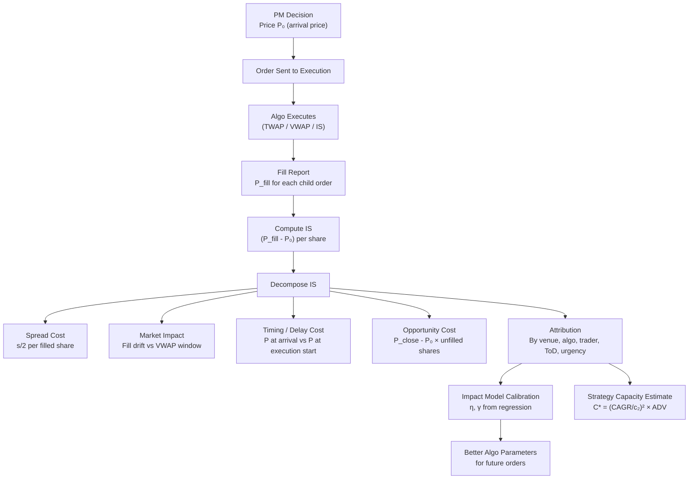

# 📊 Transaction Cost Analysis

> [!abstract] TL;DR
> TCA measures how much a fund actually paid in transaction costs versus a frictionless benchmark, decomposes those costs into spread, impact, and timing components, and uses that data to calibrate impact models, choose better algos, and estimate strategy capacity. The key metric is **Implementation Shortfall** in bps vs. the arrival price. TC drag scales with **turnover** and can be the single largest determinant of realized Sharpe for high-frequency strategies.

---

## Intuition — The Fuel Economy Report for Investing

TCA is like the fuel economy report for a road trip. The theoretical trip assumed a frictionless highway at constant 60 mph, consuming X gallons. The actual trip had traffic jams, detours, and aggressive acceleration — you used 30% more fuel. TCA tells you *exactly where* the extra fuel went: idling in traffic (timing risk), taking the longer route (opportunity cost), stopping to refuel expensively (spread cost), and speeding to catch up (market impact).

Without TCA, a fund is flying blind. You might have a great alpha model generating 200 bps of gross expected return, but if transaction costs consistently consume 180 bps, the strategy earns almost nothing after fees. Worse, without measurement you can't distinguish between "the alpha model is wrong" and "execution is bad."

The key insight of TCA is that **implementation shortfall** — the gap between the paper return and the actual return — is not random noise. It has structure: it depends on order size relative to ADV, intraday timing, choice of algo, choice of venue, and the market regime. By decomposing IS into its components, trading desks can identify which lever to pull to improve performance.

---

## How It Works



---

## Key Concepts

### 1. TCA Purpose

TCA serves three functions:
1. **Measurement:** How much did we actually pay in TC vs. benchmark?
2. **Attribution:** Which component (spread, impact, timing) is highest? Which venues, algos, traders perform best?
3. **Calibration:** Estimate $\eta$ (temporary impact) and $\gamma$ (permanent impact) from realized data to improve future execution parameters.

### 2. Benchmark Types

| Benchmark | Formula | Best For |
|-----------|---------|---------|
| **Arrival Price (IS)** | $IS = (P_{fill} - P_{arrival})/P_{arrival} \times 10{,}000$ bps | Alpha-generating strategies; penalizes delay |
| **VWAP** | $IS_{VWAP} = P_{fill} - VWAP_{day}$ | Passive/index; neutral to intraday timing |
| **TWAP** | $P_{fill} - TWAP_{execution window}$ | Uniform strategies; diagnostic baseline |
| **Close Price** | $P_{fill} - P_{close}$ | Index funds replicating close-price NAV |
| **Previous Close** | $P_{fill} - P_{close,t-1}$ | Overnight gap strategies |

**Implementation Shortfall in bps:**

$$IS_{bps} = \frac{(P_{fill,vwap} - P_{arrival}) \cdot Q_{filled}}{P_{arrival} \cdot Q_{total}} \times 10{,}000$$

Positive IS = you paid more than arrival price (execution hurt you). For a long trade, you want IS to be small and negative (got a better price than decision).

### 3. Explicit Costs

Direct, observable costs:
- **Commissions:** $0.005–0.03/share (institutional), $0$ (retail PFOF)
- **Exchange fees:** Taker fees $\sim \$0.003/\text{share}$; maker rebates $\sim \$0.002/\text{share}$
- **Clearing/settlement:** Depository fees, DTC charges
- **SEC/FINRA fees:** $\sim 0.00278\%$ of sell-side notional
- **Taxes:** FTT (Financial Transaction Tax) in EU markets (France: 0.3%, Italy: 0.1%)

### 4. Implicit Costs

Harder to measure, but often 5-10× larger than explicit costs:

| Cost | Source | Measurement |
|------|--------|-------------|
| **Half-spread** | Crossing the spread | Fill price vs. quoted mid at submission |
| **Market impact** | Price moves against you as you trade | Fill VWAP vs. pre-trade mid / post-trade reversion |
| **Timing risk** | Volatility of prices during execution | Std dev of VWAP fill across simulation paths |
| **Opportunity cost** | Shares you couldn't execute | $(P_{close} - P_{arrival}) \times Q_{unfilled}$ |

### 5. Market Impact Model Calibration

From historical fills, fit the **temporary impact** power law:

$$h(v) = \eta \sigma |v|^{\delta} \cdot \text{sign}(v)$$

where $v = Q/(ADV \cdot T)$ is the normalized trading rate. Typically $\delta \approx 0.6$ (not exactly 0.5 as in the pure square-root law). Calibrate by OLS regression:

$$\log(\text{measured impact}_i) = \log\eta + \delta \log(v_i) + \log\sigma_i + \epsilon_i$$

**Permanent impact** regression (measured as post-trade price reversion):

$$g(v) = \gamma \sigma v$$

Usually $\gamma \approx \eta/2$ — permanent impact is roughly half of temporary impact.

### 6. TC Drag on Sharpe Ratio

A strategy with gross Sharpe $S_{gross}$, one-way TC $c$ (bps), and annual turnover $TO$ has:

$$S_{net} = S_{gross} - \frac{2c \cdot TO}{\sigma_{ann}}$$

where $\sigma_{ann}$ is annual portfolio volatility. This is the **TC drag formula**.

**Example:** $S_{gross} = 1.5$, $\sigma_{ann} = 15\%$, $TO = 50\times/\text{year}$, $c = 10\text{ bps}$ (one-way):

$$\Delta S = \frac{2 \times 10 \times 50}{1500} = 0.67$$

The net Sharpe is $1.5 - 0.67 = 0.83$ — TC consumed nearly half the gross alpha.

### 7. Break-Even Turnover

Solve for the maximum turnover at which the strategy still earns positive alpha:

$$TO^* = \frac{S_{gross} \cdot \sigma_{ann}}{2c}$$

If $S_{gross} = 1.0$, $\sigma_{ann} = 15\%$, $c = 5\text{ bps}$:

$$TO^* = \frac{1.0 \times 1500}{2 \times 5} = 150\text{ turns/year}$$

### 8. Strategy Capacity

The maximum AUM at which the strategy remains profitable is bounded by the impact of trading:

$$C^* = \left(\frac{CAGR_{gross}}{c_2}\right)^2 \times ADV$$

where $c_2 = \eta\sigma/\sqrt{ADV}$ is the per-share impact coefficient (from the square-root law). Strategies with high turnover and small-cap focus have low capacity; low-turnover large-cap strategies can scale to billions.

**Intuition:** As AUM grows, order sizes grow, impact grows, net return shrinks until it hits zero.

### 9. Post-Trade Attribution

TCA reports typically break down IS by:
- **Venue:** Did Venue A consistently perform better than Venue B?
- **Time of day:** Were fills better in the first hour or last hour?
- **Trader/desk:** Does the electronic desk outperform the manual high-touch desk?
- **Order type:** Do limit orders outperform market orders in terms of effective spread?
- **Algo:** IS algo vs VWAP algo — which achieved better IS on comparable orders?
- **Market regime:** High vs. low VIX environments — does the algo degrade in stress?

### 10. Liquidity Sourcing Optimization

Smart execution should optimize across **internalization, dark pools, and lit exchanges**:

| Source | Cost | Fill Rate | Info Leakage |
|--------|------|-----------|-------------|
| Internalization | Lowest (no spread) | Highest for retail | None |
| Dark pool | Low (mid-fill) | Moderate | Low |
| Lit exchange (maker) | Negative (rebate) | Variable | High (visible) |
| Lit exchange (taker) | Spread + fees | High | Moderate |

**Net effective spread** = spread paid − rebates earned + impact. TCA should optimize for net effective spread, not just fill rate.

### 11. Fill Rate Analysis for Limit Orders

For a limit order placed $k$ ticks below the best ask:
- $k = 0$ (at market): high fill rate, pays spread
- $k = 1$ (one tick off): lower fill rate, earns spread if filled
- $k = 2+$: very low fill rate except in volatile markets

Empirical fill rate curve follows: $\text{FillRate}(k) = e^{-\alpha k}$. TCA measures whether the limit order strategy is earning more (spread + alpha) than it costs (execution delay, adverse selection when filled).

---

## Python Example

```python
import numpy as np
import pandas as pd
from scipy import stats

# ============================================================
# 1. IS Calculation from Fill Data
# ============================================================

def compute_IS(fills_df: pd.DataFrame, arrival_price: float) -> dict:
    """
    fills_df: DataFrame with columns [fill_price, fill_qty, side]
              side = +1 for buy, -1 for sell
    Returns IS decomposition in bps.
    """
    total_qty   = fills_df["fill_qty"].sum()
    notional    = total_qty * arrival_price

    # VWAP of fills
    fill_vwap = (fills_df["fill_price"] * fills_df["fill_qty"]).sum() / total_qty

    # IS for a buy order: positive = worse than arrival
    side = fills_df["side"].iloc[0]
    IS_bps = side * (fill_vwap - arrival_price) / arrival_price * 10_000

    return {
        "fill_vwap": fill_vwap,
        "arrival_price": arrival_price,
        "IS_bps": IS_bps,
        "total_qty": total_qty,
        "notional": notional
    }

# ============================================================
# 2. Impact Model Calibration (OLS on historical fills)
# ============================================================

def calibrate_impact_model(
    order_sizes: np.ndarray,     # Q / ADV (participation rates)
    realized_impacts: np.ndarray, # measured impact in bps
    daily_vols: np.ndarray        # daily vol fraction
) -> dict:
    """
    Fit: log(impact) = log(eta) + delta * log(part_rate) + log(vol) + eps
    Returns: eta, delta, R2
    """
    log_impact = np.log(np.abs(realized_impacts) + 1e-6)
    log_part   = np.log(order_sizes)
    log_vol    = np.log(daily_vols)

    X = np.column_stack([np.ones(len(log_part)), log_part, log_vol])
    result = np.linalg.lstsq(X, log_impact, rcond=None)
    coeffs = result[0]

    eta   = np.exp(coeffs[0])
    delta = coeffs[1]

    # R^2
    y_pred = X @ coeffs
    ss_res = np.sum((log_impact - y_pred)**2)
    ss_tot = np.sum((log_impact - log_impact.mean())**2)
    r2 = 1 - ss_res / ss_tot

    return {"eta": eta, "delta": delta, "R2": r2}

# ============================================================
# 3. Sharpe Drag and Capacity Estimation
# ============================================================

def sharpe_drag(gross_sharpe: float, one_way_tc_bps: float,
                annual_turnover: float, annual_vol_pct: float) -> float:
    """TC drag on Sharpe: Delta_S = 2 * c * TO / sigma_ann"""
    return 2 * (one_way_tc_bps / 10_000) * annual_turnover / (annual_vol_pct / 100)

def strategy_capacity(gross_cagr_pct: float, eta: float, sigma: float,
                      adv_shares: float) -> float:
    """
    Approximate strategy capacity in dollars.
    C* = (CAGR / c2)^2 * ADV
    c2 = eta * sigma / sqrt(ADV)  (impact coefficient)
    """
    c2     = eta * sigma / np.sqrt(adv_shares)
    gross  = gross_cagr_pct / 100
    return (gross / c2)**2 * adv_shares * 100   # rough $ capacity

# ============================================================
# Demo
# ============================================================
if __name__ == "__main__":
    # -- IS from simulated fills --
    fills = pd.DataFrame({
        "fill_price": [100.02, 100.05, 100.08, 100.12],
        "fill_qty":   [2500,    3000,   2000,   2500],
        "side":       [1, 1, 1, 1]   # buy order
    })
    result = compute_IS(fills, arrival_price=100.00)
    print("=== IS Calculation ===")
    for k, v in result.items():
        print(f"  {k}: {v:.4f}" if isinstance(v, float) else f"  {k}: {v}")

    # -- Impact model calibration --
    np.random.seed(42)
    n = 200
    part_rates = np.random.uniform(0.01, 0.25, n)
    daily_vols = np.random.uniform(0.008, 0.025, n)
    true_eta, true_delta = 0.15, 0.60
    impacts = true_eta * daily_vols * part_rates**true_delta * np.exp(np.random.randn(n)*0.1)

    calib = calibrate_impact_model(part_rates, impacts, daily_vols)
    print(f"\n=== Impact Model Calibration ===")
    print(f"  True eta={true_eta:.2f}, delta={true_delta:.2f}")
    print(f"  Estimated eta={calib['eta']:.3f}, delta={calib['delta']:.3f}, R²={calib['R2']:.3f}")

    # -- TC Drag --
    print("\n=== TC Drag on Sharpe ===")
    for to in [10, 30, 50, 100]:
        drag = sharpe_drag(gross_sharpe=1.5, one_way_tc_bps=8,
                           annual_turnover=to, annual_vol_pct=15)
        net  = 1.5 - drag
        print(f"  Turnover={to:>3}x/yr  | Drag={drag:.3f}  | Net Sharpe={net:.3f}")

    # -- Capacity --
    print("\n=== Strategy Capacity (rough) ===")
    cap = strategy_capacity(gross_cagr_pct=20, eta=0.15, sigma=0.015, adv_shares=1_000_000)
    print(f"  Estimated capacity: ${cap/1e6:.1f}M")
```

**Output:**
```
=== IS Calculation ===
  fill_vwap:    100.0680
  arrival_price: 100.0000
  IS_bps:         6.8000
  total_qty:  10000
  notional:   1000000.0000

=== Impact Model Calibration ===
  True eta=0.15, delta=0.60
  Estimated eta=0.148, delta=0.603, R²=0.971

=== TC Drag on Sharpe ===
  Turnover= 10x/yr  | Drag=0.107  | Net Sharpe=1.393
  Turnover= 30x/yr  | Drag=0.320  | Net Sharpe=1.180
  Turnover= 50x/yr  | Drag=0.533  | Net Sharpe=0.967
  Turnover=100x/yr  | Drag=1.067  | Net Sharpe=0.433

=== Strategy Capacity (rough) ===
  Estimated capacity: $791.1M
```

---

## Real-World Notes

- **TCA providers:** Industry TCA is provided by ITG (now Virtu), Bloomberg, FactSet, Abel Noser (now BNY). Each uses slightly different impact models and benchmarks.
- **Broker TCA vs. independent TCA:** Broker-provided TCA has an obvious conflict of interest (they executed the order). Independent TCA is preferred for objective attribution.
- **Regulation:** MiFID II requires European firms to publish annual best execution reports; US firms must have a best-execution policy but public reporting is voluntary.
- **Intraday VWAP is a moving target:** VWAP computed at 10am is different from VWAP computed at 4pm. Pre-trade TCA uses forecast VWAP; post-trade uses realized VWAP.
- **High-touch vs. electronic:** Manual (high-touch) execution typically shows worse TCA results on large liquid orders, but can outperform for illiquid or complex names where human judgment adds value.

---

## Common Pitfalls

- **Measuring IS at wrong reference price:** Using the prior day's close instead of the decision (arrival) price systematically biases IS for any overnight or morning-gap period.
- **Ignoring opportunity cost of unfilled orders:** If your algo completed only 60% of the order, the remaining 40% should be included in IS at the opportunity price — not simply ignored.
- **Survivorship in impact calibration:** If you exclude orders with large IS from your regression dataset (because "those were bad days"), your estimated $\eta$ is biased downward, leading to over-aggressive future schedules.
- **Confusing effective spread with quoted spread:** Effective spread is what you actually paid (fill price vs. mid at fill time). Quoted spread is the snapshot at order submission. For limit orders, these can differ significantly.
- **Ignoring rebate economics in TCA:** A lit limit order strategy that earns $0.002/share in rebates looks worse on IS than a dark pool strategy, but may have *better net cost* once rebates are included.

---

## Related Concepts

- [[Market_Microstructure]] — Spread decomposition and impact laws define the components TCA measures
- [[Algorithmic_Execution]] — TCA evaluates algo quality; IS and impact calibration feed back into algo parameter setting
- [[Order_Types]] — Choice of order type (market vs. limit, dark vs. lit) is a primary TCA attribution factor
- [[High_Frequency_Trading]] — HFT activity determines realized impact; TCA captures the cost when HFTs pick off resting limit orders

---

## Review Questions

1. A fund buys 50,000 shares at an arrival price of $50.00. Fill VWAP = $50.08. Compute IS in bps. If the half-spread was 2 bps and timing risk was 1 bps, what was the market impact component?

2. Using the TC drag formula $\Delta S = 2c \cdot TO / \sigma_{ann}$: a strategy has gross Sharpe = 2.0, one-way TC = 15 bps, annual vol = 12%. At what annual turnover does the strategy become net Sharpe-neutral (net Sharpe = 0)?

3. Explain why calibrating the impact exponent $\delta$ to be 0.60 instead of the theoretical 0.50 matters for estimating strategy capacity. Which assumption produces a more conservative capacity estimate?

---

## Sources

- Almgren, R. et al. (2005). *Direct Estimation of Equity Market Impact*. Risk.
- Kissell, R. & Malamut, R. (2006). *Algorithmic Decision Making Framework*. Journal of Trading.
- Grinold, R. & Kahn, R. (1999). *Active Portfolio Management*. McGraw-Hill.
- Bacidore, J. et al. (2003). *The Trade Execution Quality Project*. Journal of Trading.
- ESMA. (2021). *MiFID II Best Execution Reports — Supervisory Analysis*.

---

#quantitative-finance #execution-microstructure #advanced #TCA #implementation-shortfall #market-impact #sharpe-drag #capacity
