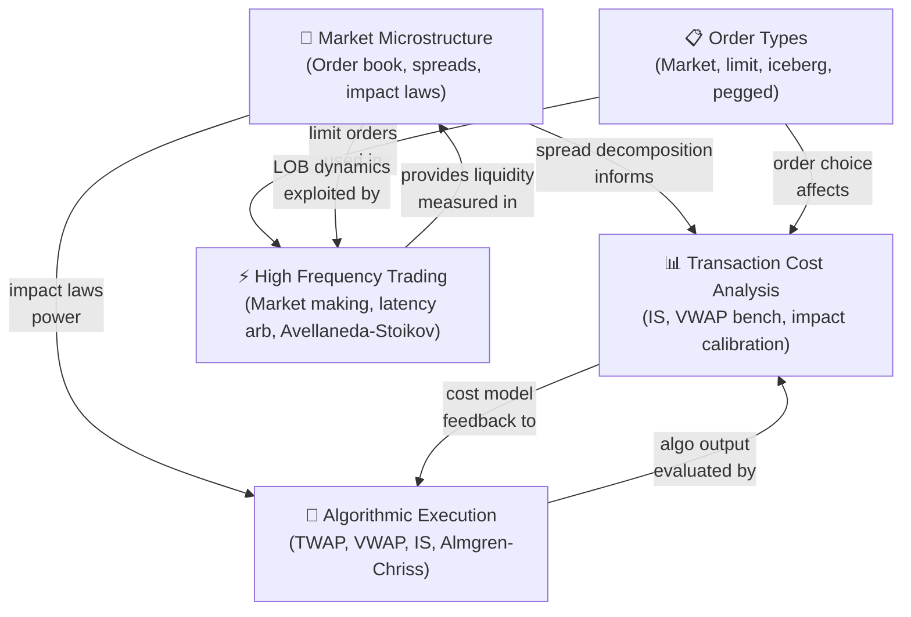

# ⚡ Execution & Microstructure — Map of Content

> [!abstract]
> Market microstructure studies how prices are formed at the level of individual orders and trades — the plumbing beneath the surface of asset prices. Optimal execution transforms a large portfolio decision into a sequence of small orders that minimize transaction costs while managing timing risk and market impact. Algorithmic trading and high-frequency strategies operate at this microscopic level, exploiting inefficiencies in the order flow and price formation process.

---

## Concept Map

---

## Learning Path

| Step | Note | Why This Order |
|------|------|---------------|
| 1 | [[Market_Microstructure]] | Foundation — understand how prices form, spreads emerge, and impact works before anything else |
| 2 | [[Order_Types]] | Know your tools — every execution algo and HFT strategy is built from primitive order types |
| 3 | [[Algorithmic_Execution]] | Apply microstructure insight to optimal scheduling of large orders |
| 4 | [[Transaction_Cost_Analysis]] | Measure and attribute execution quality; feeds back into algo calibration |
| 5 | [[High_Frequency_Trading]] | Capstone — combines everything at extreme speed; market making, latency arb, and regulatory landscape |

---

## All Notes at a Glance

| Note | Difficulty | Core Idea | Key Formula |
|------|-----------|-----------|-------------|
| [[Market_Microstructure]] | Advanced | Price formation, LOB, adverse selection | $MI = \eta\sigma\sqrt{Q/V}$ (square-root law) |
| [[Order_Types]] | Intermediate | Order anatomy, priority rules, dark pools | SOR: $q_k^* = (\mu - s_k/2)/(2\lambda_k)$ |
| [[Algorithmic_Execution]] | Advanced | Optimal trade scheduling; Almgren-Chriss | $x^*(t) = X\frac{\sinh(\kappa(T-t))}{\sinh(\kappa T)}$ |
| [[Transaction_Cost_Analysis]] | Advanced | Measure IS, calibrate impact, Sharpe drag | $\Delta S = 2c\cdot TO/\sigma_{ann}$ |
| [[High_Frequency_Trading]] | Advanced | MM, latency arb, Avellaneda-Stoikov | $r = s - q\rho\sigma^2(T-t)$ |

---

## Key Questions

1. Why does market impact scale as the **square root** of order size rather than linearly?
2. What are the three components of the bid-ask spread (Stoll 1978), and which dominates in liquid vs. illiquid markets?
3. How does the Almgren-Chriss model trade off **expected cost vs. variance of execution**? What happens as risk aversion $\lambda \to 0$ or $\lambda \to \infty$?
4. When should you use an **IS algorithm** vs. **VWAP algorithm**? What does alpha decay have to do with this choice?
5. Why do HFT market makers need to adjust their **reservation price** for inventory, and how does the Avellaneda-Stoikov formula quantify this?
6. What is **implementation shortfall** and how is it decomposed into delay, spread, impact, and opportunity costs?
7. How does **TCA** measure strategy capacity, and why does high turnover compound transaction cost drag on Sharpe?

---

## Related Sections

- [[_MOC_QuantFinance_Master]] — Master vault entry point
- [[_MOC_Quant_Strategies]] — Alpha generation strategies that feed execution decisions
- [[_MOC_Backtesting_Simulation]] — Backtesting must incorporate realistic TC models from TCA
- [[_MOC_Risk_Management]] — Position sizing interacts with execution urgency and impact

---

#MOC #QuantitativeFinance #ExecutionMicrostructure
