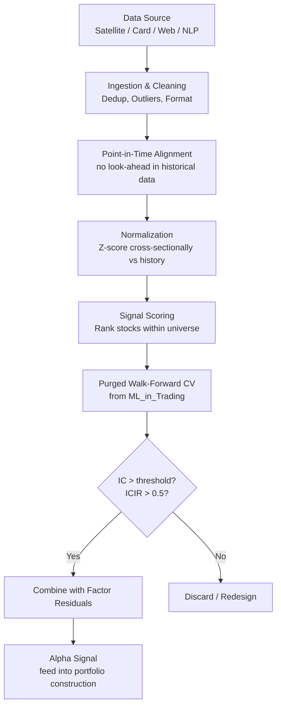

# Alternative Data

> [!abstract] TL;DR
> Alternative data is like being the first hedge fund to use Bloomberg in 1990 — while everyone else was reading paper filings, Bloomberg users had real-time data. That edge existed until it was crowded. Today, satellite imagery of parking lots, credit card transaction flows, and geolocation data provide the same structural advantage: real-time economic signals before official earnings releases. The edge decays fast, the legal risks are real, and disciplined due diligence separates alpha from noise.

---

## Intuition — The Information Edge Race

In 1983, Mike Bloomberg launched the Bloomberg Terminal. The firms that adopted it first — gaining access to real-time bond prices, news, and analytics — had a genuine information edge over competitors still working from paper confirmations. Within a decade, Bloomberg was ubiquitous and the edge was gone. But the principle remained: the first systematic users of any new information source capture the premium.

Alternative data follows this exact pattern. When the first quant funds discovered that satellite imagery of retail parking lots could estimate same-store sales two weeks before the official earnings report, the IC on that signal was exceptional. As the technique spread — via academic publication, vendor marketing, and regulatory filings — the signal was arbitraged away. Today, basic parking lot counting is table stakes. The frontier has moved to multimodal fusion: parking lot imagery combined with mobile device GPS pings, combined with credit card transactions from the same catchment area.

The second critical insight is that alternative data is fundamentally about signal decay. Unlike the Fama-French momentum factor (which has persisted for 50+ years because it has a behavioral underpinning), alternative data signals are operational — they reflect a specific data collection advantage that can be replicated. Satellite imagery alpha decays as drone counts are commoditized. The investment in alternative data is therefore an investment in a moving target: constant sourcing, evaluation, and rotation.

---

## How It Works



---

## Key Concepts

### Alternative Data Taxonomy

| Category | Examples | Alpha Mechanism | Decay Half-life |
|----------|----------|-----------------|----------------|
| Satellite imagery | Parking lots, oil storage tanks, crop coverage | Foot traffic → revenue before earnings | 1–4 weeks |
| Credit/debit card | Transaction flows by merchant, geography | Real-time revenue estimates | 1–2 weeks |
| Web scraping | Job postings, Amazon reviews, Glassdoor, web traffic | Operational health, hiring trends | 2–6 weeks |
| Social media | Twitter/X, Reddit (WSB), StockTwits | Retail sentiment, meme dynamics | 1–5 days |
| Email receipts | Purchase confirmation panel (Slice Intelligence) | Same-store sales tracking | 1–2 weeks |
| Geolocation / mobility | Foot traffic (SafeGraph, Placer.ai), mobility patterns | Consumer trends, store visits | 1–3 weeks |
| NLP / text | Earnings calls, 10-K filings, patent applications | Tone analysis, R&D signals | 2–8 weeks |
| ESG scores | Carbon footprint, labor practices, governance | Regulatory risk, ESG fund flows | 1–3 months |

### IC Typical Ranges by Data Type

| Data Source | Typical IC | Notes |
|-------------|-----------|-------|
| Satellite imagery (parking lots) | 0.03–0.07 | Strongest near retail sector earnings |
| Credit card transactions | 0.04–0.08 | Requires merchant-mapped panel data |
| Web scraping (job postings) | 0.02–0.05 | Lagged 2–4 weeks vs actual hiring |
| NLP sentiment (earnings calls) | 0.02–0.05 | See [[NLP_for_Finance]] |
| Geolocation (foot traffic) | 0.03–0.06 | High-frequency restaurants/retail |
| Social media sentiment | 0.01–0.04 | Noisy; works best event-driven |

### Signal Construction Pipeline

A robust alternative data signal follows six steps:

**Step 1 — Ingestion and Cleaning**
- Deduplication: remove repeated observations (especially in social media streams)
- Outlier removal: clip values beyond 5 standard deviations; flag for review
- Format standardization: align timestamps to market close; convert to common currency

**Step 2 — Point-in-Time Alignment**
- Critical: ensure historical data reflects only what was available at each point in time
- Satellite imagery must use only the observation date, not subsequent reprocessing
- Credit card data must account for reporting lag (typically 1–3 business days)
- Failure here creates look-ahead bias identical to the problems in [[ML_in_Trading]]

**Step 3 — Normalization**
Cross-sectional z-score at each time step $t$:

$$z_{i,t} = \frac{s_{i,t} - \mu_t}{\sigma_t}$$

where $\mu_t$ and $\sigma_t$ are cross-sectional mean and standard deviation at time $t$ across all stocks in universe. Alternatively, normalize vs the company's own history:

$$z_{i,t}^{\text{hist}} = \frac{s_{i,t} - \mu_{i,T}}{\sigma_{i,T}}$$

where $\mu_{i,T}$ is the rolling mean of stock $i$'s signal over the prior $T$ periods.

**Step 4 — Signal Scoring**
Rank stocks by $z_{i,t}$ within the universe; convert to percentile ranks $[0, 1]$:

$$\text{rank}_{i,t} = \frac{\text{rank}(z_{i,t})}{N + 1}$$

**Step 5 — Backtest with Purged Walk-Forward CV**
Use the framework from [[ML_in_Trading]]:
- IC/ICIR evaluation across rolling OOS folds
- Embargo and purge zones respected
- Target: IC > 0.02, ICIR > 0.5 for inclusion in signal blend

**Step 6 — Combine with Factor Model Residuals**
Orthogonalize the alt-data signal against known factors (market, size, value, momentum) to isolate the information not already in the factor model:

$$\alpha_i^{\text{alt}} = z_{i,t} - \beta_{\text{factors}} \cdot F_t$$

This prevents the alpha from being diluted by or correlated with standard factor exposures.

### Legal and Regulatory Considerations

Alternative data presents genuine legal risk that must be actively managed:

**Material Non-Public Information (MNPI)**
Trading on MNPI is illegal under SEC Rule 10b-5. Examples:
- A satellite image taken during an earnings blackout window that reveals pre-release revenue
- Credit card data covering 80% of a retailer's transactions (effectively the company's internal data)

The legal test: would a reasonable person consider this information material? Would it have been disclosed by the company had they known others possessed it?

**Regulation FD (Fair Disclosure)**
Reg FD prohibits companies from selectively disclosing material information to preferred investors. Applies to investment research relationships — analysts cannot receive earnings guidance that other investors do not receive simultaneously.

**Data Vendor Due Diligence**
Responsibility for legality extends to the buyer. Quant funds must verify:
- Web scraping respects Terms of Service
- Consumer data panels comply with GDPR, CCPA privacy laws
- Satellite imagery does not capture legally protected airspace
- Social media data was obtained under appropriate API agreements

**Practical Compliance Process**:
1. Legal review of data collection method before purchase
2. Compliance officer sign-off on signal construction methodology
3. MNPI review for any data with insider-like coverage
4. Annual re-review as regulations evolve

### Data Due Diligence Checklist

| Check | What to Look For | Red Flag |
|-------|-----------------|---------|
| Sample quality | Coverage, accuracy, update frequency | < 30% universe coverage |
| Survivorship bias | Does sample include delisted companies? | Historical bias toward survivors |
| Point-in-time availability | When was data actually available? | Restatement look-ahead |
| Coverage breadth | % of universe covered | Drops below 50% in important sectors |
| Vendor stability | Track record, client base, backup systems | Single-vendor source of truth |
| Signal validation | Can you independently verify a sample? | No independent check possible |

### Vendor Selection Criteria

1. **Sample data first**: always evaluate a sample before paying for full access
2. **Understand collection method**: how is the data obtained? What are the failure modes?
3. **Independent validation**: cross-check against public data where possible (e.g., verify credit card signal against actual same-store-sales when reported)
4. **Exclusive vs commodity**: exclusive data (single buyer) has longer half-life; broadly distributed data decays faster
5. **Counter-cyclical coverage**: does the dataset capture recessions and crises, or only the bull market period?

### Signal Decay and Turnover

Alternative data signals decay faster than classical factor signals because they reflect operational informational advantages, not structural behavioral biases:

$$IC(h) = IC(1) \cdot e^{-\rho h}$$

For satellite imagery, $\rho \approx 0.5$ (IC halves within 1–2 periods). For NLP signals, $\rho \approx 0.2–0.3$. For ESG scores, $\rho \approx 0.05$.

Fast decay implies **higher turnover** — rebalancing more frequently to capture the signal before it dissipates. Higher turnover means higher transaction costs. The signal must be sufficiently strong (high IC) to survive these costs.

Rule of thumb: annualized signal premium must exceed $2 \times$ annualized turnover $\times$ average spread.

---

## Python Example

```python
import numpy as np
import pandas as pd
from scipy.stats import spearmanr

# ─── Synthetic alternative data signal construction ───────────────────────────

def generate_synthetic_card_data(n_stocks: int, n_periods: int,
                                  true_ic: float = 0.04,
                                  noise_level: float = 0.98,
                                  seed: int = 42) -> tuple:
    """
    Simulate credit card transaction flow signal and forward returns.
    Returns (signal DataFrame, returns DataFrame).
    """
    rng = np.random.default_rng(seed)
    # True forward returns (unobservable)
    true_returns = rng.standard_normal((n_periods, n_stocks)) * 0.02

    # Card signal: weak correlation with next-period returns + noise
    signal = (true_ic * true_returns +
              noise_level * rng.standard_normal((n_periods, n_stocks)))

    signal_df = pd.DataFrame(signal, columns=[f"stock_{i}" for i in range(n_stocks)])
    returns_df = pd.DataFrame(
        np.roll(true_returns, -1, axis=0),  # next-period returns
        columns=[f"stock_{i}" for i in range(n_stocks)]
    )
    return signal_df.iloc[:-1], returns_df.iloc[:-1]


def cross_sectional_zscore(signal_df: pd.DataFrame) -> pd.DataFrame:
    """Z-score signal cross-sectionally at each time step."""
    mu = signal_df.mean(axis=1)
    sigma = signal_df.std(axis=1).replace(0, 1)
    return signal_df.sub(mu, axis=0).div(sigma, axis=0)


def compute_rolling_ic(signal_df: pd.DataFrame,
                        returns_df: pd.DataFrame) -> pd.Series:
    """Compute period-by-period IC (Spearman rank correlation)."""
    ics = []
    for t in range(len(signal_df)):
        sig_t = signal_df.iloc[t]
        ret_t = returns_df.iloc[t]
        ic, _ = spearmanr(sig_t, ret_t)
        ics.append(ic)
    return pd.Series(ics, name="IC")


def evaluate_alt_data_signal(signal_df: pd.DataFrame,
                              returns_df: pd.DataFrame) -> dict:
    """Full evaluation pipeline: normalize, compute IC, report statistics."""
    # Step 1: Cross-sectional z-score
    z_signal = cross_sectional_zscore(signal_df)

    # Step 2: Rolling IC
    ic_series = compute_rolling_ic(z_signal, returns_df)

    # Step 3: Summary statistics
    mean_ic = ic_series.mean()
    std_ic = ic_series.std()
    icir = mean_ic / std_ic if std_ic > 0 else 0.0
    pct_positive = (ic_series > 0).mean()

    return {
        "mean_IC": mean_ic,
        "std_IC": std_ic,
        "ICIR": icir,
        "pct_positive_IC": pct_positive,
        "IC_series": ic_series,
    }


# Run the pipeline
signal_df, returns_df = generate_synthetic_card_data(
    n_stocks=100, n_periods=252, true_ic=0.04
)

results = evaluate_alt_data_signal(signal_df, returns_df)
print(f"Alternative Data Signal Evaluation")
print(f"  Mean IC          : {results['mean_IC']:.4f}  (target: > 0.02)")
print(f"  ICIR             : {results['ICIR']:.4f}  (target: > 0.50)")
print(f"  % Positive IC    : {results['pct_positive_IC']:.1%}")

# Signal decay estimation (exponential fit)
ic_rolling = results["IC_series"].rolling(20).mean().dropna()
print(f"\nSignal appears to be {'persistent' if results['ICIR'] > 0.5 else 'unstable'}")
print(f"Recommend {'deploy with monitoring' if results['ICIR'] > 0.5 else 'redesign or discard'}")
```

---

## Real-World Notes

- The first published study using satellite imagery for trading signals was Correia, Kang, and Scott (2021) on Chinese factory activity — signal IC was 0.06 before publication, estimated < 0.02 after widespread adoption.
- Second Measure and Bloomberg Second Measure pioneered institutional credit card signal products; typical coverage is 2–5% of a retailer's transactions from a large consumer panel — sufficient for statistical estimation.
- SafeGraph (geolocation) and Placer.ai are the leading foot traffic data vendors; their data is used by Citadel, D.E. Shaw, and most large multi-strategy funds.
- ESG signals are bifurcating: traditional ESG sentiment has been crowded since 2020; frontier signals include real-time carbon measurement via satellite and supply chain labor tracking.

---

## Common Pitfalls

- **Ignoring point-in-time availability**: historical backtests with reprocessed satellite imagery are biased — use only the original observation timestamp.
- **Testing on a single market regime**: satellite parking data backtested only on 2015–2019 misses the COVID period (zero cars = maximum noise) and the reopening surge (massive signal reversal).
- **Overestimating coverage**: a credit card panel covering 80% of a retailer's transactions is nearly MNPI; most panels cover 2–8% — sufficient for estimation but legally distinct.
- **Not adjusting for sector**: normalize within sector (retail vs tech vs healthcare) not across the full universe — otherwise you're mixing signals with fundamentally different dynamics.

---

## Related Concepts

- [[ML_in_Trading]] — IC/ICIR evaluation and purged CV framework for alt data signals
- [[NLP_for_Finance]] — NLP signals (earnings call sentiment, 10-K text) as a specific alternative data category
- [[Neural_Networks_Finance]] — alt data features as inputs to XGBoost/LSTM ensemble
- [[Reinforcement_Learning_Trading]] — alt data signals can enter RL state representations

---

## Review Questions

1. A satellite imagery vendor claims an annualized IC of 0.08 on their parking lot dataset, backtested from 2015–2022. What specific data quality and methodology concerns should you investigate before accepting this number?
2. You receive a credit card transaction panel covering 65% of all transactions at a major retailer. The legal/compliance team raises MNPI concerns. What is the legal test, and what coverage percentage is typically considered safe?
3. An alternative data signal has IC = 0.05 and decay rate $\rho = 0.6$. Calculate the optimal holding horizon $H^*$ and estimate the signal's IC at $h = 3$ periods. Does this signal support a weekly or monthly rebalancing strategy?

---

## Sources

- Kolanovic, M., & Krishnamachari, R. T. (2017). *Big Data and AI Strategies: Machine Learning and Alternative Data Approach to Investing*. JPMorgan.
- Correia, M., Kang, J., & Scott, J. (2021). Managerial Response to Alternative Data. *Working Paper*.
- López de Prado, M. (2018). *Advances in Financial Machine Learning*. Wiley. (Chapter on feature engineering)
- Man Institute. (2019). *The Search for Genuine Alpha: Alternative Data*. Man Institute Research.
- US SEC. (2018). *Statement on Digital Asset Securities*. (MNPI guidance applicable to alternative data)

#quantitative-finance #ml-finance #intermediate
