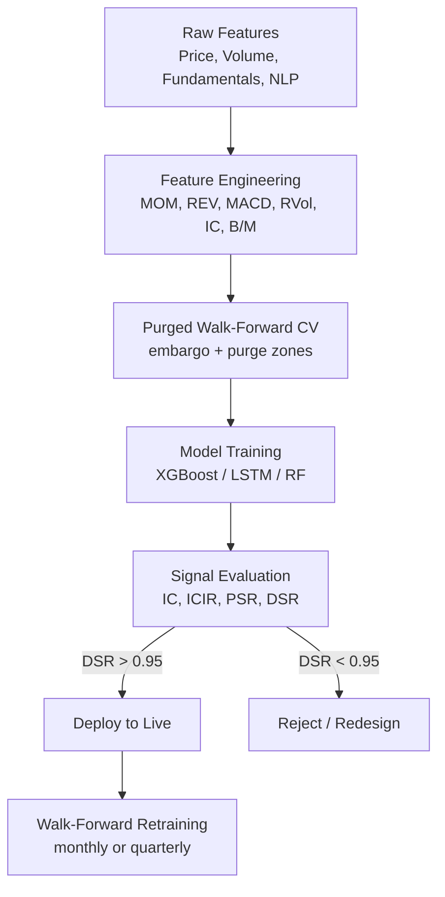

# ML in Trading

> [!abstract] TL;DR
> Applying ML to financial time series is fundamentally harder than standard supervised learning: signal-to-noise ratios are sub-1%, regimes shift, and naive backtesting inflates results through look-ahead bias. Correcting these problems requires purged walk-forward cross-validation, embargo periods, and rigorous signal evaluation via Information Coefficient (IC), ICIR, and the Probabilistic Sharpe Ratio (PSR) before any live deployment.

---

## Intuition — The Exam Answer Key Problem

Imagine studying for tomorrow's exam by secretly reading tomorrow's answer key tonight. Your practice score is perfect — but the real test will expose you. This is precisely what happens when you train an ML model on financial data without purging future information from your training set. The model has "seen" the correct answers through look-ahead bias embedded in labels constructed from future prices.

The second trap is subtler: even with clean data, financial time series are serially correlated. Consecutive daily returns share common macroeconomic shocks and microstructure effects. Standard k-fold cross-validation shuffles the data randomly, placing adjacent observations in both train and test sets. The model then exploits these correlations between folds as if they were genuine predictive features — but on live data, where the past does not touch the future, the signal vanishes. The backtest was an illusion.

The third reality check is the signal-to-noise problem. In image classification, models routinely achieve $R^2 > 90\%$. In finance, an $R^2$ of 1% on one-day forward returns is genuinely excellent. A model must be designed and evaluated for this regime: ensemble methods, regularization, and out-of-sample IC rather than in-sample fit are the right scorecard.

---

## How It Works



---

## Key Concepts

### Structural Challenges of ML in Finance

| Challenge | Effect on Modeling | Solution |
|-----------|-------------------|---------|
| Low SNR ($R^2 < 1\%$) | Signal buried in noise | Ensemble methods, regularization |
| Non-stationarity | Model decays over time | Walk-forward retraining |
| Look-ahead bias | Inflated OOS metrics | Purged CV with embargo |
| Fat tails | Loss underestimation | Robust loss functions (Huber) |
| Serial correlation | Overstated t-stats | Newey-West standard errors |
| Crowding | Alpha decay as signal spreads | Novelty tracking, turnover monitoring |

### Purged Walk-Forward Cross-Validation (López de Prado)

Standard k-fold randomly mixes train/test, creating leakage through serial correlation. Purged walk-forward enforces a strict temporal ordering:

1. **Purge**: Remove the $H-1$ bars immediately before the test fold. These observations were constructed using prices that overlap with the test period label horizon.
2. **Embargo**: After the test fold, skip $H/2$ bars before starting the next training extension. These bars are contaminated by forward bar construction from within the test period.

$$\text{NEVER use standard k-fold on financial time series}$$

For the **Combinatorial Purged Cross-Validation (CPCV)** with $N=6$ folds choosing $k=2$ test paths:

$$\binom{N}{k} = \binom{6}{2} = 15 \text{ OOS paths}$$

This distributional coverage over 15 synthetic OOS Sharpe ratios allows inference on the full Sharpe distribution, not just a single OOS estimate.

### Information Coefficient (IC)

$$IC = \rho_S(\hat{r}_t, r_t)$$

where $\rho_S$ is the Spearman rank correlation between the model forecast $\hat{r}_t$ and realized return $r_t$. Using rank correlation makes IC robust to outliers and fat-tailed returns.

$$ICIR = \frac{\overline{IC}}{\sigma(IC)}$$

A **target ICIR > 0.5** is the threshold for a signal worth pursuing. An IC of 0.05 with high variance (ICIR = 0.2) is far less deployable than an IC of 0.03 with ICIR = 0.8.

### Grinold's Fundamental Law of Active Management

$$IR \approx IC \cdot \sqrt{N_{bets}}$$

where $N_{bets}$ is the number of **independent** bets. This law explains why high-frequency strategies (many bets, moderate IC) can compete with low-frequency strategies (few bets, high IC). Crucially, bets must be independent — leveraging correlated positions inflates the apparent breadth.

### OOS $R^2$ — Campbell-Thompson Test

$$R^2_{OOS} = 1 - \frac{\sum_t (r_t - \hat{r}_t)^2}{\sum_t (r_t - \bar{r}_{t,IS})^2}$$

Even a **slightly positive $R^2_{OOS}$** is meaningful evidence of real alpha — because the denominator uses in-sample mean as benchmark. A negative value means the model is worse than a naïve mean forecast.

### Signal Decay Model

$$IC(h) = IC(1) \cdot e^{-\rho h}$$

where $h$ is the holding horizon and $\rho$ is the decay rate. The **optimal holding horizon** that balances signal strength against transaction costs is:

$$H^* = \frac{1}{2\rho}$$

A signal with $\rho = 0.5$ decays to $e^{-0.5} \approx 60\%$ of its value in one period — requiring frequent rebalancing.

### Probabilistic Sharpe Ratio (PSR)

The PSR accounts for non-normality and the multiple-testing problem inherent in strategy selection:

$$PSR = \Phi\left(\frac{(\hat{SR} - SR^*)\sqrt{T-1}}{\sqrt{1 - \hat{\gamma}_3 SR^* + \frac{\hat{\gamma}_4 - 1}{4} SR^{*2}}}\right)$$

where $\hat{\gamma}_3$ is skewness, $\hat{\gamma}_4$ is excess kurtosis, and $SR^*$ is the benchmark (e.g., 1.0 annualized).

**Deployment gate: DSR > 0.95** (Deflated Sharpe Ratio corrects for multiple testing across strategy variants).

**IS/OOS IC decay ratio target: 0.3–0.7** — if OOS IC is less than 30% of IS IC, the model is badly overfit.

### Feature Taxonomy

| Category | Features |
|----------|----------|
| Price/Volume | MOM (1M, 3M, 12M), REV (1W), MACD, Realized Vol (RVol), Implied Vol (IVOL) |
| Fundamental | Earnings-to-Price (E/P), Book-to-Market (B/M), SUE (standardized unexpected earnings), Piotroski F-score |
| NLP/Text | LM sentiment score, Fog Index (readability), FinBERT sentiment |

---

## Python Example

```python
import numpy as np
import pandas as pd
from sklearn.linear_model import Ridge
from scipy.stats import spearmanr

def purged_walk_forward_cv(X: pd.DataFrame, y: pd.Series,
                           n_splits: int = 5,
                           embargo_pct: float = 0.01,
                           purge_pct: float = 0.01):
    """
    Purged walk-forward cross-validation with embargo.
    Returns list of (train_idx, test_idx) tuples.
    """
    n = len(X)
    fold_size = n // n_splits
    embargo_size = int(n * embargo_pct)
    purge_size = int(n * purge_pct)
    splits = []

    for i in range(1, n_splits):
        test_start = i * fold_size
        test_end = test_start + fold_size
        # purge: remove rows just before test set
        train_end = test_start - purge_size
        # embargo: skip rows just after previous test end
        train_start = (i - 1) * fold_size + embargo_size if i > 1 else 0
        train_idx = list(range(train_start, max(train_start, train_end)))
        test_idx = list(range(test_start, min(test_end, n)))
        if len(train_idx) > 0 and len(test_idx) > 0:
            splits.append((train_idx, test_idx))
    return splits


def compute_ic(forecasts: pd.Series, returns: pd.Series) -> float:
    """Spearman rank IC between forecast and realized returns."""
    common = forecasts.index.intersection(returns.index)
    ic, _ = spearmanr(forecasts[common], returns[common])
    return ic


def evaluate_signal(X: pd.DataFrame, y: pd.Series,
                    model=None, n_splits: int = 5) -> dict:
    """Run purged CV and compute IC, ICIR."""
    if model is None:
        model = Ridge(alpha=1.0)

    splits = purged_walk_forward_cv(X, y, n_splits=n_splits)
    ic_scores = []

    for train_idx, test_idx in splits:
        X_tr, y_tr = X.iloc[train_idx], y.iloc[train_idx]
        X_te, y_te = X.iloc[test_idx], y.iloc[test_idx]
        model.fit(X_tr, y_tr)
        preds = pd.Series(model.predict(X_te), index=y_te.index)
        ic = compute_ic(preds, y_te)
        ic_scores.append(ic)

    ic_arr = np.array(ic_scores)
    icir = ic_arr.mean() / (ic_arr.std() + 1e-8)
    return {
        "mean_IC": ic_arr.mean(),
        "std_IC": ic_arr.std(),
        "ICIR": icir,
        "IC_series": ic_scores
    }


# Example usage
np.random.seed(42)
n_obs, n_feat = 1000, 10
X = pd.DataFrame(np.random.randn(n_obs, n_feat),
                 columns=[f"f{i}" for i in range(n_feat)])
# Weak signal: first feature has true IC ~ 0.05
y = 0.05 * X["f0"] + 0.02 * X["f1"] + np.random.randn(n_obs) * 0.99

results = evaluate_signal(X, pd.Series(y))
print(f"Mean IC : {results['mean_IC']:.4f}")
print(f"ICIR    : {results['ICIR']:.4f}")
```

---

## Real-World Notes

- López de Prado's *Advances in Financial Machine Learning* (2018) is the authoritative reference for purged CV and CPCV.
- At major quant funds (Two Sigma, Renaissance, AQR), model refresh cycles range from weekly (high-frequency features) to quarterly (fundamental factors).
- The IS/OOS IC decay ratio of 0.3–0.7 is a practical heuristic: ratios above 0.7 suggest the model may still be overfit (IS IC is understated); ratios below 0.3 indicate the OOS environment is too different from IS.

---

## Common Pitfalls

- **Using `TimeSeriesSplit` from sklearn without purge/embargo** — it prevents future leakage but not look-ahead bias from label construction.
- **Optimizing on Sharpe without PSR** — multiple testing across dozens of model variants inflates apparent significance.
- **Ignoring transaction costs in feature selection** — a feature with IC = 0.04 but requiring daily rebalancing may be unprofitable after costs.
- **Cross-sectional z-scoring before the CV split** — using future data to normalize destroys temporal integrity.

---

## Related Concepts

- [[Neural_Networks_Finance]] — models trained under purged CV framework
- [[NLP_for_Finance]] — NLP features feed into the feature taxonomy
- [[Alternative_Data]] — alternative data signals evaluated by IC/ICIR
- [[Reinforcement_Learning_Trading]] — RL agents replace the predict-then-trade loop
- [[_MOC_Backtesting]] — full backtesting framework context

---

## Review Questions

1. A model trained on daily data uses labels defined as 5-day forward returns. How many bars should be purged before the test fold, and why?
2. Your signal has $\overline{IC} = 0.04$ in-sample and $\overline{IC} = 0.008$ out-of-sample. What does the IS/OOS decay ratio tell you, and what action should you take?
3. Two strategies: Strategy A has $IC = 0.08$, $N_{bets} = 50$/year. Strategy B has $IC = 0.02$, $N_{bets} = 2000$/year. Using Grinold's law, which has the higher expected IR, and what assumption is required?

---

## Sources

- López de Prado, M. (2018). *Advances in Financial Machine Learning*. Wiley.
- Campbell, J. Y., & Thompson, S. B. (2008). Predicting Excess Stock Returns Out of Sample. *Review of Financial Studies*.
- Grinold, R. C. (1989). The Fundamental Law of Active Management. *Journal of Portfolio Management*.
- Bailey, D. H., & López de Prado, M. (2012). The Sharpe Ratio Efficient Frontier. *Journal of Risk*.

#quantitative-finance #ml-finance #advanced
