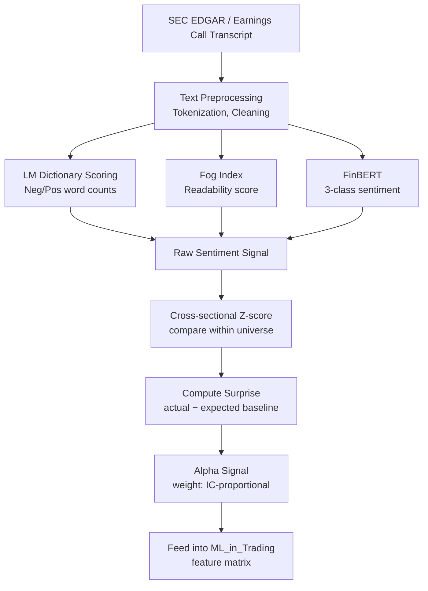

# NLP for Finance

> [!abstract] TL;DR
> NLP for finance is like having an analyst who reads 10,000 earnings calls per quarter and summarizes the tone with quantitative precision — impossible for humans, tractable for NLP models. The key is using domain-specific tools: the Loughran-McDonald dictionary (not Harvard GI), FinBERT for contextual sentiment, and the Fog Index for readability, then trading the surprise relative to baseline rather than the raw signal.

---

## Intuition — The Scale Advantage

A top-tier buy-side research desk has perhaps 50 analysts. Each follows 30–40 companies. That is 1,500–2,000 companies covered — approximately the S&P 1500. Each analyst manually reads earnings call transcripts, 10-K filings, and press releases. They are extraordinarily skilled but fundamentally bandwidth-constrained: they cannot read every word of every filing for every company every quarter.

An NLP pipeline has no such constraint. It can process 10,000 earnings call transcripts in minutes, applying consistent, systematic scoring rules. The competitive advantage is not that the NLP model is smarter than a human analyst — it is that it operates at a scale and consistency no human team can match.

The second insight is the surprise paradigm. The raw sentiment score of an earnings call matters less than how it compares to that company's historical baseline and to market expectations. A CEO who usually speaks in cautious, hedged language suddenly using confident, forward-looking phrases is a stronger buy signal than a perennially bullish executive maintaining their usual tone. NLP-based alpha comes from detecting these deviations — the same logic as earnings surprises in fundamental analysis, applied to the textual dimension.

---

## How It Works



---

## Key Concepts

### Why Financial NLP is Unique

Standard NLP corpora (news, social media, literature) do not prepare models for financial text:

1. **Domain-specific language**: "negative earnings" does not mean negative emotions — "liability," "risk," "loss provision" are routine, not alarming.
2. **Number dominance**: financial filings are 40–60% numerical data and tables; pure text models miss the most informative content.
3. **Forward-looking statements**: "We expect revenues to grow 15%" carries predictive signal; backward-looking statements ("revenues grew 12% last year") are lower value.
4. **Legal boilerplate**: standard disclaimers in every 10-K inflate word counts without informational content; must be stripped.

### Loughran-McDonald (LM) Dictionary

Published in 2011, the LM dictionary contains **2,709 negative** and **354 positive** words specifically validated for financial text.

Critical distinction: Harvard General Inquirer (GI) marks words like "liability," "debenture," "tax," "contract" as negative. In financial context these are **neutral technical terms**. Studies show Harvard GI produces noise-dominated sentiment in financial documents.

$$\text{LM Sentiment Score} = \frac{\text{Positive Words} - \text{Negative Words}}{\text{Total Words}}$$

Typical score range: −0.05 to +0.05. A score of −0.08 in a 10-K annual report is significantly negative (2–3 standard deviations from cross-sectional mean).

### Fog Index: Readability as a Signal

$$\text{Fog Index} = 0.4 \times \left(\frac{\text{Words}}{\text{Sentences}} + \% \text{ words with} > 2 \text{ syllables}\right)$$

High Fog Index = complex, dense language. In financial research (Li 2008), higher 10-K Fog Index predicts:
- Lower future return on assets
- More persistent earnings uncertainty
- Possible information hiding by management

A Fog Index above 20 (postgraduate reading level) in a 10-K is a red flag; the average readable report scores around 16–18.

### FinBERT: Domain-Adapted BERT

FinBERT (Yang, Uu, and Rish, 2020) fine-tunes BERT on ~76,000 financial news sentences, producing a 3-class classifier:

| Class | Meaning | Example |
|-------|---------|---------|
| Positive | Bullish tone, growth signals | "Record revenues exceeded expectations" |
| Negative | Bearish tone, risk escalation | "Guidance cut due to demand softness" |
| Neutral | Factual, procedural | "The company was incorporated in Delaware" |

FinBERT captures contextual meaning: "The loss was smaller than feared" is **positive** even though it contains the word "loss" — something dictionary-based methods cannot handle.

### Earnings Call Transcript NLP Pipeline

1. **Download 8-K from SEC EDGAR** — earnings releases are typically filed as 8-K within 4 business days of the call
2. **Parse transcript**: separate CEO/CFO prepared remarks from analyst Q&A section (Q&A often more informative — analysts ask direct questions about guidance misses)
3. **Compute LM sentiment score** and Fog Index on prepared remarks
4. **Run FinBERT** on each sentence; aggregate to document-level score
5. **Compare to historical baseline**: $z_t = (s_t - \mu_{t-4:t-1}) / \sigma_{t-4:t-1}$ (z-score relative to prior 4 quarters)
6. **Trade on surprise**: abnormal sentiment $= z_t$ is the alpha signal

Event-driven studies show sentiment surprise predicts **1–5 day post-call drift** of 0.5–1.5% (depending on universe and regime), with IC in the range 0.02–0.06.

### SEC Filing Analysis: 10-K and 10-Q

**10-K (Annual Report)**:
- **Item 7 (MD&A)**: Management Discussion and Analysis — the richest textual content
- **Textual similarity year-over-year**: $\text{Similarity}(t, t-1) = \cos(\text{TF-IDF}_t, \text{TF-IDF}_{t-1})$
- High similarity signals management **copying prior year boilerplate**, associated with negative future returns (Li 2008 finding: firms with high MD&A similarity have lower subsequent ROA)

**10-Q (Quarterly)**: same analysis applied quarterly; changes in risk factor language signal emerging problems.

### Social Media and Alternative Text Sources

| Source | Signal Type | Alpha Decay |
|--------|------------|-------------|
| StockTwits | Retail sentiment, short-term momentum | 1–3 days |
| Twitter/X | Broad market sentiment, event reactions | Hours to 2 days |
| WallStreetBets (Reddit) | Meme stock momentum, gamma squeeze indicators | 1–5 days |
| Patent filings | R&D activity, product pipeline signals | 2–6 months |
| Job postings | Business expansion, headcount trends | 1–3 months |
| RFP databases | B2B demand signals for enterprise tech | 2–8 weeks |

**GME January 2021 case study**: WallStreetBets thread volume and sentiment diverged from short interest and institutional flows days before the gamma squeeze — NLP on Reddit would have detected the setup early (though MNPI compliance review required before acting).

### Signal Construction

1. Compute NLP score for all stocks in universe (S&P 500 or Russell 2000)
2. **Cross-sectional z-score**: $z_i = (s_i - \mu) / \sigma$ across the universe at each point in time
3. Use $z_i$ as a feature input to the [[ML_in_Trading]] feature matrix
4. Evaluate via IC/ICIR using purged walk-forward CV
5. Combine with factor model residuals to isolate text-specific alpha

**IC typical ranges**: LM sentiment IC ≈ 0.02–0.05; FinBERT on earnings calls IC ≈ 0.03–0.07 (short-horizon, event-driven).

### MNPI Risk

Material Non-Public Information risk is the primary legal constraint on NLP-based trading:

- **Reg FD** (Fair Disclosure): companies cannot selectively disclose material information to preferred investors
- **MNPI**: if an NLP model processes information not yet public (e.g., an earnings call recording before official publication), trades based on it are illegal
- **Safe harbor**: trading on publicly filed documents (8-K, 10-K, 10-Q) and transcripts after public publication is generally legal
- **Compliance review**: all new data sources must pass legal/compliance review before strategy deployment

---

## Python Example

```python
from transformers import pipeline, AutoTokenizer, AutoModelForSequenceClassification
import torch
import re
from collections import Counter

# ─── LM Dictionary Scoring ───────────────────────────────────────────────────

LM_NEGATIVE = {
    "loss", "losses", "decline", "weak", "negative", "adverse", "fail",
    "failed", "failure", "uncertainty", "uncertain", "risk", "risks",
    "impairment", "writedown", "writeoff", "litigation", "penalty",
    "restatement", "investigation", "subpoena", "shortfall", "disappointing"
}  # truncated; full LM list has 2,709 words

LM_POSITIVE = {
    "growth", "profit", "gain", "exceed", "exceeded", "strong", "strength",
    "record", "outperform", "beat", "improvement", "improved", "opportunity"
}  # truncated; full LM list has 354 words


def lm_sentiment(text: str) -> dict:
    """Compute LM dictionary sentiment score."""
    words = re.findall(r'\b[a-z]+\b', text.lower())
    total = len(words)
    if total == 0:
        return {"score": 0.0, "n_pos": 0, "n_neg": 0, "total": 0}
    n_pos = sum(1 for w in words if w in LM_POSITIVE)
    n_neg = sum(1 for w in words if w in LM_NEGATIVE)
    score = (n_pos - n_neg) / total
    return {"score": score, "n_pos": n_pos, "n_neg": n_neg, "total": total}


def fog_index(text: str) -> float:
    """Compute Gunning Fog Index for readability."""
    sentences = re.split(r'[.!?]+', text)
    sentences = [s.strip() for s in sentences if s.strip()]
    words = re.findall(r'\b[a-z]+\b', text.lower())
    if not sentences or not words:
        return 0.0
    avg_sentence_length = len(words) / len(sentences)
    # Count polysyllabic words (> 2 syllables — approximate via length > 7)
    complex_words = [w for w in words if len(w) > 7]
    pct_complex = len(complex_words) / len(words) * 100
    return 0.4 * (avg_sentence_length + pct_complex)


# ─── FinBERT Scoring ─────────────────────────────────────────────────────────

def load_finbert():
    """Load FinBERT model (requires transformers + torch)."""
    model_name = "ProsusAI/finbert"
    tokenizer = AutoTokenizer.from_pretrained(model_name)
    model = AutoModelForSequenceClassification.from_pretrained(model_name)
    return pipeline("text-classification", model=model,
                    tokenizer=tokenizer, return_all_scores=True)


def finbert_score(pipe, text: str, max_length: int = 512) -> dict:
    """
    Score text with FinBERT, handling long documents by chunking.
    Returns weighted average sentiment across chunks.
    """
    # Simple chunking by sentence
    sentences = re.split(r'(?<=[.!?])\s+', text)
    chunks, current = [], ""
    for sent in sentences:
        if len(current) + len(sent) < max_length:
            current += " " + sent
        else:
            if current:
                chunks.append(current.strip())
            current = sent
    if current:
        chunks.append(current.strip())

    scores = {"positive": 0.0, "negative": 0.0, "neutral": 0.0}
    for chunk in chunks:
        result = pipe(chunk[:512])[0]
        for item in result:
            scores[item["label"].lower()] += item["score"]

    # Normalize
    n = max(len(chunks), 1)
    return {k: v / n for k, v in scores.items()}


# ─── Demo ─────────────────────────────────────────────────────────────────────

sample_transcript = """
We delivered record revenues of $4.2 billion this quarter, exceeding consensus
estimates by 8%. Our cloud segment showed exceptional growth of 42% year-over-year.
Looking ahead, we remain cautious about macroeconomic uncertainty and the potential
impact of rising interest rates on consumer demand. However, our strong balance
sheet and disciplined cost management provide a solid foundation for continued
investment in innovation. We are raising full-year guidance by $200 million.
"""

lm_result = lm_sentiment(sample_transcript)
fog = fog_index(sample_transcript)

print(f"LM Sentiment Score : {lm_result['score']:.4f}")
print(f"  Positive words   : {lm_result['n_pos']}")
print(f"  Negative words   : {lm_result['n_neg']}")
print(f"Fog Index          : {fog:.2f}  (readable < 18, complex > 20)")

# FinBERT (comment out if model not available)
# pipe = load_finbert()
# fb_scores = finbert_score(pipe, sample_transcript)
# print(f"FinBERT Positive   : {fb_scores['positive']:.3f}")
# print(f"FinBERT Negative   : {fb_scores['negative']:.3f}")
# print(f"FinBERT Neutral    : {fb_scores['neutral']:.3f}")
```

---

## Real-World Notes

- Loughran and McDonald (2011) showed Harvard GI produces spuriously negative scores for financial text — the seminal paper that triggered all subsequent financial NLP dictionaries.
- FinBERT is now the industry baseline; Bloomberg Intelligence and Reuters both use proprietary variants of BERT fine-tuned on larger financial corpora.
- 10-K textual similarity analysis (year-over-year cosine distance on MD&A) was popularized by Li (2008) and is standard at systematic fundamental funds.
- Signal half-life for earnings call NLP is typically 1–5 trading days for sentiment surprise; 2–8 weeks for readability/complexity signals.

---

## Common Pitfalls

- **Using Harvard GI instead of LM dictionary** — inflates false negative signal for routine financial terms.
- **Computing z-score across time rather than cross-sectionally** — creates look-ahead bias if future dates are included in the normalization window.
- **Ignoring boilerplate stripping** — identical legal disclaimer paragraphs inflate similarity scores artificially.
- **Trading before official publication** — even a 5-minute advantage from private transcript access creates MNPI exposure.

---

## Related Concepts

- [[ML_in_Trading]] — NLP features feed into IC-evaluated feature matrix; purged CV framework applies here
- [[Neural_Networks_Finance]] — FinBERT predictions used as XGBoost features; LSTM captures temporal evolution of sentiment
- [[Alternative_Data]] — NLP is one category of alternative data; see full taxonomy
- [[_MOC_Risk_Management]] — MNPI and compliance risk context

---

## Review Questions

1. A sentiment analysis pipeline using Harvard GI flags 40% of 10-K filings as "highly negative." After switching to the LM dictionary, only 12% qualify. What explains this difference, and which measure is more likely to generate a real trading signal?
2. An earnings call Fog Index increases from 16 to 23 quarter-over-quarter for a specific company. What does this suggest about management communication, and how would you trade it?
3. You build a cross-sectional z-score of FinBERT sentiment scores across the S&P 500 each quarter. The IC over the subsequent 5 trading days is 0.04. Using Grinold's law and assuming 4 calls/year per stock, estimate the annual IR contribution from this signal.

---

## Sources

- Loughran, T., & McDonald, B. (2011). When Is a Liability Not a Liability? Textual Analysis, Dictionaries, and 10-Ks. *Journal of Finance*, 66(1).
- Li, F. (2008). Annual Report Readability, Current Earnings, and Earnings Persistence. *Journal of Accounting and Economics*.
- Yang, Y., Uu, M., & Rish, I. (2020). FinBERT: A Pretrained Language Model for Financial Communications. *arXiv:2006.08097*.
- Devlin, J. et al. (2019). BERT: Pre-training of Deep Bidirectional Transformers. *NAACL 2019*.
- Tetlock, P. C. (2007). Giving Content to Investor Sentiment. *Journal of Finance*, 62(3).

#quantitative-finance #ml-finance #advanced
