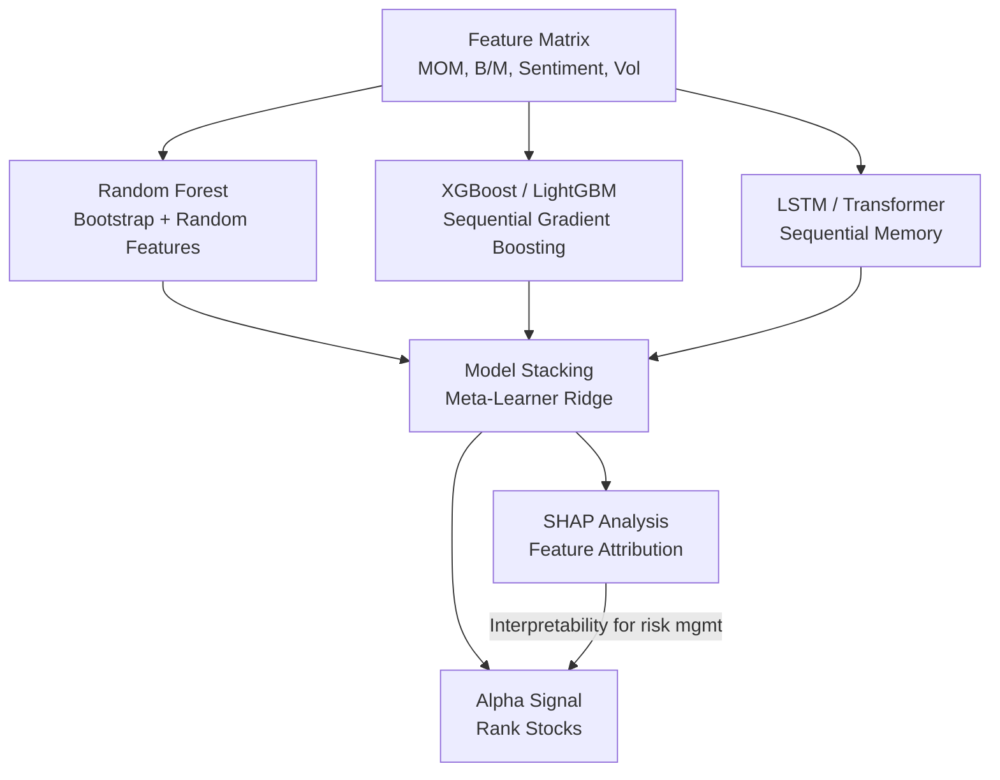

# Neural Networks for Finance

> [!abstract] TL;DR
> A committee of weak financial analysts — each mediocre on their own — consistently outperforms any single expert when their errors are independent. This is ensemble learning in finance: tree models (Random Forest, XGBoost, LightGBM) and deep architectures (LSTM, Transformer) exploit complementary biases to extract the 1–3% of variance that constitutes real alpha, while SHAP values keep the predictions interpretable enough for risk managers and regulators.

---

## Intuition — The Committee of Analysts

Imagine 500 junior analysts, each assigned a random 60% of historical data and a random subset of 8 financial features. Each builds a simple decision tree. Individually, each tree is badly overfit and noisy. But when you average their predictions, something remarkable happens: the idiosyncratic errors cancel out, and the systematic signal — the small fraction of variance genuinely predictable — is amplified. This is a Random Forest.

Gradient Boosting flips the logic: instead of independent committees, it trains analysts sequentially, where each new analyst focuses on the mistakes of the previous ensemble. The result is a model that progressively corrects its own biases through iteration. XGBoost adds second-order curvature information (like Newton-Raphson optimization) and explicit regularization, making it exceptionally robust to the noise and fat tails of financial data.

Deep learning adds temporal memory. An LSTM can remember that a company missed earnings three consecutive quarters — a pattern invisible to static feature vectors. A Transformer can attend to all past observations simultaneously, weighting each by learned relevance. The challenge is sample efficiency: financial datasets have thousands of observations where computer vision has millions. Proper regularization, pre-training, and ensemble stacking with tree models are essential.

---

## How It Works



---

## Key Concepts

### CART: Classification and Regression Trees

A single CART splits feature space recursively by minimizing impurity:

$$\text{Gini}(S) = 1 - \sum_k p_k^2 \qquad \text{Entropy}(S) = -\sum_k p_k \log p_k$$

At each node, choose feature $j$ and threshold $\theta$ to minimize:

$$\min_{j,\theta} \left[\frac{|S_L|}{|S|} \cdot \text{Impurity}(S_L) + \frac{|S_R|}{|S|} \cdot \text{Impurity}(S_R)\right]$$

Single trees overfit catastrophically on financial data — they memorize noise.

### Random Forest: Bagging + Random Features

- **Bootstrap**: each tree trains on a random sample with replacement (≈63% of data per tree)
- **Random features**: at each split, choose the best among $m \approx \sqrt{p}$ randomly selected features
- **OOB error**: observations not selected in the bootstrap serve as a built-in validation set

**Residual variance floor**: correlation between trees sets a minimum portfolio variance:

$$\sigma^2_{\text{portfolio}} \approx \rho \cdot \sigma^2_{\text{tree}}$$

where $\rho$ is the average pairwise correlation between trees. This is why reducing tree correlation (via feature randomness) improves ensemble performance more than reducing individual tree error.

**Feature importance — MDI vs MDA**:
- **MDI (Mean Decrease Impurity)**: sum of impurity reductions across all splits for a feature. Fast but biased toward high-cardinality continuous features.
- **MDA (Mean Decrease Accuracy)**: permute feature values in OOB data; measure accuracy drop. Slower but unbiased and directly interpretable as predictive value.

### Gradient Boosting: Sequential Additive Modeling

Initialize $F_0(x) = \text{const}$. At each step $m$:

$$F_m(x) = F_{m-1}(x) + \nu \cdot h_m(x)$$

where $h_m$ fits the **negative gradient** of the loss function (pseudo-residuals):

$$r_i^{(m)} = -\left[\frac{\partial L(y_i, F(x_i))}{\partial F(x_i)}\right]_{F=F_{m-1}}$$

For MSE loss, pseudo-residuals are just ordinary residuals. For financial data, **Huber loss** is preferred for robustness to fat-tailed returns.

### XGBoost: Second-Order Optimization

XGBoost uses a second-order Taylor expansion of the loss:

$$\mathcal{L}^{(m)} \approx \sum_i \left[g_i f_m(x_i) + \frac{1}{2} h_i f_m(x_i)^2\right] + \Omega(f_m)$$

where $g_i = \partial_{F} L$, $h_i = \partial^2_{F} L$. The **optimal leaf weight** for leaf $j$ is:

$$w_j^* = -\frac{G_j}{H_j + \lambda}$$

where $G_j = \sum_{i \in j} g_i$, $H_j = \sum_{i \in j} h_i$, and $\lambda$ is the L2 regularization on leaf scores. This closed-form solution makes XGBoost both fast and well-regularized.

### LightGBM: Gradient-Based One-Side Sampling (GOSS)

LightGBM accelerates gradient boosting via GOSS:
- Keep the top $a\%$ of observations by gradient magnitude (informative observations)
- Randomly sample $b\%$ of remaining small-gradient observations (representative of low-loss data)
- Amplify small-gradient samples by $\frac{1-a}{b}$ to maintain unbiased estimation

This achieves **5–10× speedup** over vanilla XGBoost on large feature matrices, with minimal accuracy loss — critical for large-cap universes with hundreds of features.

### SHAP: Shapley Value Attribution

Shapley values from cooperative game theory provide the unique attribution satisfying four axioms: **efficiency** (attributions sum to prediction), **symmetry** (equal features get equal credit), **linearity** (decomposable across models), **null player** (zero attribution for useless features).

For tree models, **TreeSHAP** computes exact Shapley values in $O(TLD^2)$ (trees × leaves × depth squared) — polynomial rather than exponential.

$$\phi_j = \sum_{S \subseteq F \setminus \{j\}} \frac{|S|!(|F|-|S|-1)!}{|F|!} \left[f(S \cup \{j\}) - f(S)\right]$$

In practice: plot SHAP beeswarm to see which features drive individual predictions, use SHAP interaction values to detect feature co-dependencies.

### LSTM for Sequential Financial Data

LSTM gates control information flow through time:

$$f_t = \sigma(W_f [h_{t-1}, x_t] + b_f) \quad \text{(forget gate)}$$
$$i_t = \sigma(W_i [h_{t-1}, x_t] + b_i) \quad \text{(input gate)}$$
$$\tilde{C}_t = \tanh(W_C [h_{t-1}, x_t] + b_C) \quad \text{(cell candidate)}$$
$$C_t = f_t \odot C_{t-1} + i_t \odot \tilde{C}_t \quad \text{(cell state update)}$$

**Critical implementation detail** (Jozefowicz 2015): initialize forget gate bias $b_f = 1$ (not 0). This defaults the gate to "remember," preventing gradient vanishing in long sequences — essential for multi-quarter earnings patterns.

### Transformer Attention for Finance

$$\text{Attn}(Q, K, V) = \text{softmax}\!\left(\frac{QK^\top}{\sqrt{d_k}}\right) V$$

The $\frac{1}{\sqrt{d_k}}$ scaling prevents softmax saturation in high-dimensional embedding spaces. Positional encoding adds sequence order information (critical: Transformer has no inherent notion of time).

For financial time series, **temporal masks** prevent attention to future time steps during training — equivalent to the embargo concept from purged CV.

### Deep Hedging (Buehler et al. 2019)

Classical BS delta hedging minimizes variance under the risk-neutral measure $Q$, ignoring transaction costs and liquidity. Deep Hedging trains a neural network to minimize hedging cost under the real-world measure $P$:

$$\min_\theta E^P\left[-\sum_{t=0}^T \delta^\theta_t \Delta S_t + c(\delta^\theta_t - \delta^\theta_{t-1})\right]$$

where $c(\cdot)$ is the transaction cost function. The network learns to trade off hedging error against friction costs — achieving superior performance to BS delta when costs are material.

### Model Stacking

Combine predictions from RF, XGBoost, and LSTM via a **meta-learner** (typically Ridge regression trained on held-out fold predictions):

$$\hat{r}^{\text{stack}} = \alpha_1 \hat{r}^{RF} + \alpha_2 \hat{r}^{XGB} + \alpha_3 \hat{r}^{LSTM} + \varepsilon$$

Stacking exploits model diversity: tree models capture regime-conditional nonlinearities; LSTMs capture temporal patterns; the meta-learner learns the optimal blending weight dynamically.

**PSR/DSR for ML models**: apply the same deployment gate as in [[ML_in_Trading]] — $PSR > 0.95$ against $SR^* = 1.0$ before live deployment. MinBTL (minimum backtest length) is approximately 120 months for $SR^* = 1.0$ and typical financial tail moments.

---

## Python Example

```python
import numpy as np
import pandas as pd
import xgboost as xgb
import shap
from sklearn.model_selection import cross_val_predict

def train_xgboost_return_predictor(X_train: pd.DataFrame,
                                    y_train: pd.Series,
                                    X_test: pd.DataFrame,
                                    y_test: pd.Series) -> dict:
    """
    XGBoost return predictor with SHAP attribution and purged CV evaluation.
    """
    params = {
        "objective": "reg:squarederror",
        "max_depth": 4,
        "learning_rate": 0.05,
        "n_estimators": 300,
        "subsample": 0.7,           # row sampling (like RF bagging)
        "colsample_bytree": 0.7,    # feature sampling
        "reg_lambda": 5.0,          # L2 regularization (lambda in w* formula)
        "min_child_weight": 10,     # prevents small-sample leaf splits
        "tree_method": "hist",      # LightGBM-style histogram binning
        "random_state": 42,
    }

    model = xgb.XGBRegressor(**params)
    model.fit(X_train, y_train,
              eval_set=[(X_test, y_test)],
              verbose=False)

    # OOS predictions
    y_pred = pd.Series(model.predict(X_test), index=y_test.index)

    # OOS R² (Campbell-Thompson)
    ss_res = ((y_test - y_pred) ** 2).sum()
    ss_tot = ((y_test - y_train.mean()) ** 2).sum()
    r2_oos = 1 - ss_res / ss_tot

    # Information Coefficient (Spearman rank correlation)
    from scipy.stats import spearmanr
    ic, _ = spearmanr(y_pred, y_test)

    # SHAP feature attribution
    explainer = shap.TreeExplainer(model)
    shap_values = explainer.shap_values(X_test)
    mean_abs_shap = pd.Series(
        np.abs(shap_values).mean(axis=0),
        index=X_train.columns
    ).sort_values(ascending=False)

    return {
        "model": model,
        "r2_oos": r2_oos,
        "ic": ic,
        "shap_importance": mean_abs_shap,
        "predictions": y_pred,
    }


# Synthetic demonstration
np.random.seed(0)
n, p = 2000, 15
X = pd.DataFrame(np.random.randn(n, p), columns=[f"feat_{i}" for i in range(p)])
# True signal: feat_0 (momentum), feat_1 (value), feat_2 (sentiment)
y = (0.06 * X["feat_0"] + 0.04 * X["feat_1"] -
     0.03 * X["feat_2"] + np.random.randn(n) * 0.98)

split = int(0.7 * n)
X_tr, X_te = X.iloc[:split], X.iloc[split:]
y_tr, y_te = y.iloc[:split], y.iloc[split:]

results = train_xgboost_return_predictor(X_tr, y_tr, X_te, y_te)
print(f"OOS R²  : {results['r2_oos']:.5f}")
print(f"IC      : {results['ic']:.4f}")
print("Top SHAP features:")
print(results["shap_importance"].head(5))
```

---

## Real-World Notes

- At Two Sigma and Citadel, tree ensemble + LSTM stacks with SHAP monitoring are standard production stack.
- LightGBM is typically preferred over XGBoost in production due to 5–10× speed advantage with comparable accuracy on tabular financial data.
- Deep Hedging is now used by JP Morgan and BNP Paribas for options books with significant gamma exposure and path-dependent frictions.
- Transformer models fine-tuned on financial time series (e.g., Temporal Fusion Transformer) are emerging but require large datasets to outperform well-tuned XGBoost on short-horizon return prediction.

---

## Common Pitfalls

- **MDI for feature selection** without MDA verification — continuous features like volume will spuriously top the MDI ranking.
- **No forget gate bias initialization** in LSTMs — vanilla PyTorch default is $b_f = 0$, causing gradient vanishing over 20+ step sequences.
- **SHAP values on training data** — always compute SHAP on held-out test data to avoid cherry-picking explanation of overfitted patterns.
- **Ignoring the variance floor** — stacking many correlated tree models gives diminishing diversification returns; monitor pairwise tree correlation.

---

## Related Concepts

- [[ML_in_Trading]] — evaluation framework (IC, ICIR, PSR) and purged CV applied to these models
- [[NLP_for_Finance]] — NLP features (FinBERT sentiment, Fog Index) as inputs to XGBoost
- [[Alternative_Data]] — satellite/card data features entering the feature matrix
- [[Reinforcement_Learning_Trading]] — RL agents replace the predict-then-optimize loop

---

## Review Questions

1. Why is the forget gate bias initialization $b_f = 1$ (rather than 0) critical for LSTM performance on multi-quarter financial sequences?
2. A Random Forest has 500 trees with pairwise correlation $\rho = 0.3$ and individual tree variance $\sigma^2 = 1.0$. What is the portfolio variance floor, and how would you reduce it?
3. You compute MDI feature importance and find "market cap" ranks #1. Should you trust this? What alternative importance measure would you use and why?

---

## Sources

- Breiman, L. (2001). Random Forests. *Machine Learning*, 45(1).
- Chen, T., & Guestrin, C. (2016). XGBoost: A Scalable Tree Boosting System. *KDD 2016*.
- Buehler, H. et al. (2019). Deep Hedging. *Quantitative Finance*, 19(8).
- Jozefowicz, R. et al. (2015). An Empirical Evaluation of Recurrent Network Architectures. *ICML*.
- Lundberg, S. M., & Lee, S. I. (2017). A Unified Approach to Interpreting Model Predictions. *NeurIPS*.
- López de Prado, M. (2018). *Advances in Financial Machine Learning*. Wiley.

#quantitative-finance #ml-finance #advanced
