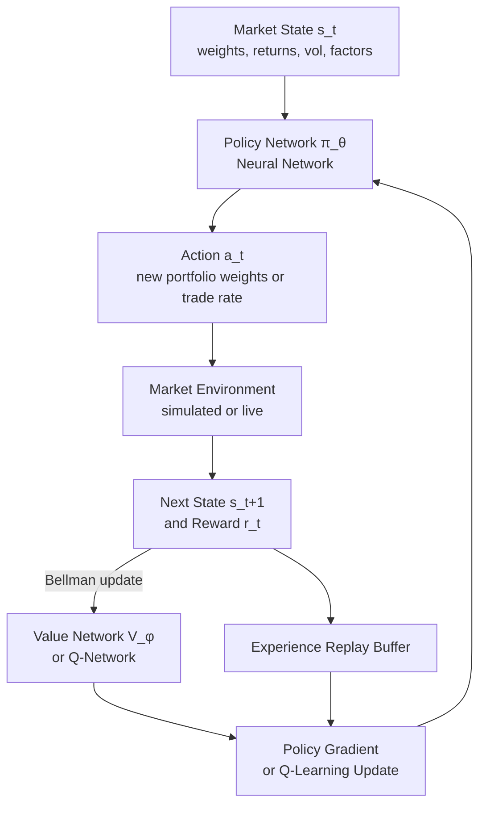

# Reinforcement Learning for Trading

> [!abstract] TL;DR
> RL trading is like training a chess engine — not hardcoding opening theory and endgame rules, but letting an agent learn from millions of simulated positions which moves lead to winning positions. Applied to finance, RL agents discover optimal execution policies, portfolio rebalancing rules, and risk-adjusted strategies without requiring explicit mathematical models of market dynamics, handling frictions and non-stationarity that cripple closed-form solutions.

---

## Intuition — Learning Without a Rulebook

Classical quantitative finance is rule-based: Almgren-Chriss gives you optimal execution as a closed-form formula under specific assumptions (quadratic costs, Gaussian returns). These formulas are elegant but fragile — they break when spreads widen, when there is a large order imbalance, or when the market is trending against your execution.

RL takes the opposite approach. Give the agent a description of the current market state, a set of possible actions, and a reward signal (PnL minus transaction costs minus drawdown penalties). Let it simulate millions of market trajectories and learn which actions maximize cumulative reward. The agent does not need to know the transaction cost formula — it will discover it empirically. It does not need to assume Gaussian returns — it learns the true empirical distribution. This makes RL robust to the model misspecification that plagues analytical approaches.

The challenge is that financial data is scarce relative to what RL requires. In Atari games (where RL first became famous), an agent can play millions of frames per hour. A trading agent has perhaps 252 days of annual data. The solution is synthetic environment generation — training on simulated markets calibrated to empirical statistics — followed by fine-tuning on real data.

---

## How It Works



---

## Key Concepts

### MDP: The Formal Framework

Reinforcement learning formalizes the trading problem as a **Markov Decision Process** (MDP):

$$\mathcal{M} = (S, A, P, R, \gamma)$$

| Component | Symbol | Definition |
|-----------|--------|------------|
| State space | $S$ | Market observations available at time $t$ |
| Action space | $A$ | Decisions the agent can take |
| Transition | $P(s'\|s,a)$ | Market dynamics (unknown to agent) |
| Reward | $R(s,a,s')$ | PnL minus costs |
| Discount factor | $\gamma \in [0,1)$ | Weight on future rewards |

### Value Functions and Bellman Equations

The **state value function** under policy $\pi$:

$$V^\pi(s) = E^\pi\left[\sum_{t=0}^\infty \gamma^t r_t \,\middle|\, s_0 = s\right]$$

The **action-value (Q) function**:

$$Q^\pi(s, a) = E^\pi\left[\sum_{t=0}^\infty \gamma^t r_t \,\middle|\, s_0 = s, a_0 = a\right]$$

**Bellman optimality equation** — the recursive structure that all RL algorithms exploit:

$$Q^*(s, a) = r(s, a) + \gamma \max_{a'} Q^*(s', a')$$

The optimal policy follows $\pi^*(s) = \arg\max_a Q^*(s, a)$.

### DQN: Deep Q-Networks (Mnih et al. 2015)

DQN approximates $Q^*(s,a)$ with a neural network $Q_\theta(s,a)$, trained via:

$$\mathcal{L}(\theta) = E\left[\left(r + \gamma \max_{a'} Q_{\theta^-}(s', a') - Q_\theta(s, a)\right)^2\right]$$

Two critical innovations that stabilize training:
1. **Experience replay buffer**: store $(s, a, r, s')$ tuples; sample random mini-batches to break serial correlation
2. **Periodic target network copy**: use a separate $\theta^-$ (updated every $C$ steps) to compute the TD target, preventing oscillation

**Double DQN**: decouple action selection from action evaluation to reduce overestimation bias:

$$\mathcal{L} = \left(r + \gamma Q_{\theta^-}(s', \arg\max_{a'} Q_\theta(s', a')) - Q_\theta(s, a)\right)^2$$

DQN is appropriate for discrete action spaces (e.g., hold/buy/sell). For continuous portfolio weights, policy gradient methods are preferred.

### PPO: Proximal Policy Optimization

PPO is the workhorse for continuous-action RL in finance. It maximizes a **clipped surrogate objective** to prevent destructive policy updates:

$$L^{CLIP}(\theta) = E_t\left[\min\left(r_t(\theta)\hat{A}_t,\; \text{clip}(r_t(\theta), 1-\epsilon, 1+\epsilon)\hat{A}_t\right)\right]$$

where:
- $r_t(\theta) = \pi_\theta(a_t|s_t) / \pi_{\theta_{old}}(a_t|s_t)$ is the probability ratio
- $\hat{A}_t$ is the advantage estimate (how much better than average was this action)
- $\epsilon = 0.2$ is the clipping parameter (typically)

The clipping prevents any single update from changing the policy too aggressively, which is critical in financial environments where a bad policy can cause irreversible drawdowns.

### RL Portfolio Management

**State representation** for a $N$-asset portfolio:

$$s_t = (w_{t-1},\; r_{t-K:t},\; \sigma_{t-K:t},\; f_{t-K:t})$$

- $w_{t-1}$: previous period weights (dimension $N$) — determines transaction costs
- $r_{t-K:t}$: lookback window of returns (dimension $N \times K$)
- $\sigma_{t-K:t}$: realized volatility estimates
- $f_{t-K:t}$: factor exposures (momentum, value, etc.)

**Action**: new target portfolio weights $w_t \in \Delta^N$ (simplex for long-only; unconstrained for long-short).

**Reward function** (Sharpe-based):

$$R_t = PnL_t - \lambda \cdot TC_t - \kappa \cdot \text{drawdown}_t$$

where $TC_t = \sum_i |w_{t,i} - w_{t-1,i}| \cdot \text{spread}_i$ and $\kappa$ penalizes drawdown beyond a threshold.

**Why Sharpe-based reward outperforms raw PnL**: raw PnL reward encourages maximum leverage and single large bets. Sharpe reward naturally penalizes variance, producing more stable strategies.

### RL Execution: Matching Almgren-Chriss

For **optimal execution** of a large order $Q_0$ shares over horizon $T$:

**State** (Nevmyvaka 2006 formulation):

$$s_t = \left(\frac{q_t}{Q_0},\; \frac{\tau_t}{T},\; \sigma_t,\; OBI_t\right)$$

- $q_t / Q_0$: fraction of order remaining
- $\tau_t / T$: fraction of time remaining
- $\sigma_t$: current volatility estimate
- $OBI_t$: order book imbalance (bid volume − ask volume)/(bid + ask volume)

**Action**: $\dot{q}_t$ — trading rate (shares per unit time).

**Reward**: $-(\text{implementation shortfall}_t + \lambda \cdot \text{market impact})$

Key result: a well-trained Actor-Critic agent matches the closed-form **Almgren-Chriss** solution analytically when costs are linear — and outperforms it when costs are nonlinear or when $OBI_t$ provides exploitable information about short-term price direction.

### Sample Efficiency Challenge

Financial data is scarce:
- 252 trading days per year
- 10 years of usable data ≈ 2,520 observations
- RL typically requires millions of environment steps

**Solutions**:
1. **Synthetic environments**: fit a regime-switching model to historical data; generate millions of synthetic paths calibrated to empirical volatility, autocorrelation, and tail moments
2. **Real data fine-tuning**: pre-train on synthetic data, fine-tune on real data
3. **FinRL / Backtrader gyms**: standardized OpenAI Gym wrappers for financial data that allow fast vectorized simulation

### Reward Shaping Best Practices

| Reward Design | Behavior | Recommended? |
|--------------|----------|--------------|
| Raw PnL | Maximum leverage, single bets | No |
| Sharpe ratio | Balanced risk/return | Yes |
| Sortino ratio | Downside-only penalization | Yes (advanced) |
| Calmar ratio | Drawdown-focused | For drawdown-constrained mandates |
| Custom (regulatory) | Constraint satisfaction | Case-specific |

---

## Python Example

```python
import numpy as np
import gymnasium as gym
from gymnasium import spaces

class PortfolioEnv(gym.Env):
    """
    Simple multi-asset portfolio RL environment.
    State: [prev_weights, recent_returns (K steps), recent_vol (K steps)]
    Action: new portfolio weights (softmax-constrained to sum to 1)
    Reward: step Sharpe contribution minus transaction costs
    """
    def __init__(self, returns: np.ndarray, lookback: int = 20,
                 tc_rate: float = 0.001, drawdown_penalty: float = 0.1):
        super().__init__()
        self.returns = returns          # shape (T, N)
        self.T, self.N = returns.shape
        self.K = lookback
        self.tc_rate = tc_rate
        self.drawdown_penalty = drawdown_penalty

        # Observation: prev weights (N) + returns (K*N) + vols (K*N)
        obs_dim = self.N + 2 * self.K * self.N
        self.observation_space = spaces.Box(-np.inf, np.inf, shape=(obs_dim,))
        self.action_space = spaces.Box(0.0, 1.0, shape=(self.N,))

        self.reset()

    def reset(self, seed=None):
        super().reset(seed=seed)
        self.t = self.K
        self.weights = np.ones(self.N) / self.N   # equal-weight start
        self.portfolio_value = 1.0
        self.peak_value = 1.0
        return self._get_obs(), {}

    def _get_obs(self):
        recent_returns = self.returns[self.t - self.K:self.t]     # (K, N)
        recent_vols = recent_returns.std(axis=0, keepdims=True)    # (1, N)
        recent_vols = np.repeat(recent_vols, self.K, axis=0)
        return np.concatenate([
            self.weights,
            recent_returns.flatten(),
            recent_vols.flatten()
        ])

    def step(self, action: np.ndarray):
        # Normalize action to valid portfolio weights
        action = np.clip(action, 1e-6, None)
        new_weights = action / action.sum()

        # Transaction costs
        turnover = np.abs(new_weights - self.weights).sum()
        tc = turnover * self.tc_rate

        # Realize returns
        r_t = self.returns[self.t]
        gross_return = np.dot(new_weights, r_t)
        net_return = gross_return - tc

        # Update portfolio value
        self.portfolio_value *= (1 + net_return)
        self.peak_value = max(self.peak_value, self.portfolio_value)
        drawdown = (self.peak_value - self.portfolio_value) / self.peak_value

        # Reward: step return minus drawdown penalty
        reward = net_return - self.drawdown_penalty * drawdown

        self.weights = new_weights
        self.t += 1
        done = self.t >= self.T - 1

        return self._get_obs(), reward, done, False, {
            "net_return": net_return,
            "tc": tc,
            "drawdown": drawdown
        }


# Demo: random agent baseline
np.random.seed(42)
T, N = 500, 5
returns = np.random.randn(T, N) * 0.01 + 0.0002  # synthetic daily returns

env = PortfolioEnv(returns, lookback=10)
obs, _ = env.reset()
total_reward = 0
for _ in range(T - 10 - 1):
    action = np.random.dirichlet(np.ones(N))  # random portfolio
    obs, reward, done, _, info = env.step(action)
    total_reward += reward
    if done:
        break

print(f"Random agent total reward: {total_reward:.4f}")
print("Environment ready for stable-baselines3 PPO training:")
print("  from stable_baselines3 import PPO")
print("  model = PPO('MlpPolicy', env, verbose=1)")
print("  model.learn(total_timesteps=100_000)")
```

---

## Real-World Notes

- Nevmyvaka, Feng, and Kearns (2006) demonstrated Actor-Critic matching Almgren-Chriss analytically — the landmark paper establishing RL viability for execution.
- JPMorgan's LOXM execution system (2017) was the first publicly disclosed production RL execution system, reportedly outperforming classical VWAP algorithms.
- FinRL (Liu et al. 2020) provides a standardized library of financial RL environments covering portfolio management, execution, and options hedging.
- Reward shaping remains an active research area; Sharpe-based rewards tend to produce more deployable strategies than raw PnL but introduce non-stationarity in the reward landscape.

---

## Common Pitfalls

- **Overfitting to the training environment**: an agent trained on 2010–2020 data may not handle COVID volatility or 2022 rate-shock regimes. Always test on multiple out-of-sample regimes.
- **Ignoring transaction costs in simulation**: an agent trained without TC will learn to trade continuously, generating zero net alpha after costs in production.
- **Discrete action spaces for portfolio weights**: DQN with discretized weights (e.g., 0%, 10%, 20%, ...) suffers from coarse resolution; PPO with continuous Dirichlet actions is preferred.
- **Single reward scale across different volatility regimes**: normalize rewards to daily vol units to prevent high-vol periods from dominating gradient updates.

---

## Related Concepts

- [[ML_in_Trading]] — IC/ICIR evaluation of RL policy quality; purged CV for backtest validity
- [[Neural_Networks_Finance]] — policy and value networks are neural architectures (LSTM, MLP)
- [[NLP_for_Finance]] — NLP signals can enter the RL state representation as sentiment features
- [[Alternative_Data]] — alternative data signals incorporated into the state vector
- [[_MOC_Market_Microstructure]] — order book structure, execution mechanics underlying RL execution

---

## Review Questions

1. The Bellman optimality equation is $Q^*(s,a) = r(s,a) + \gamma \max_{a'} Q^*(s',a')$. Why does Double DQN improve on vanilla DQN, and what specific bias does it correct?
2. A PPO portfolio agent trained on 2015–2020 data achieves Sharpe 1.8 in-sample and 0.4 out-of-sample (2020–2023). What structural challenges of applying RL to finance might explain this collapse, and what training modifications would improve OOS robustness?
3. An RL execution agent is given state $s_t = (q/Q_0, \tau/T, \sigma, OBI)$. Explain intuitively why order book imbalance ($OBI$) is a valuable state component beyond what Almgren-Chriss models, and what behavior the agent should learn to exploit it.

---

## Sources

- Mnih, V. et al. (2015). Human-level Control through Deep Reinforcement Learning. *Nature*, 518.
- Schulman, J. et al. (2017). Proximal Policy Optimization Algorithms. *arXiv:1707.06347*.
- Nevmyvaka, Y., Feng, Y., & Kearns, M. (2006). Reinforcement Learning for Optimized Trade Execution. *ICML*.
- Almgren, R., & Chriss, N. (2001). Optimal Execution of Portfolio Transactions. *Journal of Risk*.
- Liu, X. Y. et al. (2020). FinRL: A Deep Reinforcement Learning Library for Automated Stock Trading. *NeurIPS Workshop*.
- Buehler, H. et al. (2019). Deep Hedging. *Quantitative Finance*, 19(8).

#quantitative-finance #ml-finance #advanced
